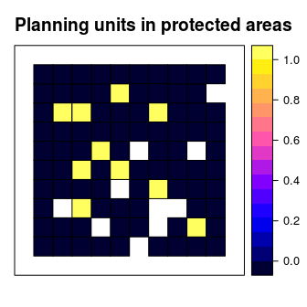
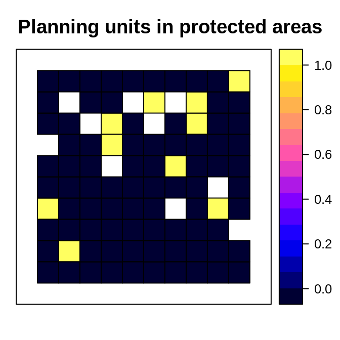
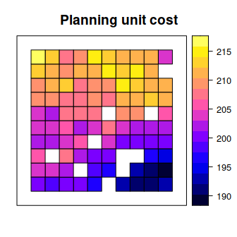
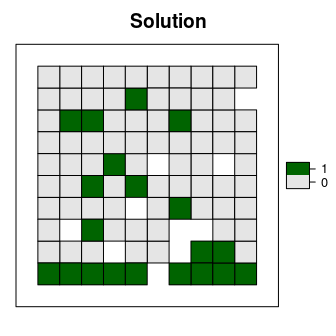
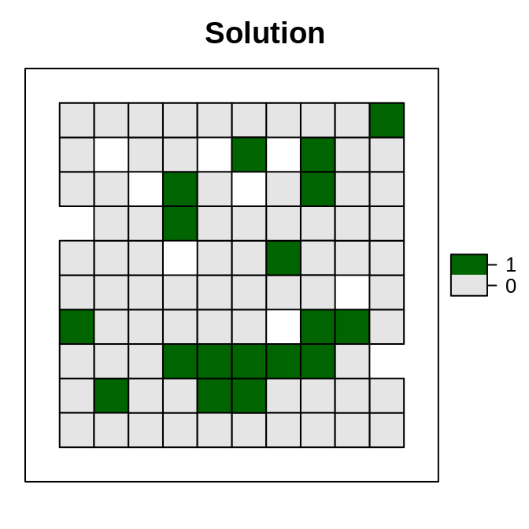
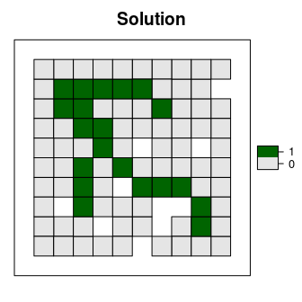
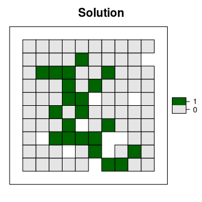

<!--- README.md is generated from README.Rmd. Please edit that file -->
Systematic Conservation Prioritization in R 
======================================================================================================

[](https://www.tidyverse.org/lifecycle/#stable) [](https://travis-ci.org/prioritizr/prioritizr) [](https://ci.appveyor.com/project/jeffreyhanson/prioritizr) [](https://codecov.io/github/prioritizr/prioritizr?branch=master) [](https://CRAN.R-project.org/package=prioritizr)

The *prioritizr R* package uses integer linear programming (ILP) techniques to provide a flexible interface for building and solving conservation planning problems. It supports a broad range of objectives, constraints, and penalties that can be used to custom-tailor conservation planning problems to the specific needs of a conservation planning exercise. Once built, conservation planning problems can be solved using a variety of commercial and open-source exact algorithm solvers. In contrast to the algorithms conventionally used to solve conservation problems, such as heuristics or simulated annealing, the exact algorithms used here are guaranteed to find optimal solutions. Furthermore, conservation problems can be constructed to optimize the spatial allocation of different management actions or zones, meaning that conservation practitioners can identify solutions that benefit multiple stakeholders. Finally, this package has the functionality to read input data formatted for the *Marxan* conservation planning program, and find much cheaper solutions in a much shorter period of time than *Marxan*.

Installation
------------

The latest official version of the *prioritizr R* package can be installed using the following *R* code.

``` r
install.packages("prioritizr", repos = "https://cran.rstudio.com/")
```

Alternatively, the latest development version can be installed using the following code. Please note that while developmental versions may contain additional features not present in the official version, they may also contain coding errors.

``` r
if (!require(devtools))
  install.packages("devtools")
devtools::install_github("prioritizr/prioritizr")
```

Citation
--------

Please use the following citation to cite the *prioritizr R* package in publications:

Hanson JO, Schuster R, Morrell N, Strimas-Mackey M, Watts ME, Arcese P, Bennett J, Possingham HP (2019). prioritizr: Systematic Conservation Prioritization in R. R package version 4.0.3. Available at <https://github.com/prioritizr/prioritizr>.

Additionally, we keep a [record of publications](https://prioritizr.net/articles/publication_record.html) that use the *prioritizr R* package. If you use this package in any reports or publications, please [file an issue on GitHub](https://github.com/prioritizr/prioritizr/issues/new) so we can add it to the record.

Usage
-----

Here we will provide a short example showing how the *prioritizr R* package can be used to build and solve conservation problems. For brevity, we will use one of the built-in simulated data sets that is distributed with the package. First, we will load the *prioritizr R* package.

``` r
# load package
library(prioritizr)
```

We will use the `sim_pu_polygons` object to represent our planning units. Although the *prioritizr R* can support many different types of planning unit data, here our planning units are represented as polygons in a spatial vector format (i.e. `SpatialPolygonsDataFrame`). Each polygon represents a different planning unit and we have 90 planning units in total. The attribute table associated with this data set contains information describing the acquisition cost of each planning ("cost" column), and a value indicating if the unit is already located in protected area ("locked\_in" column). Let's explore the planning unit data.

``` r
# load planning unit data
data(sim_pu_polygons)

# show the first 6 rows in the attribute table
head(sim_pu_polygons@data)
```

    ##       cost locked_in locked_out
    ## 1 215.8638     FALSE      FALSE
    ## 2 212.7823     FALSE      FALSE
    ## 3 207.4962     FALSE      FALSE
    ## 4 208.9322     FALSE      FALSE
    ## 5 214.0419     FALSE      FALSE
    ## 6 213.7636     FALSE      FALSE

``` r
# plot the planning units and color them according to acquisition cost
spplot(sim_pu_polygons, "cost", main = "Planning unit cost",
       xlim = c(-0.1, 1.1), ylim = c(-0.1, 1.1))
```



``` r
# plot the planning units and show which planning units are inside protected
# areas (colored in yellow)
spplot(sim_pu_polygons, "locked_in", main = "Planning units in protected areas",
       xlim = c(-0.1, 1.1), ylim = c(-0.1, 1.1))
```



Conservation features are represented using a stack of raster data (i.e. `RasterStack` objects). A `RasterStack` represents a collection of `RasterLayers` with the same spatial properties (i.e. spatial extent, coordinate system, dimensionality, and resolution). Each `RasterLayer` in the stack describes the distribution of a conservation feature.

In our example, the `sim_features` object is a `RasterStack` object that contains 5 layers. Each `RasterLayer` describes the distribution of a species. Specifically, the pixel values denote the proportion of suitable habitat across different areas inside the study area. For a given layer, pixels with a value of one are comprised entirely of suitable habitat for the feature, and pixels with a value of zero contain no suitable habitat.

``` r
# load feature data
data(sim_features)

# plot the distribution of suitable habitat for each feature
plot(sim_features, main = paste("Feature", seq_len(nlayers(sim_features))),
     nr = 2)
```



Let's say that we want to develop a reserve network that will secure 20 % of the distribution for each feature in the study area for minimal cost. In this planning scenario, we can either purchase all of the land inside a given planning unit, or none of the land inside a given planning unit. Thus we will create a new [`problem`](https://prioritizr.net/reference/problem.html) that will use a minimum set objective ([`add_min_set_objective`](https://prioritizr.net/reference/add_min_set_objective.html)), with relative targets of 20 % ([`add_relative_targets`](https://prioritizr.net/reference/add_relative_targets.html)), and binary decisions ([`add_binary_decisions`](https://prioritizr.net/reference/add_binary_decisions.html)).

``` r
# create problem
p1 <- problem(sim_pu_polygons, features = sim_features,
              cost_column = "cost") %>%
      add_min_set_objective() %>%
      add_relative_targets(0.2) %>%
      add_binary_decisions()
```

After we have built a [`problem`](https://prioritizr.net/reference/problem.html), we can solve it to obtain a solution. Since we have not specified the method used to solve the problem, *prioritizr* will automatically use the best solver currently installed. **It is strongly encouraged to install the [Gurobi software suite and the *gurobi* *R* package to solve problems quickly](http://gurobi.com), for more information on this please refer to the [Gurobi Installation Gude](https://prioritizr.net/articles/gurobi_installation.html)**

``` r
# solve the problem
s1 <- solve(p1)
```

    ## Optimize a model with 5 rows, 90 columns and 450 nonzeros
    ## Variable types: 0 continuous, 90 integer (90 binary)
    ## Coefficient statistics:
    ##   Matrix range     [2e-01, 9e-01]
    ##   Objective range  [2e+02, 2e+02]
    ##   Bounds range     [1e+00, 1e+00]
    ##   RHS range        [5e+00, 2e+01]
    ## Found heuristic solution: objective 4527.5191308
    ## Presolve time: 0.00s
    ## Presolved: 5 rows, 90 columns, 450 nonzeros
    ## Variable types: 0 continuous, 90 integer (90 binary)
    ## Presolved: 5 rows, 90 columns, 450 nonzeros
    ## 
    ## 
    ## Root relaxation: objective 3.540492e+03, 16 iterations, 0.00 seconds
    ## 
    ##     Nodes    |    Current Node    |     Objective Bounds      |     Work
    ##  Expl Unexpl |  Obj  Depth IntInf | Incumbent    BestBd   Gap | It/Node Time
    ## 
    ##      0     0 3540.49243    0    5 4527.51913 3540.49243  21.8%     -    0s
    ## H    0     0                    3620.4726332 3540.49243  2.21%     -    0s
    ## 
    ## Explored 1 nodes (16 simplex iterations) in 0.00 seconds
    ## Thread count was 1 (of 16 available processors)
    ## 
    ## Solution count 2: 3620.47 4527.52 
    ## 
    ## Optimal solution found (tolerance 1.00e-01)
    ## Best objective 3.620472633183e+03, best bound 3.540492425483e+03, gap 2.2091%

``` r
# extract the objective (cost of solution in this case)
print(attr(s1, "objective"))
```

    ## solution_1 
    ##   3620.473

``` r
# extract time spent solving the problem
print(attr(s1, "runtime"))
```

    ##  solution_1 
    ## 0.001452923

``` r
# extract state message from the solver
print(attr(s1, "status"))
```

    ## solution_1 
    ##  "OPTIMAL"

``` r
# plot the solution
s1$solution_1 <- factor(s1$solution_1)
spplot(s1, "solution_1", col.regions = c('grey90', 'darkgreen'),
       main = "Solution", xlim = c(-0.1, 1.1), ylim = c(-0.1, 1.1))
```



Although this solution adequately conserves each feature, it is inefficient because it does not consider the fact some of the planning units are already inside protected areas. Since our planning unit data contains information on which planning units are already inside protected areas (in the `"locked_in"` column of the attribute table), we can add constraints to ensure they are prioritized in the solution ([`add_locked_in_constraints`](https://prioritizr.net/reference/add_locked_in_constraints.html)).

``` r
# create new problem with locked in constraints added to it
p2 <- p1 %>% add_locked_in_constraints("locked_in")

# solve the problem
s2 <- solve(p2)
```

    ## Optimize a model with 5 rows, 90 columns and 450 nonzeros
    ## Variable types: 0 continuous, 90 integer (90 binary)
    ## Coefficient statistics:
    ##   Matrix range     [2e-01, 9e-01]
    ##   Objective range  [2e+02, 2e+02]
    ##   Bounds range     [1e+00, 1e+00]
    ##   RHS range        [5e+00, 2e+01]
    ## Found heuristic solution: objective 4041.1733358
    ## Presolve removed 0 rows and 10 columns
    ## Presolve time: 0.00s
    ## Presolved: 5 rows, 80 columns, 400 nonzeros
    ## Variable types: 0 continuous, 80 integer (80 binary)
    ## Presolved: 5 rows, 80 columns, 400 nonzeros
    ## 
    ## 
    ## Root relaxation: objective 3.630574e+03, 11 iterations, 0.00 seconds
    ## 
    ##     Nodes    |    Current Node    |     Objective Bounds      |     Work
    ##  Expl Unexpl |  Obj  Depth IntInf | Incumbent    BestBd   Gap | It/Node Time
    ## 
    ##      0     0 3630.57402    0    3 4041.17334 3630.57402  10.2%     -    0s
    ## H    0     0                    3667.6102726 3630.57402  1.01%     -    0s
    ## 
    ## Explored 1 nodes (11 simplex iterations) in 0.00 seconds
    ## Thread count was 1 (of 16 available processors)
    ## 
    ## Solution count 2: 3667.61 4041.17 
    ## 
    ## Optimal solution found (tolerance 1.00e-01)
    ## Best objective 3.667610272636e+03, best bound 3.630574016262e+03, gap 1.0098%

``` r
# plot the solution
s2$solution_1 <- factor(s2$solution_1)
spplot(s2, "solution_1", col.regions = c('grey90', 'darkgreen'),
       main = "Solution", xlim = c(-0.1, 1.1), ylim = c(-0.1, 1.1))
```



This solution is an improvement over the previous solution. However, it is also highly fragmented. As a consequence, this solution may be associated with increased management costs and the species in this scenario may not benefit substantially from this solution due to edge effects. We can further modify the problem by adding penalties that punish overly fragmented solutions ([`add_boundary_penalties`](https://prioritizr.net/reference/add_boundary_penalties.html)). Here we will use a penalty factor of 1 (i.e. boundary length modifier; BLM), and an edge factor of 50 % so that planning units that occur outer edge of the study area are not overly penalized.

``` r
# create new problem with boundary penalties added to it
p3 <- p2 %>% add_boundary_penalties(penalty = 500, edge_factor = 0.5)

# solve the problem
s3 <- solve(p3)
```

    ## Optimize a model with 289 rows, 232 columns and 1018 nonzeros
    ## Variable types: 0 continuous, 232 integer (232 binary)
    ## Coefficient statistics:
    ##   Matrix range     [2e-01, 1e+00]
    ##   Objective range  [1e+02, 4e+02]
    ##   Bounds range     [1e+00, 1e+00]
    ##   RHS range        [5e+00, 2e+01]
    ## Found heuristic solution: objective 20343.430551
    ## Found heuristic solution: objective 6291.1733358
    ## Presolve removed 56 rows and 38 columns
    ## Presolve time: 0.00s
    ## Presolved: 233 rows, 194 columns, 856 nonzeros
    ## Variable types: 0 continuous, 194 integer (194 binary)
    ## Presolved: 233 rows, 194 columns, 856 nonzeros
    ## 
    ## 
    ## Root relaxation: objective 5.257455e+03, 96 iterations, 0.00 seconds
    ## 
    ##     Nodes    |    Current Node    |     Objective Bounds      |     Work
    ##  Expl Unexpl |  Obj  Depth IntInf | Incumbent    BestBd   Gap | It/Node Time
    ## 
    ##      0     0 5257.45459    0  135 6291.17334 5257.45459  16.4%     -    0s
    ## H    0     0                    5934.2224148 5257.45459  11.4%     -    0s
    ## H    0     0                    5760.2480822 5257.45459  8.73%     -    0s
    ## 
    ## Explored 1 nodes (96 simplex iterations) in 0.01 seconds
    ## Thread count was 1 (of 16 available processors)
    ## 
    ## Solution count 4: 5760.25 5934.22 6291.17 20343.4 
    ## 
    ## Optimal solution found (tolerance 1.00e-01)
    ## Best objective 5.760248082186e+03, best bound 5.257454590588e+03, gap 8.7287%

``` r
# plot the solution
s3$solution_1 <- factor(s3$solution_1)
spplot(s3, "solution_1", col.regions = c('grey90', 'darkgreen'),
       main = "Solution", xlim = c(-0.1, 1.1), ylim = c(-0.1, 1.1))
```



This solution is even better then the previous solution. However, we are not finished yet. This solution does not maintain connectivity between reserves, and so species may have limited capacity to disperse throughout the solution. To avoid this, we can add contiguity constraints ([`add_contiguity_constraints`](https://prioritizr.net/reference/add_contiguity_constraints.html)).

``` r
# create new problem with contiguity constraints
p4 <- p3 %>% add_contiguity_constraints()

# solve the problem
s4 <- solve(p4)
```

    ## Optimize a model with 650 rows, 503 columns and 2281 nonzeros
    ## Variable types: 0 continuous, 503 integer (503 binary)
    ## Coefficient statistics:
    ##   Matrix range     [2e-01, 1e+00]
    ##   Objective range  [1e+02, 4e+02]
    ##   Bounds range     [1e+00, 1e+00]
    ##   RHS range        [1e+00, 2e+01]
    ## Presolve removed 145 rows and 100 columns
    ## Presolve time: 0.00s
    ## Presolved: 505 rows, 403 columns, 1800 nonzeros
    ## Variable types: 0 continuous, 403 integer (402 binary)
    ## Presolved: 505 rows, 403 columns, 1800 nonzeros
    ## 
    ## 
    ## Root relaxation: objective 5.520847e+03, 386 iterations, 0.01 seconds
    ## 
    ##     Nodes    |    Current Node    |     Objective Bounds      |     Work
    ##  Expl Unexpl |  Obj  Depth IntInf | Incumbent    BestBd   Gap | It/Node Time
    ## 
    ##      0     0 5520.84728    0  137          - 5520.84728      -     -    0s
    ##      0     0 5792.20955    0  105          - 5792.20955      -     -    0s
    ##      0     0 5833.30042    0  114          - 5833.30042      -     -    0s
    ##      0     0 5959.02194    0  117          - 5959.02194      -     -    0s
    ##      0     0 5976.27590    0   51          - 5976.27590      -     -    0s
    ##      0     0 5981.97572    0   45          - 5981.97572      -     -    0s
    ##      0     0 6031.60680    0  128          - 6031.60680      -     -    0s
    ##      0     0 6032.44516    0  128          - 6032.44516      -     -    0s
    ##      0     0 6105.71851    0  124          - 6105.71851      -     -    0s
    ##      0     0 6105.71851    0  125          - 6105.71851      -     -    0s
    ##      0     0 6140.22495    0  127          - 6140.22495      -     -    0s
    ##      0     0 6163.94342    0  124          - 6163.94342      -     -    0s
    ##      0     0 6172.31151    0  131          - 6172.31151      -     -    0s
    ##      0     0 6173.96465    0  131          - 6173.96465      -     -    0s
    ##      0     0 6174.48873    0  130          - 6174.48873      -     -    0s
    ##      0     0 6177.26736    0  124          - 6177.26736      -     -    0s
    ##      0     0 6179.81695    0  130          - 6179.81695      -     -    0s
    ##      0     0 6188.22388    0  130          - 6188.22388      -     -    0s
    ##      0     0 6191.79030    0  133          - 6191.79030      -     -    0s
    ##      0     0 6192.93623    0  131          - 6192.93623      -     -    0s
    ##      0     0 6204.51388    0  138          - 6204.51388      -     -    0s
    ##      0     0 6208.76268    0  102          - 6208.76268      -     -    0s
    ##      0     0 6209.34791    0  126          - 6209.34791      -     -    0s
    ##      0     0 6210.30119    0  130          - 6210.30119      -     -    0s
    ##      0     0 6214.79010    0  146          - 6214.79010      -     -    0s
    ##      0     0 6214.79010    0  145          - 6214.79010      -     -    0s
    ## H    0     0                    8671.1621160 6214.79010  28.3%     -    0s
    ## H    0     0                    8261.4552486 6214.79010  24.8%     -    0s
    ##      0     2 6216.65044    0  144 8261.45525 6216.65044  24.8%     -    0s
    ## H   14    14                    7709.5982602 6216.65044  19.4%  16.4    0s
    ## *   16    12               9    7655.6322062 6216.65044  18.8%  14.8    0s
    ## H   27    19                    7550.0550970 6228.70239  17.5%  14.9    0s
    ## *   51    21               7    7456.4223876 6390.43271  14.3%  12.9    0s
    ## 
    ## Cutting planes:
    ##   Gomory: 5
    ##   MIR: 1
    ##   Zero half: 28
    ##   Mod-K: 2
    ## 
    ## Explored 246 nodes (3391 simplex iterations) in 0.22 seconds
    ## Thread count was 1 (of 16 available processors)
    ## 
    ## Solution count 6: 7456.42 7550.06 7655.63 ... 8671.16
    ## 
    ## Optimal solution found (tolerance 1.00e-01)
    ## Best objective 7.456422387618e+03, best bound 6.710932797695e+03, gap 9.9980%

``` r
# plot the solution
s4$solution_1 <- factor(s4$solution_1)
spplot(s4, "solution_1", col.regions = c('grey90', 'darkgreen'),
       main = "Solution", xlim = c(-0.1, 1.1), ylim = c(-0.1, 1.1))
```



This short example demonstrates how the *prioritizr R* package can be used to build a minimal conservation problem, and how constraints and penalties can be iteratively added to the problem to obtain a solution. Although we explored just a few different functions for modifying the a conservation problem, the *prioritizr R* package provides many functions for specifying objectives, constraints, penalties, and decision variables, so that you can build and custom-tailor a conservation planning problem to suit your exact planning scenario.

Getting help
------------

Please refer to the [package website](https://prioritizr.net/index.html) for more information on the *prioritizr R* package. This website contains [a comprehensive tutorial on systematic conservation planning using the package](https://prioritizr.net/articles/prioritizr.html), [instructions for installing the *Gurobi* software suite to solve large-scale and complex conservation planning problems](https://prioritizr.net/articles/gurobi_installation.html), [a tutorial on building and solving problems that contain multiple management zones](https://prioritizr.net/articles/zones.html), and two worked examples involving real-world data in [Tasmania, Australia](https://prioritizr.net/articles/tasmania.html) and [Salt Spring Island, Canada](https://prioritizr.net/articles/saltspring.html). Additionally, check out the [teaching repository](https://github.com/prioritizr/teaching) for seminar slides and workshop materials. If you have any questions about using the *prioritizr R* package or suggestions from improving it, please [file an issue at the package's online code repository](https://github.com/prioritizr/prioritizr/issues/new).
