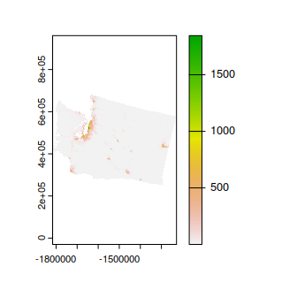
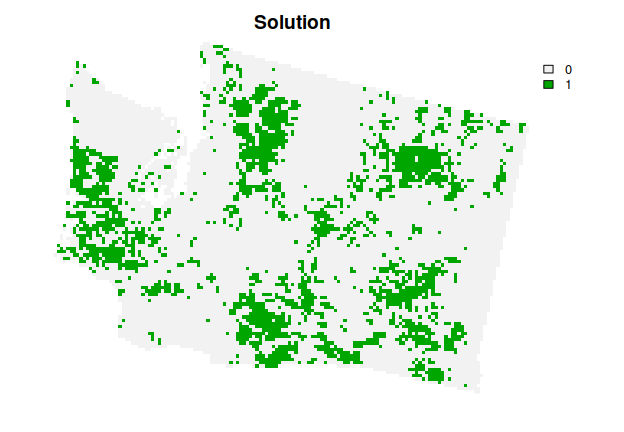
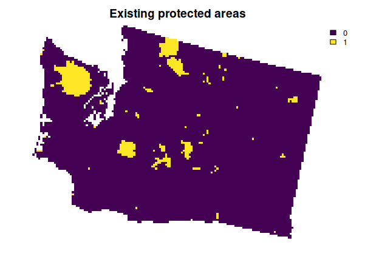
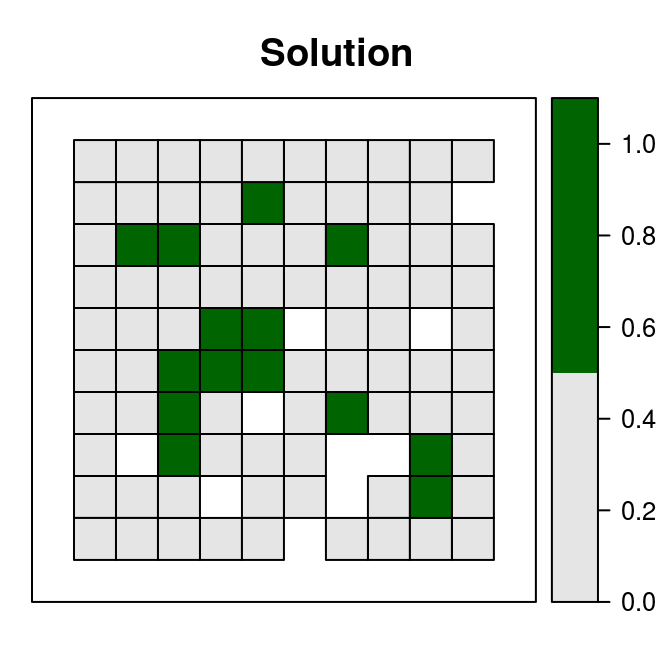
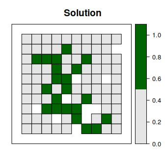
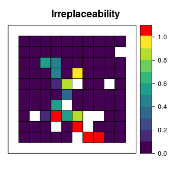

<!--- README.md is generated from README.Rmd. Please edit that file -->

# prioritizr: 

# Systematic Conservation Prioritization in R

<!-- badges: start -->

[](https://lifecycle.r-lib.org/articles/stages.html)
[](https://github.com/prioritizr/prioritizr/actions)
[](https://github.com/prioritizr/prioritizr/actions)
[](https://github.com/prioritizr/prioritizr/actions)
[](https://github.com/prioritizr/prioritizr/actions)
[](https://codecov.io/github/prioritizr/prioritizr?branch=master)
[](https://CRAN.R-project.org/package=prioritizr)
<!-- badges: end -->

The *prioritizr R* package uses mixed integer linear programming (MILP)
techniques to provide a flexible interface for building and solving
conservation planning problems. It supports a broad range of objectives,
constraints, and penalties that can be used to custom-tailor
conservation planning problems to the specific needs of a conservation
planning exercise. Once built, conservation planning problems can be
solved using a variety of commercial and open-source exact algorithm
solvers. In contrast to the algorithms conventionally used to solve
conservation problems, such as heuristics or simulated annealing, the
exact algorithms used here are guaranteed to find optimal solutions.
Furthermore, conservation problems can be constructed to optimize the
spatial allocation of different management actions or zones, meaning
that conservation practitioners can identify solutions that benefit
multiple stakeholders. Finally, this package has the functionality to
read input data formatted for the *Marxan* conservation planning
program, and find much cheaper solutions in a much shorter period of
time than *Marxan*.

## Installation

The latest official version of the *prioritizr R* package can be
installed from the [Comprehensive R Archive Network
(CRAN)](https://cran.r-project.org/) using the following *R* code.

``` r
install.packages("prioritizr", repos = "https://cran.rstudio.com/")
```

Alternatively, the latest development version can be installed from
[GitHub](https://github.com/prioritizr/prioritizr) using the following
code. Please note that while developmental versions may contain
additional features not present in the official version, they may also
contain coding errors.

``` r
if (!require(remotes)) install.packages("remotes")
remotes::install_github("prioritizr/prioritizr")
```

## Citation

Please cite the *prioritizr R* package when using it in publications. To
cite the latest official version, please use:

> Hanson JO, Schuster R, Morrell N, Strimas-Mackey M, Edwards BPM, Watts
> ME, Arcese P, Bennett J, Possingham HP (2022). prioritizr: Systematic
> Conservation Prioritization in R. R package version 7.2.1. Available
> at <https://CRAN.R-project.org/package=prioritizr>.

Alternatively, to cite the latest development version, please use:

> Hanson JO, Schuster R, Morrell N, Strimas-Mackey M, Edwards BPM, Watts
> ME, Arcese P, Bennett J, Possingham HP (2022). prioritizr: Systematic
> Conservation Prioritization in R. R package version 7.2.1. Available
> at <https://github.com/prioritizr/prioritizr>.

Additionally, we keep a [record of
publications](https://prioritizr.net/articles/publication_record.html)
that use the *prioritizr R* package. If you use this package in any
reports or publications, please [file an issue on
GitHub](https://github.com/prioritizr/prioritizr/issues/new) so we can
add it to the record.

## Usage

Here we will provide a short example showing how the *prioritizr R*
package can be used to build and solve conservation problems. For
brevity, we will use one of the built-in simulated datasets that is
distributed with the package. First, we will load the *prioritizr R*
package.

``` r
# load package
library(prioritizr)
```

We will use the `sim_pu_polygons` object to represent our planning
units. Although the *prioritizr R* can support many different types of
planning unit data, here our planning units are represented as polygons
in a spatial vector format (i.e. `SpatialPolygonsDataFrame`). Each
polygon represents a different planning unit and we have 90 planning
units in total. The attribute table associated with this dataset
contains information describing the acquisition cost of each planning
(“cost” column), and a value indicating if the unit is already located
in protected area (“locked\_in” column). Let’s explore the planning unit
data.

``` r
# load planning unit data
data(sim_pu_polygons)

# show the first 6 rows in the attribute table
head(sim_pu_polygons@data)
```

    ##       cost locked_in locked_out
    ## 1 215.8638     FALSE      FALSE
    ## 2 212.7823     FALSE      FALSE
    ## 3 207.4962     FALSE      FALSE
    ## 4 208.9322     FALSE       TRUE
    ## 5 214.0419     FALSE      FALSE
    ## 6 213.7636     FALSE      FALSE

``` r
# plot the planning units and color them according to acquisition cost
spplot(sim_pu_polygons, "cost", main = "Planning unit cost",
       xlim = c(-0.1, 1.1), ylim = c(-0.1, 1.1))
```


``` r
# plot the planning units and show which planning units are inside protected
# areas (colored in yellow)
spplot(sim_pu_polygons, "locked_in", main = "Planning units in protected areas",
       xlim = c(-0.1, 1.1), ylim = c(-0.1, 1.1))
```



Conservation features are represented using a stack of raster data
(i.e. `RasterStack` objects). A `RasterStack` represents a collection of
`RasterLayers` with the same spatial properties (i.e. spatial extent,
coordinate system, dimensionality, and resolution). Each `RasterLayer`
in the stack describes the distribution of a conservation feature.

In our example, the `sim_features` object is a `RasterStack` object that
contains 5 layers. Each `RasterLayer` describes the distribution of a
species. Specifically, the pixel values denote the proportion of
suitable habitat across different areas inside the study area. For a
given layer, pixels with a value of one are comprised entirely of
suitable habitat for the feature, and pixels with a value of zero
contain no suitable habitat.

``` r
# load feature data
data(sim_features)

# plot the distribution of suitable habitat for each feature
plot(sim_features, main = paste("Feature", seq_len(nlayers(sim_features))),
     nr = 2)
```


Let’s say that we want to develop a reserve network that will secure 15%
of the distribution for each feature in the study area for minimal cost.
In this planning scenario, we can either purchase all of the land inside
a given planning unit, or none of the land inside a given planning unit.
Thus we will create a new
[`problem`](https://prioritizr.net/reference/problem.html) that will use
a minimum set objective
([`add_min_set_objective`](https://prioritizr.net/reference/add_min_set_objective.html)),
with relative targets of 15%
([`add_relative_targets`](https://prioritizr.net/reference/add_relative_targets.html)),
binary decisions
([`add_binary_decisions`](https://prioritizr.net/reference/add_binary_decisions.html)),
and specify that we want to want optimal solutions from the best solver
installed on our system
([`add_default_solver`](https://prioritizr.net/reference/add_default_solver.html)).

``` r
# create problem
p1 <- problem(sim_pu_polygons, features = sim_features,
              cost_column = "cost") %>%
      add_min_set_objective() %>%
      add_relative_targets(0.15) %>%
      add_binary_decisions() %>%
      add_default_solver(gap = 0)
```

After we have built a
[`problem`](https://prioritizr.net/reference/problem.html), we can solve
it to obtain a solution. Since we have not specified the method used to
solve the problem, *prioritizr* will automatically use the best solver
currently installed. **It is strongly encouraged to install the [Gurobi
software suite and the *gurobi* *R* package to solve problems
quickly](https://www.gurobi.com/), for more information on this please
refer to the [Gurobi Installation
Guide](https://prioritizr.net/articles/gurobi_installation_guide.html)**

``` r
# solve the problem
s1 <- solve(p1)
```

    ## Gurobi Optimizer version 9.5.2 build v9.5.2rc0 (linux64)
    ## Thread count: 4 physical cores, 8 logical processors, using up to 1 threads
    ## Optimize a model with 5 rows, 90 columns and 450 nonzeros
    ## Model fingerprint: 0x53cdb40f
    ## Variable types: 0 continuous, 90 integer (90 binary)
    ## Coefficient statistics:
    ##   Matrix range     [2e-01, 9e-01]
    ##   Objective range  [2e+02, 2e+02]
    ##   Bounds range     [1e+00, 1e+00]
    ##   RHS range        [4e+00, 1e+01]
    ## Found heuristic solution: objective 3139.8880309
    ## Presolve time: 0.00s
    ## Presolved: 5 rows, 90 columns, 450 nonzeros
    ## Variable types: 0 continuous, 90 integer (90 binary)
    ## Found heuristic solution: objective 2929.4929229
    ## Root relaxation presolved: 5 rows, 90 columns, 450 nonzeros
    ## 
    ## 
    ## Root relaxation: objective 2.611170e+03, 13 iterations, 0.00 seconds (0.00 work units)
    ## 
    ##     Nodes    |    Current Node    |     Objective Bounds      |     Work
    ##  Expl Unexpl |  Obj  Depth IntInf | Incumbent    BestBd   Gap | It/Node Time
    ## 
    ##      0     0 2611.17006    0    4 2929.49292 2611.17006  10.9%     -    0s
    ## H    0     0                    2780.0314635 2611.17006  6.07%     -    0s
    ## H    0     0                    2761.3302091 2611.17006  5.44%     -    0s
    ## H    0     0                    2747.3774616 2611.17006  4.96%     -    0s
    ##      0     0 2611.74321    0    5 2747.37746 2611.74321  4.94%     -    0s
    ##      0     0 2611.77869    0    6 2747.37746 2611.77869  4.94%     -    0s
    ##      0     0 2611.89458    0    7 2747.37746 2611.89458  4.93%     -    0s
    ##      0     0 2611.92840    0    8 2747.37746 2611.92840  4.93%     -    0s
    ##      0     0 2611.95890    0    8 2747.37746 2611.95890  4.93%     -    0s
    ##      0     0 2611.99567    0    8 2747.37746 2611.99567  4.93%     -    0s
    ##      0     0 2612.19459    0    8 2747.37746 2612.19459  4.92%     -    0s
    ##      0     0 2612.26426    0    9 2747.37746 2612.26426  4.92%     -    0s
    ##      0     0 2612.28612    0   10 2747.37746 2612.28612  4.92%     -    0s
    ##      0     0 2612.30057    0   10 2747.37746 2612.30057  4.92%     -    0s
    ##      0     0 2612.32679    0   10 2747.37746 2612.32679  4.92%     -    0s
    ##      0     0 2612.33532    0   10 2747.37746 2612.33532  4.92%     -    0s
    ##      0     0 2612.39836    0    9 2747.37746 2612.39836  4.91%     -    0s
    ##      0     0 2612.42417    0   10 2747.37746 2612.42417  4.91%     -    0s
    ##      0     0 2612.43417    0   11 2747.37746 2612.43417  4.91%     -    0s
    ##      0     0 2612.49918    0   10 2747.37746 2612.49918  4.91%     -    0s
    ##      0     0 2612.50875    0   10 2747.37746 2612.50875  4.91%     -    0s
    ##      0     2 2612.81540    0   10 2747.37746 2612.81540  4.90%     -    0s
    ##  48461 24685 2632.32410   59    3 2747.37746 2621.25357  4.59%   1.6    5s
    ## H88635  5604                    2627.6389306 2622.33208  0.20%   1.6    6s
    ## 
    ## Cutting planes:
    ##   MIR: 6
    ##   StrongCG: 2
    ##   Flow cover: 3
    ## 
    ## Explored 108086 nodes (186594 simplex iterations) in 8.11 seconds (2.28 work units)
    ## Thread count was 1 (of 8 available processors)
    ## 
    ## Solution count 6: 2627.64 2747.38 2761.33 ... 3139.89
    ## 
    ## Optimal solution found (tolerance 0.00e+00)
    ## Best objective 2.627638930618e+03, best bound 2.627638930618e+03, gap 0.0000%

``` r
# extract the objective
print(attr(s1, "objective"))
```

    ## solution_1 
    ##   2627.639

``` r
# extract time spent solving the problem
print(attr(s1, "runtime"))
```

    ## solution_1 
    ##      8.144

``` r
# extract state message from the solver
print(attr(s1, "status"))
```

    ## solution_1 
    ##  "OPTIMAL"

``` r
# plot the solution
spplot(s1, "solution_1", main = "Solution", at = c(0, 0.5, 1.1),
       col.regions = c("grey90", "darkgreen"), xlim = c(-0.1, 1.1),
       ylim = c(-0.1, 1.1))
```



To evaluate the performance of the solution, we can calculate summary
statistics.

``` r
# calculate solution cost
print(eval_cost_summary(p1, s1[, "solution_1"]), width = Inf)
```

    ## # A tibble: 1 × 2
    ##   summary  cost
    ##   <chr>   <dbl>
    ## 1 overall 2628.

``` r
# calculate information describing how well the targets are met by the solution
print(eval_target_coverage_summary(p1, s1[, "solution_1"]), width = Inf)
```

    ## # A tibble: 5 × 9
    ##   feature met   total_amount absolute_target absolute_held absolute_shortfall
    ##   <chr>   <lgl>        <dbl>           <dbl>         <dbl>              <dbl>
    ## 1 layer.1 TRUE          74.5           11.2          11.5                   0
    ## 2 layer.2 TRUE          28.1            4.21          4.22                  0
    ## 3 layer.3 TRUE          64.9            9.73          9.75                  0
    ## 4 layer.4 TRUE          38.2            5.73          5.76                  0
    ## 5 layer.5 TRUE          50.7            7.60          7.60                  0
    ##   relative_target relative_held relative_shortfall
    ##             <dbl>         <dbl>              <dbl>
    ## 1            0.15         0.155                  0
    ## 2            0.15         0.150                  0
    ## 3            0.15         0.150                  0
    ## 4            0.15         0.151                  0
    ## 5            0.15         0.150                  0

Although this solution adequately conserves each feature, it is
inefficient because it does not consider the fact some of the planning
units are already inside protected areas. Since our planning unit data
contains information on which planning units are already inside
protected areas (in the `"locked_in"` column of the attribute table), we
can add constraints to ensure they are prioritized in the solution
([`add_locked_in_constraints`](https://prioritizr.net/reference/add_locked_in_constraints.html)).

``` r
# create new problem with locked in constraints added to it
p2 <- p1 %>%
      add_locked_in_constraints("locked_in")

# solve the problem
s2 <- solve(p2)
```

    ## Gurobi Optimizer version 9.5.2 build v9.5.2rc0 (linux64)
    ## Thread count: 4 physical cores, 8 logical processors, using up to 1 threads
    ## Optimize a model with 5 rows, 90 columns and 450 nonzeros
    ## Model fingerprint: 0x7d308c9f
    ## Variable types: 0 continuous, 90 integer (90 binary)
    ## Coefficient statistics:
    ##   Matrix range     [2e-01, 9e-01]
    ##   Objective range  [2e+02, 2e+02]
    ##   Bounds range     [1e+00, 1e+00]
    ##   RHS range        [4e+00, 1e+01]
    ## Found heuristic solution: objective 3027.6970854
    ## Presolve removed 0 rows and 10 columns
    ## Presolve time: 0.00s
    ## Presolved: 5 rows, 80 columns, 400 nonzeros
    ## Variable types: 0 continuous, 80 integer (80 binary)
    ## Found heuristic solution: objective 3021.2805888
    ## Root relaxation presolved: 5 rows, 80 columns, 400 nonzeros
    ## 
    ## 
    ## Root relaxation: objective 2.754438e+03, 12 iterations, 0.00 seconds (0.00 work units)
    ## 
    ##     Nodes    |    Current Node    |     Objective Bounds      |     Work
    ##  Expl Unexpl |  Obj  Depth IntInf | Incumbent    BestBd   Gap | It/Node Time
    ## 
    ##      0     0 2754.43795    0    4 3021.28059 2754.43795  8.83%     -    0s
    ## H    0     0                    2839.1208991 2754.43795  2.98%     -    0s
    ##      0     0 2754.44157    0    5 2839.12090 2754.44157  2.98%     -    0s
    ##      0     0 2758.48548    0    5 2839.12090 2758.48548  2.84%     -    0s
    ##      0     0 2758.91527    0    6 2839.12090 2758.91527  2.83%     -    0s
    ##      0     0 2759.22179    0    7 2839.12090 2759.22179  2.81%     -    0s
    ##      0     0 2761.07832    0    6 2839.12090 2761.07832  2.75%     -    0s
    ##      0     0 2761.43633    0    7 2839.12090 2761.43633  2.74%     -    0s
    ##      0     0 2761.45454    0    8 2839.12090 2761.45454  2.74%     -    0s
    ##      0     0 2761.46314    0    9 2839.12090 2761.46314  2.74%     -    0s
    ##      0     0 2761.49423    0   10 2839.12090 2761.49423  2.73%     -    0s
    ##      0     0 2761.65657    0   10 2839.12090 2761.65657  2.73%     -    0s
    ##      0     0 2762.39851    0   10 2839.12090 2762.39851  2.70%     -    0s
    ##      0     0 2762.63943    0    9 2839.12090 2762.63943  2.69%     -    0s
    ##      0     0 2763.80043    0    7 2839.12090 2763.80043  2.65%     -    0s
    ##      0     0 2763.80469    0    8 2839.12090 2763.80469  2.65%     -    0s
    ##      0     0 2763.83234    0    8 2839.12090 2763.83234  2.65%     -    0s
    ##      0     0 2763.88681    0    8 2839.12090 2763.88681  2.65%     -    0s
    ##      0     0 2763.89889    0    9 2839.12090 2763.89889  2.65%     -    0s
    ##      0     0 2764.42236    0    9 2839.12090 2764.42236  2.63%     -    0s
    ##      0     0 2764.50511    0   10 2839.12090 2764.50511  2.63%     -    0s
    ##      0     0 2764.71972    0   11 2839.12090 2764.71972  2.62%     -    0s
    ##      0     0 2764.92447    0   11 2839.12090 2764.92447  2.61%     -    0s
    ##      0     0 2765.35561    0   11 2839.12090 2765.35561  2.60%     -    0s
    ##      0     0 2765.37938    0   12 2839.12090 2765.37938  2.60%     -    0s
    ##      0     0 2765.56448    0   12 2839.12090 2765.56448  2.59%     -    0s
    ##      0     0 2765.66439    0   13 2839.12090 2765.66439  2.59%     -    0s
    ##      0     0 2765.95837    0   13 2839.12090 2765.95837  2.58%     -    0s
    ##      0     0 2766.11567    0   13 2839.12090 2766.11567  2.57%     -    0s
    ##      0     0 2766.24843    0   11 2839.12090 2766.24843  2.57%     -    0s
    ##      0     0 2766.27073    0   12 2839.12090 2766.27073  2.57%     -    0s
    ##      0     0 2766.27073    0   13 2839.12090 2766.27073  2.57%     -    0s
    ##      0     0 2766.27073    0   13 2839.12090 2766.27073  2.57%     -    0s
    ##      0     2 2766.27077    0   13 2839.12090 2766.27077  2.57%     -    0s
    ## * 1023   390              42    2838.2640999 2786.00750  1.84%   2.6    0s
    ## 
    ## Cutting planes:
    ##   Gomory: 2
    ##   MIR: 4
    ##   Flow cover: 1
    ## 
    ## Explored 10370 nodes (24553 simplex iterations) in 2.47 seconds (1.01 work units)
    ## Thread count was 1 (of 8 available processors)
    ## 
    ## Solution count 5: 2838.26 2839.12 3021.28 ... 3027.7
    ## 
    ## Optimal solution found (tolerance 0.00e+00)
    ## Best objective 2.838264099909e+03, best bound 2.838264099909e+03, gap 0.0000%

``` r
# plot the solution
spplot(s2, "solution_1", main = "Solution", at = c(0, 0.5, 1.1),
       col.regions = c("grey90", "darkgreen"), xlim = c(-0.1, 1.1),
       ylim = c(-0.1, 1.1))
```



This solution is an improvement over the previous solution. However, it
is also highly fragmented. As a consequence, this solution may be
associated with increased management costs and the species in this
scenario may not benefit substantially from this solution due to edge
effects. We can further modify the problem by adding penalties that
punish overly fragmented solutions
([`add_boundary_penalties`](https://prioritizr.net/reference/add_boundary_penalties.html)).
Here we will use a penalty factor of 300 (i.e. boundary length modifier;
BLM), and an edge factor of 50% so that planning units that occur outer
edge of the study area are not overly penalized.

``` r
# create new problem with boundary penalties added to it
p3 <- p2 %>%
      add_boundary_penalties(penalty = 300, edge_factor = 0.5)

# solve the problem
s3 <- solve(p3)
```

    ## Gurobi Optimizer version 9.5.2 build v9.5.2rc0 (linux64)
    ## Thread count: 4 physical cores, 8 logical processors, using up to 1 threads
    ## Optimize a model with 293 rows, 234 columns and 1026 nonzeros
    ## Model fingerprint: 0xf2e8dbb5
    ## Variable types: 0 continuous, 234 integer (234 binary)
    ## Coefficient statistics:
    ##   Matrix range     [2e-01, 1e+00]
    ##   Objective range  [6e+01, 3e+02]
    ##   Bounds range     [1e+00, 1e+00]
    ##   RHS range        [4e+00, 1e+01]
    ## Found heuristic solution: objective 19567.196992
    ## Found heuristic solution: objective 4347.6970854
    ## Presolve removed 72 rows and 46 columns
    ## Presolve time: 0.01s
    ## Presolved: 221 rows, 188 columns, 832 nonzeros
    ## Variable types: 0 continuous, 188 integer (188 binary)
    ## Found heuristic solution: objective 4118.0739655
    ## Root relaxation presolved: 221 rows, 188 columns, 832 nonzeros
    ## 
    ## 
    ## Root relaxation: objective 3.862929e+03, 120 iterations, 0.00 seconds (0.00 work units)
    ## 
    ##     Nodes    |    Current Node    |     Objective Bounds      |     Work
    ##  Expl Unexpl |  Obj  Depth IntInf | Incumbent    BestBd   Gap | It/Node Time
    ## 
    ##      0     0 3862.92935    0   65 4118.07397 3862.92935  6.20%     -    0s
    ## H    0     0                    4045.3056552 3862.92935  4.51%     -    0s
    ## H    0     0                    3951.7528370 3862.92935  2.25%     -    0s
    ##      0     0 3889.41282    0   41 3951.75284 3889.41282  1.58%     -    0s
    ## H    0     0                    3939.6015361 3889.41282  1.27%     -    0s
    ##      0     0 3892.64818    0   63 3939.60154 3892.64818  1.19%     -    0s
    ##      0     0 3896.53163    0   85 3939.60154 3896.53163  1.09%     -    0s
    ##      0     0 3910.26013    0    8 3939.60154 3910.26013  0.74%     -    0s
    ##      0     0 3910.58042    0    9 3939.60154 3910.58042  0.74%     -    0s
    ##      0     0 3915.80408    0    6 3939.60154 3915.80408  0.60%     -    0s
    ##      0     0     cutoff    0      3939.60154 3939.60154  0.00%     -    0s
    ## 
    ## Cutting planes:
    ##   Gomory: 1
    ##   Cover: 2
    ##   GUB cover: 1
    ##   Zero half: 1
    ## 
    ## Explored 1 nodes (220 simplex iterations) in 0.07 seconds (0.02 work units)
    ## Thread count was 1 (of 8 available processors)
    ## 
    ## Solution count 7: 3939.6 3943.85 3951.75 ... 19567.2
    ## 
    ## Optimal solution found (tolerance 0.00e+00)
    ## Best objective 3.939601536145e+03, best bound 3.939601536145e+03, gap 0.0000%

``` r
# plot the solution
spplot(s3, "solution_1", main = "Solution", at = c(0, 0.5, 1.1),
       col.regions = c("grey90", "darkgreen"), xlim = c(-0.1, 1.1),
       ylim = c(-0.1, 1.1))
```



This solution is even better then the previous solution. However, we are
not finished yet. This solution does not maintain connectivity between
reserves, and so species may have limited capacity to disperse
throughout the solution. To avoid this, we can add contiguity
constraints
([`add_contiguity_constraints`](https://prioritizr.net/reference/add_contiguity_constraints.html)).

``` r
# create new problem with contiguity constraints
p4 <- p3 %>%
      add_contiguity_constraints()

# solve the problem
s4 <- solve(p4)
```

    ## Gurobi Optimizer version 9.5.2 build v9.5.2rc0 (linux64)
    ## Thread count: 4 physical cores, 8 logical processors, using up to 1 threads
    ## Optimize a model with 654 rows, 506 columns and 2292 nonzeros
    ## Model fingerprint: 0xa7ea9b38
    ## Variable types: 0 continuous, 506 integer (506 binary)
    ## Coefficient statistics:
    ##   Matrix range     [2e-01, 1e+00]
    ##   Objective range  [6e+01, 3e+02]
    ##   Bounds range     [1e+00, 1e+00]
    ##   RHS range        [1e+00, 1e+01]
    ## Presolve removed 352 rows and 261 columns
    ## Presolve time: 0.03s
    ## Presolved: 302 rows, 245 columns, 678 nonzeros
    ## Variable types: 0 continuous, 245 integer (245 binary)
    ## Found heuristic solution: objective 7330.4055047
    ## Found heuristic solution: objective 6070.2074533
    ## Root relaxation presolved: 302 rows, 245 columns, 678 nonzeros
    ## 
    ## 
    ## Root relaxation: objective 5.489159e+03, 68 iterations, 0.00 seconds (0.00 work units)
    ## 
    ##     Nodes    |    Current Node    |     Objective Bounds      |     Work
    ##  Expl Unexpl |  Obj  Depth IntInf | Incumbent    BestBd   Gap | It/Node Time
    ## 
    ##      0     0 5489.15943    0   59 6070.20745 5489.15943  9.57%     -    0s
    ## H    0     0                    5858.4184908 5489.15943  6.30%     -    0s
    ##      0     0 5738.84421    0   49 5858.41849 5738.84421  2.04%     -    0s
    ##      0     0 5829.13269    0    8 5858.41849 5829.13269  0.50%     -    0s
    ##      0     0 infeasible    0      5858.41849 5858.41849  0.00%     -    0s
    ## 
    ## Explored 1 nodes (193 simplex iterations) in 0.06 seconds (0.02 work units)
    ## Thread count was 1 (of 8 available processors)
    ## 
    ## Solution count 4: 5858.42 5859.21 6070.21 7330.41 
    ## 
    ## Optimal solution found (tolerance 0.00e+00)
    ## Best objective 5.858418490821e+03, best bound 5.858418490821e+03, gap 0.0000%

``` r
# plot the solution
spplot(s4, "solution_1", main = "Solution", at = c(0, 0.5, 1.1),
       col.regions = c("grey90", "darkgreen"), xlim = c(-0.1, 1.1),
       ylim = c(-0.1, 1.1))
```



Now let’s explore which planning units selected in the prioritization
are most important for meeting our targets as cost-effectively as
possible. To achieve this, we will calculate importance
(irreplaceability) scores using a version of the replacement cost
method. Under this method, planning units with higher scores are more
important for meeting the objective of our conservation planning problem
than those with lower scores. Furthermore, planning units with infinite
scores are irreplaceable—it is impossible to meet our targets without
protecting these planning units. Note that we override the solver
behavior in the code below to prevent lots of unnecessary text from
being output.

``` r
# solve the problem
rc <- p4 %>%
      add_default_solver(gap = 0, verbose = FALSE) %>%
      eval_replacement_importance(s4[, "solution_1"])
```

    ## Warning in res(x, ...): overwriting previously defined solver

``` r
# set infinite values as 1.09 so we can plot them
rc$rc[rc$rc > 100] <- 1.09

# plot the importance scores
# planning units that are truly irreplaceable are shown in red
spplot(rc, "rc", main = "Irreplaceability", xlim = c(-0.1, 1.1),
       ylim = c(-0.1, 1.1), at = c(seq(0, 0.9, 0.1), 1.01, 1.1),
       col.regions = c("#440154", "#482878", "#3E4A89", "#31688E", "#26828E",
                       "#1F9E89", "#35B779", "#6DCD59", "#B4DE2C", "#FDE725",
                       "#FF0000"))
```



This short example demonstrates how the *prioritizr R* package can be
used to build and customize conservation problems, and then solve them
to generate solutions. Although we explored just a few different
functions for modifying a conservation problem, the package provides
many functions for specifying objectives, constraints, penalties, and
decision variables, so that you can build and custom-tailor conservation
planning problems to suit your planning scenario.

## Learning resources

The [package website](https://prioritizr.net/index.html) contains
information on the *prioritizr R* package. Here you can find
[documentation for every function and built-in
dataset](https://prioritizr.net/reference/index.html), and [news
describing the updates in each package
version](https://prioritizr.net/news/index.html). It also contains the
following articles and tutorials.

-   [**Getting
    started**](https://prioritizr.net/articles/prioritizr.html): Short
    tutorial on using the package.
-   [**Package
    overview**](https://prioritizr.net/articles/package_overview.html):
    Introduction to systematic conservation planning and a comprehensive
    overview of the package.
-   [**Connectivity
    tutorial**](https://prioritizr.net/articles/connectivity_tutorial.html):
    Tutorial on incorporating connectivity into prioritizations.
-   [**Calibrating trade-offs
    tutorial**](https://prioritizr.net/articles/calibrating_trade-offs_tutorial.html):
    Tutorial on running calibration analyses to satisfy multiple
    criteria.
-   [**Management zones
    tutorial**](https://prioritizr.net/articles/management_zones_tutorial.html):
    Tutorial on incorporating multiple management zones and actions into
    prioritizations.
-   [**Gurobi installation
    guide**](https://prioritizr.net/articles/gurobi_installation_guide.html):
    Instructions for installing the *Gurobi* optimization suite for
    generating prioritizations.
-   [**Solver
    benchmarks**](https://prioritizr.net/articles/solver_benchmarks.html):
    Performance comparison of optimization solvers for generating
    prioritizations.
-   [**Publication
    record**](https://prioritizr.net/articles/publication_record.html):
    List of publications that have cited the package.

Additional resources can also be found in [online repositories under the
*prioritizr* organization](https://github.com/prioritizr). These
resources include [slides for talks and seminars about the
package](https://github.com/prioritizr/teaching). Additionally, workshop
materials are available too (e.g., the [Massey University 2021
workshop](https://prioritizr.github.io/massey-workshop/) and the
[PacMara 2019
workshop](https://prioritizr.github.io/PacMara_workshop/)).

## Getting help

If you have any questions about the *prioritizr R* package or
suggestions for improving it, please [post an issue on the code
repository](https://github.com/prioritizr/prioritizr/issues/new).
