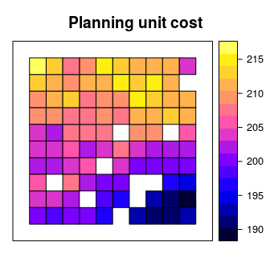

<!--- README.md is generated from README.Rmd. Please edit that file -->
Systematic conservation prioritization in R
===========================================

[](http://www.repostatus.org/#wip) [](https://travis-ci.org/prioritizr/prioritizr) [](https://ci.appveyor.com/project/jeffreyhanson/prioritizr) [](https://codecov.io/github/prioritizr/prioritizr?branch=master) [](https://CRAN.R-project.org/package=prioritizr)

*Prioritizr* is an *R* package for solving systematic conservation prioritization problems using integer linear programming (ILP) techniques. The package offers a flexible interface for creating conservation problems using a range of different objectives and constraints that can be tailored to the specific needs of the conservation planner. Conservation problems can be solved using a variety of commercial and open-source exact algorithm solvers. In contrast to the algorithms conventionally used to solve conservation problems, such as greedy heuristics or simulated annealing, the exact algorithms used by *prioritizr* are guaranteed to find optimal solutions. This package also has the functionality to read [Marxan](http://marxan.net/) input data and find much cheaper solutions in a much shorter period of time than *Marxan* ([Beyer *et al. 2016*](http://marxan.net/downloads/papers/beyer_etal_2015.pdf)). Check out the [*prioritizrshiny* *R* package](https://github.com/prioritizr/prioritizrshiny) to interactively build and customize conservation planning problems.

Overview
--------

This package largely consists of seven main types of functions. These functions are used to:

-   create a new reserve design [problem](https://prioritizr.github.io/prioritizr/reference/problem.html) by specifying the planning units and features of conservation interest (e.g. species, ecosystems).
-   add an [objective](https://prioritizr.github.io/prioritizr/reference/objectives.html) to a reserve design problem. For example, the [`add_min_set_objective`](https://prioritizr.github.io/prioritizr/reference/add_min_set_objective.html) function can used to specify that the overall goal of the prioritization is to adequately represent each feature for minimal cost.
-   add [targets](https://prioritizr.github.io/prioritizr/reference/targets.html) to a problem to identify how much of each feature is desired in solutions
-   add [constraints](https://prioritizr.github.io/prioritizr/reference/constraints.html) to a problem to obtain better solutions. For example, the [`add_locked_in_constraints`](https://prioritizr.github.io/prioritizr/reference/add_locked_in_constraints.html) function can be used to ensure that specific planning units will be prioritized. This can be useful when identifying new places to add to an existing reserve network.
-   add [penalties](https://prioritizr.github.io/prioritizr/reference/penalties.html) to a problem to penalize ineffective solutions. For example, the [`add_boundary_penalties`](https://prioritizr.github.io/prioritizr/reference/add_boundary_penalties.html) function can be used to add penalties to the problem that result in solutions being clumped into contiguous reserves.
-   add [decisions](https://prioritizr.github.io/prioritizr/reference/decisions.html) to a problem to specify the nature of the conservation decision on the planning units. For example, the [`add_binary_decisions`](https://prioritizr.github.io/prioritizr/reference/add_binary_decisions.html) function specifies that planning units are either prioritized or not. Whereas, the [`add_proportion_decisions`](https://prioritizr.github.io/prioritizr/reference/add_proportion_decisions.html) can be used to specify that a proportion of each planning unit can be prioritized.
-   add methods to generate a [portfolio](https://prioritizr.github.io/prioritizr/reference/portfolios.html) of solutions. For instance, use [`add_cuts_portfolio`](https://prioritizr.github.io/prioritizr/reference/add_cuts_portfolio.html) to find a given number of solutions that are closest to optimality.
-   add a [solver](https://prioritizr.github.io/prioritizr/reference/solve.html) to customize the methods used to solve the problem.

The currently supported solvers are listed below. Each must be installed separately from this package. The details of the solvers are intentionally abstracted away so that minimal knowledge is required to use a given solver.

-   [Gurobi:](http://gurobi.com) Install the [*gurobi* *R* package](http://www.gurobi.com/products/modeling-languages/r) to use this solver.
-   [SYMPHONY:](https://projects.coin-or.org/SYMPHONY) Install either the [*Rsymphony*](https://CRAN.R-project.org/package=Rsymphony) or [*lpsymphony*](https://bioconductor.riken.jp/packages/3.3/bioc/html/lpsymphony.html) *R* packages to use this solver.

Installation
------------

To install the developmental version of *prioritizr*, use the following *R* code:

``` r
if (!require(devtools))
  install.packages("devtools")
devtools::install_github("prioritizr/prioritizr")
```

Citation
--------

    Hanson JO, Schuster R, Morrell N, Strimas-Mackey M, Watts ME, Arcese P, Bennett J, Possingham HP (2017). prioritizr: Systematic Conservation Prioritization in R. R package version 2.0.2.1. https://github.com/prioritizr/prioritizr.

Example usage
-------------

Here we will provide a simple example on using this package to solve conservation problems. We will use one of the built-in simulated data sets that is distributed with the package. First, we will load the *prioritizr* package.

``` r
# load package
library(prioritizr)
```

We will use the `sim_pu_polygons` object to represent our planning units. Although *prioritizr* can support many different types of planning unit data, here our planning units are represented as polygons in a vector format (i.e. `SpatialPolygonsDataFrame`). Each polygon represents a planning unit. This object contains 90 planning units. The attribute table associates each planning unit an acquisition cost ("cost" column), and a value indicating if the unit is inside a simulated protected area ("locked\_in" column). Let's explore the planning unit data.

``` r
# load planning unit data
data(sim_pu_polygons)

# show the first 20 rows in the attribute table
head(sim_pu_polygons@data)
```

    ##       cost locked_in locked_out
    ## 1 215.8638     FALSE      FALSE
    ## 2 212.7823     FALSE      FALSE
    ## 3 207.4962     FALSE      FALSE
    ## 4 208.9322     FALSE       TRUE
    ## 5 214.0419     FALSE      FALSE
    ## 6 213.7636     FALSE      FALSE

``` r
# plot the planning units and colour by acquisition cost
spplot(sim_pu_polygons, "cost", main = "Planning unit cost",
       xlim = c(-0.1, 1.1), ylim = c(-0.1, 1.1))
```



``` r
# plot the planning units and show which planning units are inside protected
# areas. Units inside protected areas are shown in yellow.
spplot(sim_pu_polygons, "locked_in", main = "Planning units in protected areas",
       xlim = c(-0.1, 1.1), ylim = c(-0.1, 1.1))
```


Biodiversity features are represented using a stack of raster data (i.e. `RasterStack` objects). A `RasterStack` represents a collection of `RasterLayers` with the same spatial properties (i.e. spatial extent, coordinate system, dimensionality, and resolution). Each `RasterLayer` in the stack describes the distribution of a biodiversity feature.

In our example, the `sim_features` object is a `RasterStack` object that contains 5 layers. Each `RasterLayer` describes the distribution of a species. Specifically, the cell values denote the proportion of suitable habitat in across the study area. For a given layer, cells with a value of one are entirely comprized of suitable habitat for the feature, and cells with a value of zero contain no suitable habitat.

``` r
# load feature data
data(sim_features)
# plot the distribution of suitable habitat for each feature
plot(sim_features, main = paste("Feature", seq_len(nlayers(sim_features))),
     nr = 2)
```


We want to develop a reserve network that will secure 20 % of the distribution for each feature for minimal cost. In this planning scenario, we can either purchase all of the land inside a given planning unit, or none of the land inside a given planning unit. Thus we will create a new [`problem`](https://prioritizr.github.io/prioritizr/reference/problem.html) that will use a minimum set objective ([`add_min_set_objective`](https://prioritizr.github.io/prioritizr/reference/add_min_set_objective.html)), with relative targets of 20 % ([`add_relative_targets`](https://prioritizr.github.io/prioritizr/reference/add_relative_targets.html)), and binary decisions ([`add_binary_decisions`](https://prioritizr.github.io/prioritizr/reference/add_binary_decisions.html)).

``` r
# create problem
p1 <- problem(sim_pu_polygons, features = sim_features,
              cost_column = "cost") %>%
      add_min_set_objective() %>%
      add_relative_targets(0.2) %>%
      add_binary_decisions()
```

After we have built a [`problem`](https://prioritizr.github.io/prioritizr/reference/problem.html), we can solve it to obtain a solution. Since we have not specified the method used to solve the problem, *prioritizr* will automatically use the best solver currently installed. **It is strongly encouraged to install the [Gurobi software suite and the *gurobi* *R* package to solve problems quickly](http://gurobi.com).**

``` r
# solve the problem
s1 <- solve(p1)
```

    ## Optimize a model with 5 rows, 90 columns and 450 nonzeros
    ## Variable types: 0 continuous, 90 integer (90 binary)
    ## Coefficient statistics:
    ##   Matrix range     [2e-01, 9e-01]
    ##   Objective range  [2e+02, 2e+02]
    ##   Bounds range     [1e+00, 1e+00]
    ##   RHS range        [6e+00, 1e+01]
    ## Found heuristic solution: objective 4135.27
    ## Presolve time: 0.00s
    ## Presolved: 5 rows, 90 columns, 450 nonzeros
    ## Variable types: 0 continuous, 90 integer (90 binary)
    ## Presolved: 5 rows, 90 columns, 450 nonzeros
    ## 
    ## 
    ## Root relaxation: objective 3.490348e+03, 17 iterations, 0.00 seconds
    ## 
    ##     Nodes    |    Current Node    |     Objective Bounds      |     Work
    ##  Expl Unexpl |  Obj  Depth IntInf | Incumbent    BestBd   Gap | It/Node Time
    ## 
    ##      0     0 3490.34813    0    4 4135.27447 3490.34813  15.6%     -    0s
    ## H    0     0                    3597.0951275 3490.34813  2.97%     -    0s
    ## 
    ## Explored 1 nodes (17 simplex iterations) in 0.00 seconds
    ## Thread count was 1 (of 16 available processors)
    ## 
    ## Solution count 2: 3597.1 4135.27 
    ## 
    ## Optimal solution found (tolerance 1.00e-01)
    ## Best objective 3.597095127479e+03, best bound 3.490348127696e+03, gap 2.9676%

``` r
# extract the objective (cost of solution in this case)
print(attr(s1, "objective"))
```

    ## solution_1 
    ##   3597.095

``` r
# extract time spent solving solution
print(attr(s1, "runtime"))
```

    ##  solution_1 
    ## 0.003009796

``` r
# extract message returned from solver
print(attr(s1, "status"))
```

    ## solution_1 
    ##  "OPTIMAL"

``` r
# plot the solution
s1$solution_1 <- factor(s1$solution_1)
spplot(s1, "solution_1", col.regions = c('grey90', 'darkgreen'),
       main = "Solution", xlim = c(-0.1, 1.1), ylim = c(-0.1, 1.1))
```


Although this solution adequately conserves each feature, it is inefficient because it does not consider the fact some of the planning units are already inside protected areas. Since our vector data contains information on which planning units are inside protected areas in the `"locked_in"` column, we can add constraints to ensure they are prioritized in the solution ([`add_locked_in_constraints`](https://prioritizr.github.io/prioritizr/reference/add_locked_in_constraints.html)).

``` r
# create problem with locked in constraints added to it
p2 <- p1 %>% add_locked_in_constraints("locked_in")
# solve the problem
s2 <- solve(p2)
```

    ## Optimize a model with 5 rows, 90 columns and 450 nonzeros
    ## Variable types: 0 continuous, 90 integer (90 binary)
    ## Coefficient statistics:
    ##   Matrix range     [2e-01, 9e-01]
    ##   Objective range  [2e+02, 2e+02]
    ##   Bounds range     [1e+00, 1e+00]
    ##   RHS range        [6e+00, 1e+01]
    ## Found heuristic solution: objective 4020.2
    ## Presolve removed 0 rows and 10 columns
    ## Presolve time: 0.00s
    ## Presolved: 5 rows, 80 columns, 400 nonzeros
    ## Variable types: 0 continuous, 80 integer (80 binary)
    ## Presolved: 5 rows, 80 columns, 400 nonzeros
    ## 
    ## 
    ## Root relaxation: objective 3.620461e+03, 11 iterations, 0.00 seconds
    ## 
    ##     Nodes    |    Current Node    |     Objective Bounds      |     Work
    ##  Expl Unexpl |  Obj  Depth IntInf | Incumbent    BestBd   Gap | It/Node Time
    ## 
    ##      0     0 3620.46082    0    3 4020.20382 3620.46082  9.94%     -    0s
    ## 
    ## Explored 1 nodes (11 simplex iterations) in 0.00 seconds
    ## Thread count was 1 (of 16 available processors)
    ## 
    ## Solution count 1: 4020.2 
    ## 
    ## Optimal solution found (tolerance 1.00e-01)
    ## Best objective 4.020203818008e+03, best bound 3.620460824006e+03, gap 9.9434%

``` r
# plot the solution
s2$solution_1 <- factor(s2$solution_1)
spplot(s2, "solution_1", col.regions = c('grey90', 'darkgreen'),
       main = "Solution", xlim = c(-0.1, 1.1), ylim = c(-0.1, 1.1))
```


This solution is an improvement over the the previous solution. However, it is also highly fragmented. As a consequence, implementing this solution may be associated with increased management costs and be susceptible to edge effects. We can further constrain the solution by adding penalties that punish overly fragmented solutions ([`add_boundary_penalties`](https://prioritizr.github.io/prioritizr/reference/add_boundary_penalties.html)). Here we will use a penalty factor of 1 (i.e. boundary length modifier; BLM), and an edge factor of 50 % so that planning units along the coastline are not overly penalized.

``` r
# create problem with boundary penalties added to it
p3 <- p2 %>% add_boundary_penalties(penalty = 500, edge_factor = 0.5)
# solve the problem
s3 <- solve(p3)
```

    ## Optimize a model with 293 rows, 234 columns and 1026 nonzeros
    ## Variable types: 0 continuous, 234 integer (234 binary)
    ## Coefficient statistics:
    ##   Matrix range     [2e-01, 1e+00]
    ##   Objective range  [1e+02, 4e+02]
    ##   Bounds range     [1e+00, 1e+00]
    ##   RHS range        [6e+00, 1e+01]
    ## Found heuristic solution: objective 20287.2
    ## Found heuristic solution: objective 6420.2
    ## Presolve removed 72 rows and 46 columns
    ## Presolve time: 0.00s
    ## Presolved: 221 rows, 188 columns, 832 nonzeros
    ## Variable types: 0 continuous, 188 integer (188 binary)
    ## Presolved: 221 rows, 188 columns, 832 nonzeros
    ## 
    ## 
    ## Root relaxation: objective 5.477092e+03, 121 iterations, 0.00 seconds
    ## 
    ##     Nodes    |    Current Node    |     Objective Bounds      |     Work
    ##  Expl Unexpl |  Obj  Depth IntInf | Incumbent    BestBd   Gap | It/Node Time
    ## 
    ##      0     0 5477.09167    0   89 6420.20382 5477.09167  14.7%     -    0s
    ## H    0     0                    5963.8421871 5477.09167  8.16%     -    0s
    ## 
    ## Explored 1 nodes (121 simplex iterations) in 0.01 seconds
    ## Thread count was 1 (of 16 available processors)
    ## 
    ## Solution count 3: 5963.84 6420.2 20287.2 
    ## 
    ## Optimal solution found (tolerance 1.00e-01)
    ## Best objective 5.963842187126e+03, best bound 5.477091668218e+03, gap 8.1617%

``` r
# plot the solution
s3$solution_1 <- factor(s3$solution_1)
spplot(s3, "solution_1", col.regions = c('grey90', 'darkgreen'),
       main = "Solution", xlim = c(-0.1, 1.1), ylim = c(-0.1, 1.1))
```


This solution is even better then the previous solution. However, we are not finished yet. This solution does not maintain connectivity between reserves, and so species may have limited ability to disperse throughout the reserve network. To avoid this, we can add connected constraints ([`add_connected_constraints`](https://prioritizr.github.io/prioritizr/reference/add_connected_constraints.html)).

``` r
# create problem with connected constraints
p4 <- p3 %>% add_connected_constraints()
# solve the problem
s4 <- solve(p4)
```

    ## Optimize a model with 655 rows, 506 columns and 2293 nonzeros
    ## Variable types: 0 continuous, 506 integer (506 binary)
    ## Coefficient statistics:
    ##   Matrix range     [2e-01, 1e+00]
    ##   Objective range  [1e+02, 4e+02]
    ##   Bounds range     [1e+00, 1e+00]
    ##   RHS range        [1e+00, 1e+01]
    ## Presolve removed 187 rows and 129 columns
    ## Presolve time: 0.00s
    ## Presolved: 468 rows, 377 columns, 1688 nonzeros
    ## Variable types: 0 continuous, 377 integer (376 binary)
    ## Presolved: 468 rows, 377 columns, 1688 nonzeros
    ## 
    ## 
    ## Root relaxation: objective 5.647064e+03, 334 iterations, 0.01 seconds
    ## 
    ##     Nodes    |    Current Node    |     Objective Bounds      |     Work
    ##  Expl Unexpl |  Obj  Depth IntInf | Incumbent    BestBd   Gap | It/Node Time
    ## 
    ##      0     0 5647.06401    0  153          - 5647.06401      -     -    0s
    ##      0     0 5890.44226    0   78          - 5890.44226      -     -    0s
    ##      0     0 5890.47965    0   84          - 5890.47965      -     -    0s
    ##      0     0 5955.81681    0  116          - 5955.81681      -     -    0s
    ##      0     0 5961.21299    0  117          - 5961.21299      -     -    0s
    ##      0     0 5962.20129    0  119          - 5962.20129      -     -    0s
    ##      0     0 5962.20129    0  119          - 5962.20129      -     -    0s
    ##      0     0 5970.47709    0  110          - 5970.47709      -     -    0s
    ##      0     0 5973.62595    0  112          - 5973.62595      -     -    0s
    ##      0     0 5975.96010    0  119          - 5975.96010      -     -    0s
    ##      0     0 5993.08173    0  127          - 5993.08173      -     -    0s
    ##      0     0 6000.64312    0  120          - 6000.64312      -     -    0s
    ##      0     0 6001.64677    0  126          - 6001.64677      -     -    0s
    ##      0     0 6001.67965    0  127          - 6001.67965      -     -    0s
    ##      0     0 6005.68765    0  114          - 6005.68765      -     -    0s
    ##      0     0 6005.70873    0  115          - 6005.70873      -     -    0s
    ##      0     0 6009.34202    0  117          - 6009.34202      -     -    0s
    ##      0     0 6009.54033    0  114          - 6009.54033      -     -    0s
    ##      0     0 6010.24752    0  122          - 6010.24752      -     -    0s
    ##      0     0 6010.48660    0  104          - 6010.48660      -     -    0s
    ##      0     0 6012.89021    0  112          - 6012.89021      -     -    0s
    ##      0     0 6012.89021    0  110          - 6012.89021      -     -    0s
    ## H    0     0                    12169.667322 6012.89021  50.6%     -    0s
    ##      0     2 6013.70070    0  110 12169.6673 6013.70070  50.6%     -    0s
    ## H   13    13                    6873.1743958 6020.56496  12.4%  20.5    0s
    ## *   15    11               9    6801.3893648 6020.56496  11.5%  18.0    0s
    ## H   26    13                    6469.1727465 6024.62441  6.87%  17.2    0s
    ## 
    ## Cutting planes:
    ##   Gomory: 4
    ##   MIR: 1
    ##   Zero half: 26
    ## 
    ## Explored 27 nodes (1240 simplex iterations) in 0.13 seconds
    ## Thread count was 1 (of 16 available processors)
    ## 
    ## Solution count 4: 6469.17 6801.39 6873.17 12169.7 
    ## 
    ## Optimal solution found (tolerance 1.00e-01)
    ## Best objective 6.469172746541e+03, best bound 6.024624405213e+03, gap 6.8718%

``` r
# plot the solution
s4$solution_1 <- factor(s4$solution_1)
spplot(s4, "solution_1", col.regions = c('grey90', 'darkgreen'),
       main = "Solution", xlim = c(-0.1, 1.1), ylim = c(-0.1, 1.1))
```


This short example demonstrates how the *prioritizr* package can be used to build a minimal conservation problem, and how constraints can be iteratively added to the problem to obtain a solution that fulfils the needs of the conservation planner. Here, we explored several constraints using the minimum set objective. The *prioritizr* package provides many other constraints and also different objectives that can be used to build a conservation problem.
