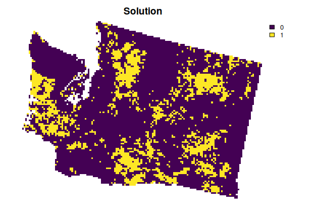
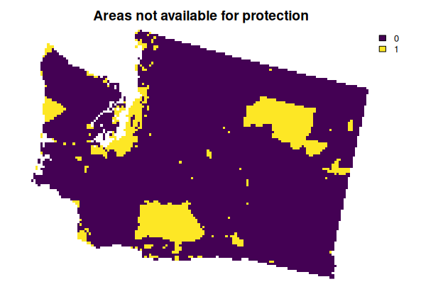

<!--- README.md is generated from README.Rmd. Please edit that file -->

# prioritizr: 

# Systematic Conservation Prioritization in R

<!-- badges: start -->

[](https://lifecycle.r-lib.org/articles/stages.html)
[](https://github.com/prioritizr/prioritizr/actions)
[](https://github.com/prioritizr/prioritizr/actions)
[](https://github.com/prioritizr/prioritizr/actions)
[](https://github.com/prioritizr/prioritizr/actions)
[](https://codecov.io/github/prioritizr/prioritizr?branch=master)
[](https://CRAN.R-project.org/package=prioritizr)
<!-- badges: end -->

The *prioritizr R* package uses mixed integer linear programming (MILP)
techniques to provide a flexible interface for building and solving
conservation planning problems. It supports a broad range of objectives,
constraints, and penalties that can be used to custom-tailor
conservation planning problems to the specific needs of a conservation
planning exercise. Once built, conservation planning problems can be
solved using a variety of commercial and open-source exact algorithm
solvers. In contrast to the algorithms conventionally used to solve
conservation problems, such as heuristics or simulated annealing, the
exact algorithms used here are guaranteed to find optimal solutions.
Furthermore, conservation problems can be constructed to optimize the
spatial allocation of different management actions or zones, meaning
that conservation practitioners can identify solutions that benefit
multiple stakeholders. Finally, this package has the functionality to
read input data formatted for the *Marxan* conservation planning
program, and find much cheaper solutions in a much shorter period of
time than *Marxan*.

## Installation

The latest official version of the *prioritizr R* package can be
installed from the [Comprehensive R Archive Network
(CRAN)](https://cran.r-project.org/) using the following *R* code.

``` r
install.packages("prioritizr", repos = "https://cran.rstudio.com/")
```

Alternatively, the latest development version can be installed from
[GitHub](https://github.com/prioritizr/prioritizr) using the following
code. Please note that while developmental versions may contain
additional features not present in the official version, they may also
contain coding errors.

``` r
if (!require(remotes)) install.packages("remotes")
remotes::install_github("prioritizr/prioritizr")
```

## Citation

Please cite the *prioritizr R* package when using it in publications. To
cite the latest official version, please use:

> Hanson JO, Schuster R, Morrell N, Strimas-Mackey M, Edwards BPM, Watts
> ME, Arcese P, Bennett J, Possingham HP (2023). prioritizr: Systematic
> Conservation Prioritization in R. R package version 8.0.0. Available
> at <https://CRAN.R-project.org/package=prioritizr>.

Alternatively, to cite the latest development version, please use:

> Hanson JO, Schuster R, Morrell N, Strimas-Mackey M, Edwards BPM, Watts
> ME, Arcese P, Bennett J, Possingham HP (2023). prioritizr: Systematic
> Conservation Prioritization in R. R package version 8.0.0. Available
> at <https://github.com/prioritizr/prioritizr>.

Additionally, we keep a [record of
publications](https://prioritizr.net/articles/publication_record.html)
that use the *prioritizr R* package. If you use this package in any
reports or publications, please [file an issue on
GitHub](https://github.com/prioritizr/prioritizr/issues/new) so we can
add it to the record.

## Usage

Here we provide a short example showing how the *prioritizr R* package
can be used to build and solve conservation problems. Specifically, we
will use an example dataset available through the *prioritizrdata R*
package. To begin with, we will load the packages.

``` r
# load packages
library(prioritizr)
library(prioritizrdata)
```

We will use the Washington dataset in this example. To import the
planning unit data, we will use the `get_wa_pu()` function. Although the
*prioritizr R* package can support many different types of planning unit
data, here our planning units are represented as a single-layer raster
(i.e., `terra::rast()` object). Each cell represents a different
planning unit, and cell values denote land acquisition costs.
Specifically, there are 10757 planning units in total (i.e., cells with
non-missing values).

``` r
# import planning unit data
wa_pu <- get_wa_pu()

# preview data
print(wa_pu)
```

    ## class       : SpatRaster 
    ## dimensions  : 109, 147, 1  (nrow, ncol, nlyr)
    ## resolution  : 4000, 4000  (x, y)
    ## extent      : -1816382, -1228382, 247483.5, 683483.5  (xmin, xmax, ymin, ymax)
    ## coord. ref. : +proj=laea +lat_0=45 +lon_0=-100 +x_0=0 +y_0=0 +ellps=sphere +units=m +no_defs 
    ## source      : wa_pu.tif 
    ## name        :         cost 
    ## min value   :    0.2988945 
    ## max value   : 1845.9683838

``` r
# plot data
plot(wa_pu, main = "Costs", axes = FALSE)
```


Next, we will use the `get_wa_features()` function to import the
conservation feature data. Although the *prioritizr R* package can
support many different types of feature data, here our feature data are
represented as a multi-layer raster (i.e., `terra::rast()` object). Each
layer describes the spatial distribution of a feature. Here, our feature
data correspond to different bird species. To account for migratory
patterns, the breeding and non-breeding distributions of species are
represented as different features. Specifically, the cell values denote
the relative abundance of individuals, with higher values indicating
greater abundance.

``` r
# import feature data
wa_features <- get_wa_features()

# preview data
print(wa_features)
```

    ## class       : SpatRaster 
    ## dimensions  : 109, 147, 400  (nrow, ncol, nlyr)
    ## resolution  : 4000, 4000  (x, y)
    ## extent      : -1816382, -1228382, 247483.5, 683483.5  (xmin, xmax, ymin, ymax)
    ## coord. ref. : +proj=laea +lat_0=45 +lon_0=-100 +x_0=0 +y_0=0 +ellps=sphere +units=m +no_defs 
    ## source      : wa_features.tif 
    ## names       : Ameri~ding), Ameri~ding), Ameri~ding), Ameri~ding), Ameri~ding), Ameri~full), ...

``` r
# plot the first nine features
plot(wa_features[[1:9]], nr = 3, axes = FALSE)
```


Let’s make sure that you have a solver installed on your computer. This
is important so that you can use optimization algorithms to generate
spatial prioritizations. If this is your first time using the
*prioritizr R* package, please install the HiGHS solver using the
following *R* code. Although the HiGHS solver is relatively fast and
easy to install, please note that you’ll need to install the [Gurobi
software suite and the *gurobi* *R* package](https://www.gurobi.com/)
for best performance (see the [Gurobi Installation
Guide](https://prioritizr.net/articles/gurobi_installation_guide.html)
for details).

``` r
# if needed, install HiGHS solver
install.packages("highs", repos = "https://cran.rstudio.com/")
```

Now, let’s generate a spatial prioritization. Let’s say that we want to
identify priority areas for expanding the protected area system. To
ensure feasibility, we will set a budget. Specifically, the total cost
of the prioritization will represent a 30% increase in the total land
value associated with the existing protected area system. Given this
budget, we want the prioritization to increase feature representation,
as much as possible, so that each feature would, ideally, have 30% of
its distribution covered by the prioritization. In this scenario, we can
either purchase all of the land inside a given planning unit, or none of
the land inside a given planning unit. Thus we will create a new
`problem()` that will use a minimum set objective (via
`add_min_set_objective()`), with relative targets of 20% (via
`add_relative_targets()`), binary decisions (via
`add_binary_decisions()`), and specify that we want to want near-optimal
solutions (i.e., 10% from optimality) using the best solver installed on
our computer (via `add_default_solver()`).

``` r
# calculate budget
budget <- terra::global(wa_pu, "sum", na.rm = TRUE)[[1]] * 0.3

# create problem
p1 <-
  problem(wa_pu, features = wa_features) %>%
  add_min_shortfall_objective(budget) %>%
  add_relative_targets(0.2) %>%
  add_binary_decisions() %>%
  add_default_solver(gap = 0.1)
```

``` r
# print the problem
print(p1)
```

    ## A conservation problem (<ConservationProblem>)
    ## ├•data
    ## │├•features:    "American Avocet (breeding)", "American Bittern (breeding)" , … (400 total)
    ## │└•planning units:
    ## │ ├•data:       <SpatRaster> (10757 total)
    ## │ ├•costs:      continuous values (between 0.2989 and 1845.9684)
    ## │ ├•extent:     -1816381.6182, 247483.5211, -1228381.6182, 683483.5211 (xmin, ymin, xmax, ymax)
    ## │ └•CRS:        PROJCRS["unknown",
    ## └•formulation
    ##  ├•objective:   minimum shortfall objective (`budget` = 53197.467)
    ##  ├•penalties:   none specified
    ##  ├•targets:     relative targets (between 0.2 and 0.2)
    ##  ├•constraints: none specified
    ##  ├•decisions:   binary decision
    ##  ├•portfolio:   shuffle portfolio (`number_solutions` = 1, …)
    ##  └•solver:      gurobi solver (`gap` = 0.1, `time_limit` = 2147483647, `first_feasible` = FALSE, …)
    ## # ℹ Use `summary(...)` to see complete formulation.

After we have built a `problem()`, we can solve it to obtain a solution.

``` r
# solve the problem
s1 <- solve(p1)
```

    ## Gurobi Optimizer version 10.0.0 build v10.0.0rc2 (linux64)
    ## 
    ## CPU model: 11th Gen Intel(R) Core(TM) i7-1185G7 @ 3.00GHz, instruction set [SSE2|AVX|AVX2|AVX512]
    ## Thread count: 4 physical cores, 8 logical processors, using up to 1 threads
    ## 
    ## Optimize a model with 401 rows, 11157 columns and 1535518 nonzeros
    ## Model fingerprint: 0xb611ace6
    ## Variable types: 400 continuous, 10757 integer (10757 binary)
    ## Coefficient statistics:
    ##   Matrix range     [1e-03, 2e+03]
    ##   Objective range  [5e-02, 5e-02]
    ##   Bounds range     [1e+00, 1e+00]
    ##   RHS range        [2e+01, 5e+04]
    ## Found heuristic solution: objective 400.0000000
    ## Found heuristic solution: objective 399.9999995
    ## Presolve removed 5 rows and 5 columns
    ## Presolve time: 1.81s
    ## Presolved: 396 rows, 11152 columns, 1535508 nonzeros
    ## Variable types: 394 continuous, 10758 integer (10758 binary)
    ## Found heuristic solution: objective 393.9999995
    ## Root relaxation presolved: 396 rows, 11152 columns, 1535508 nonzeros
    ## 
    ## 
    ## Root relaxation: objective 0.000000e+00, 543 iterations, 0.36 seconds (0.76 work units)
    ## 
    ##     Nodes    |    Current Node    |     Objective Bounds      |     Work
    ##  Expl Unexpl |  Obj  Depth IntInf | Incumbent    BestBd   Gap | It/Node Time
    ## 
    ## *    0     0               0       0.0000000    0.00000  0.00%     -    2s
    ## 
    ## Explored 1 nodes (543 simplex iterations) in 2.31 seconds (5.28 work units)
    ## Thread count was 1 (of 8 available processors)
    ## 
    ## Solution count 3: 0 394 400 
    ## 
    ## Optimal solution found (tolerance 1.00e-01)
    ## Best objective 0.000000000000e+00, best bound 0.000000000000e+00, gap 0.0000%

``` r
# extract the objective
print(attr(s1, "objective"))
```

    ## solution_1 
    ##          0

``` r
# extract time spent solving the problem
print(attr(s1, "runtime"))
```

    ## solution_1 
    ##      2.537

``` r
# extract state message from the solver
print(attr(s1, "status"))
```

    ## solution_1 
    ##  "OPTIMAL"

``` r
# plot the solution
plot(s1, main = "Solution", axes = FALSE)
```



After generating a solution, it is important to evaluate it. Here, we
will calculate the number of planning units selected by the solution,
and the total cost of the solution. We can also check how many
representation targets are met by the solution.

``` r
# calculate number of selected planning units by solution
eval_n_summary(p1, s1)
```

    ## # A tibble: 1 × 2
    ##   summary     n
    ##   <chr>   <dbl>
    ## 1 overall  2177

``` r
# calculate total cost of solution
eval_cost_summary(p1, s1)
```

    ## # A tibble: 1 × 2
    ##   summary   cost
    ##   <chr>    <dbl>
    ## 1 overall 28280.

``` r
# calculate target coverage for the solution
p1_target_coverage <- eval_target_coverage_summary(p1, s1)
print(p1_target_coverage)
```

    ## # A tibble: 400 × 9
    ##    feature         met   total…¹ absol…² absol…³ absol…⁴ relat…⁵ relat…⁶ relat…⁷
    ##    <chr>           <lgl>   <dbl>   <dbl>   <dbl>   <dbl>   <dbl>   <dbl>   <dbl>
    ##  1 American Avoce… TRUE    100.     20.0    23.7       0     0.2   0.237       0
    ##  2 American Bitte… TRUE     99.9    20.0    23.3       0     0.2   0.234       0
    ##  3 American Bitte… TRUE    100.     20.0    28.1       0     0.2   0.281       0
    ##  4 American Crow … TRUE     99.9    20.0    20.3       0     0.2   0.203       0
    ##  5 American Crow … TRUE     99.9    20.0    20.4       0     0.2   0.204       0
    ##  6 American Dippe… TRUE    100.     20.0    20.1       0     0.2   0.201       0
    ##  7 American Goldf… TRUE     99.9    20.0    20.5       0     0.2   0.205       0
    ##  8 American Goldf… TRUE     99.9    20.0    20.3       0     0.2   0.203       0
    ##  9 American Kestr… TRUE     99.9    20.0    20.7       0     0.2   0.207       0
    ## 10 American Kestr… TRUE    100.     20.0    20.8       0     0.2   0.208       0
    ## # … with 390 more rows, and abbreviated variable names ¹​total_amount,
    ## #   ²​absolute_target, ³​absolute_held, ⁴​absolute_shortfall, ⁵​relative_target,
    ## #   ⁶​relative_held, ⁷​relative_shortfall

``` r
# check percentage of the features that have their target met given the solution
print(mean(p1_target_coverage$met) * 100)
```

    ## [1] 100

Although this solution helps meet the representation targets, it does
not account for existing protected areas inside the study area. As such,
it may be inefficient. This is because it might not account for the
possibility that some features could be partially – or even fully –
represented by existing protected areas. To address this issue, we will
use the `get_wa_locked_in()` function to import spatial data for
protected areas in the study area. We will then add constraints to the
`problem()` to ensure they are selected by the solution (via
`add_locked_in_constraints()`).

``` r
# import locked in data
wa_locked_in <- get_wa_locked_in()

# print data
print(wa_locked_in)
```

    ## class       : SpatRaster 
    ## dimensions  : 109, 147, 1  (nrow, ncol, nlyr)
    ## resolution  : 4000, 4000  (x, y)
    ## extent      : -1816382, -1228382, 247483.5, 683483.5  (xmin, xmax, ymin, ymax)
    ## coord. ref. : +proj=laea +lat_0=45 +lon_0=-100 +x_0=0 +y_0=0 +ellps=sphere +units=m +no_defs 
    ## source      : wa_locked_in.tif 
    ## name        : protected areas 
    ## min value   :               0 
    ## max value   :               1

``` r
# plot data
plot(wa_locked_in, main = "Existing protected areas", axes = FALSE)
```


``` r
# create new problem with locked in constraints added to it
p2 <-
  p1 %>%
  add_locked_in_constraints(wa_locked_in)

# solve the problem
s2 <- solve(p2)
```

    ## Gurobi Optimizer version 10.0.0 build v10.0.0rc2 (linux64)
    ## 
    ## CPU model: 11th Gen Intel(R) Core(TM) i7-1185G7 @ 3.00GHz, instruction set [SSE2|AVX|AVX2|AVX512]
    ## Thread count: 4 physical cores, 8 logical processors, using up to 1 threads
    ## 
    ## Optimize a model with 401 rows, 11157 columns and 1535518 nonzeros
    ## Model fingerprint: 0xdf92f7ce
    ## Variable types: 400 continuous, 10757 integer (10757 binary)
    ## Coefficient statistics:
    ##   Matrix range     [1e-03, 2e+03]
    ##   Objective range  [5e-02, 5e-02]
    ##   Bounds range     [1e+00, 1e+00]
    ##   RHS range        [2e+01, 5e+04]
    ## Found heuristic solution: objective 132.9560977
    ## Found heuristic solution: objective 132.9560972
    ## Presolve removed 154 rows and 4086 columns
    ## Presolve time: 0.71s
    ## Presolved: 247 rows, 7071 columns, 550807 nonzeros
    ## Variable types: 244 continuous, 6827 integer (6827 binary)
    ## Found heuristic solution: objective 126.9326570
    ## Root relaxation presolved: 247 rows, 7071 columns, 550807 nonzeros
    ## 
    ## 
    ## Root relaxation: objective 0.000000e+00, 134 iterations, 0.07 seconds (0.19 work units)
    ## 
    ##     Nodes    |    Current Node    |     Objective Bounds      |     Work
    ##  Expl Unexpl |  Obj  Depth IntInf | Incumbent    BestBd   Gap | It/Node Time
    ## 
    ## *    0     0               0       0.0000000    0.00000  0.00%     -    0s
    ## 
    ## Explored 1 nodes (134 simplex iterations) in 0.84 seconds (1.87 work units)
    ## Thread count was 1 (of 8 available processors)
    ## 
    ## Solution count 3: 0 126.933 132.956 
    ## 
    ## Optimal solution found (tolerance 1.00e-01)
    ## Best objective 0.000000000000e+00, best bound 0.000000000000e+00, gap 0.0000%

``` r
# plot the solution
plot(s2, main = "Solution", axes = FALSE)
```


We can also confirm that the solution is improving feature
representation. To achieve this, we can compare the percentage of
features that have their target met given the existing protected area
system to that given the prioritization. Below, we can see that the
percentage is much higher given the solution.

``` r
# check percentage of the features that have their target met given the solution
p2_target_coverage <- eval_target_coverage_summary(p1, s1)
print(mean(p2_target_coverage$met) * 100)
```

    ## [1] 100

``` r
# check percentage of the features that have their target met given the
# existing protected area system
p0_target_coverage <- eval_target_coverage_summary(p1, wa_locked_in)
print(mean(p0_target_coverage$met) * 100)
```

    ## [1] 37.25

This solution is an improvement over the previous solution. However,
there are some places in the study area that are not available for
protected area establishment (e.g., due to land tenure). As a
consequence, the solution might not be practical for implementation,
because it might select some places that are not available for
protection. To address this issue, we will use the `get_wa_locked_out()`
function to import spatial data describing which planning units are not
available for protection. We will then add constraints to the
`problem()` to ensure they are not selected by the solution (via
`add_locked_out_constraints()`).

``` r
# import locked out data
wa_locked_out <- get_wa_locked_out()

# print data
print(wa_locked_out)
```

    ## class       : SpatRaster 
    ## dimensions  : 109, 147, 1  (nrow, ncol, nlyr)
    ## resolution  : 4000, 4000  (x, y)
    ## extent      : -1816382, -1228382, 247483.5, 683483.5  (xmin, xmax, ymin, ymax)
    ## coord. ref. : +proj=laea +lat_0=45 +lon_0=-100 +x_0=0 +y_0=0 +ellps=sphere +units=m +no_defs 
    ## source      : wa_locked_out.tif 
    ## name        : urban areas 
    ## min value   :           0 
    ## max value   :           1

``` r
# plot data
plot(wa_locked_out, main = "Areas not available for protection", axes = FALSE)
```



``` r
# create new problem with locked out constraints added to it
p3 <-
  p2 %>%
  add_locked_out_constraints(wa_locked_out)

# solve the problem
s3 <- solve(p3)
```

    ## Gurobi Optimizer version 10.0.0 build v10.0.0rc2 (linux64)
    ## 
    ## CPU model: 11th Gen Intel(R) Core(TM) i7-1185G7 @ 3.00GHz, instruction set [SSE2|AVX|AVX2|AVX512]
    ## Thread count: 4 physical cores, 8 logical processors, using up to 1 threads
    ## 
    ## Optimize a model with 401 rows, 11157 columns and 1535518 nonzeros
    ## Model fingerprint: 0xc977bf42
    ## Variable types: 400 continuous, 10757 integer (10757 binary)
    ## Coefficient statistics:
    ##   Matrix range     [1e-03, 2e+03]
    ##   Objective range  [5e-02, 5e-02]
    ##   Bounds range     [1e+00, 1e+00]
    ##   RHS range        [2e+01, 5e+04]
    ## Found heuristic solution: objective 132.9560977
    ## Found heuristic solution: objective 132.9560972
    ## Presolve removed 157 rows and 4439 columns
    ## Presolve time: 0.72s
    ## Presolved: 244 rows, 6718 columns, 514094 nonzeros
    ## Variable types: 241 continuous, 6477 integer (6477 binary)
    ## Found heuristic solution: objective 128.7807444
    ## Root relaxation presolved: 244 rows, 6718 columns, 514094 nonzeros
    ## 
    ## 
    ## Root relaxation: objective 4.378302e+00, 90 iterations, 0.08 seconds (0.17 work units)
    ## 
    ##     Nodes    |    Current Node    |     Objective Bounds      |     Work
    ##  Expl Unexpl |  Obj  Depth IntInf | Incumbent    BestBd   Gap | It/Node Time
    ## 
    ## *    0     0               0       4.3783020    4.37830  0.00%     -    0s
    ## 
    ## Explored 1 nodes (90 simplex iterations) in 0.86 seconds (1.80 work units)
    ## Thread count was 1 (of 8 available processors)
    ## 
    ## Solution count 3: 4.3783 128.781 132.956 
    ## 
    ## Optimal solution found (tolerance 1.00e-01)
    ## Best objective 4.378302022154e+00, best bound 4.378302022154e+00, gap 0.0000%

``` r
# plot the solution
plot(s3, main = "Solution", axes = FALSE)
```


This solution is even better then the previous solution. However, we are
not finished yet. The planning units selected by the solution are fairly
fragmented. This can cause issues because fragmentation increases
management costs and reduces conservation benefits through edge effects.
To address this issue, we can further modify the problem by adding
penalties that punish overly fragmented solutions (via
`add_boundary_penalties()`). Here we will use a penalty factor (i.e.,
boundary length modifier) of 0.003, and an edge factor of 50% so that
planning units that occur on the outer edge of the study area are not
overly penalized.

``` r
# create new problem with boundary penalties added to it
p4 <-
  p3 %>%
  add_boundary_penalties(penalty = 0.001, edge_factor = 0.5)

# solve the problem
s4 <- solve(p4)
```

    ## Gurobi Optimizer version 10.0.0 build v10.0.0rc2 (linux64)
    ## 
    ## CPU model: 11th Gen Intel(R) Core(TM) i7-1185G7 @ 3.00GHz, instruction set [SSE2|AVX|AVX2|AVX512]
    ## Thread count: 4 physical cores, 8 logical processors, using up to 1 threads
    ## 
    ## Optimize a model with 42573 rows, 32243 columns and 1619862 nonzeros
    ## Model fingerprint: 0x19d4092a
    ## Variable types: 400 continuous, 31843 integer (31843 binary)
    ## Coefficient statistics:
    ##   Matrix range     [1e-03, 2e+03]
    ##   Objective range  [5e-02, 2e+01]
    ##   Bounds range     [1e+00, 1e+00]
    ##   RHS range        [2e+01, 5e+04]
    ## Found heuristic solution: objective 13190.956098
    ## Found heuristic solution: objective 13190.956097
    ## Presolve removed 20465 rows and 14599 columns
    ## Presolve time: 1.89s
    ## Presolved: 22108 rows, 17644 columns, 557209 nonzeros
    ## Variable types: 241 continuous, 17403 integer (17403 binary)
    ## Found heuristic solution: objective 9650.9498965
    ## Root relaxation presolved: 22108 rows, 17644 columns, 557209 nonzeros
    ## 
    ## 
    ## Root relaxation: objective 2.749550e+03, 8568 iterations, 1.31 seconds (4.70 work units)
    ## 
    ##     Nodes    |    Current Node    |     Objective Bounds      |     Work
    ##  Expl Unexpl |  Obj  Depth IntInf | Incumbent    BestBd   Gap | It/Node Time
    ## 
    ##      0     0 2749.55007    0   16 9650.94990 2749.55007  71.5%     -    3s
    ## H    0     0                    2753.8338768 2749.55007  0.16%     -    3s
    ## 
    ## Cleanup yields a better solution
    ## 
    ## Explored 1 nodes (8568 simplex iterations) in 3.39 seconds (8.96 work units)
    ## Thread count was 1 (of 8 available processors)
    ## 
    ## Solution count 4: 2753.75 2753.83 9650.95 13191 
    ## 
    ## Optimal solution found (tolerance 1.00e-01)
    ## Best objective 2.753746452278e+03, best bound 2.749550066559e+03, gap 0.1524%

``` r
# plot the solution
plot(s4, main = "Solution", axes = FALSE)
```


Now, let’s explore which planning units selected by the solution are
most important for cost-effectively meeting the targets. To achieve
this, we will calculate importance (irreplaceability) scores using the
Ferrier method. Although this method produces scores for each feature
separately, we will examine the total scores that summarize overall
importance across all features.

``` r
# calculate importance scores
rc <-
  p4 %>%
  eval_ferrier_importance(s4)

# print scores
print(rc)
```

    ## class       : SpatRaster 
    ## dimensions  : 109, 147, 401  (nrow, ncol, nlyr)
    ## resolution  : 4000, 4000  (x, y)
    ## extent      : -1816382, -1228382, 247483.5, 683483.5  (xmin, xmax, ymin, ymax)
    ## coord. ref. : +proj=laea +lat_0=45 +lon_0=-100 +x_0=0 +y_0=0 +ellps=sphere +units=m +no_defs 
    ## source(s)   : memory
    ## varnames    : wa_pu 
    ##               wa_pu 
    ##               wa_pu 
    ##               ...
    ## names       : Ameri~ding), Ameri~ding), Ameri~ding),  Ameri~ding),  Ameri~ding),  Ameri~full), ... 
    ## min values  : 0.000000000, 0.000000000, 0.000000000, 0.0000000000, 0.0000000000, 0.0000000000, ... 
    ## max values  : 0.001754543, 0.002814002, 0.005946064, 0.0003499742, 0.0008111256, 0.0001789696, ...

``` r
# plot the total importance scores
## note that gray cells are not selected by the prioritization
plot(
  rc[["total"]], main = "Importance scores",
  breaks = c(0, 1e-10, 1, 3, 6), axes = FALSE,
  col = c("#e5e5e5", "#fff7ec", "#fc8d59", "#7f0000")
)
```


This short example demonstrates how the *prioritizr R* package can be
used to build and customize conservation problems, and then solve them
to generate solutions. Although we explored just a few different
functions for modifying a conservation problem, the package provides
many functions for specifying objectives, constraints, penalties, and
decision variables, so that you can build and custom-tailor conservation
planning problems to suit your planning scenario.

## Learning resources

The [package website](https://prioritizr.net/index.html) contains
information on the *prioritizr R* package. Here you can find
[documentation for every function and built-in
dataset](https://prioritizr.net/reference/index.html), and [news
describing the updates in each package
version](https://prioritizr.net/news/index.html). It also contains the
following articles and tutorials.

-   [**Getting
    started**](https://prioritizr.net/articles/prioritizr.html): Short
    tutorial on using the package.
-   [**Package
    overview**](https://prioritizr.net/articles/package_overview.html):
    Introduction to systematic conservation planning and a comprehensive
    overview of the package.
-   [**Connectivity
    tutorial**](https://prioritizr.net/articles/connectivity_tutorial.html):
    Tutorial on incorporating connectivity into prioritizations.
-   [**Calibrating trade-offs
    tutorial**](https://prioritizr.net/articles/calibrating_trade-offs_tutorial.html):
    Tutorial on running calibration analyses to satisfy multiple
    criteria.
-   [**Management zones
    tutorial**](https://prioritizr.net/articles/management_zones_tutorial.html):
    Tutorial on incorporating multiple management zones and actions into
    prioritizations.
-   [**Gurobi installation
    guide**](https://prioritizr.net/articles/gurobi_installation_guide.html):
    Instructions for installing the *Gurobi* optimization suite for
    generating prioritizations.
-   [**Solver
    benchmarks**](https://prioritizr.net/articles/solver_benchmarks.html):
    Performance comparison of optimization solvers for generating
    prioritizations.
-   [**Publication
    record**](https://prioritizr.net/articles/publication_record.html):
    List of publications that have cited the package.

Additional resources can also be found in [online repositories under the
*prioritizr* organization](https://github.com/prioritizr). These
resources include [slides for talks and seminars about the
package](https://github.com/prioritizr/teaching). Additionally, workshop
materials are available too (e.g., the [Massey University 2021
workshop](https://prioritizr.github.io/massey-workshop/) and the
[PacMara 2019
workshop](https://prioritizr.github.io/PacMara_workshop/)).

## Getting help

If you have any questions about the *prioritizr R* package or
suggestions for improving it, please [post an issue on the code
repository](https://github.com/prioritizr/prioritizr/issues/new).
