# Calibrating trade-offs tutorial

## Introduction

Systematic conservation planning requires making trade-offs between
objectives (Margules & Pressey 2000; Vane-Wright *et al.* 1991). Since
different objectives may conflict with one another – or not align
perfectly – prioritizations need to make trade-offs between different
objectives (Klein *et al.* 2013). Although some objectives can easily be
accounted for by using locked constraints or representation targets
(e.g., Dorji *et al.* 2020; Hermoso *et al.* 2018), this is not always
the case (e.g., Beger *et al.* 2010). For example, prioritizations often
need to balance overall cost with the overall level spatial
fragmentation among priority areas (Hermoso *et al.* 2011; Stewart &
Possingham 2005). Additionally, prioritizations often need to balance
the overall level of connectivity among priority areas against other
objectives (Hermoso *et al.* 2012). Since the best trade-off depends on
a range of factors – such as available budgets, species’ connectivity
requirements, and management capacity – finding the best compromise can
be challenging.

The *prioritizr R* package provides multi-objective optimization
approaches to help identify desirable compromises between different
objectives. To achieve this, one option involves formulating a
conservation planning problem (via
[`problem()`](https://prioritizr.net/reference/problem.md)) with a
primary objective (e.g.,
[`add_min_set_objective()`](https://prioritizr.net/reference/add_min_set_objective.md)
to minimize cost) and penalties specify to supplementary objectives
(e.g.,
[`add_boundary_penalties()`](https://prioritizr.net/reference/add_boundary_penalties.md)
to minimize spatial fragmentation). Another option involves formulating
a multi-objective conservation planning problem (via
[`multi_problem()`](https://prioritizr.net/reference/multi_problem.md))
with multiple objectives, (optionally) supplementary penalties, and a
particular multi-objective objective optimization approach (e.g.,
[`add_hier_approach()`](https://prioritizr.net/reference/add_hier_approach.md)
for hierarchical optimization). When formulating a problem, the nature
of these trade-offs can be specified using parameters (e.g., `penalty`
parameter for
[`add_boundary_penalties()`](https://prioritizr.net/reference/add_boundary_penalties.md)
function, or `rel_tol` parameter for
[`add_hier_approach()`](https://prioritizr.net/reference/add_hier_approach.md)
). To identify a prioritization that represents a desirable compromise
among multiple objectives, a calibration analysis can be performed to
generate a set of candidate prioritizations based on different
parameters or multi-objective optimization approaches, measure their
performance according to each of the objectives, and then select a
prioritization based on how well it achieves the objectives (Hermoso *et
al.* 2011; Stewart & Possingham 2005; Hermoso *et al.* 2012).

The aim of this tutorial is to provide guidance on calibrating
trade-offs when using the *prioritizr R* package. Here we will explore a
several different approaches for generating prioritizations and finding
a desirable compromise between different objectives. Specifically, we
will try to generate prioritizations that strike the best balance
between total cost of priority areas and spatial fragmentation (measured
as the total boundary length of prioritization). Although the code
presented in this vignette is directly applicable to performing a
boundary length calibration analysis (similar to Ardron *et al.* 2010),
it can also be adapted for other penalty and objective functions (e.g.,
exploring trade-offs between cost and species’ representation).

## Data

Let’s load the packages and dataset used in this tutorial. Since this
tutorial uses the *prioritizrdata R* package along with several other
*R* packages (see below), please ensure that they are all installed.
This particular dataset comprises two objects: `tas_pu` and
`tas_features`. Although we will briefly describe this dataset below,
please refer
[`?prioritizrdata::tas_data`](http://prioritizr.github.io/prioritizrdata/reference/tas_data.md)
for further details.

``` r
# load packages
library(prioritizrdata)
library(prioritizr)
library(sf)
library(terra)
library(dplyr)
library(tibble)
library(ggplot2)
library(topsis)
library(withr)
library(stringr)
library(ggrepel)

# set seed for reproducibility
set.seed(500)

# load planning unit data
tas_pu <- get_tas_pu()
print(tas_pu)
```

    ## Simple feature collection with 1130 features and 4 fields
    ## Geometry type: MULTIPOLYGON
    ## Dimension:     XY
    ## Bounding box:  xmin: 298809.6 ymin: 5167775 xmax: 613818.8 ymax: 5502544
    ## Projected CRS: WGS 84 / UTM zone 55S
    ## # A tibble: 1,130 × 5
    ##       id  cost locked_in locked_out                                         geom
    ##    <int> <dbl> <lgl>     <lgl>                                <MULTIPOLYGON [m]>
    ##  1     1 60.2  FALSE     TRUE       (((328497 5497704, 326783.8 5500050, 326775…
    ##  2     2 19.9  FALSE     FALSE      (((307121.6 5490487, 305344.4 5492917, 3053…
    ##  3     3 59.7  FALSE     TRUE       (((321726.1 5492382, 320111 5494593, 320127…
    ##  4     4 32.4  FALSE     FALSE      (((304314.5 5494324, 304342.2 5494287, 3043…
    ##  5     5 26.2  FALSE     FALSE      (((314958.5 5487057, 312336 5490646, 312339…
    ##  6     6 51.3  FALSE     FALSE      (((327904.3 5491218, 326594.6 5493012, 3284…
    ##  7     7 32.3  FALSE     FALSE      (((308194.1 5481729, 306601.2 5483908, 3066…
    ##  8     8 38.4  FALSE     FALSE      (((322792.7 5483624, 319965.3 5487497, 3199…
    ##  9     9  3.55 FALSE     FALSE      (((334896.6 5490731, 335610.4 5492490, 3357…
    ## 10    10  1.83 FALSE     FALSE      (((356377.1 5487952, 353903.1 5487635, 3538…
    ## # ℹ 1,120 more rows

``` r
# load feature data
tas_features <- get_tas_features()
print(tas_features)
```

    ## class       : SpatRaster
    ## size        : 398, 359, 33  (nrow, ncol, nlyr)
    ## resolution  : 1000, 1000  (x, y)
    ## extent      : 288801.7, 647801.7, 5142976, 5540976  (xmin, xmax, ymin, ymax)
    ## coord. ref. : WGS 84 / UTM zone 55S (EPSG:32755)
    ## source      : tas_features.tif
    ## names       : Banks~lands, Bould~marks, Calli~lands, Cool ~orest, Eucal~hyll), Eucal~torey, ...
    ## min values  :           0,           0,           0,           0,           0,           0, ...
    ## max values  :           1,           1,           1,           1,           1,           1, ...

The `tas_pu` object contains planning units represented as spatial
polygons (i.e., converted to a
[`sf::st_sf()`](https://r-spatial.github.io/sf/reference/sf.html)
object). This object has three columns that denote the following
information for each planning unit: a unique identifier (`id`),
unimproved land value (`cost`), and current conservation status
(`locked_in`). Specifically, the conservation status column indicates if
at least half the area planning unit is covered by existing protected
areas (denoted by a value of 1) or not (denoted by a value of zero).

``` r
# plot map of planning unit costs
plot(tas_pu[, "cost"])
```

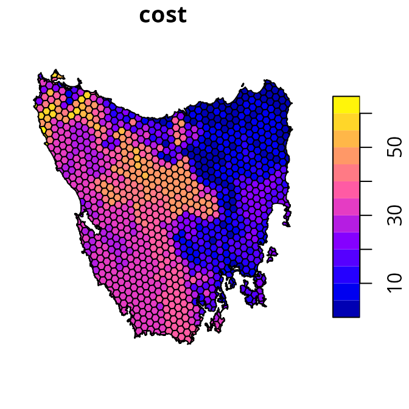

``` r
# plot map of planning unit statuses
plot(tas_pu[, "locked_in"])
```


The `tas_features` object describes the spatial distribution of various
vegetation communities (using presence/absence data). We will use these
vegetation communities as the biodiversity features for the
prioritization.

``` r
# plot map of the first four vegetation classes
plot(tas_features[[1:4]])
```

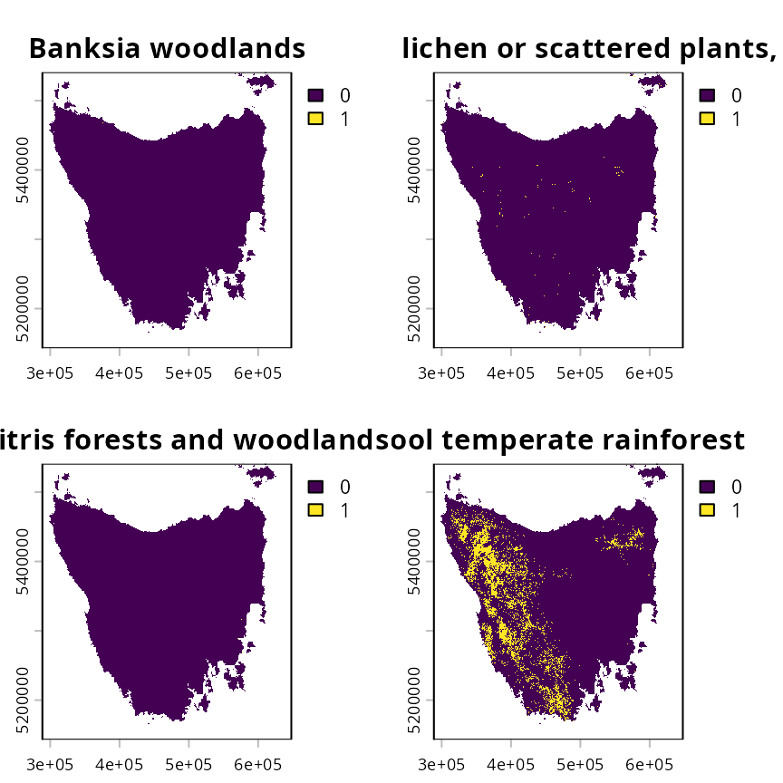

## Preliminary processing

We will now prepare the data for subsequent analysis. This is important
to help make it easier to find suitable trade-off parameters, and avoid
numerical scaling issues that can result in overly long run times (see
[`presolve_check()`](https://prioritizr.net/reference/presolve_check.md)
for further information). These processing steps are akin to data
scaling (or normalization) procedures that are applied in statistical
analysis to improve model convergence.

To begin with, we will set the cost values for all locked in planning
units to zero. This is important so that the total cost of the
prioritization reflects the total cost of new priority areas—-not total
land value including existing protected areas. In other words, we want
the total cost estimate for a prioritization to reflect the cost of
establishing new protected areas. **This procedure is especially
important for the hierarchical approach (see below), so that its
trade-off parameters reflect proportionate increases in the cost of
establishing new protected areas.**

``` r
# set costs for planning units covered by existing protected areas to zero
tas_pu$cost[tas_pu$locked_in > 0.5] <- 0

# plot map of planning unit costs
plot(tas_pu[, "cost"])
```

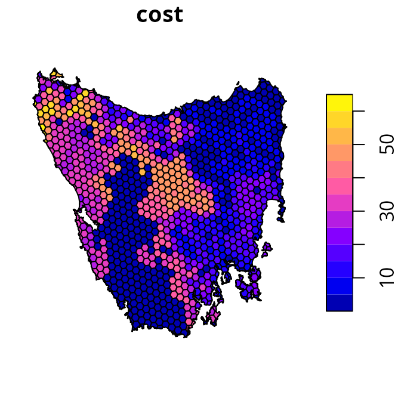

Next, we will pre-compute and manually re-scale the boundary length
data. This procedure is important because boundary length values are
often very high, which can cause numerical issues that result in
excessive run times (see
[`presolve_check()`](https://prioritizr.net/reference/presolve_check.md)
for further details).

``` r
# generate boundary length data for the planning units
tas_bd <- boundary_matrix(tas_pu)

# manually re-scale the boundary length values
tas_bd <- rescale_matrix(tas_bd)
```

After completing these procedures, our data is ready for analysis.

## Initial prioritization

We will generate an initial prioritization based on our primary
objective (i.e., does not account for spatial fragmentation).
Specifically, we will use the minimum set objective so that the
optimization process minimizes total cost. We will add representation
targets to ensure that prioritizations cover 17% of each vegetation
community. Additionally, we will add constraints to ensure that planning
units covered by existing protected areas are selected (i.e., locked
in). Finally, we will specify that the conservation planning exercise
involves binary decisions (i.e., selecting or not selecting planning
units for protected area establishment).

``` r
# define a problem
p0 <-
  problem(tas_pu, tas_features, cost_column = "cost") %>%
  add_min_set_objective() %>%
  add_relative_targets(0.17) %>%
  add_locked_in_constraints("locked_in") %>%
  add_binary_decisions()

# print problem
print(p0)
```

    ## A conservation problem (<ConservationProblem>)
    ## ├•data
    ## │├•features:    "Banksia woodlands", … (33 total)
    ## │└•planning units:
    ## │ ├•data:       <sf> (1130 total)
    ## │ ├•costs:      continuous values (between 0 and 61.92727)
    ## │ ├•extent:     298809.6, 5167775, 613818.8, 5502544 (xmin, ymin, xmax, ymax)
    ## │ └•CRS:        WGS 84 / UTM zone 55S (projected)
    ## ├•formulation
    ## │├•objective:   minimum set objective
    ## │├•penalties:   none specified
    ## │├•features:
    ## ││├•targets:    relative targets (all equal to 0.17)
    ## ││└•weights:    none specified
    ## │├•constraints:
    ## ││└•1:          locked in constraints (257 planning units)
    ## │└•decisions:   binary decision
    ## └•optimization
    ##  ├•portfolio:   single portfolio
    ##  └•solver:      gurobi solver (`gap` = 0.1, `time_limit` = 2147483647, …)
    ## # ℹ Use `summary(...)` to see further details.

``` r
# solve problem
s0 <- solve(p0)
```

``` r
# print result
print(s0)
```

    ## Simple feature collection with 1130 features and 5 fields
    ## Geometry type: MULTIPOLYGON
    ## Dimension:     XY
    ## Bounding box:  xmin: 298809.6 ymin: 5167775 xmax: 613818.8 ymax: 5502544
    ## Projected CRS: WGS 84 / UTM zone 55S
    ## # A tibble: 1,130 × 6
    ##       id  cost locked_in locked_out solution_1                          geometry
    ##  * <int> <dbl> <lgl>     <lgl>           <dbl>                <MULTIPOLYGON [m]>
    ##  1     1 60.2  FALSE     TRUE                0 (((328497 5497704, 326783.8 5500…
    ##  2     2 19.9  FALSE     FALSE               0 (((307121.6 5490487, 305344.4 54…
    ##  3     3 59.7  FALSE     TRUE                0 (((321726.1 5492382, 320111 5494…
    ##  4     4 32.4  FALSE     FALSE               0 (((304314.5 5494324, 304342.2 54…
    ##  5     5 26.2  FALSE     FALSE               0 (((314958.5 5487057, 312336 5490…
    ##  6     6 51.3  FALSE     FALSE               0 (((327904.3 5491218, 326594.6 54…
    ##  7     7 32.3  FALSE     FALSE               0 (((308194.1 5481729, 306601.2 54…
    ##  8     8 38.4  FALSE     FALSE               0 (((322792.7 5483624, 319965.3 54…
    ##  9     9  3.55 FALSE     FALSE               0 (((334896.6 5490731, 335610.4 54…
    ## 10    10  1.83 FALSE     FALSE               0 (((356377.1 5487952, 353903.1 54…
    ## # ℹ 1,120 more rows

``` r
# create column for making a map of the prioritization
s0$map_1 <- case_when(
  s0$locked_in > 0.5 ~ "locked in",
  s0$solution_1 > 0.5 ~ "priority",
  TRUE ~ "other"
)

# plot map of prioritization
plot(
  s0[, "map_1"], pal = c("purple", "grey90", "darkgreen"),
  main = NULL, key.pos = 1
)
```


We can see that the priority areas identified by the prioritization are
scattered across the study area (shown in green). Indeed, relatively few
priority areas are connected to existing protected areas (shown in
purple) or other priority areas (shown in green). As such, the
prioritization has a high level of spatial fragmentation. If it is
important to avoid such levels of spatial fragmentation, then we will
need to explicitly account for spatial fragmentation in the optimization
process.

## Generating candidate prioritizations

Here we will start the calibration analysis by generating a set of
candidate prioritizations. In particular, we will examine multiple
different approaches for generating candidate prioritizations. Some of
these approaches will involve generating multiple different
prioritizations based on different trade-off parameters, and other
approaches will involve generating a single prioritization that tries to
automatically resolve trade-offs. Since this tutorial involves
navigating trade-offs between the overall cost of a prioritization and
the level of spatial fragmentation associated with a prioritization (as
measured by total boundary length), we will generate prioritizations
using different parameters related to these objectives. **Although we’ll
be examining multiple approaches in this tutorial, you would normally
only use one of these approaches when conducting your own analysis**

### Weighted sum approach

The weighted sum approach for multi-objective optimization involves
combining separate objectives (e.g., total cost and total boundary
length) into a single joint objective. To achieve this, a trade-off
parameter is used to specify the relative importance of each criterion.
Although older versions of the *prioritizr R* package required building
multiple problems (separately) that each had their own trade-off
parameter (i.e., via the `penalty` parameter for
[`add_boundary_penalties()`](https://prioritizr.net/reference/add_boundary_penalties.md)),
it is now possible to automatically generate multiple prioritizations
based on multiple different trade-off parameters by explicitly
formulating a multi-objective optimization problem. As such, we will
build a multi-objective problem (via
[`multi_problem()`](https://prioritizr.net/reference/multi_problem.md))
and use the weighted sum approach (via
[`add_wtd_sum_approach()`](https://prioritizr.net/reference/add_wtd_sum_approach.md))
with `weights` values to indicate trade-offs.

The main challenge with the weighted sum approach is identifying a range
of suitable `weights` (or `penalty`) values to generate candidate
prioritizations. If we set a `weights` value for the boundary penalties
that are too low, then the penalties will have no effect (e.g., boundary
length penalties would have no effect on the prioritization).
Conversely, if we set a `weights` value that is too high, then the
prioritization will effectively ignore the primary objective. In such
cases, the prioritization will be overly spatially clustered – because
the planning unit cost values have no effect – and contain a single
reserve. Thus we need to find a suitable range of `weights` values
before we can generate a set of candidate prioritizations.

We can find a suitable range of `weights` values for the boundary
penalties by generating a set of preliminary prioritizations. These
preliminary prioritizations will be based on different `weights` values
– similar to the process for generating the candidate prioritizations –
but solved using customized settings that sacrifice optimality for fast
run times (see below for details). This is especially important because
specifying a `weights` value that is too high will cause the
optimization process to take a very long time to generate a solutions
(due to the numerical scaling issues mentioned previously). To find a
suitable range of `weights` values, we need to identify an upper limit
for the `weights` value (i.e., the highest `weights` value that result
in a prioritization containing a single reserve). Let’s create some
preliminary `weights` to identify this upper limit. **Please note that
you might need to adjust the `prelim_upper` value to find the upper
limit when analyzing different datasets.**

``` r
# define a range of different weight values for the boundary penalties
## note that we use a power scale to avoid focusing too much on high weights
prelim_lower <- -1 # change this for your own data
prelim_upper <- 5  # change this for your own data

# create a matrix of weights
## the first column has weights fixed at 1 for the primary objective
## the second column has varying weights for the boundary penalties
prelim_weights <- matrix(
  c(
    rep(1, 9),
    round(10^seq(prelim_lower, prelim_upper, length.out = 9), 5)
  ),
  ncol = 2
)

# assign row names for preliminary weights
rownames(prelim_weights) <-
  with_options(list(scipen = 30), paste0("weight_", prelim_weights[, 2]))

# print weight values
print(prelim_weights)
```

    ##                   [,1]         [,2]
    ## weight_0.1           1      0.10000
    ## weight_0.56234       1      0.56234
    ## weight_3.16228       1      3.16228
    ## weight_17.78279      1     17.78279
    ## weight_100           1    100.00000
    ## weight_562.34133     1    562.34133
    ## weight_3162.27766    1   3162.27766
    ## weight_17782.7941    1  17782.79410
    ## weight_100000        1 100000.00000

Next, let’s use the preliminary `weights` values to generate preliminary
prioritizations. As mentioned earlier, we will generate these
preliminary prioritizations using customized settings to reduce runtime.
Specifically, we will set a time limit of 10 minutes per run, and relax
the optimality gap to 20%. Although we would not normally use such
settings – because the resulting prioritizations are not guaranteed to
be near-optimal (the default gap is 10%) – this is fine here because our
goal is to tune the preliminary `weights` values. Indeed, none of these
preliminary prioritizations will be considered as candidate
prioritizations. **Please note that you might need to set a higher time
limit, or relax the optimality gap even further (e.g., 40%) when
analyzing larger datasets.**

``` r
# define a multi-objective optimization problem
p1 <-
  multi_problem(
    ## primj
    cost_obj =
      problem(tas_pu, tas_features, cost_column = "cost") %>%
      add_min_set_objective() %>%
      add_relative_targets(0.17) %>%
      add_locked_in_constraints("locked_in") %>%
      add_binary_decisions(),
    boundary_obj =
      problem(tas_pu, tas_features, cost_column = "cost") %>%
      # note that we use budget = NULL so that the boundary objective
      # does not have a limit to the maximum expenditure
      add_min_penalties_objective(budget = NULL) %>%
      # note that we use penalty = 1 here so that trade-offs will
      # subsequently be specified by prelim_weights
      add_boundary_penalties(penalty = 1, data = tas_bd) %>%
      add_binary_decisions()
  )

# generate preliminary prioritizations based on each weight
## note that we specify a relaxed gap and time limit for the solver
prelim_wtd_sum_results <-
  p1 %>%
  add_wtd_sum_approach(weights = prelim_weights) %>%
  add_default_solver(gap = 0.2, time_limit = 10 * 60) %>%
  solve()

# rename solution columns
names(prelim_wtd_sum_results) <- str_replace_all(
  names(prelim_wtd_sum_results),
  setNames(
    rownames(prelim_weights),
    paste0("solution_", seq_len(nrow(prelim_weights)))
  )
)

# preview results
print(prelim_wtd_sum_results)
```

After generating the preliminary prioritizations, let’s create some maps
to visualize them. In particular, we want to understand how different
weight values influence the spatial fragmentation of the
prioritizations.

``` r
# plot maps of prioritizations
plot(
  x =
    prelim_wtd_sum_results %>%
    dplyr::select(starts_with("weight_")) %>%
    mutate_if(is.numeric, function(x) {
      case_when(
        prelim_wtd_sum_results$locked_in > 0.5 ~ "locked in",
        x > 0.5 ~ "priority",
        TRUE ~ "other"
      )
    }),
  pal = c("purple", "grey90", "darkgreen")
)
```

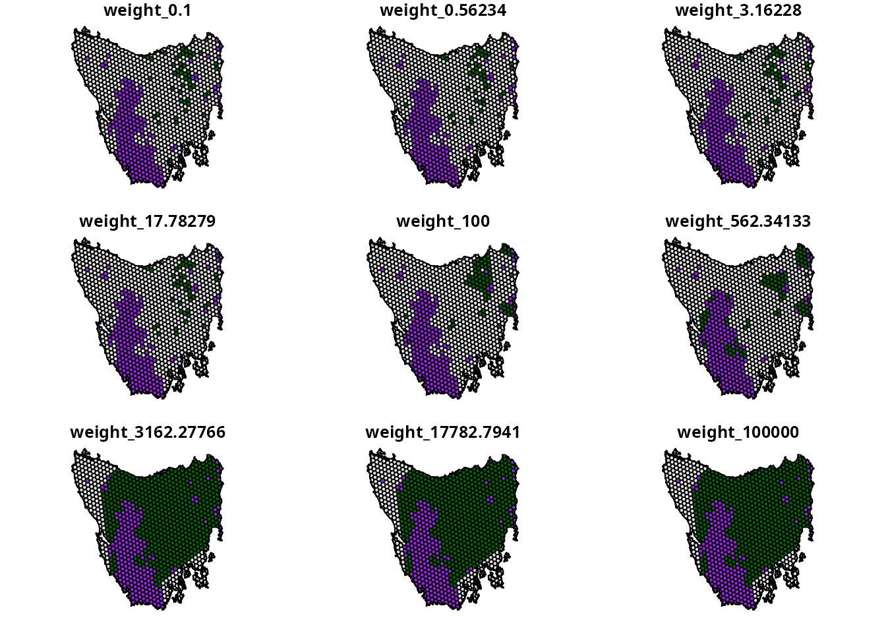

We can see that as the `weights` value used to generate the
prioritizations increases, the spatial fragmentation of the
prioritizations decreases. In particular, we can see that a `weights`
value of 3162.27766 results in a single reserve – meaning this is our
best guess of the upper limit. Using this `weights` value as an upper
limit, we will now generate a second series of prioritizations that will
be the candidate prioritizations. Critically, these candidate
prioritizations will not be generated using with time limit and be
generated using a more suitable gap (i.e., default gap of 10%).

``` r
# define best guess for upper weight limit
upper_weight_limit <- 3162.27766
```

``` r
# define a new set of weights values
weights <- matrix(
  c(
    rep(1, 9),
    round(seq(10^prelim_lower, upper_weight_limit, length.out = 9), 5)
  ),
  ncol = 2
)

# assign row names for weights
rownames(weights) <-
  with_options(list(scipen = 30), paste0("weight_", weights[, 2]))

# generate prioritizations based on weight sum approach
wtd_sum_results <-
  p1 %>%
  add_wtd_sum_approach(weights = weights) %>%
  solve()

# rename columns with prioritizations so they have weight values
names(wtd_sum_results) <- str_replace_all(
  names(wtd_sum_results),
  setNames(
    rownames(weights),
    paste0("solution_", seq_len(nrow(weights)))
  )
)

# plot maps of prioritizations
plot(
  x =
    wtd_sum_results %>%
    dplyr::select(starts_with("weight_")) %>%
    mutate_if(is.numeric, function(x) {
      case_when(
        wtd_sum_results$locked_in > 0.5 ~ "locked in",
        x > 0.5 ~ "priority",
        TRUE ~ "other"
      )
    }),
  pal = c("purple", "grey90", "darkgreen")
)
```

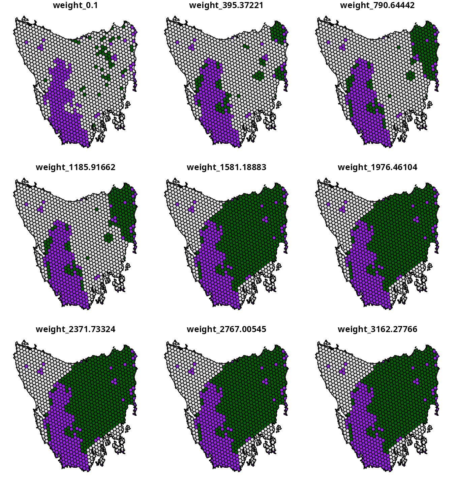

We now have a set of candidate prioritizations generated using the
weighted sum approach. The main advantages of this approach is that it
is similar calibration analyses used by other decision support tools for
conservation and it is relatively straightforward to implement (Ardron
*et al.* 2010). However, this approach also has a key disadvantage.
Because the `weights` parameter is a unitless trade-off parameter –
meaning that we can’t leverage existing knowledge to specify a suitable
range of `weights` values – we first have to conduct a preliminary
analysis to identify a suitable upper limit. Although finding an upper
limit was fairly simple for the example dataset, it can be difficult to
find for more realistic datasets with more planning units and features.
In the next section, we will show how to generate a set of candidate
prioritizations using the hierarchical approach – which does not have
this disadvantage.

### Hierarchical approach

The hierarchical approach for multi-objective optimization involves
generating a series of incremental prioritizations – using a different
objective at each increment to refine the previous solution – until the
final solution achieves all of the objectives. The advantage with this
approach is that we can specify trade-off parameters for each objective
based on a percentage from optimality. This means that we can leverage
our own knowledge – or that of decision maker – to generate a range of
suitable trade-off parameters. As such, this approach – unlike the
weighted sum approach – does not require us to generate a series of
preliminary prioritizations.

This approach uses a relative tolerance (`rel_tol`) parameter to specify
trade-offs. The `rel_tol` parameter specifies the relative degree –
expressed as a proportion – to which we are willing to sacrifice higher
priority objectives to better optimize lower priority objectives. As
mentioned earlier, the total cost of the prioritization is the primary
objective and spatial fragmentation is a supplemental objective—thus the
total cost of the prioritization has a higher priority than spatial
fragmentation. For example, a value of 0.05 means that we would be
willing to sacrifice a 5% reduction in quality for the highest priority
objective to better optimize low priority objectives. Since these values
are expressed as proportions – and not unitless values as per the
weighted sum approach – we can use domain knowledge to specify a
suitable range of `rel_tol` values. For this tutorial, let’s assume that
it would be impractical – per our domain knowledge – to expend more than
four times the total cost of the initial prioritization to reduce
spatial fragmentation.

``` r
# define relative tolerance values
rel_tol <- matrix(seq(0, 4, length.out = 9))

# assign row names for relative tolerance values
rownames(rel_tol) <-
  with_options(list(scipen = 30), paste0("rel_tol_", rel_tol[, 1]))

# print relative tolerance values
print(rel_tol)

# generate prioritizations based on hierarchical approach
hierarchical_results <-
  p1 %>%
  # by default, objectives are assumed to be in order of priority
  # (but this can be altered with the priority parameter)
  add_hier_approach(rel_tol = rel_tol) %>%
  solve()

# rename columns with prioritizations so they have rel_tol values
names(hierarchical_results) <- str_replace_all(
  names(hierarchical_results),
  setNames(
    rownames(rel_tol),
    paste0("solution_", seq_len(nrow(rel_tol)))
  )
)

# plot maps of prioritizations
plot(
  x =
    hierarchical_results %>%
    dplyr::select(starts_with("rel_tol_")) %>%
    mutate_if(is.numeric, function(x) {
      case_when(
        hierarchical_results$locked_in > 0.5 ~ "locked in",
        x > 0.5 ~ "priority",
        TRUE ~ "other"
      )
    }),
  pal = c("purple", "grey90", "darkgreen")
)
```

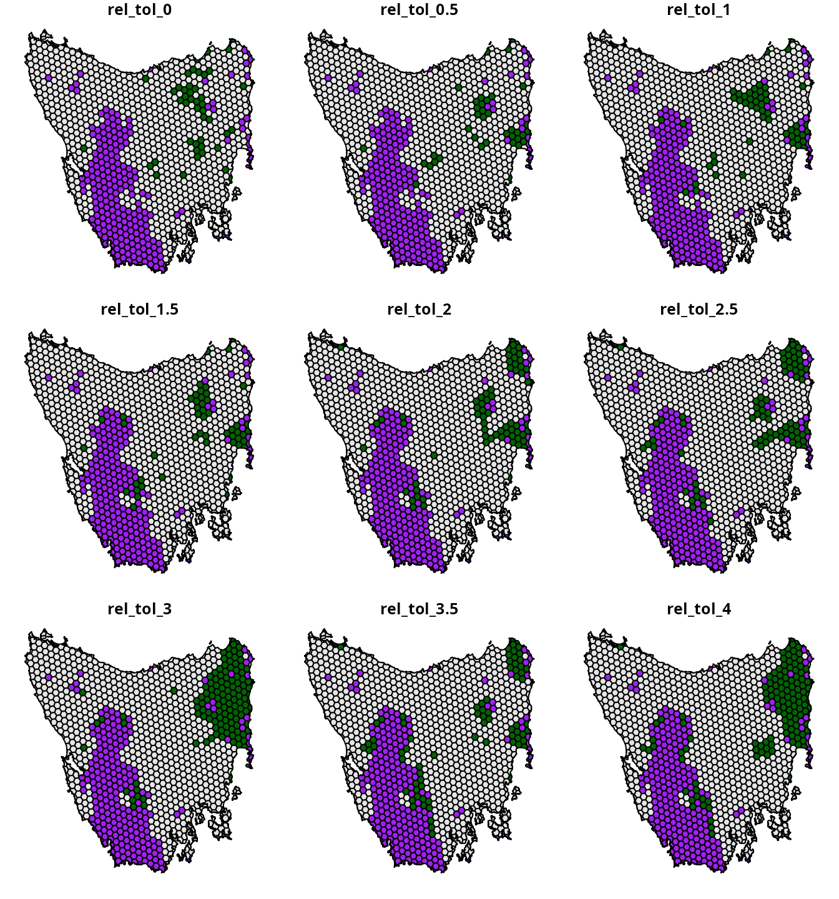

### Cohon *et al.* (1979) approach

The Cohon *et al.* (1979) approach aims to automatically balance
trade-offs between two objectives (Fischer & Church 2005). Specifically,
it involves generating two optimal prioritizations – with each
prioritization representing the optimal prioritization according to each
criteria (e.g., total cost versus total boundary length) – and then
using performance metrics for these prioritizations to automatically
derive a trade-off parameter value (Ardron *et al.* 2010; Cohon *et al.*
1979). Thus, unlike the two previous approaches, this approach can be
used to automatically generate a single prioritization that balances
trade-offs. As such, this approach can potentially be used to find a
prioritization that represents a desirable compromise in a much shorter
period of time than the previous approach.

``` r
# create problem with boundary penalties
## note that penalty = 1 is used as a place-holder
p2 <-
  problem(tas_pu, tas_features, cost_column = "cost") %>%
  add_min_set_objective() %>%
  add_boundary_penalties(penalty = 1, data = tas_bd) %>%
  add_relative_targets(0.17) %>%
  add_locked_in_constraints("locked_in") %>%
  add_binary_decisions()

# find calibrated boundary penalty using Cohon's approach
cohon_penalty <- calibrate_cohon_penalty(p2, verbose = FALSE)
```

``` r
# print penalty value
print(cohon_penalty[[1]])
```

    ## [1] 551.3914

Now that we have calculated a `penalty` value using this approach, we
can use it to generate a prioritization.

``` r
# generate prioritization using penalty value calculated using Cohon's approach
p3 <-
  problem(tas_pu, tas_features, cost_column = "cost") %>%
  add_min_set_objective() %>%
  add_boundary_penalties(penalty = cohon_penalty, data = tas_bd) %>%
  add_relative_targets(0.17) %>%
  add_locked_in_constraints("locked_in") %>%
  add_binary_decisions()

# solve problem
s3 <- solve(p3)

# plot map of prioritization
plot(
  x =
    s3 %>%
    mutate(
      value = case_when(
        locked_in > 0.5 ~ "locked in",
        solution_1 > 0.5 ~ "priority",
        TRUE ~ "other"
      )
    ) %>%
    dplyr::select(value),
  pal = c("purple", "grey90", "darkgreen"),
  main = NULL, key.pos = 1
)
```

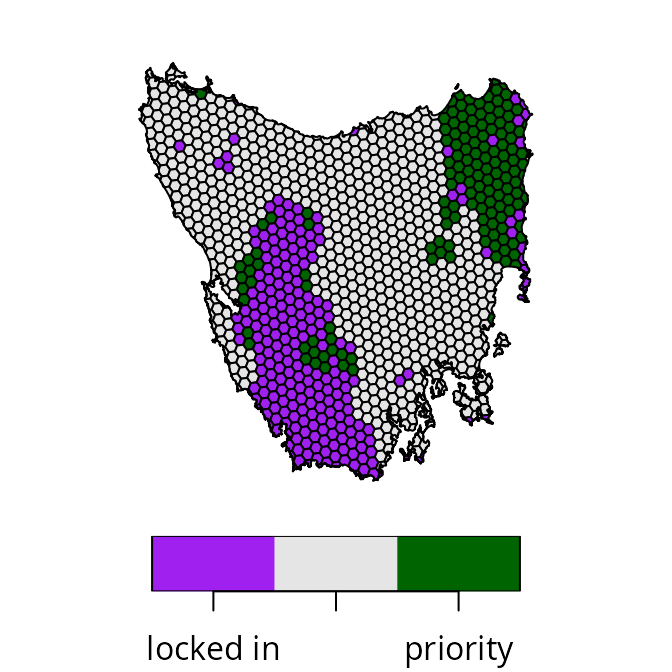

### Reference point approach

The reference point approach (Wierzbicki 1980) is another
multi-objective optimization approach that can be used to balance
trade-offs. Although it has a `weights` parameter that can be used to
specify trade-offs among objectives (similar to the weighted sum
approach), this approach can also be used to automatically identify a
prioritization that equally balances how well each objective is
achieved. This is because – similar to the Cohon *et al.* (1979)
approach – the reference point approach considers the best and worst
possible performance that could be achieved for each objective. Now
let’s use the reference point approach to generate a prioritization.

``` r
# generate prioritization based on reference point approach
s4 <-
  p1 %>%
  add_ref_point_approach() %>%
  solve()

# plot map of prioritization
plot(
  x =
    s4 %>%
    mutate(
      value = case_when(
        locked_in > 0.5 ~ "locked in",
        solution_1 > 0.5 ~ "priority",
        TRUE ~ "other"
      )
    ) %>%
    dplyr::select(value),
  pal = c("purple", "grey90", "darkgreen"),
  main = NULL, key.pos = 1
)
```

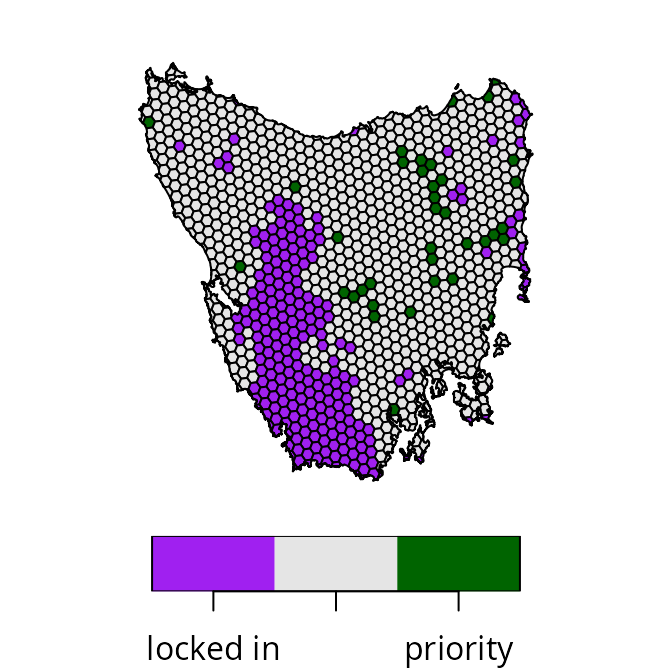

After completing this, let’s compare the prioritizations to see if we
can identify a desirable compromise between the objectives.

## Calculating performance metrics

Here we will calculate performance metrics to compare the
prioritizations. To help organize all the prioritizations generated by
the different approaches, we will first create a `solutions` object to
store them in. Next, since our aim is to navigate trade-offs between the
total cost of a prioritization and the overall level of spatial
fragmentation associated with a prioritization (as measured by total
boundary length), we will calculate metrics to assess these objectives.

``` r
# create object with all prioritizations
solutions <-
  sf::st_sf(geometry = sf::st_geometry(tas_pu)) %>%
  bind_cols(
    hierarchical_results %>%
      dplyr::select(starts_with("rel_tol")) %>%
      st_drop_geometry(),
    wtd_sum_results %>%
      dplyr::select(starts_with("weight")) %>%
      st_drop_geometry(),
    s3 %>%
      dplyr::select(solution_1) %>%
      rename(Cohon = solution_1) %>%
      st_drop_geometry(),
    s4 %>%
      dplyr::select(solution_1) %>%
      rename(`reference point` = solution_1) %>%
      st_drop_geometry()
  )

# calculate metrics for prioritizations
metric_data <-
  lapply(
    names(st_drop_geometry(solutions)), function(x) {
      data.frame(
        name = x,
        total_cost =
          eval_cost_summary(p0, solutions[, x])$cost,
        total_boundary_length =
          eval_boundary_summary(p0, solutions[, x])$boundary
      )
    }
  ) %>%
  bind_rows() %>%
  as_tibble() %>%
  mutate(
    approach = case_when(
      startsWith(name, "rel_tol") ~ "hierarchical",
      startsWith(name, "weight") ~ "weighted sum",
      startsWith(name, "Cohon") ~ "Cohon",
      startsWith(name, "reference point") ~ "reference point"
    )
  ) %>%
  mutate(
    label = case_when(
      approach == "hierarchical" ~
        gsub("rel_tol_", "rel_tol = ", name, fixed = TRUE),
      approach == "weighted sum" ~
        gsub("weight_", "weight = ", name, fixed = TRUE),
      TRUE ~ name
    )
  )

# preview metrics
print(metric_data)
```

    ## # A tibble: 20 × 5
    ##    name              total_cost total_boundary_length approach        label     
    ##    <chr>                  <dbl>                 <dbl> <chr>           <chr>     
    ##  1 rel_tol_0               377.              2636025. hierarchical    rel_tol =…
    ##  2 rel_tol_0.5             564.              2241411. hierarchical    rel_tol =…
    ##  3 rel_tol_1               757.              2136875. hierarchical    rel_tol =…
    ##  4 rel_tol_1.5             930.              2084474. hierarchical    rel_tol =…
    ##  5 rel_tol_2              1141.              2013689. hierarchical    rel_tol =…
    ##  6 rel_tol_2.5            1323.              1961490. hierarchical    rel_tol =…
    ##  7 rel_tol_3              1518.              1858158. hierarchical    rel_tol =…
    ##  8 rel_tol_3.5            1680.              1899301. hierarchical    rel_tol =…
    ##  9 rel_tol_4              1867.              1834144. hierarchical    rel_tol =…
    ## 10 weight_0.1              372.              2802603. weighted sum    weight = …
    ## 11 weight_395.37221       1794.              1769184. weighted sum    weight = …
    ## 12 weight_790.64442       2364.              1655994. weighted sum    weight = …
    ## 13 weight_1185.91662      2392.              1645271. weighted sum    weight = …
    ## 14 weight_1581.18883      9738.              1289465. weighted sum    weight = …
    ## 15 weight_1976.46104      9738.              1289465. weighted sum    weight = …
    ## 16 weight_2371.73324      9738.              1289465. weighted sum    weight = …
    ## 17 weight_2767.00545      9772.              1288656. weighted sum    weight = …
    ## 18 weight_3162.27766      9772.              1288656. weighted sum    weight = …
    ## 19 Cohon                  2040.              1673569. Cohon           Cohon     
    ## 20 reference point         463.              2284516. reference point reference…

After calculating the metrics, we can use them to visualize trade-offs
among the prioritizations.

``` r
# create plot to visualize trade-offs among prioritizations
result_plot <-
  ggplot(
    data = metric_data,
    aes(x = total_boundary_length, y = total_cost, label = label)
  ) +
  geom_point(aes(color = approach), size = 3) +
  geom_label_repel(
    seed = 500,
    nudge_x = 5.5,
    nudge_y = 5.5,
    force = 10,
    max.overlaps = Inf
  ) +
  scale_color_manual(
    name = "Approach",
    values = c(
      "hierarchical" = "#984ea3",
      "weighted sum" = "#000000",
      "Cohon" = "#377eb8",
      "reference point" = "#ff7f00"
    )
  ) +
  xlab("Total boundary length of prioritization") +
  ylab("Total cost of prioritization") +
  scale_x_continuous(expand = expansion(mult = c(0.2, 0.3))) +
  scale_y_continuous(expand = expansion(mult = c(0.3, 0.2))) +
  theme(
    legend.position = c(0.95, 0.95),
    legend.justification = c(1, 1)
  )

# render plot
print(result_plot)
```

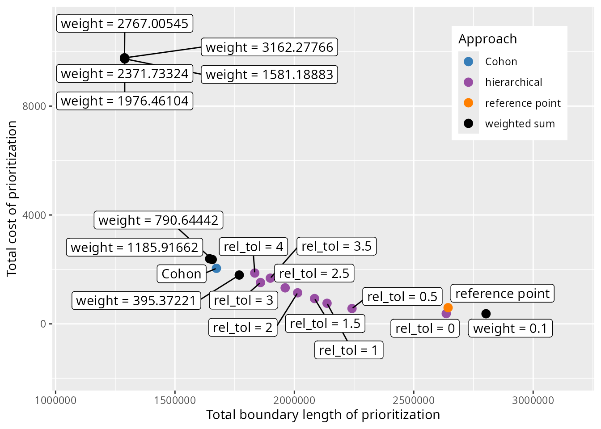

## Selecting a prioritization

Now we need to decide which prioritization represents a desirable
compromise between the objectives. Since weighted sum and hierarchical
approaches involve generating a set of candidate prioritizations, we
will begin by selecting a single prioritization from these
prioritizations to help narrow down our set of choices. To achieve this,
we will employ one qualitative method and one quantitative method.
Although these methods could be applied to prioritizations generated
with the weighted sum as well as the hierarchical approaches, here we
will just consider those generated with the hierarchical approach for
brevity.

### Visual method

One qualitative method involves plotting the relationship between the
different criteria, and using the plot to visually select a candidate
prioritization. This visual method is often used to help calibrate
trade-offs among prioritizations generated using the *Marxan* decision
support tool (e.g., Hermoso *et al.* 2011; Stewart & Possingham 2005).
In particular, we will apply the visual method to select a
prioritization from the set of prioritizations generated by the
hierarchical approach. So, let’s create a plot to select a
prioritization.

``` r
# create plot to visualize trade-offs and show selected candidate prioritization
result_plot <-
  ggplot(
    data = metric_data %>% filter(approach == "hierarchical"),
    aes(x = total_boundary_length, y = total_cost, label = label)
  ) +
  geom_line() +
  geom_point(size = 3) +
  geom_label_repel(
    seed = 500,
    nudge_x = 5.5,
    nudge_y = 5.5,
    force = 10,
    max.overlaps = Inf
  ) +
  xlab("Total boundary length of prioritization") +
  ylab("Total cost of prioritization") +
  theme(
    legend.position = c(0.95, 0.95),
    legend.justification = c(1, 1)
  )

# render plot
print(result_plot)
```

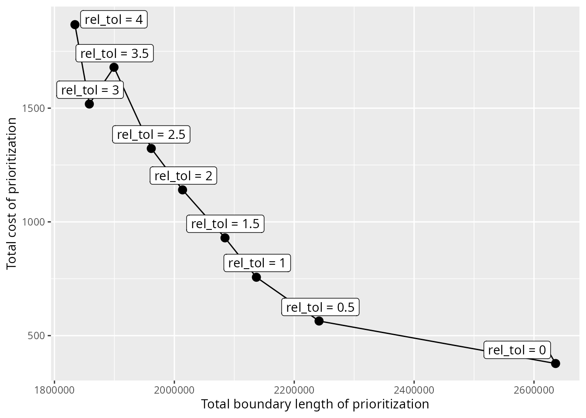

We can see that there is a clear relationship between total cost and
total boundary length. It would seem that in order to achieve a lower
total boundary length – and thus lower spatial fragmentation – the
prioritization must have a greater cost. Although we might expect the
results to show a smoother curve – in other words, only Pareto dominant
solutions – this result is expected because we generated candidate
prioritizations using the default optimality gap of 10%. Typically, the
visual method involves selecting a prioritization near the elbow (or
knee) of the plot. So, let’s select the prioritization generated using a
`rel_tol` value of 1. To keep track of the prioritizations selected
based on different methods, let’s create a `method` column in the
`metric_data` table.

``` r
# initialize method column
metric_data <-
  metric_data %>%
  mutate(method = "none") %>%
  mutate(
    method = if_else(
      approach %in% c("Cohon", "reference point"),
      approach,
      method
    )
  )

# specify prioritization selected by visual method
metric_data <-
  metric_data %>%
  mutate(
    method = if_else(
      name == rownames(rel_tol)[[3]],
      "visual",
      method
    )
  )
```

Next, let’s consider a quantitative approach.

### TOPSIS method

Multiple-criteria decision analysis is a discipline that uses analytical
methods to evaluate trade-offs between multiple objectives \[MCDA;
reviewed in Greene *et al.* (2011)\]. Although this discipline contains
many different methods, here we will use the the Technique for Order of
Preference by Similarity to Ideal Solution (TOPSIS) method (Hwang & Yoon
1981). This method requires (i) data describing the performance of each
prioritization according to each objective, (ii) weights to encode the
relative importance of each objective, and (iii) details on whether each
objective should ideally be minimized or maximized. Let’s run the
analysis – assuming that we want equal weighting for total cost and
total boundary length – to identify a candidate prioritization from
those generated with the hierarchical approach.

``` r
# calculate TOPSIS scores
topsis_results <- topsis(
  decision =
    metric_data %>%
    filter(approach == "hierarchical") %>%
    dplyr::select(total_cost, total_boundary_length) %>%
    as.matrix(),
  weights = c(1, 1),
  impacts = c("-", "-")
)

# print results
print(topsis_results)
```

    ##   alt.row     score rank
    ## 1       1 0.7595566    2
    ## 2       2 0.8133448    1
    ## 3       3 0.7327770    3
    ## 4       4 0.6343975    4
    ## 5       5 0.5135217    5
    ## 6       6 0.4153342    6
    ## 7       7 0.3352942    7
    ## 8       8 0.2659945    8
    ## 9       9 0.2404434    9

The candidate prioritization with the greatest TOPSIS score is
considered to represent the best trade-off between total cost and total
boundary length. So, based on this method, we would select the
prioritization generated using a `rel_tol` value of 0.5. Let’s update
the `metric_data` with this information.

``` r
# add column indicating prioritization selected by TOPSIS method
metric_data <-
  metric_data %>%
  mutate(
    method = if_else(
      name == rownames(rel_tol)[[which.max(topsis_results$score)]],
      "TOPSIS",
      method
    )
  )
```

### Method comparison

Let’s create a plot to visualize the prioritizations selected by the
different approaches and methods.

``` r
# create plot to visualize trade-offs and show selected prioritizations
result_plot <-
  ggplot(
    data = metric_data,
    aes(x = total_boundary_length, y = total_cost, label = label)
  ) +
  geom_point(aes(color = method), size = 3) +
  geom_label_repel(
    seed = 500,
    nudge_x = 5.5,
    nudge_y = 5.5,
    force = 10,
    max.overlaps = Inf
  ) +
  scale_color_manual(
    name = "Method",
    values = c(
      "visual" = "#984ea3",
      "none" = "#000000",
      "TOPSIS" = "#e41a1c",
      "Cohon" = "#377eb8",
      "reference point" = "#ff7f00"
    )
  ) +
  xlab("Total boundary length of prioritization") +
  ylab("Total cost of prioritization") +
  scale_x_continuous(expand = expansion(mult = c(0.2, 0.3))) +
  scale_y_continuous(expand = expansion(mult = c(0.3, 0.2))) +
  theme(
    legend.position = c(0.95, 0.95),
    legend.justification = c(1, 1)
  )

# render plot
print(result_plot)
```

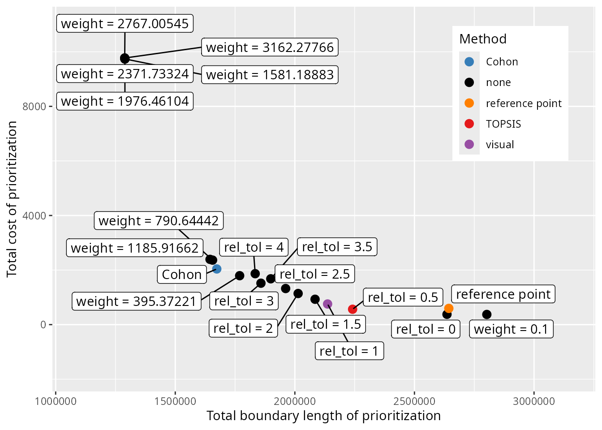

We can see that the different methods selected different
prioritizations. To further compare the results from the different
methods, let’s create some maps showing the selected prioritizations.

``` r
# extract column names for creating the prioritizations
solutions$Visual <-
  solutions[[metric_data$name[metric_data$method == "visual"]]]
solutions$TOPSIS <-
  solutions[[metric_data$name[metric_data$method == "TOPSIS"]]]

# plot maps of selected prioritizations
plot(
  x =
    solutions %>%
    dplyr::select(Visual, TOPSIS, Cohon, `reference point`) %>%
    mutate_if(is.numeric, function(x) {
      case_when(
        tas_pu$locked_in > 0.5 ~ "locked in",
        x > 0.5 ~ "priority",
        TRUE ~ "other"
      )
    }),
  pal = c("purple", "grey90", "darkgreen")
)
```

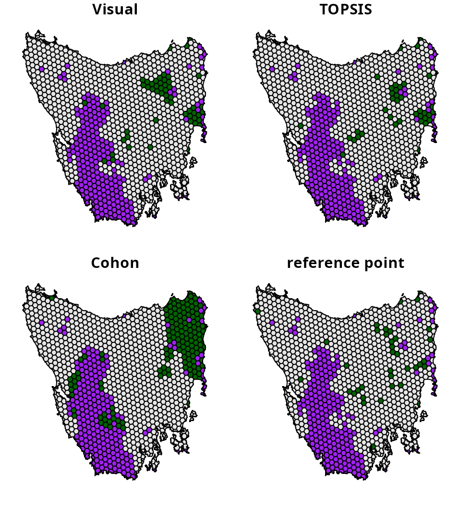

How do we determine which one is best? This is difficult to say.
Ideally, expert knowledge could be used to help select a prioritization,
such as knowledge on available resources, species’ connectivity
requirements, and management feasibility. However, from a practical
perspective, prioritizations generated for academic contexts might find
the quantitative approaches more useful because they have greater
transparency and reproducibility. Ultimately, all of these methods are
designed to support decision making. This means that they are intended
to assist the decision making process, not serve as a replacement.

## Conclusion

Hopefully, this vignette has provided a useful introduction for
resolving trade-offs in prioritizations. Although we only explored
trade-offs between total cost and spatial fragmentation in this
tutorial, this analysis could be adapted to explore trade-offs between a
wide range of different criteria. For instance, instead of considering
total cost as the primary objective, future analyses could explore
trade-offs with feature representation (using the
[`add_min_shortfall_objective()`](https://prioritizr.net/reference/add_min_shortfall_objective.md)
function). Additionally, instead of spatial fragmentation, future
analyses could explore trade-offs that directly relate to connectivity
(using the
[`add_connectivity_penalties()`](https://prioritizr.net/reference/add_connectivity_penalties.md)
function) or specific variables of interest – such as ecosystem
intactness or inverse human footprint index (Williams *et al.* 2020;
Beyer *et al.* 2019) – to inform decision making (using the
[`add_linear_penalties()`](https://prioritizr.net/reference/add_linear_penalties.md)
function). Furthermore, after identifying the best `weights` or
`rel_tol` values to strike a balance between multiple criteria, you
could generate a portfolio of prioritizations (e.g., via
[`add_gap_portfolio()`](https://prioritizr.net/reference/add_gap_portfolio.md))
to find multiple options for achieving a similar balance. This might be
helpful when you need to generate a set of prioritizations that have
comparable performance – in terms of how well they achieve different
criteria – but select different planning units.

## References

Ardron, J.A., Possingham, H.P. & Klein, C.J. (2010). *Marxan Good
Practices Handbook*. Pacific Marine Analysis; Research Association,
Vancouver, Victoria, BC.

Beger, M., Linke, S., Watts, M., Game, E., Treml, E., Ball, I. &
Possingham, H.P. (2010). Incorporating asymmetric connectivity into
spatial decision making for conservation. *Conservation Letters*, *3*,
359–368.

Beyer, H.L., Venter, O., Grantham, H.S. & Watson, J.E.M. (2019).
Substantial losses in ecoregion intactness highlight urgency of globally
coordinated action. *Conservation Letters*, *13*.

Cohon, J.L., Church, R.L. & Sheer, D.P. (1979). Generating
multiobjective trade-offs: An algorithm for bicriterion problems. *Water
Resources Research*, *15*, 1001–1010.

Dorji, T., Linke, S. & Sheldon, F. (2020). Freshwater conservation
planning in the context of nature needs half and protected area dynamism
in bhutan. *Biological Conservation*, *251*, 108785.

Fischer, D.T. & Church, R.L. (2005). The SITES reserve selection system:
A critical review. *Environmental Modeling and Assessment*, *10*,
215–228.

Greene, R., Devillers, R., Luther, J.E. & Eddy, B.G. (2011). GIS-based
multiple-criteria decision analysis. *Geography Compass*, *5*, 412–432.

Hermoso, V., Cattarino, L., Linke, S. & Kennard, M.J. (2018). Catchment
zoning to enhance co-benefits and minimize trade-offs between ecosystem
services and freshwater biodiversity conservation. *Aquatic
Conservation: Marine and Freshwater Ecosystems*, *28*, 1004–1014.

Hermoso, V., Kennard, M.J. & Linke, S. (2012). Integrating
multidirectional connectivity requirements in systematic conservation
planning for freshwater systems. *Diversity and Distributions*, *18*,
448–458.

Hermoso, V., Linke, S., Prenda, J. & Possingham, H.P. (2011). Addressing
longitudinal connectivity in the systematic conservation planning of
fresh waters. *Freshwater Biology*, *56*, 57–70.

Hwang, C.L. & Yoon, K.G. (1981). *Multiple Attribute Decision Making:
Methods and Applications*. Springer-Verlag, New York, NY.

Klein, C.J., Tulloch, V.J., Halpern, B.S., Selkoe, K.A., Watts, M.E.,
Steinback, C., Scholz, A. & Possingham, H.P. (2013). Tradeoffs in marine
reserve design: Habitat condition, representation, and socioeconomic
costs. *Conservation Letters*, 324–332.

Margules, C.R. & Pressey, R.L. (2000). Systematic conservation planning.
*Nature*, *405*, 243–253.

Stewart, R.R. & Possingham, H.P. (2005). Efficiency, costs and
trade-offs in marine reserve system design. *Environmental Modeling and
Assessment*, *10*, 203–213.

Vane-Wright, R.I., Humphries, C.J. & Williams, P.H. (1991). What to
protect? — Systematics and the agony of choice. *Biological
Conservation*, *55*, 235–254.

Wierzbicki, A.P. (1980). The use of reference objectives in
multiobjective optimization. *Multiple Criteria Decision Making Theory
and Application. Lecture Notes in Economics and Mathematical Systems*
(eds G. Fandel & T. Gal), pp. 468–486. Springer Berlin Heidelberg,
Berlin, Heidelberg.

Williams, B.A., Venter, O., Allan, J.R., Atkinson, S.C., Rehbein, J.A.,
Ward, M., Marco, M.D., Grantham, H.S., Ervin, J., Goetz, S.J., Hansen,
A.J., Jantz, P., Pillay, R., Rodrı́guez-Buriticá, S., Supples, C.,
Virnig, A.L.S. & Watson, J.E.M. (2020). Change in terrestrial human
footprint drives continued loss of intact ecosystems. *One Earth*, *3*,
371–382.
