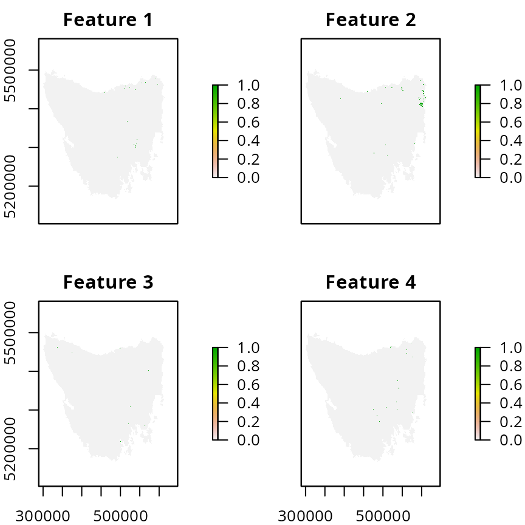
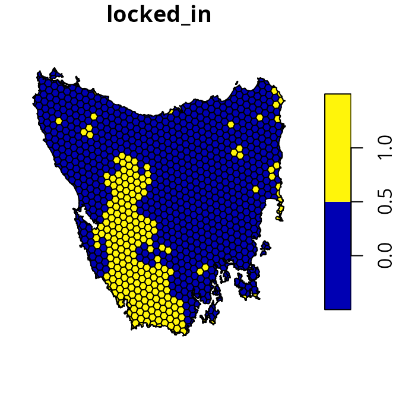
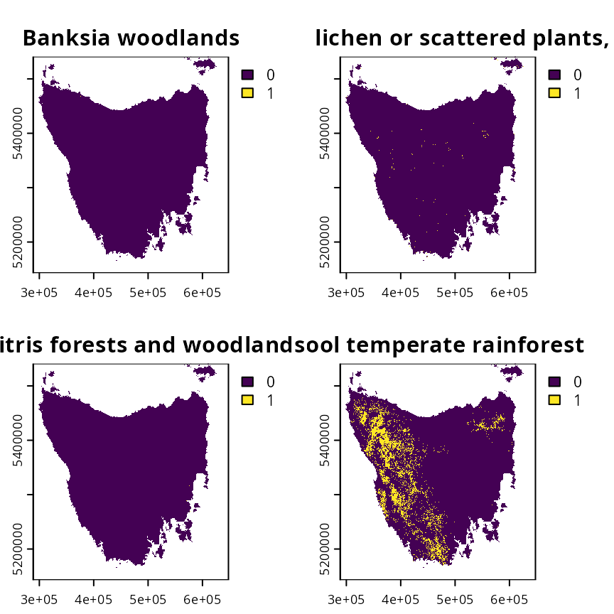
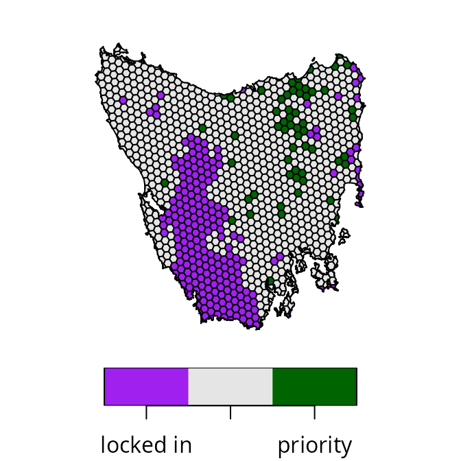
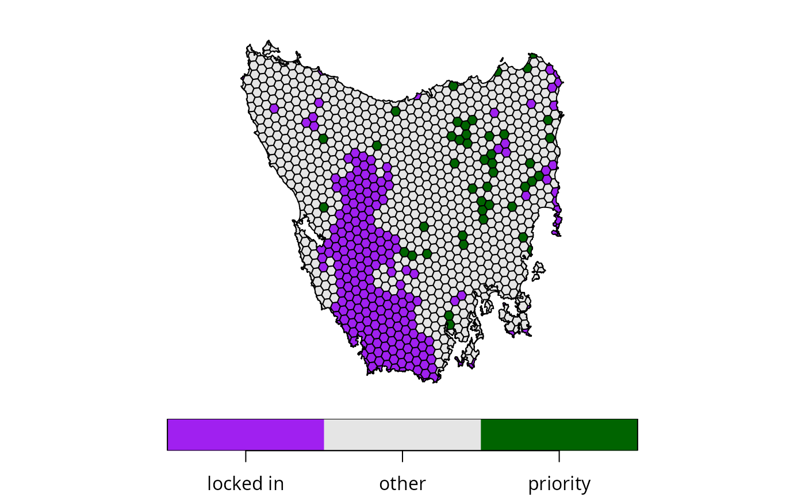
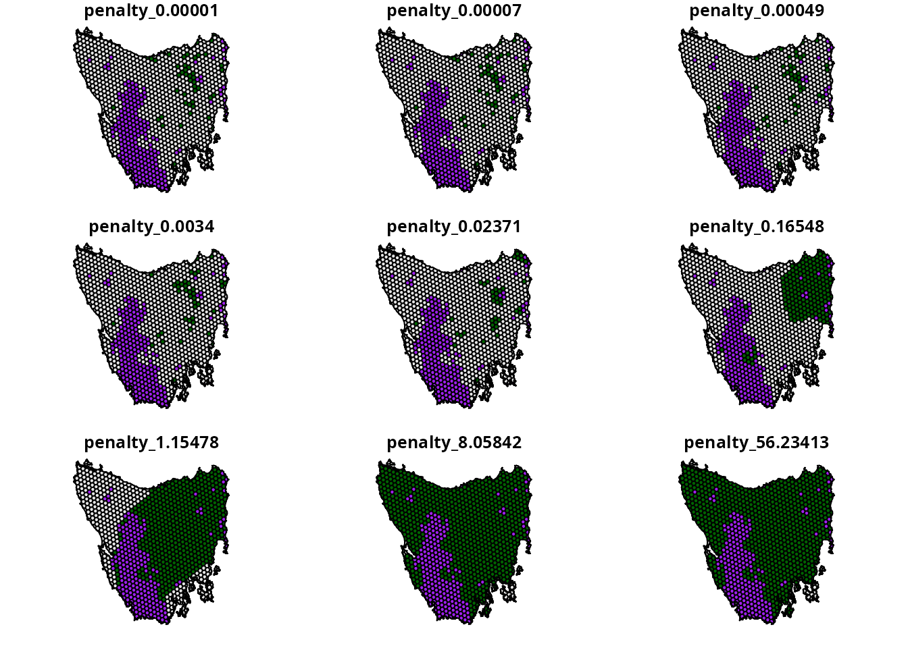
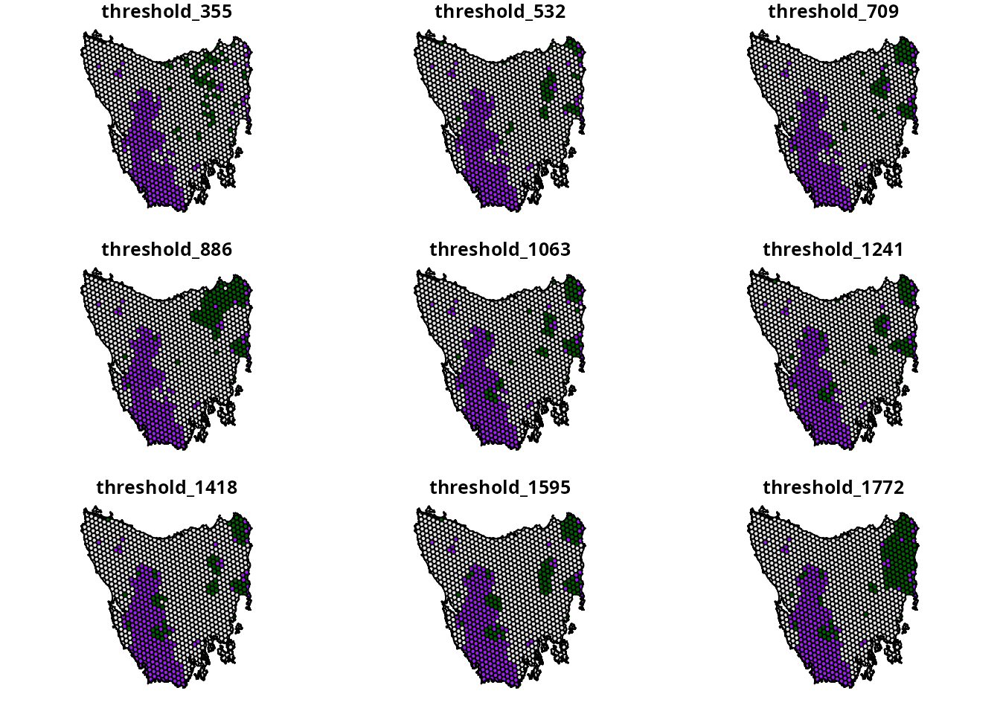
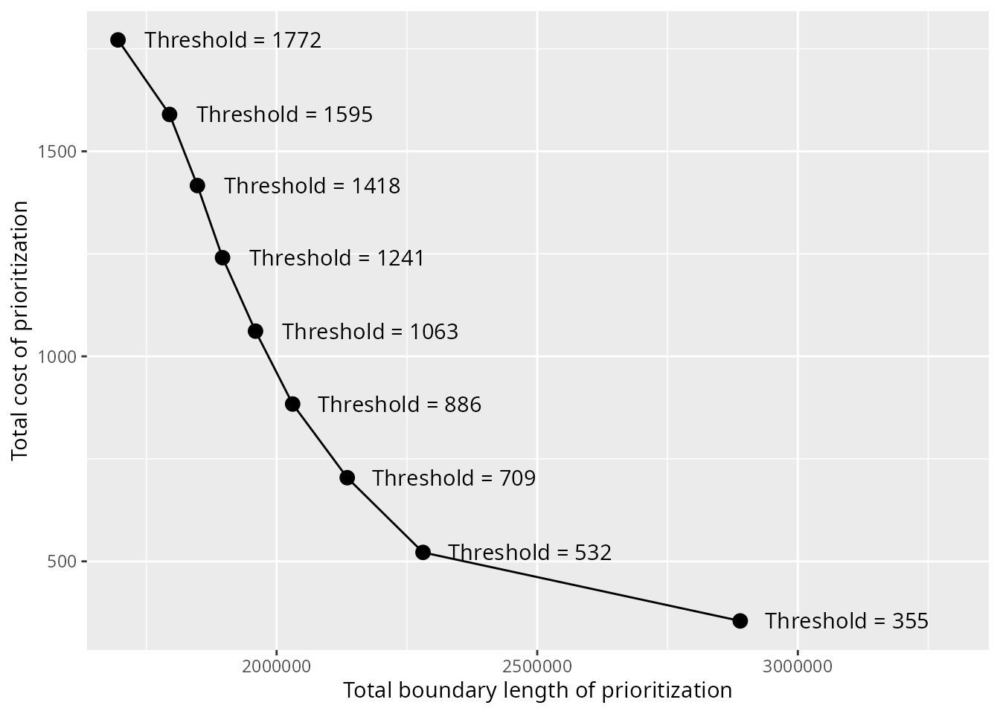
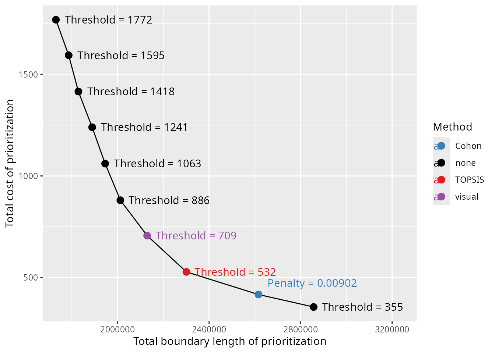
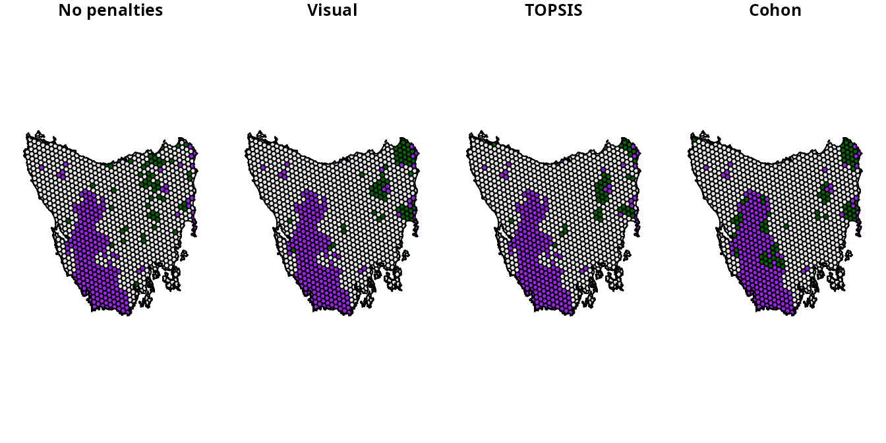

# Calibrating trade-offs tutorial

## Introduction

Systematic conservation planning requires making trade-offs (Margules &
Pressey 2000; Vane-Wright *et al.* 1991). Since different criteria may
conflict with one another – or not align perfectly – prioritizations
need to make trade-offs between different criteria (Klein *et al.*
2013). Although some criteria can easily be accounted for by using
locked constraints or representation targets (e.g., Dorji *et al.* 2020;
Hermoso *et al.* 2018), this is not always the case (e.g., Beger *et
al.* 2010). For example, prioritizations often need to balance overall
cost with the overall level spatial fragmentation among reserves
(Hermoso *et al.* 2011; Stewart & Possingham 2005). Additionally,
prioritizations often need to balance the overall level of connectivity
among reserves against other criteria (Hermoso *et al.* 2012). Since the
best trade-off depends on a range of factors – such as available
budgets, species’ connectivity requirements, and management capacity –
finding the best balance can be challenging.

The *prioritizr R* package provides multi-objective optimization methods
to help identify the best trade-offs between different criteria. To
achieve this, a conservation planning problem can be formulated with a
primary objective (e.g.,
[`add_min_set_objective()`](https://prioritizr.net/reference/add_min_set_objective.md))
and penalties (e.g.,
[`add_boundary_penalties()`](https://prioritizr.net/reference/add_boundary_penalties.md))
that relate to such criteria. When building the problem, the nature of
the trade-offs can be specified using certain parameters (e.g., the
`penalty` parameter of the
[`add_boundary_penalties()`](https://prioritizr.net/reference/add_boundary_penalties.md)
function). To identify a prioritization that finds the best balance
between different criteria, the trade-off parameters can be tuned using
a calibration analysis. These analyses – in the context of systematic
conservation planning – typically involve generating a set of candidate
prioritizations based on different parameters, measuring their
performance according to each of the criteria, and then selecting a
prioritization (or set of prioritizations) based on how well they
achieve the criteria (Hermoso *et al.* 2011; Stewart & Possingham 2005;
Hermoso *et al.* 2012). For example, the *Marxan* decision support tool
has a range of parameters (e.g., species penalty factors, boundary
length modifier) that are calibrated to balance cost, species’
representation, and spatial fragmentation (Ardron *et al.* 2010).

The aim of this tutorial is to provide guidance on calibrating
trade-offs when using the *prioritizr R* package. Here we will explore a
couple of different approaches for generating candidate prioritizations,
and methods for finding the best balance between different criteria.
Specifically, we will try to generate prioritizations that strike the
best balance between total cost and spatial fragmentation (measured as
total boundary length). As such, the code used in this vignette will be
directly applicable when performing a boundary length calibration
analysis.

## Data

Let’s load the packages and dataset used in this tutorial. Since this
tutorial uses the *prioritizrdata R* package along with several other
*R* packages (see below), please ensure that they are all installed.
This particular dataset comprises two objects: `tas_pu` and
`tas_features`. Although we will briefly describe this dataset below,
please refer
[`?prioritizrdata::tas_data`](http://prioritizr.github.io/prioritizrdata/reference/tas_data.md)
for further details.

``` r
# load packages
library(prioritizrdata)
library(prioritizr)
library(sf)
library(terra)
library(dplyr)
library(tibble)
library(ggplot2)
library(topsis)
library(withr)

# set seed for reproducibility
set.seed(500)

# load planning unit data
tas_pu <- get_tas_pu()
print(tas_pu)
```

    ## Simple feature collection with 1130 features and 4 fields
    ## Geometry type: MULTIPOLYGON
    ## Dimension:     XY
    ## Bounding box:  xmin: 298809.6 ymin: 5167775 xmax: 613818.8 ymax: 5502544
    ## Projected CRS: WGS 84 / UTM zone 55S
    ## # A tibble: 1,130 × 5
    ##       id  cost locked_in locked_out                                         geom
    ##    <int> <dbl> <lgl>     <lgl>                                <MULTIPOLYGON [m]>
    ##  1     1 60.2  FALSE     TRUE       (((328497 5497704, 326783.8 5500050, 326775…
    ##  2     2 19.9  FALSE     FALSE      (((307121.6 5490487, 305344.4 5492917, 3053…
    ##  3     3 59.7  FALSE     TRUE       (((321726.1 5492382, 320111 5494593, 320127…
    ##  4     4 32.4  FALSE     FALSE      (((304314.5 5494324, 304342.2 5494287, 3043…
    ##  5     5 26.2  FALSE     FALSE      (((314958.5 5487057, 312336 5490646, 312339…
    ##  6     6 51.3  FALSE     FALSE      (((327904.3 5491218, 326594.6 5493012, 3284…
    ##  7     7 32.3  FALSE     FALSE      (((308194.1 5481729, 306601.2 5483908, 3066…
    ##  8     8 38.4  FALSE     FALSE      (((322792.7 5483624, 319965.3 5487497, 3199…
    ##  9     9  3.55 FALSE     FALSE      (((334896.6 5490731, 335610.4 5492490, 3357…
    ## 10    10  1.83 FALSE     FALSE      (((356377.1 5487952, 353903.1 5487635, 3538…
    ## # ℹ 1,120 more rows

``` r
# load feature data
tas_features <- get_tas_features()
print(tas_features)
```

    ## class       : SpatRaster 
    ## size        : 398, 359, 33  (nrow, ncol, nlyr)
    ## resolution  : 1000, 1000  (x, y)
    ## extent      : 288801.7, 647801.7, 5142976, 5540976  (xmin, xmax, ymin, ymax)
    ## coord. ref. : WGS 84 / UTM zone 55S (EPSG:32755) 
    ## source      : tas_features.tif 
    ## names       : Banks~lands, Bould~marks, Calli~lands, Cool ~orest, Eucal~hyll), Eucal~torey, ... 
    ## min values  :           0,           0,           0,           0,           0,           0, ... 
    ## max values  :           1,           1,           1,           1,           1,           1, ...

The `tas_pu` object contains planning units represented as spatial
polygons (i.e., converted to a
[`sf::st_sf()`](https://r-spatial.github.io/sf/reference/sf.html)
object). This object has three columns that denote the following
information for each planning unit: a unique identifier (`id`),
unimproved land value (`cost`), and current conservation status
(`locked_in`). Specifically, the conservation status column indicates if
at least half the area planning unit is covered by existing protected
areas (denoted by a value of 1) or not (denoted by a value of zero).

``` r
# plot map of planning unit costs
plot(tas_pu[, "cost"])
```



``` r
# plot map of planning unit statuses
plot(tas_pu[, "locked_in"])
```



The `tas_features` object describes the spatial distribution of
different vegetation communities (using presence/absence data). We will
use the vegetation communities as the biodiversity features for the
prioritization.

``` r
# plot map of the first four vegetation classes
plot(tas_features[[1:4]])
```



We can use this dataset to generate a prioritization. Specifically, we
will use the minimum set objective so that the optimization process
minimizes total cost. We will add representation targets to ensure that
prioritizations cover 17% of each vegetation community. Additionally, we
will add constraints to ensure that planning units covered by existing
protected areas are selected (i.e., locked in). Finally, we will specify
that the conservation planning exercise involves binary decisions (i.e.,
selecting or not selecting planning units for protected area
establishment).

``` r
# define a problem
p0 <-
  problem(tas_pu, tas_features, cost_column = "cost") %>%
  add_min_set_objective() %>%
  add_relative_targets(0.17) %>%
  add_locked_in_constraints("locked_in") %>%
  add_binary_decisions()

# print problem
print(p0)
```

    ## A conservation problem (<ConservationProblem>)
    ## ├•data
    ## │├•features:    "Banksia woodlands", … (33 total)
    ## │└•planning units:
    ## │ ├•data:       <sf> (1130 total)
    ## │ ├•costs:      continuous values (between 0.1924883 and 61.92727)
    ## │ ├•extent:     298809.6, 5167775, 613818.8, 5502544 (xmin, ymin, xmax, ymax)
    ## │ └•CRS:        WGS 84 / UTM zone 55S (projected)
    ## ├•formulation
    ## │├•objective:   minimum set objective
    ## │├•penalties:   none specified
    ## │├•features:
    ## ││├•targets:    relative targets (all equal to 0.17)
    ## ││└•weights:    none specified
    ## │├•constraints:
    ## ││└•1:          locked in constraints (257 planning units)
    ## │└•decisions:   binary decision
    ## └•optimization
    ##  ├•portfolio:   default portfolio
    ##  └•solver:      gurobi solver (`gap` = 0.1, `time_limit` = 2147483647, `first_feasible` = FALSE, …)
    ## # ℹ Use `summary(...)` to see complete formulation.

``` r
# solve problem
s0 <- solve(p0)
```

    ## Set parameter Username
    ## Set parameter LicenseID to value 2774703
    ## Set parameter TimeLimit to value 2147483647
    ## Set parameter MIPGap to value 0.1
    ## Set parameter Presolve to value 2
    ## Set parameter Threads to value 1
    ## Academic license - for non-commercial use only - expires 2027-02-03
    ## Warning: Gurobi version mismatch between R 13.0.0 and C library 13.0.1
    ## Gurobi Optimizer version 13.0.1 build v13.0.1rc0 (linux64 - "Ubuntu 24.04.2 LTS")
    ## 
    ## CPU model: 11th Gen Intel(R) Core(TM) i7-1185G7 @ 3.00GHz, instruction set [SSE2|AVX|AVX2|AVX512]
    ## Thread count: 4 physical cores, 8 logical processors, using up to 1 threads
    ## 
    ## Non-default parameters:
    ## TimeLimit  2147483647
    ## MIPGap  0.1
    ## Presolve  2
    ## Threads  1
    ## 
    ## Optimize a model with 33 rows, 1130 columns and 8157 nonzeros (Min)
    ## Model fingerprint: 0xd205b612
    ## Model has 1130 linear objective coefficients
    ## Variable types: 0 continuous, 1130 integer (1130 binary)
    ## Coefficient statistics:
    ##   Matrix range     [2e-06, 6e+01]
    ##   Objective range  [2e-01, 6e+01]
    ##   Bounds range     [1e+00, 1e+00]
    ##   RHS range        [2e-01, 2e+03]
    ## 
    ## Found heuristic solution: objective 10337.581214
    ## Presolve removed 19 rows and 354 columns
    ## Presolve time: 0.01s
    ## Presolved: 14 rows, 776 columns, 2296 nonzeros
    ## Variable types: 0 continuous, 776 integer (776 binary)
    ## Root relaxation presolved: 14 rows, 776 columns, 2296 nonzeros
    ## 
    ## 
    ## Root relaxation: objective 8.818115e+03, 20 iterations, 0.00 seconds (0.00 work units)
    ## 
    ##     Nodes    |    Current Node    |     Objective Bounds      |     Work
    ##  Expl Unexpl |  Obj  Depth IntInf | Incumbent    BestBd   Gap | It/Node Time
    ## 
    ##      0     0 8818.11463    0   11 10337.5812 8818.11463  14.7%     -    0s
    ## H    0     0                    9023.1107262 8818.11463  2.27%     -    0s
    ## 
    ## Explored 1 nodes (20 simplex iterations) in 0.01 seconds (0.01 work units)
    ## Thread count was 1 (of 8 available processors)
    ## 
    ## Solution count 2: 9023.11 10337.6 
    ## 
    ## Optimal solution found (tolerance 1.00e-01)
    ## Best objective 9.023110726172e+03, best bound 8.818114631416e+03, gap 2.2719%

``` r
# print result
print(s0)
```

    ## Simple feature collection with 1130 features and 5 fields
    ## Geometry type: MULTIPOLYGON
    ## Dimension:     XY
    ## Bounding box:  xmin: 298809.6 ymin: 5167775 xmax: 613818.8 ymax: 5502544
    ## Projected CRS: WGS 84 / UTM zone 55S
    ## # A tibble: 1,130 × 6
    ##       id  cost locked_in locked_out solution_1                          geometry
    ##  * <int> <dbl> <lgl>     <lgl>           <dbl>                <MULTIPOLYGON [m]>
    ##  1     1 60.2  FALSE     TRUE                0 (((328497 5497704, 326783.8 5500…
    ##  2     2 19.9  FALSE     FALSE               0 (((307121.6 5490487, 305344.4 54…
    ##  3     3 59.7  FALSE     TRUE                0 (((321726.1 5492382, 320111 5494…
    ##  4     4 32.4  FALSE     FALSE               0 (((304314.5 5494324, 304342.2 54…
    ##  5     5 26.2  FALSE     FALSE               0 (((314958.5 5487057, 312336 5490…
    ##  6     6 51.3  FALSE     FALSE               0 (((327904.3 5491218, 326594.6 54…
    ##  7     7 32.3  FALSE     FALSE               0 (((308194.1 5481729, 306601.2 54…
    ##  8     8 38.4  FALSE     FALSE               0 (((322792.7 5483624, 319965.3 54…
    ##  9     9  3.55 FALSE     FALSE               0 (((334896.6 5490731, 335610.4 54…
    ## 10    10  1.83 FALSE     FALSE               0 (((356377.1 5487952, 353903.1 54…
    ## # ℹ 1,120 more rows

``` r
# create column for making a map of the prioritization
s0$map_1 <- case_when(
  s0$locked_in > 0.5 ~ "locked in",
  s0$solution_1 > 0.5 ~ "priority",
  TRUE ~ "other"
)

# plot map of prioritization
plot(
  s0[, "map_1"], pal = c("purple", "grey90", "darkgreen"),
  main = NULL, key.pos = 1
)
```



We can see that the priority areas identified by the prioritization are
scattered across the study area (shown in green). Indeed, none of the
priority areas are connected to existing protected areas (shown in
purple), and very of them are connected with other priority areas. As
such, the prioritization has a high level of spatial fragmentation. If
it is important to avoid such levels of spatial fragmentation, then we
will need to explicitly account for spatial fragmentation in the
optimization process.

## Preliminary processing

We need to conduct some preliminary processing procedures to prepare the
data for subsequent analysis. This is important to help make it easier
to find suitable trade-off parameters, and avoid numerical scaling
issues that can result in overly long run times (see
[`presolve_check()`](https://prioritizr.net/reference/presolve_check.md)
for further information). These processing steps are akin to data
scaling (or normalization) procedures that are applied in statistical
analysis to improve model convergence.

The first processing procedure involves setting the cost values for all
locked in planning units to zero. This is so that the total cost
estimates of the prioritization reflects the total cost of establishing
new protected areas – not just total land value. In other words, we want
the total cost estimate for a prioritization to reflect the cost of
implementing conservation actions. **This procedure is especially
important when using the hierarchical approach described below, so that
cost thresholds are based on percentage increases in the cost of
establishing new protected areas.**

``` r
# set costs for planning units covered by existing protected areas to zero
tas_pu$cost[tas_pu$locked_in > 0.5] <- 0

# plot map of planning unit costs
plot(tas_pu[, "cost"])
```



The second procedure involves pre-computing the boundary length data and
manually re-scaling the boundary length values. This procedure is
important because boundary length values are often very high, which can
cause numerical issues that result in excessive run times (see
[`presolve_check()`](https://prioritizr.net/reference/presolve_check.md)
for further details).

``` r
# generate boundary length data for the planning units
tas_bd <- boundary_matrix(tas_pu)

# manually re-scale the boundary length values
tas_bd <- rescale_matrix(tas_bd)
```

After applying these procedures, our data is ready for subsequent
analysis.

## Generating candidate prioritizations

Here we will start the calibration analysis by generating a set of
candidate prioritizations. Specifically, these prioritizations will be
generated using different parameters to specify different trade-offs
between the different criteria. Since this tutorial involves navigating
trade-offs between the overall cost of a prioritization and the level of
spatial fragmentation associated with a prioritization (as measured by
total boundary length), we will generate prioritizations using different
parameters related to these criteria. We will examine two approaches for
generating candidate prioritizations based on multi-objective
optimization procedures. **Although we’ll be examining both approaches
in this tutorial, you would normally only use one of these approaches
when conducting your own analysis**

### Blended approach

The blended approach for multi-objective optimization involves combining
separate criteria (e.g., total cost and total boundary length) into a
single joint criterion. To achieve this, a trade-off (or scaling)
parameter is used to specify the relative importance of each criterion.
This approach is the default approach provided by the *prioritizr R*
package. Specifically, each of the functions for adding a penalty to a
problem formulation (e.g.,
[`add_boundary_penalties()`](https://prioritizr.net/reference/add_boundary_penalties.md))
contains a parameter to control the relative importance of the penalties
(i.e., the `penalty` parameter). For example, when using the
[`add_boundary_penalties()`](https://prioritizr.net/reference/add_boundary_penalties.md)
function, setting a high `penalty` value will indicate that it is
important to reduce the overall exposed boundary (perimeter) of the
prioritization.

The main challenge with the blended approach is identifying a range of
suitable `penalty` values to generate candidate prioritizations. If we
set a `penalty` value that is too low, then the penalties will have no
effect (e.g., boundary length penalties would have no effect on the
prioritization). If we set a `penalty` value too high, then the
prioritization will effectively ignore the primary objective. In such
cases, the prioritization will be overly spatially clustered – because
the planning unit cost values have no effect — and contain a single
reserve. Thus we need to find a suitable range of `penalty` values
before we can generate a set of candidate prioritizations.

We can find a suitable range of `penalty` values by generating a set of
preliminary prioritizations. These preliminary prioritizations will be
based on different `penalty` values – similar to the process for
generating the candidate prioritizations – but solved using customized
settings that sacrifice optimality for fast run times (see below for
details). This is especially important because specifying a `penalty`
value that is too high will cause the optimization process to take a
very long time to generate a solutions (due to the numerical scaling
issues mentioned previously). To find a suitable range of `penalty`
values, we need to identify an upper limit for the `penalty` value
(i.e., the highest `penalty` value that result in a prioritization
containing a single reserve). Let’s create some preliminary `penalty` to
identify this upper limit. **Please note that you might need to adjust
the `prelim_upper` value to find the upper limit when analyzing
different datasets.**

``` r
# define a range of different penalty values
## note that we use a power scale to avoid focusing on very high penalty values
prelim_lower <- -5  # change this for your own data
prelim_upper <- 1.75 # change this for your own data
prelim_penalty <- round(10^seq(prelim_lower, prelim_upper, length.out = 9), 5)

# print penalty values
print(prelim_penalty)
```

    ## [1]  0.00001  0.00007  0.00049  0.00340  0.02371  0.16548  1.15478  8.05842
    ## [9] 56.23413

Next, let’s use the preliminary `penalty` values to generate preliminary
prioritizations. As mentioned earlier, we will generate these
preliminary prioritizations using customized settings to reduce runtime.
Specifically, we will set a time limit of 10 minutes per run, and relax
the optimality gap to 20%. Although we would not normally use such
settings – because the resulting prioritizations are not guaranteed to
be near-optimal (the default gap is 10%) – this is fine because our goal
here is to tune the preliminary `penalty` values. Indeed, none of these
preliminary prioritizations will be considered as candidate
prioritizations. **Please note that you might need to set a higher time
limit, or relax the optimality gap even further (e.g., 40%) when
analyzing larger datasets.**

``` r
# define a problem without boundary penalties
p0 <-
  problem(tas_pu, tas_features, cost_column = "cost") %>%
  add_min_set_objective() %>%
  add_relative_targets(0.17) %>%
  add_locked_in_constraints("locked_in") %>%
  add_binary_decisions()

# generate preliminary prioritizations based on each penalty
## note that we specify a relaxed gap and time limit for the solver
prelim_blended_results <- lapply(prelim_penalty, function(x) {
  s <-
    p0 %>%
    add_boundary_penalties(penalty = x, data = tas_bd) %>%
    add_default_solver(gap = 0.2, time_limit = 10 * 60) %>%
    solve()
  s <- data.frame(s = s$solution_1)
  names(s) <- with_options(list(scipen = 30), paste0("penalty_", x))
  s
})

# format results as a single spatial object
prelim_blended_results <- cbind(
  tas_pu, do.call(bind_cols, prelim_blended_results)
)

# preview results
print(prelim_blended_results)
```

After generating the preliminary prioritizations, let’s create some maps
to visualize them. In particular, we want to understand how different
penalty values influence the spatial fragmentation of the
prioritizations.

``` r
# plot maps of prioritizations
plot(
  x =
    prelim_blended_results %>%
    dplyr::select(starts_with("penalty_")) %>%
    mutate_if(is.numeric, function(x) {
      case_when(
        prelim_blended_results$locked_in > 0.5 ~ "locked in",
        x > 0.5 ~ "priority",
        TRUE ~ "other"
      )
    }),
  pal = c("purple", "grey90", "darkgreen")
)
```



We can see that as the `penalty` value used to generate the
prioritizations increases, the spatial fragmentation of the
prioritizations decreases. In particular, we can see that a `penalty`
value of 1.15478 results in a single reserve – meaning this is our best
guess of the upper limit. Using this `penalty` value as an upper limit,
we will now generate a second series of prioritizations that will be the
candidate prioritizations. Critically, these candidate prioritizations
will not be generated using with time limit and be generated using a
more suitable gap (i.e., default gap of 10%).

``` r
# define best guesss for upper penalty limit
upper_penalty_limit <- 1.15478
```

``` r
# define a new set of penalty values
penalty <- round(10^seq(-5, log10(upper_penalty_limit), length.out = 9), 5)

# generate prioritizations based on each penalty
blended_results <- lapply(penalty, function(x) {
  ## generate solution
  s <-
    p0 %>%
    add_boundary_penalties(penalty = x, data = tas_bd) %>%
    solve()
  ## return data frame with solution
  s <- data.frame(s = s$solution_1)
  names(s) <- with_options(list(scipen = 30), paste0("penalty_", x))
  s
})

# format results as a single spatial object
blended_results <- cbind(tas_pu, do.call(bind_cols, blended_results))

# plot maps of prioritizations
plot(
  x =
    blended_results %>%
    dplyr::select(starts_with("penalty_")) %>%
    mutate_if(is.numeric, function(x) {
      case_when(
        blended_results$locked_in > 0.5 ~ "locked in",
        x > 0.5 ~ "priority",
        TRUE ~ "other"
      )
    }),
  pal = c("purple", "grey90", "darkgreen")
)
```


We now have a set of candidate prioritizations generated using the
blended approach. The main advantages of this approach is that it is
similar calibration analyses used by other decision support tools for
conservation (i.e., *Marxan*) and it is relatively straightforward to
implement. However, this approach also has a key disadvantage. Because
the `penalty` parameter is a unitless trade-off parameter – meaning that
we can’t leverage existing knowledge to specify a suitable range of
`penalty` values – we first have to conduct a preliminary analysis to
identify an upper limit. Although finding an upper limit was fairly
simple for the example dataset, it can be difficult to find for more
realistic data. In the next section, we will show how to generate a set
of candidate prioritizations using the hierarchical approach – which
does not have this disadvantage.

### Hierarchical approach

The hierarchical approach for multi-objective optimization involves
generating a series of incremental prioritizations – using a different
objective at each increment to refine the previous solution – until the
final solution achieves all of the objectives. The advantage with this
approach is that we can specify trade-off parameters for each objective
based on a percentage from optimality. This means that we can leverage
our own knowledge – or that of decision maker – to generate a range of
suitable trade-off parameters. As such, this approach does not require
us to generate a series of preliminary prioritizations.

This approach is slightly more complicated to implement within the
*prioritizr R* package then the blended approach. To start off, we
generate an initial prioritization based on a problem formulation that
does not consider any penalties. Critically, we will generate this
prioritization by solving the problem to optimality (using the `gap`
parameter of the
[`add_default_solver()`](https://prioritizr.net/reference/add_default_solver.md)
function).

``` r
# define a problem without boundary penalties
p1 <-
  problem(tas_pu, tas_features, cost_column = "cost") %>%
  add_min_set_objective() %>%
  add_relative_targets(0.17) %>%
  add_locked_in_constraints("locked_in") %>%
  add_binary_decisions() %>%
  add_default_solver(gap = 0)

# solve problem
s1 <- solve(p1)

# add column for making a map of the prioritization
s1$map_1 <- case_when(
  s1$locked_in > 0.5 ~ "locked in",
  s1$solution_1 > 0.5 ~ "priority",
  TRUE ~ "other"
)

# plot map of prioritization
plot(
  s1[, "map_1"], pal = c("purple", "grey90", "darkgreen"),
  main = NULL, key.pos = 1
)
```


Next, we will calculate the total cost of the initial prioritization.

``` r
# calculate cost
s1_cost <- eval_cost_summary(p1, s1[, "solution_1"])$cost

# print cost
print(s1_cost)
```

    ## [1] 354.3258

Now we will calculate a series of cost thresholds. These cost thresholds
will be calculated by inflating the cost of the initial prioritization
by a range of percentage values. Since these values are percentages –
and not unitless values unlike those used in the blended approach – we
can use domain knowledge to specify a suitable range of cost thresholds.
For this tutorial, let’s assume that it would be impractical – per our
domain knowledge – to expend more than four times the total cost of the
initial prioritization to reduce spatial fragmentation.

``` r
# calculate cost threshold values
threshold <- s1_cost + (s1_cost * seq(1e-5, 4, length.out = 9))
threshold <- ceiling(threshold)

# print cost thresholds
print(threshold)
```

    ## [1]  355  532  709  886 1063 1241 1418 1595 1772

After generating the cost thresholds, we can use them to generate
prioritizations. Specifically, we will generate prioritizations that aim
to minimize total boundary length – as much as possible – whilst
ensuring that (i) the total cost of the prioritization does not exceed a
given cost threshold, (ii) the representation targets for the features
are met, and (iii) other considerations are met (e.g., locked in
constraints). To achieve this, we will use the minimum penalties
objective (i.e.,
[`add_min_penalties_objective()`](https://prioritizr.net/reference/add_min_penalties_objective.md)).
This objective is specifically designed to enable the optimization
process to evaluate competing solutions based only the penalties. As
such, we can use it to perform hierarchical multi-objective
optimization.

``` r
# define a problem with the boundary penalties
## note that it doesn't actually matter what penalty value is used with the
## boundary penalties (as long as the value is > 0) and so we just use
## a penalty value of 1
p2 <-
  problem(tas_pu, tas_features, cost_column = "cost") %>%
  add_boundary_penalties(penalty = 1, data = tas_bd) %>%
  add_relative_targets(0.17) %>%
  add_locked_in_constraints("locked_in") %>%
  add_binary_decisions()

# generate prioritizations based on each cost threshold
## note that the prioritizations are solved to within 10% of optimality
## (the default gap) because the gap is not specified
hierarchical_results <- lapply(threshold, function(x) {
  ## generate solution by adding the minimum penalties objective with
  ## the budget specified based on the threshold values
  s <-
    p2 %>%
    add_min_penalties_objective(budget = x) %>%
    solve()
  ## return data frame with solution
  s <- data.frame(s = s$solution_1)
  names(s) <- paste0("threshold_", x)
  s
})

# format results as a single spatial object
hierarchical_results <- cbind(tas_pu, do.call(bind_cols, hierarchical_results))

# plot maps of prioritizations
plot(
  x =
    hierarchical_results %>%
    dplyr::select(starts_with("threshold_")) %>%
    mutate_if(is.numeric, function(x) {
      case_when(
        hierarchical_results$locked_in > 0.5 ~ "locked in",
        x > 0.5 ~ "priority",
        TRUE ~ "other"
      )
    }),
  pal = c("purple", "grey90", "darkgreen")
)
```



We now have a set of candidate prioritizations generated using the
hierarchical approach. This approach can be much faster than the blended
approach because it does not require generating a set of prioritizations
to identify an upper limit for the `penalty` trade-off parameter. After
generating a set of candidate prioritizations, we can then calculate
performance metrics to compare the prioritizations.

## Calculating performance metrics

Here we will calculate performance metrics to compare the
prioritizations. Since we aim to navigate trade-offs between the total
cost of a prioritization and the overall level of spatial fragmentation
associated with a prioritization (as measured by total boundary length),
we will calculate metrics to assess these criteria. Although we
generated two sets of candidate prioritizations in the previous section;
for brevity, here we will consider the candidate prioritizations
generated using the hierarchical approach. **Please note that you could
also apply the following procedures to candidate prioritizations
generated using the blended approach.**

``` r
# calculate metrics for prioritizations
hierarchical_metrics <- lapply(
  grep("threshold_", names(hierarchical_results)), function(x) {
    x <- hierarchical_results[, x]
    data.frame(
      total_cost = eval_cost_summary(p2, x)$cost,
      total_boundary_length = eval_boundary_summary(p2, x)$boundary
    )
  }
)
hierarchical_metrics <- do.call(bind_rows, hierarchical_metrics)
hierarchical_metrics$threshold <- threshold
hierarchical_metrics <- as_tibble(hierarchical_metrics)

# preview metrics
print(hierarchical_metrics)
```

    ## # A tibble: 9 × 3
    ##   total_cost total_boundary_length threshold
    ##        <dbl>                 <dbl>     <dbl>
    ## 1       355.              2869559.       355
    ## 2       517.              2298458.       532
    ## 3       668.              2141521.       709
    ## 4       883.              2020987.       886
    ## 5      1060.              1965032.      1063
    ## 6      1240.              1910963.      1241
    ## 7      1414.              1827306.      1418
    ## 8      1594.              1774384.      1595
    ## 9      1771.              1713437.      1772

After calculating the metrics, let’s we can use them to help select a
prioritization.

## Selecting a prioritization

Now we need to decide on which candidate prioritization achieves the
best trade-off. There are a range of qualitative and quantitative
methods that are available to select a candidate prioritization (Ardron
*et al.* 2010). Here we will consider three different methods. Since
some of these methods use a set of candidate prioritizations, we will
use the candidate prioritizations using the hierarchical approach for
these methods. To keep track of the prioritizations selected by
different methods, let’s create a `results_data` table.

``` r
# create data for plotting
result_data <-
  hierarchical_metrics %>%
  ## rename threshold column to value column
  rename(value = "threshold") %>%
  ## add column with column names that contain candidate prioritizations
  mutate(name = grep(
    "threshold_", names(hierarchical_results), value = TRUE, fixed = TRUE
  )) %>%
  ## add column with labels for plotting
  mutate(label = paste("Threshold =", value)) %>%
  ## add column to keep track prioritizations selected by different methods
  mutate(method = "none")

# print table
print(result_data)
```

    ## # A tibble: 9 × 6
    ##   total_cost total_boundary_length value name           label            method
    ##        <dbl>                 <dbl> <dbl> <chr>          <chr>            <chr> 
    ## 1       355.              2869559.   355 threshold_355  Threshold = 355  none  
    ## 2       517.              2298458.   532 threshold_532  Threshold = 532  none  
    ## 3       668.              2141521.   709 threshold_709  Threshold = 709  none  
    ## 4       883.              2020987.   886 threshold_886  Threshold = 886  none  
    ## 5      1060.              1965032.  1063 threshold_1063 Threshold = 1063 none  
    ## 6      1240.              1910963.  1241 threshold_1241 Threshold = 1241 none  
    ## 7      1414.              1827306.  1418 threshold_1418 Threshold = 1418 none  
    ## 8      1594.              1774384.  1595 threshold_1595 Threshold = 1595 none  
    ## 9      1771.              1713437.  1772 threshold_1772 Threshold = 1772 none

Next, let’s examine some different methods for selecting
prioritizations.

### Visual method

One qualitative method involves plotting the relationship between the
different criteria, and using the plot to visually select a candidate
prioritization. This visual method is often used to help calibrate
trade-offs among prioritizations generated using the *Marxan* decision
support tool (e.g., Hermoso *et al.* 2011; Stewart & Possingham 2005).
So, let’s create a plot to select a prioritization.

``` r
# create plot to visualize trade-offs and show selected candidate prioritization
result_plot <-
  ggplot(
    data = result_data,
    aes(x = total_boundary_length, y = total_cost, label = label)
  ) +
  geom_line() +
  geom_point(size = 3) +
  geom_text(hjust = -0.15) +
  xlab("Total boundary length of prioritization") +
  ylab("Total cost of prioritization") +
  scale_x_continuous(expand = expansion(mult = c(0.05, 0.4))) +
  theme(legend.title = element_blank())

# render plot
print(result_plot)
```



We can see that there is a clear relationship between total cost and
total boundary length. It would seem that in order to achieve a lower
total boundary length – and thus lower spatial fragmentation – the
prioritization must have a greater cost. Although we might expect the
results to show a smoother curve – in other words, only Pareto dominant
solutions – this result is expected because we generated candidate
prioritizations using the default optimality gap of 10%. Typically, the
visual method involves selecting a prioritization near the elbow of the
plot. So, let’s select the prioritization generated using a `threshold`
value of 709. To keep track of the prioritizations selected based on
different methods, let’s create a `method` column in the `result_data`
table.

``` r
# specify prioritization selected by visual method
result_data$method[3] <- "visual"
```

Next, let’s consider a quantitative approach.

### TOPSIS method

Multiple-criteria decision analysis is a discipline that uses analytical
methods to evaluate trade-offs between multiple criteria \[MCDA;
reviewed in Greene *et al.* (2011)\]. Although this discipline contains
many different methods, here we will use the the Technique for Order of
Preference by Similarity to Ideal Solution (TOPSIS) method (Hwang & Yoon
1981). This method requires (i) data describing the performance of each
prioritization according to the different criteria, (ii) weights to
encode the relative importance of each criteria, and (iii) details on
whether each criteria should ideally be minimized or maximized. Let’s
run the analysis, assuming that we want equal weighting for total cost
and total boundary length.

``` r
# calculate TOPSIS scores
topsis_results <- topsis(
  decision =
    hierarchical_metrics %>%
    dplyr::select(total_cost, total_boundary_length) %>%
    as.matrix(),
  weights = c(1, 1),
  impacts = c("-", "-")
)

# print results
print(topsis_results)
```

    ##   alt.row     score rank
    ## 1       1 0.6890516    3
    ## 2       2 0.7812698    1
    ## 3       3 0.7491596    2
    ## 4       4 0.6439785    4
    ## 5       5 0.5471350    5
    ## 6       6 0.4568871    6
    ## 7       7 0.3898302    7
    ## 8       8 0.3371559    8
    ## 9       9 0.3109484    9

The candidate prioritization with the greatest TOPSIS score is
considered to represent the best trade-off between total cost and total
boundary length. So, based on this method, we would select the
prioritization generated using a `threshold` value of 532. Let’s update
the `result_data` with this information.

``` r
# add column indicating prioritization selected by TOPSIS method
result_data$method[which.max(topsis_results$score)] <- "TOPSIS"
```

Next, let’s consider another quantitative method.

### Cohon *et al.* (1979) method

This method is based on an algorithm that was originally developed by
Cohon *et al.* (1979), and was later adapted for use in systematic
conservation planning (Fischer & Church 2005). Specifically, it involves
generating two optimal prioritizations – with each prioritization
representing the optimal prioritization according to each criteria
(e.g., total cost versus total boundary length) – and then using
performance metrics for these prioritizations to automatically derive a
`penalty` value (Ardron *et al.* 2010; Cohon *et al.* 1979). Thus,
unlike the two other methods, this method does not require a set of
candidate prioritizations. As such, this method can be used to find a
prioritization that represents a suitable compromise in a much shorter
period of time than the other methods.

``` r
# create problem with boundary penalties
## note that penalty = 1 is used as a place-holder
p3 <-
  problem(tas_pu, tas_features, cost_column = "cost") %>%
  add_min_set_objective() %>%
  add_boundary_penalties(penalty = 1, data = tas_bd) %>%
  add_relative_targets(0.17) %>%
  add_locked_in_constraints("locked_in") %>%
  add_binary_decisions()

# find calibrated boundary penalty using Cohon's method
cohon_penalty <- calibrate_cohon_penalty(p3, verbose = FALSE)

# print penalty value
print(cohon_penalty[[1]])
```

    ## [1] 0.5513913

Now that we have calculated a `penalty` value using this method, we can
use it to generate a prioritization.

``` r
# generate prioritization using penalty value calculated using Cohon's method
p4 <-
  problem(tas_pu, tas_features, cost_column = "cost") %>%
  add_min_set_objective() %>%
  add_boundary_penalties(penalty = cohon_penalty, data = tas_bd) %>%
  add_relative_targets(0.17) %>%
  add_locked_in_constraints("locked_in") %>%
  add_binary_decisions()

# solve problem
s4 <- solve(p4)
```

Let’s update the `results_data` table with results about the
prioritization.

``` r
# add new row with data for prioritization
result_data <- bind_rows(
  result_data,
  tibble(
    total_cost = eval_cost_summary(p4, s4[, "solution_1"])$cost,
    total_boundary_length =
      eval_boundary_summary(p4, s4[, "solution_1"])$boundary,
    value = cohon_penalty,
    name = paste0("penalty_", cohon_penalty),
    label = paste0("Penalty = ",  cohon_penalty),
    method = "Cohon"
  )
)
```

After completing this, let’s compare the prioritizations selected by
different methods.

### Method comparison

Let’s create a plot to visualize the results from the different methods.

``` r
# create plot to visualize trade-offs and show selected prioritizations
result_plot <-
  ggplot(
    data =
      result_data %>%
      mutate(vjust = if_else(method == "Cohon", -1, 0.5)),
    aes(x = total_boundary_length, y = total_cost, label = label)
  ) +
  geom_line() +
  geom_point(aes(color = method), size = 3) +
  geom_text(aes(vjust = vjust, color = method), hjust = -0.1) +
  scale_color_manual(
    name = "Method",
    values = c(
      "visual" = "#984ea3",
      "none" = "#000000",
      "TOPSIS" = "#e41a1c",
      "Cohon" = "#377eb8"
    )
  ) +
  xlab("Total boundary length of prioritization") +
  ylab("Total cost of prioritization") +
  scale_x_continuous(expand = expansion(mult = c(0.05, 0.4)))

# render plot
print(result_plot)
```



We can see that the different methods selected different
prioritizations. To further compare the results from the different
methods, let’s create some maps showing the selected prioritizations.

``` r
# extract column names for creating the prioritizations
visual_name <- result_data$name[[which(result_data$method == "visual")]]
topsis_name <- result_data$name[[which(result_data$method == "TOPSIS")]]

# create object with selected prioritizations
solutions  <- bind_cols(
  tas_pu,
  s0 %>%
    st_drop_geometry() %>%
    dplyr::select(solution_1) %>%
    setNames("No penalties"),
  hierarchical_results %>%
    st_drop_geometry() %>%
    dplyr::select(all_of(c(visual_name, topsis_name))) %>%
    setNames(c("Visual", "TOPSIS")),
  s4 %>%
    st_drop_geometry() %>%
    dplyr::select(solution_1) %>%
    rename(Cohon = "solution_1")
)

# plot maps of selected prioritizations
plot(
  x =
    solutions %>%
    dplyr::select(`No penalties`, Visual, TOPSIS, Cohon) %>%
    mutate_if(is.numeric, function(x) {
      case_when(
        hierarchical_results$locked_in > 0.5 ~ "locked in",
        x > 0.5 ~ "priority",
        TRUE ~ "other"
      )
    }),
  pal = c("purple", "grey90", "darkgreen")
)
```



How do we determine which one is best? This is difficult to say.
Ideally, additional information could be used to help select a
prioritization, such as knowledge on available resources, species’
connectivity requirements, and impacts of neighboring land use. However,
from a practical perspective, prioritizations generated for academic
contexts might find the quantitative approaches more useful because they
have greater transparency and reproducibility. Ultimately, all of these
methods are designed to support decision making. This means that they
are intended to assist the decision making process, not serve as a
replacement.

## Conclusion

Hopefully, this vignette has provided a useful introduction for
resolving trade-offs in prioritizations. Although we only explored
trade-offs between total cost and spatial fragmentation in this
tutorial, this analysis could be adapted to explore trade-offs between a
wide range of different criteria. For instance, instead of considering
total cost as the primary objective, future analyses could explore
trade-offs with feature representation (using the
[`add_min_shortfall_objective()`](https://prioritizr.net/reference/add_min_shortfall_objective.md)
function). Additionally, instead of spatial fragmentation, future
analyses could explore trade-offs that directly relate to connectivity
(using the
[`add_connectivity_penalties()`](https://prioritizr.net/reference/add_connectivity_penalties.md)
function) or specific variables of interest – such as ecosystem
intactness or inverse human footprint index (Williams *et al.* 2020;
Beyer *et al.* 2019) – to inform decision making (using the
[`add_linear_penalties()`](https://prioritizr.net/reference/add_linear_penalties.md)
function). Furthermore, after identifying the best `penalty` or
`threshold` values to strike a balance between multiple criteria, you
could generate a portfolio of prioritizations (e.g., using the
`add_gap_portfolio_function()`) to find multiple options for achieving a
similar balance. This might be helpful when you need to generate a set
of prioritizations that have comparable performance – in terms of how
well they achieve different criteria – but select different planning
units.

## References

Ardron, J.A., Possingham, H.P. & Klein, C.J. (2010). *Marxan Good
Practices Handbook*. Pacific Marine Analysis; Research Association,
Vancouver, Victoria, BC.

Beger, M., Linke, S., Watts, M., Game, E., Treml, E., Ball, I. &
Possingham, H.P. (2010). Incorporating asymmetric connectivity into
spatial decision making for conservation. *Conservation Letters*, *3*,
359–368.

Beyer, H.L., Venter, O., Grantham, H.S. & Watson, J.E.M. (2019).
Substantial losses in ecoregion intactness highlight urgency of globally
coordinated action. *Conservation Letters*, *13*.

Cohon, J.L., Church, R.L. & Sheer, D.P. (1979). Generating
multiobjective trade-offs: An algorithm for bicriterion problems. *Water
Resources Research*, *15*, 1001–1010.

Dorji, T., Linke, S. & Sheldon, F. (2020). Freshwater conservation
planning in the context of nature needs half and protected area dynamism
in bhutan. *Biological Conservation*, *251*, 108785.

Fischer, D.T. & Church, R.L. (2005). The SITES reserve selection system:
A critical review. *Environmental Modeling and Assessment*, *10*,
215–228.

Greene, R., Devillers, R., Luther, J.E. & Eddy, B.G. (2011). GIS-based
multiple-criteria decision analysis. *Geography Compass*, *5*, 412–432.

Hermoso, V., Cattarino, L., Linke, S. & Kennard, M.J. (2018). Catchment
zoning to enhance co-benefits and minimize trade-offs between ecosystem
services and freshwater biodiversity conservation. *Aquatic
Conservation: Marine and Freshwater Ecosystems*, *28*, 1004–1014.

Hermoso, V., Kennard, M.J. & Linke, S. (2012). Integrating
multidirectional connectivity requirements in systematic conservation
planning for freshwater systems. *Diversity and Distributions*, *18*,
448–458.

Hermoso, V., Linke, S., Prenda, J. & Possingham, H.P. (2011). Addressing
longitudinal connectivity in the systematic conservation planning of
fresh waters. *Freshwater Biology*, *56*, 57–70.

Hwang, C.L. & Yoon, K.G. (1981). *Multiple Attribute Decision Making:
Methods and Applications*. Springer-Verlag, New York, NY.

Klein, C.J., Tulloch, V.J., Halpern, B.S., Selkoe, K.A., Watts, M.E.,
Steinback, C., Scholz, A. & Possingham, H.P. (2013). Tradeoffs in marine
reserve design: Habitat condition, representation, and socioeconomic
costs. *Conservation Letters*, 324–332.

Margules, C.R. & Pressey, R.L. (2000). Systematic conservation planning.
*Nature*, *405*, 243–253.

Stewart, R.R. & Possingham, H.P. (2005). Efficiency, costs and
trade-offs in marine reserve system design. *Environmental Modeling and
Assessment*, *10*, 203–213.

Vane-Wright, R.I., Humphries, C.J. & Williams, P.H. (1991). What to
protect? — Systematics and the agony of choice. *Biological
Conservation*, *55*, 235–254.

Williams, B.A., Venter, O., Allan, J.R., Atkinson, S.C., Rehbein, J.A.,
Ward, M., Marco, M.D., Grantham, H.S., Ervin, J., Goetz, S.J., Hansen,
A.J., Jantz, P., Pillay, R., Rodrı́guez-Buriticá, S., Supples, C.,
Virnig, A.L.S. & Watson, J.E.M. (2020). Change in terrestrial human
footprint drives continued loss of intact ecosystems. *One Earth*, *3*,
371–382.
