# Connectivity tutorial

## Introduction

Connectivity is a key consideration in systematic conservation planning
(Margules & Pressey 2000; Briers 2002). This is because isolated and
fragmented populations are often more vulnerable to extinction (Dixo *et
al.* 2009; Olds *et al.* 2012; Hodgson *et al.* 2009). To promote
connectivity in prioritizations, a range of different approaches are
available (reviewed in Balbar & Metaxas 2019). These approaches can rely
solely on the spatial configuration of a prioritization to enhance
structural connectivity (e.g, reducing the spatial fragmentation of a
prioritization; Watts *et al.* 2009). They can also leverage data – such
as environmental, river flow, and telemetry data – to generate
prioritizations that promote functional connectivity (e.g., Hermoso *et
al.* 2012; Dwyer *et al.* 2019; Leonard *et al.* 2017).

The aim of this tutorial is to show how connectivity can be incorporated
into prioritizations using the *prioritizr R* package. Here we will
explore various approaches for incorporating connectivity, and see how
they alter the spatial configuration of prioritizations. As you will
discover, many of these approaches involve setting threshold or penalty
values to specify the relative importance of connectivity compared to
other criteria (e.g., overall cost). For more information on calibrating
these values, please see the [*Calibrating trade-offs
tutorial*](https://prioritizr.net/articles/calibrating_trade-offs_tutorial.md).

## Data

The dataset used in this tutorial was created for the Coastal
Douglas-fir Conservation Partnership (CDFCP; Morrell *et al.* 2017).
Although the original dataset covers a much larger area; for brevity,
here we focus only on Salt Spring Island, British Columbia. Briefly,
Salt Spring Island supports a diverse and globally unique mix of dry
forest and savanna habitats. Today, these habitats are critically
threatened due to land conversion, invasive species, and altered
disturbance regimes. For more information on the data, please refer to
the [Marxan tool portal](https://arcese.forestry.ubc.ca/marxan-tool/)
and the [tool
tutorial](https://peter-arcese-lab.sites.olt.ubc.ca/files/2016/09/CDFCP_tutorial_2017_05.pdf).


Extent of Coastal Douglas-fir Conservation Partnership Tool area and
location of Salt Spring Island

Let’s begin by loading the packages and data for this tutorial. Since
this tutorial requires the *prioritizrdata R* package, please ensure
that it is installed. Specifically, two objects underpin the data for
this tutorial. The `salt_pu` object specifies the planning unit data as
a single-layer raster (i.e.,
[`terra::rast()`](https://rspatial.github.io/terra/reference/rast.html)
object), and the `salt_features` object contains biodiversity data
represented as a multi-layer raster (i.e.,
[`terra::rast()`](https://rspatial.github.io/terra/reference/rast.html)
object).

``` r
# load packages
library(prioritizr)
library(prioritizrdata)
library(sf)
library(terra)

# set seed for reproducibility
set.seed(500)

# load planning unit data
salt_pu <- get_salt_pu()

# load biodiversity feature data
salt_features <- get_salt_features()

# load connectivity data
salt_con <- get_salt_con()
```

Now we will conduct some preliminary processing. Specifically, we will
aggregate from the 100 m resolution to the 300 m resolution. This is to
reduce the time needed to generate prioritizations in this tutorial. In
practice, we generally recommend considering other criteria too – such
as the spatial scale that is relevant for decision making and the
resolution of available datasets – when deciding on an appropriate scale
for planning units.

``` r
# aggregate data to coarser resolution
salt_pu <- aggregate(salt_pu, fact = 3)
salt_features <- aggregate(salt_features, fact = 3)
salt_con <- aggregate(salt_con, fact = 3)
```

Next, let’s have a look at the `salt_pu` object. Here each grid cell
represents a planning unit, and the grid cell values denote acquisition
costs (BC Assessment 2015). To aid with visualization, we will
log-transform the values when plotting them on a map.

``` r
# print planning unit data
print(salt_pu)
```

    ## class       : SpatRaster
    ## size        : 94, 67, 1  (nrow, ncol, nlyr)
    ## resolution  : 300, 300  (x, y)
    ## extent      : 454589.9, 474689.9, 5394414, 5422614  (xmin, xmax, ymin, ymax)
    ## coord. ref. : WGS 84 / UTM zone 10N (EPSG:32610)
    ## source(s)   : memory
    ## name        :        cost
    ## min value   :     0.02552
    ## max value   : 8290.383165

``` r
# plot map showing the planning units costs on a log-scale
plot(log(salt_pu), main = "Planning unit costs (log)", axes = FALSE)
```

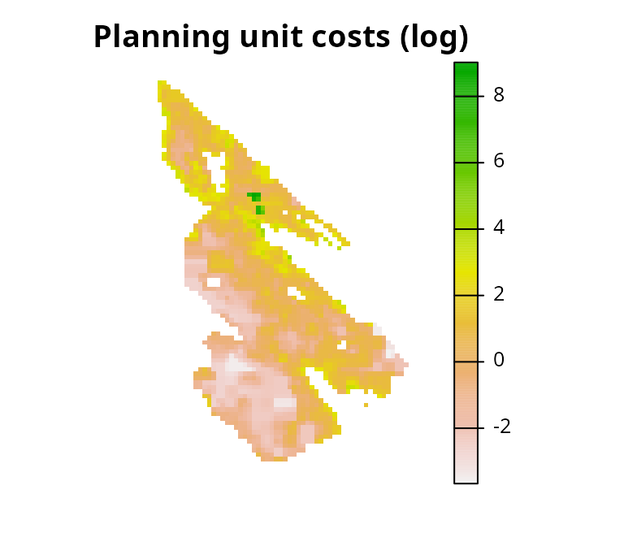

Next, let’s look at the `salt_features` object. It has multiple layers.
Each layer corresponds to different ecological communities (i.e., *Old
Forest*, *Savannah*, *Wetland*, and *Shrub* communities), and their cell
values indicate the probability of encountering a bird species
associated a given community.

``` r
# print feature data
print(salt_features)
```

    ## class       : SpatRaster
    ## size        : 94, 67, 4  (nrow, ncol, nlyr)
    ## resolution  : 300, 300  (x, y)
    ## extent      : 454589.9, 474689.9, 5394414, 5422614  (xmin, xmax, ymin, ymax)
    ## coord. ref. : WGS 84 / UTM zone 10N (EPSG:32610)
    ## source(s)   : memory
    ## names       : old forest,  savanna,  wetland,    shrub
    ## min values  :   0.423542, 0.335534, 0.148507, 0.441521
    ## max values  :   0.895186, 0.644032,  0.54416, 0.806558

``` r
# plot map showing the feature data
plot(salt_features, axes = FALSE)
```

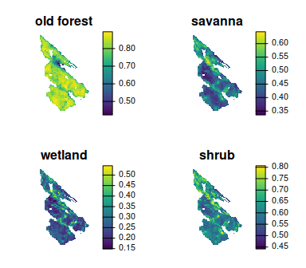

Let’s look at the `salt_con` object. It describes the inverse
probability of occurrence of human commensal species. Here we will
assume that human modified areas impede connectivity for native species,
and so cells with higher values will have greater connectivity.

``` r
# print connectivity data
print(salt_con)
```

    ## class       : SpatRaster
    ## size        : 94, 67, 1  (nrow, ncol, nlyr)
    ## resolution  : 300, 300  (x, y)
    ## extent      : 454589.9, 474689.9, 5394414, 5422614  (xmin, xmax, ymin, ymax)
    ## coord. ref. : WGS 84 / UTM zone 10N (EPSG:32610)
    ## source(s)   : memory
    ## name        : inverse human
    ## min value   :      0.406018
    ## max value   :      0.896955

``` r
# plot map showing the connectivity data
plot(salt_con, axes = FALSE)
```

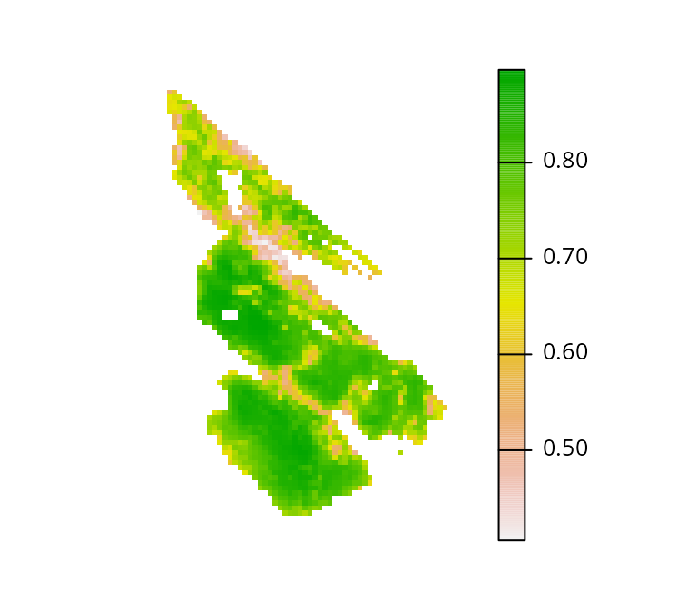

## Baseline problem

In this tutorial, we will explore a few different ways of incorporating
connectivity into prioritizations. To enable comparisons among
prioritizations based on different approaches, we will first create a
baseline problem formulation that we will subsequently customize to
incorporate connectivity. Specifically, we will formulate the baseline
problem using the minimum set objective. We will use representation
targets of 17% – based on [Aichi Biodiversity Target
11](https://www.cbd.int/sp/targets/) – to provide adequate coverage of
each ecological community. Additionally, because land properties on Salt
Spring Island can either be acquired in their entirety or not at all, we
will use binary decision types. This means that planning units are
either selected in the solution or not selected in the solution—planning
units cannot be partially acquired. Given all these details, let’s
formulate the baseline problem.

``` r
# create problem
p0 <-
  problem(salt_pu, salt_features) %>%
  add_min_set_objective() %>%
  add_relative_targets(0.17) %>%
  add_binary_decisions() %>%
  add_default_solver()

# print problem
print(p0)
```

    ## A conservation problem (<ConservationProblem>)
    ## ├•data
    ## │├•features:    "old forest", "savanna", "wetland", and "shrub" (4 total)
    ## │└•planning units:
    ## │ ├•data:       <SpatRaster> (2010 total)
    ## │ ├•costs:      continuous values (between 0.02552 and 8290.383)
    ## │ ├•extent:     454589.9, 5394414, 474689.9, 5422614 (xmin, ymin, xmax, ymax)
    ## │ └•CRS:        WGS 84 / UTM zone 10N (projected)
    ## ├•formulation
    ## │├•objective:   minimum set objective
    ## │├•penalties:   none specified
    ## │├•features:
    ## ││├•targets:    relative targets (all equal to 0.17)
    ## ││└•weights:    none specified
    ## │├•constraints: none specified
    ## │└•decisions:   binary decision
    ## └•optimization
    ##  ├•portfolio:   single portfolio
    ##  └•solver:      gurobi solver (`gap` = 0.1, `time_limit` = 2147483647, …)
    ## # ℹ Use `summary(...)` to see further details.

After formulating the baseline problem, we can solve it to generate a
prioritization.

``` r
# solve problem
s0 <- solve(p0)
```

    ## 

    ## ── Optimization ────────────────────────────────────────────────────────────────

``` r
# print solution
print(s0)
```

    ## class       : SpatRaster
    ## size        : 94, 67, 1  (nrow, ncol, nlyr)
    ## resolution  : 300, 300  (x, y)
    ## extent      : 454589.9, 474689.9, 5394414, 5422614  (xmin, xmax, ymin, ymax)
    ## coord. ref. : WGS 84 / UTM zone 10N (EPSG:32610)
    ## source(s)   : memory
    ## name        : cost
    ## min value   :    0
    ## max value   :    1

``` r
# plot solution
plot(
  s0, main = "Baseline prioritization", axes = FALSE,
  type = "classes", col = c("grey70", "darkgreen")
)
```

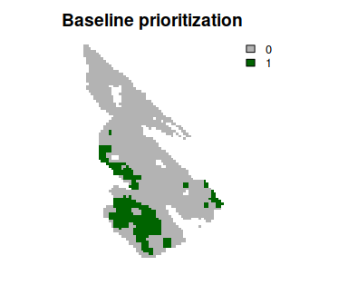

Next, let’s explore some options for incorporating connectivity.

## Adding constraints

Let’s explore approaches for promoting connectivity in prioritizations
by adding constraints to the baseline problem formulation. These
approaches ensure that prioritizations exhibit certain characteristics
(e.g., ensure prioritizations form a contiguous reserve; Önal & Briers
2006). This means that, regardless of the optimality gap used to
generate a prioritization, the prioritization will always exhibit these
characteristics.

### Neighbor constraints

Neighbor constraints can be added to ensure that each selected planning
unit has a certain number of neighbors surrounding it (using the
[`add_neighbor_constraints()`](https://prioritizr.net/reference/add_neighbor_constraints.md)
function) (based on Billionnet 2013). The `k` parameter can be used to
specify the required number of neighbors for each selected planning
unit. Let’s generate a prioritization by specifying that each planning
unit requires at least three neighbors.

``` r
# create problem with added neighbor constraints and solve it
s1 <-
  p0 %>%
  add_neighbor_constraints(k = 3) %>%
  solve()
```

    ## 

    ## ── Optimization ────────────────────────────────────────────────────────────────

``` r
# plot solutions
plot(
  c(s0, s1), main = c("baseline", "neighbors constraints"),
  axes = FALSE, type = "classes", col = c("grey70", "darkgreen")
)
```

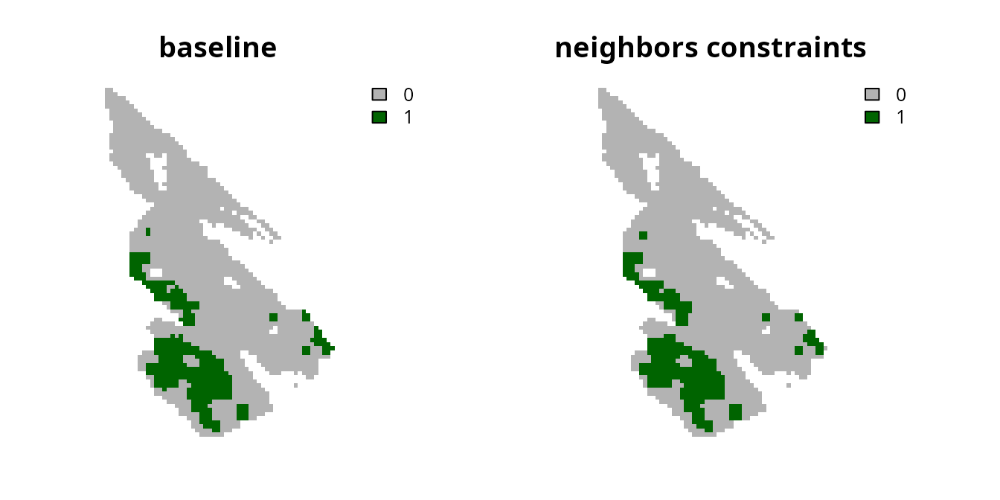

### Contiguity constraints

Contiguity constraints can be added to ensure that all planning units
form a single contiguous reserve (using the
[`add_contiguity_constraints()`](https://prioritizr.net/reference/add_contiguity_constraints.md)
function) (similar to Önal & Briers 2006). These constraints are
extremely complex. As such, they can only be applied to small
conservation planning problems and the *Gurobi* solver is required to
solve them in a feasible period of time. Since it would take a long time
to generate a near-optimal prioritization for this dataset with
contiguity constraints, we will also tell the solver to simply return
the first solution that it finds which meets the representation targets
and the contiguity constraints.

``` r
# create problem with added contiguity constraints and solve it
s2 <-
  p0 %>%
  add_contiguity_constraints() %>%
  add_gurobi_solver(first_feasible = TRUE) %>%
  solve()
```

    ## Warning: Overwriting previously defined solver.

    ## 

    ## ── Optimization ────────────────────────────────────────────────────────────────

``` r
# plot solutions
plot(
  c(s0, s2), main = c("baseline", "contiguity constraints"),
  axes = FALSE, type = "classes", col = c("grey70", "darkgreen")
)
```

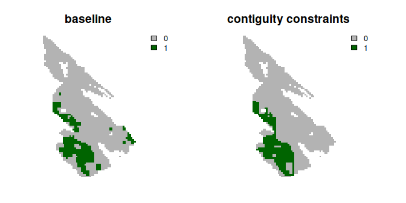

There is also an even more complex version of the contiguity constraints
that is available. These constraints – termed feature contiguity
constraints (similar to Cerdeira *et al.* 2010) – can be added to ensure
that all of the selected planning units used to the reach representation
targets within a prioritization form a contiguous network for each
feature (using the
[`add_feature_contiguity_constraints()`](https://prioritizr.net/reference/add_feature_contiguity_constraints.md)
function). In other words, they ensure that each feature can disperse
through the prioritization to access a target threshold amount of
habitat. However, these constraints are extraordinarily complex, only
feasible for small problems, and require preprocessing routines to
identify initial solutions. As such, we will not consider them in this
tutorial.

### Linear constraints

Linear constraints can be used to specify that the prioritizations must
meet an arbitrary set of criteria. As such, they can be used to ensure
that prioritizations provide adequate coverage of planning units that
have facilitate a high level of connectivity. Recall that the `salt_con`
data are used to describe connectivity across the study area. Since
higher values denote planning units with greater connectivity, we could
use linear constraints to ensure that the total sum of connectivity
values – based on this dataset – meets a particular threshold
(e.g. cover at least 30% of the total amount). This would effectively be
treating connectivity as an additional feature (similar to Daigle *et
al.* 2020).

``` r
# compute threshold for constraints
## here we use a threshold of 30% of the total connectivity values
threshold <- global(salt_con, "sum", na.rm = TRUE)[[1]] * 0.3

# print threshold
print(threshold)
```

    ## [1] 449.6104

``` r
# create problem with added linear constraints and solve it
s3 <-
  p0 %>%
  add_linear_constraints(
    data = salt_con, threshold = threshold, sense = ">="
  ) %>%
  solve()
```

    ## 

    ## ── Optimization ────────────────────────────────────────────────────────────────

``` r
# plot solutions
plot(
  c(s0, s3), main = c("baseline", "linear constraints"),
   axes = FALSE, type = "classes", col = c("grey70", "darkgreen")
)
```

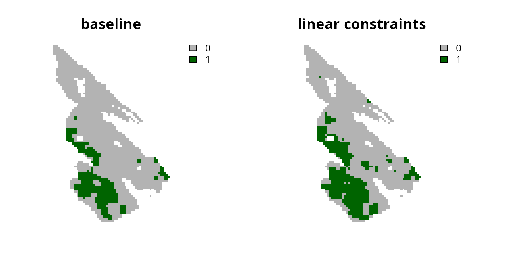

Although using continuous values has the advantage that the
prioritization process can explicitly account for differences in the
relative amount of connectivity facilitated by different planning units,
the disadvantage is that the prioritization could potentially focus on
selecting lots of planning units with low connectivity values. To avoid
this result, one strategy is to convert the continuous values into
binary values using a threshold limit (similar to Carroll 2021). By
applying such a threshold limit, linear constraints can then be used to
ensure that the prioritization selects a minimum amount of planning
units with high connectivity values (i.e., those with connectivity
values that are equal to or greater than the threshold limit).

``` r
# calculate threshold limit
## here we set a threshold limit based on the median
threshold_limit <- global(
  salt_con, fun = quantile, na.rm = TRUE, probs = 0.5
)[[1]]

# convert continuous values to binary values
salt_con_binary <- round(salt_con >= threshold_limit)

# plot binary values
plot(salt_con_binary, main = "salt_con_binary", axes = FALSE)
```

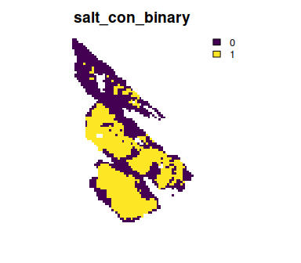

``` r
# create problem with added linear constraints and solve it
## note that we use the original threshold computed before,
## to ensure the prioritization covers at least 30% of the total amount
## connectivity values
s4 <-
  p0 %>%
  add_linear_constraints(
    data = salt_con_binary, threshold = threshold, sense = ">="
  ) %>%
  solve()
```

    ## 

    ## ── Optimization ────────────────────────────────────────────────────────────────

``` r
# plot solutions
plot(
  c(s0, s4), main = c("baseline", "linear constraints (binary)"),
  axes = FALSE, type = "classes", col = c("grey70", "darkgreen")
)
```

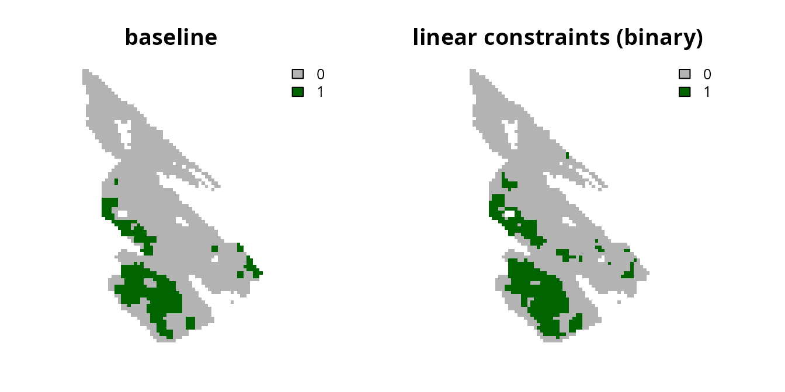

Another strategy is to clamp the continuous values below a threshold
limit and assign them a value of zero (similar to Hanson *et al.* 2020).
This strategy has the advantage that (i) the prioritization won’t focus
on selecting lots of planning units with low connectivity values to meet
the constraint threshold, and (ii) the optimization process can use
semi-continuous values to distinguish between places that can facilitate
a moderate amount and a high amount of connectivity.

``` r
# clamp continuous values using the threshold limit we computed before
salt_con_clamp <- salt_con
salt_con_clamp[salt_con <= threshold_limit] <- 0

# plot clamped values
plot(salt_con_clamp, main = "salt_con_clamp", axes = FALSE)
```

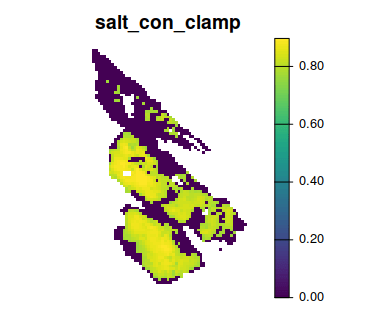

``` r
# create problem with added linear constraints and solve it
## note that we use the original threshold computed before,
## to ensure the prioritization covers at least 30% of the total amount
## connectivity values
s5 <-
  p0 %>%
  add_linear_constraints(
    data = salt_con_clamp, threshold = threshold, sense = ">="
  ) %>%
  solve()
```

    ## 

    ## ── Optimization ────────────────────────────────────────────────────────────────

``` r
# plot solutions
plot(
  c(s0, s5), main = c("baseline", "linear constraints (clamped)"),
  axes = FALSE, type = "classes", col = c("grey70", "darkgreen")
)
```

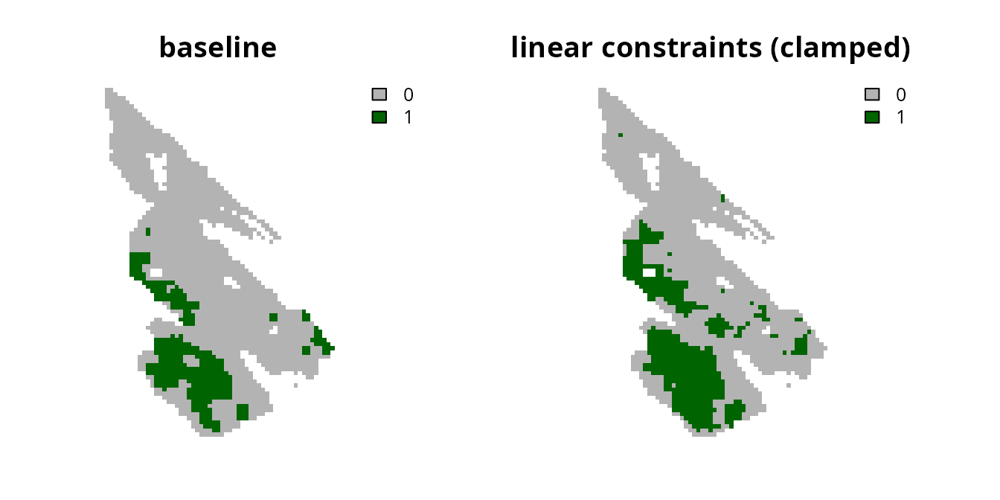

If we were concerned that the prioritization did not facilitate a high
enough level of connectivity, we could increase the `threshold` value or
the `threshold_limit` value. For example, let’s increase the
`threshold_limit` value used to clamp the continuous connectivity
values.

``` r
# compute threshold limit
threshold_limit2 <- global(
  salt_con, fun = quantile, na.rm = TRUE, probs = 0.7
)[[1]]

# clamp continuous values using the new threshold limit
salt_con_clamp2 <- salt_con
salt_con_clamp2[salt_con <= threshold_limit2] <- 0

# plot clamped values
plot(salt_con_clamp2, main = "salt_con_clamp", axes = FALSE)
```

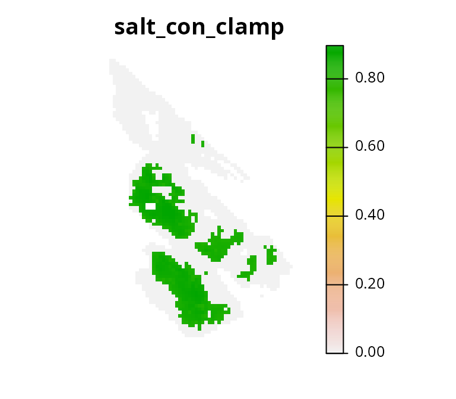

``` r
# create problem with added linear constraints and solve it
## note that we use the original threshold computed before,
## to ensure the prioritization covers at least 30% of the total amount
## connectivity values
s6 <-
  p0 %>%
  add_linear_constraints(
    data = salt_con_clamp2, threshold = threshold, sense = ">="
  ) %>%
  solve()
```

    ## 

    ## ── Optimization ────────────────────────────────────────────────────────────────

``` r
# plot solutions
plot(
  c(s0, s6), main = c("baseline", "linear constraints (clamped 2)"),
  axes = FALSE, type = "classes", col = c("grey70", "darkgreen")
)
```

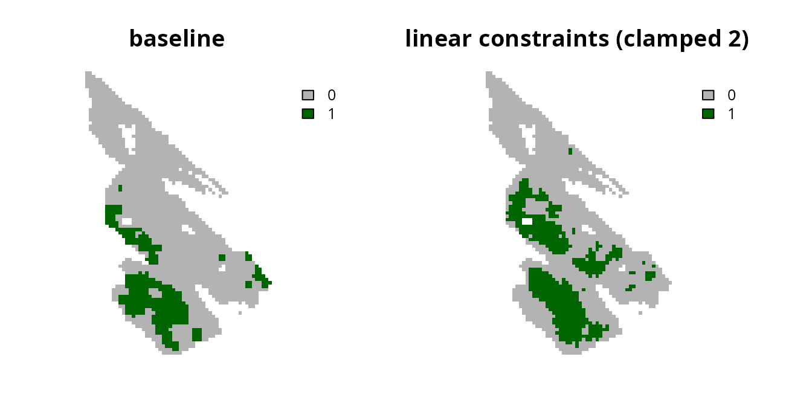

Despite the advantages of clamping the connectivity values, we can see
that the prioritization has a relatively high level of spatial
fragmentation. In fact, all prioritizations generated using the linear
constraints can potentially have this issue. This is because linear
constraints do not explicitly account for the spatial arrangement of the
planning units. As such, we recommend combining the linear constraints
approach with another approach \[e.g., the boundary penalties approach
discussed below; Carroll (2021)\].

## Adding penalties

Now let’s explore approaches for promoting connectivity in
prioritizations by adding penalties to the baseline problem formulation.
These approaches involve penalizing solutions according to certain
criteria (e.g., penalize spatial fragmentation of prioritizations; Watts
*et al.* 2009). Unlike constraint-based methods for incorporating
connectivity – if the optimality gap used to generate a prioritization
is too high – they may not necessarily produce prioritizations that
exhibit desirable characteristics.

### Boundary penalties

Boundary penalties can be used to reduce the spatial fragmentation of
prioritizations (using the
[`add_boundary_penalties()`](https://prioritizr.net/reference/add_boundary_penalties.md)
function). Specifically, these penalties update the problem formulation
to penalize solutions that have a high total amount of exposed boundary
length (Ball *et al.* 2009). Since boundary data often have large values
which can degrade solver performance and result in excessive run times
(see the [*Calibrating trade-offs
tutorial*](https://prioritizr.net/articles/calibrating_trade-offs_tutorial.md)
for details), we will first rescale the boundary data.

``` r
# precompute the boundary data
salt_boundary_data <- boundary_matrix(salt_pu)

# rescale boundary data
salt_boundary_data <- rescale_matrix(salt_boundary_data)
```

Next, let’s generate a prioritization using boundary penalties. To
specify the relative importance of reducing spatial fragmentation –
compared with the primary objective of a problem (e.g. minimizing cost)
– we need to set a value for the `penalty` parameter. Setting a higher
value for `penalty` indicates that it is more important to avoid highly
fragmented solutions. Let’s generate a prioritization with a `penalty`
value of 0.001.

``` r
# create problem with added boundary penalties
s7 <-
  p0 %>%
  add_boundary_penalties(penalty = 0.001, data = salt_boundary_data) %>%
  solve()
```

    ## 

    ## ── Optimization ────────────────────────────────────────────────────────────────

``` r
# plot solutions
plot(
  c(s0, s7), main = c("baseline", "boundary penalties (0.001)"),
  axes = FALSE, type = "classes", col = c("grey70", "darkgreen")
)
```


We can see that the resulting prioritization is still relatively
fragmented, so let’s try generating another prioritization with a higher
`penalty` value.

``` r
# create problem with increased boundary penalties
s8 <-
  p0 %>%
  add_boundary_penalties(penalty = 10, data = salt_boundary_data) %>%
  solve()
```

    ## 

    ## ── Optimization ────────────────────────────────────────────────────────────────

``` r
# plot solutions
plot(
  c(s0, s8), main = c("baseline", "boundary penalties (10)"),
  axes = FALSE, type = "classes", col = c("grey70", "darkgreen")
)
```

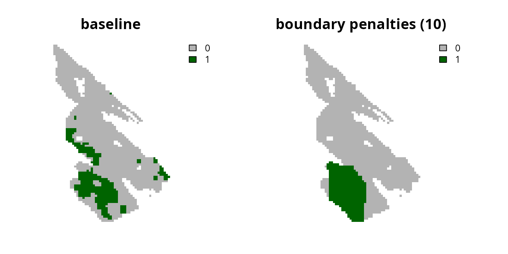

Although the prioritization is now less fragmented, it has also selected
a greater number of planning units. Let’s calculate the cost of the
prioritizations to see how they vary in overall cost.

``` r
# calculate cost of baseline prioritization
eval_cost_summary(p0, s0)
```

    ## # A tibble: 1 × 2
    ##   summary  cost
    ##   <chr>   <dbl>
    ## 1 overall  37.5

``` r
# calculate cost of prioritization with low boundary penalties (i.e., 0.001)
eval_cost_summary(p0, s7)
```

    ## # A tibble: 1 × 2
    ##   summary  cost
    ##   <chr>   <dbl>
    ## 1 overall  36.0

``` r
# calculate cost of prioritization high low boundary penalties (i.e., 0.1)
eval_cost_summary(p0, s8)
```

    ## # A tibble: 1 × 2
    ##   summary  cost
    ##   <chr>   <dbl>
    ## 1 overall  98.1

We can see that the cost of the prioritizations increase with when we
use higher `penalty` values. This is because there is a trade-off
between the cost of a prioritization and the level of spatial
fragmentation. Although it can be challenging to find the best balance,
there are qualitative and quantitative methods available to help
navigate such trade-offs. Please see the [*Calibrating trade-offs
tutorial*](https://prioritizr.net/articles/calibrating_trade-offs_tutorial.md)
for a details on these methods.

### Connectivity penalties

Connectivity penalties can be used to promote connectivity in
prioritizations (using the
[`add_connectivity_penalties()`](https://prioritizr.net/reference/add_connectivity_penalties.md)
function). These penalties use connectivity scores to parametrize the
strength of connectivity between pairs of planning units (Beger *et al.*
2010). Thus higher scores denote a greater level of connectivity between
different planning units. For example, previous studies have
parametrized connectivity scores using habitat quality, environmental,
and river flow data (e.g. Leonard *et al.* 2017; Alagador *et al.* 2012;
Hermoso *et al.* 2012). Although there are many approaches to calculate
connectivity scores, one approach involves using conductance data – data
that describe how much each planning unit facilitates movement (opposite
of landscape resistance data) – and calculating scores for each pair of
planning units by averaging their conductance values (implemented using
the
[`connectivity_matrix()`](https://prioritizr.net/reference/connectivity_matrix.md)
function).

Let’s compute connectivity scores by treating the `salt_con` object as
conductance data. This means that we assume that neighboring planning
units with higher values in the `salt_con` object are capable of
facilitating a greater amount of connectivity. **Note that the data used
to compute connectivity scores must conform to the same spatial
properties as the planning unit data (e.g., resolution, spatial extent,
coordinate reference system).** Also, although we are using raster data
here, these scores can also be computed for vector data too (e.g.,
[`sf::st_sf()`](https://r-spatial.github.io/sf/reference/sf.html)
objects). Similar to the boundary data, we will also rescale the
connectivity scores to avoid numerical issues during optimization.

``` r
# compute connectivity scores
salt_con_scores <- connectivity_matrix(salt_pu, salt_con)

# rescale scores
salt_con_scores <- rescale_matrix(salt_con_scores)
```

After computing the connectivity scores, we can use them to generate
prioritizations using connectivity penalties. Similar to the boundary
penalties, we use the `penalty` parameter to specify the relative
importance of promoting connectivity relative to the primary objective
of a problem (i.e., minimizing overall cost). Let’s generate a
prioritization with a `penalty` value of 0.001.

``` r
# create problem with added connectivity penalties
s9 <-
  p0 %>%
  add_connectivity_penalties(penalty = 0.0001, data = salt_con_scores) %>%
  solve()
```

    ## 

    ## ── Optimization ────────────────────────────────────────────────────────────────

``` r
# plot solutions
plot(
  c(s0, s9), main = c("baseline", "connectivity penalties (0.001)"),
  axes = FALSE, type = "classes", col = c("grey70", "darkgreen")
)
```

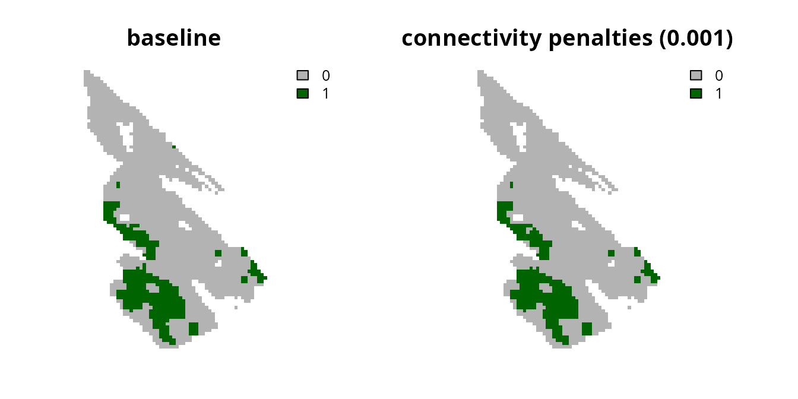

Now let’s try generating another prioritization with a higher `penalty`
value.

``` r
# create problem with increased connectivity penalties
s10 <-
  p0 %>%
  add_connectivity_penalties(penalty = 0.0002, data = salt_con_scores) %>%
  solve()
```

    ## 

    ## ── Optimization ────────────────────────────────────────────────────────────────

``` r
# plot solutions
plot(
  c(s0, s10), main = c("baseline", "connectivity penalties (0.002)"),
  axes = FALSE, type = "classes", col = c("grey70", "darkgreen")
)
```


We can see that increasing the `penalty` parameter causes the
prioritizations to select planning units in regions with greater
connectivity values (i.e., per the `salt_con` object). As discussed with
the boundary penalties, increasing the `penalty` value tells the
optimization process to focus more on promoting connectivity—meaning
that it won’t focus as much on the primary objective (i.e., because the
primary objective is to minimize overall costs). For details on
calibrating these trade-offs please see the [*Calibrating trade-offs
tutorial*](https://prioritizr.net/articles/calibrating_trade-offs_tutorial.md).
**Note that you will need to the use
[`eval_connectivity_summary()`](https://prioritizr.net/reference/eval_connectivity_summary.md)
function – instead of the
[`eval_boundary_summary()`](https://prioritizr.net/reference/eval_boundary_summary.md)
function – when adapting the tutorial code for connectivity penalties.**

## Conclusion

Hopefully, this tutorial has provided a helpful introduction for
incorporating connectivity into prioritizations. Broadly speaking, we
recommend using the boundary penalties or the connectivity penalties to
ensure that prioritizations explicitly account for the spatial
configuration of selected planning units. Additionally, though not fully
explored here, the connectivity penalties are a very flexible approach
for promoting connectivity. For instance, in addition to parametrizing
pair-wise connectivity scores for neighboring planning units, they can
also be used to parametrize pair-wise connectivity scores between more
distant planning units. Thus connectivity penalties could be used to
parametrize connectivity across both small and large spatial scales
(e.g., using a scaling procedure wherein connectivity scores between
pairs of planning units decline with the distance between them).

## References

Alagador, D., Trivino, M., Cerdeira, J.O., Brás, R., Cabeza, M. &
Araújo, M.B. (2012). Linking like with like: Optimising connectivity
between environmentally-similar habitats. *Landscape Ecology*, *27*,
291–301.

Balbar, A.C. & Metaxas, A. (2019). The current application of ecological
connectivity in the design of marine protected areas. *Global Ecology
and Conservation*, *17*, e00569.

Ball, I.R., Possingham, H. & Watts, M.E. (2009). Marxan and relatives:
Software for spatial conservation prioritisation. *Spatial Conservation
Prioritisation: Quantitative Methods & Computational Tools* (eds A.
Moilanen, K.A. Wilson & H. Possingham), pp. 185–189. Oxford University
Press, Oxford, UK.

BC Assessment. (2015). *Property Information Services*. URL
<https://info.bcassessment.ca/> \[accessed 13 June 2016\].

Beger, M., Linke, S., Watts, M., Game, E., Treml, E., Ball, I. &
Possingham, H.P. (2010). Incorporating asymmetric connectivity into
spatial decision making for conservation. *Conservation Letters*, *3*,
359–368.

Billionnet, A. (2013). Mathematical optimization ideas for biodiversity
conservation. *European Journal of Operational Research*, *231*,
514–534.

Briers, R.A. (2002). Incorporating connectivity into reserve selection
procedures. *Biological Conservation*, *103*, 77–83.

Carroll, K.A. (2021). [Systematic prioritization protocol applied to
wolverine habitat
connectivity](https://doi.org/10.1016/j.xpro.2021.100882). *STAR
Protocols*, *2*, 100882.

Cerdeira, J.O., Pinto, L.S., Cabeza, M. & Gaston, K.J. (2010). Species
specific connectivity in reserve-network design using graphs.
*Biological Conservation*, *143*, 408–415.

Daigle, R.M., Metaxas, A., Balbar, A.C., McGowan, J., Treml, E.A.,
Kuempel, C.D., Possingham, H.P. & Beger, M. (2020). Operationalizing
ecological connectivity in spatial conservation planning with Marxan
Connect. *Methods in Ecology and Evolution*, *11*, 570–579.

Dixo, M., Metzger, J.P., Morgante, J.S. & Zamudio, K.R. (2009). Habitat
fragmentation reduces genetic diversity and connectivity among toad
populations in the brazilian atlantic coastal forest. *Biological
Conservation*, *142*, 1560–1569.

Dwyer, R.G., Campbell, H.A., Pillans, R.D., Watts, M.E., Lyon, B.J.,
Guru, S.M., Dinh, M.N., Possingham, H.P. & Franklin, C.E. (2019). Using
individual-based movement information to identify spatial conservation
priorities for mobile species. *Conservation Biology*, *33*, 1426–1437.

Hanson, J.O., Marques, A., Verı́ssimo, A., Camacho-Sanchez, M.,
Velo-Antón, G., Martı́nez-Solano, Íñigo & Carvalho, S.B. (2020).
Conservation planning for adaptive and neutral evolutionary processes.
*Journal of Applied Ecology*, *57*, 2159–2169.

Hermoso, V., Kennard, M.J. & Linke, S. (2012). Integrating
multidirectional connectivity requirements in systematic conservation
planning for freshwater systems. *Diversity and Distributions*, *18*,
448–458.

Hodgson, J.A., Thomas, C.D., Wintle, B.A. & Moilanen, A. (2009). Climate
change, connectivity and conservation decision making: Back to basics.
*Journal of Applied Ecology*, *46*, 964–969.

Leonard, P.B., Baldwin, R.F. & Hanks, R.D. (2017). Landscape-scale
conservation design across biotic realms: Sequential integration of
aquatic and terrestrial landscapes. *Scientific Reports*, *7*, 1–12.

Margules, C.R. & Pressey, R.L. (2000). Systematic conservation planning.
*Nature*, *405*, 243–253.

Morrell, N., Schuster, R., Crombie, M. & Arcese, P. (2017). *A
Prioritization Tool for the Conservation of Coastal Douglas-fir Forest
and Savannah Habitats of the Georgia Basin*. The Nature Trust of British
Colombia, Coastal Douglas Fir Conservation Partnership, and the
Department of Forest and Conservation Sciences, University of British
Colombia, URL
<https://peter-arcese-lab.sites.olt.ubc.ca/files/2016/09/CDFCP_tutorial_2017_05.pdf>
\[accessed 9 October 2017\].

Olds, A.D., Connolly, R.M., Pitt, K.A. & Maxwell, P.S. (2012). Habitat
connectivity improves reserve performance. *Conservation Letters*, *5*,
56–63.

Önal, H. & Briers, R.A. (2006). Optimal selection of a connected reserve
network. *Operations Research*, *54*, 379–388.

Watts, M.E., Ball, I.R., Stewart, R.S., Klein, C.J., Wilson, K.,
Steinback, C., Lourival, R., Kircher, L. & Possingham, H.P. (2009).
Marxan with Zones: Software for optimal conservation based land- and
sea-use zoning. *Environmental Modelling & Software*, *24*, 1513–1521.
