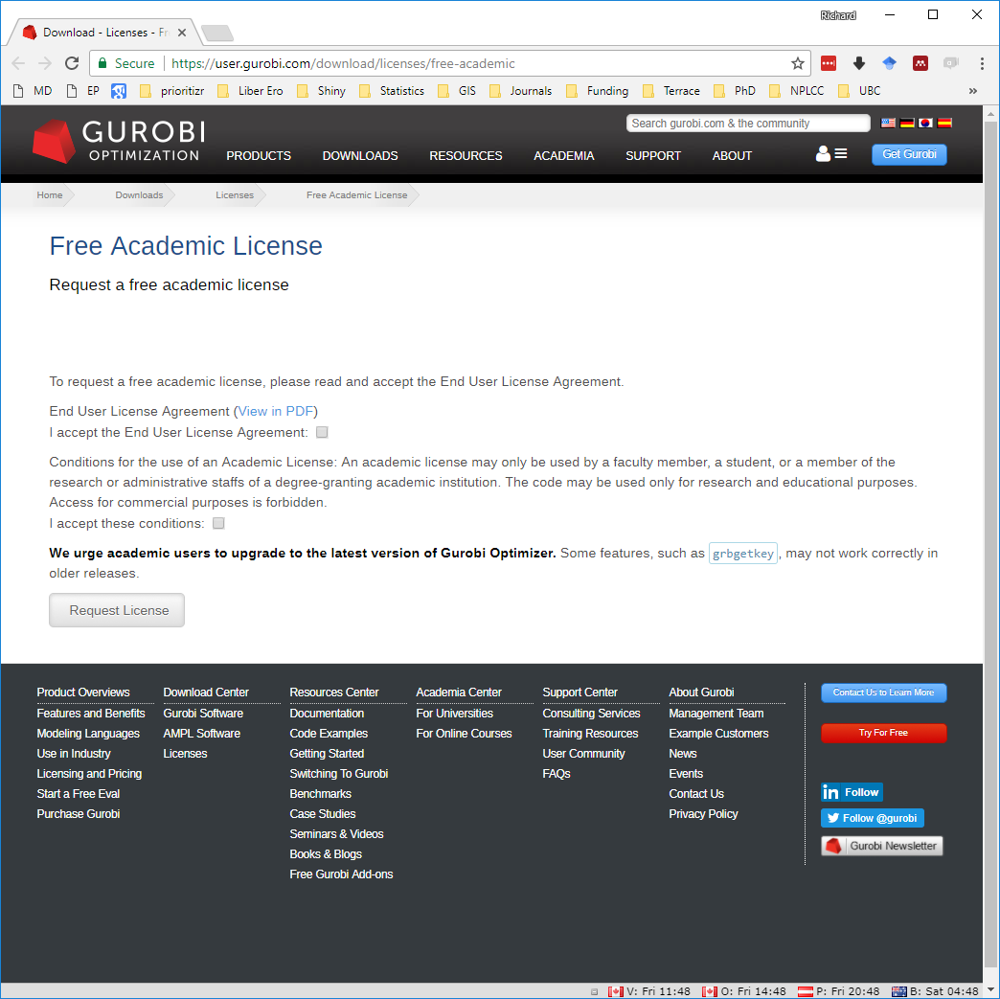
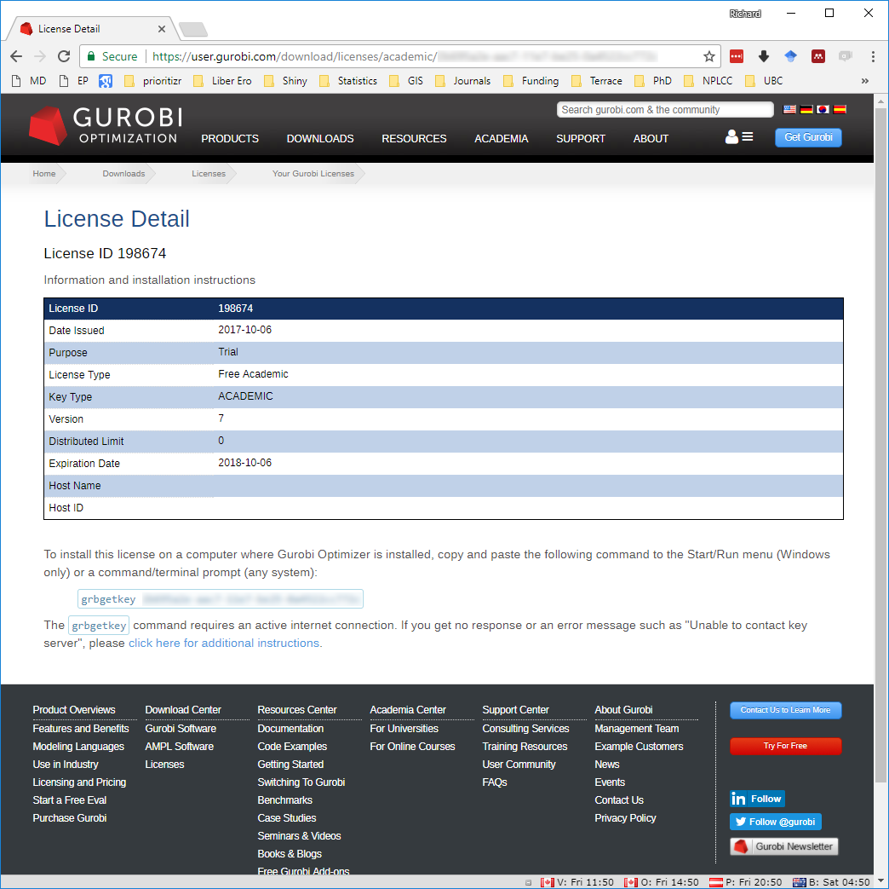
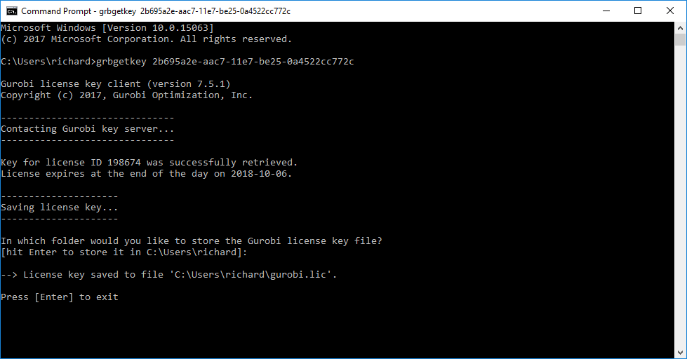
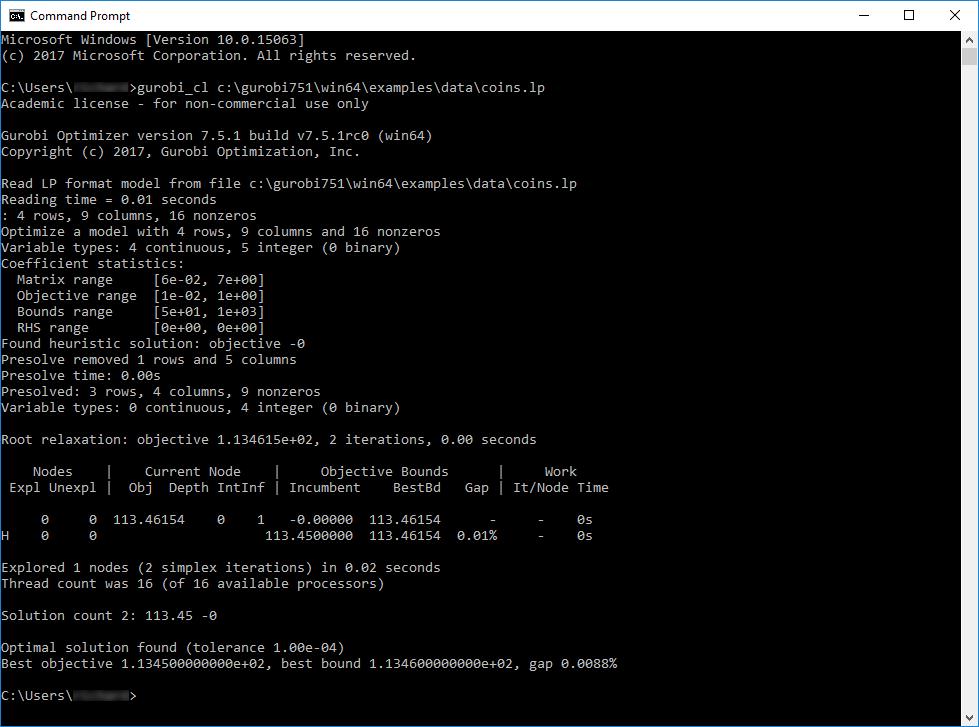
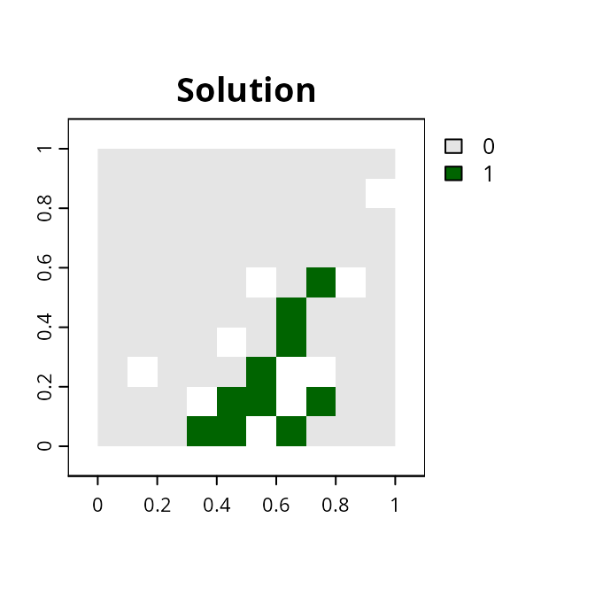

# Gurobi installation guide

## Introduction

*Gurobi* is the most powerful and fastest solver that the *prioritizr R*
package can use to solve conservation planning problems (see the
[*Solver
benchmarks*](https://prioritizr.net/articles/solver_benchmarks.md)
vignette for further details). This guide will walk you through the
process of setting up *Gurobi* on your computer so that it can be used
to solve conservation planning problems. If you encounter any problems
while following the instructions below, please refer to the [official
*Gurobi* documentation](https://docs.gurobi.com/).

## Obtaining a license

*Gurobi* is a commercial computer program. [This means that users will
need to obtain a license for *Gurobi* before they can use
it](https://www.gurobi.com/downloads/). Although academics can obtain a
special license at no cost, individuals that are not affiliated with a
recognized educational institution may need to purchase a license. If
you are an academic that is affiliated with a recognized educational
institution, you can take advantage of the [special academic
license](https://www.gurobi.com/features/academic-named-user-license/)
to use *Gurobi* for no cost. Once you have signed up for a free account
you can request a [free academic
license](https://www.gurobi.com/features/academic-named-user-license/).

  



  

Once you accept the Terms Of Service you can generate a license.

  



  

Now, copy and save the `grbgetkey XXXXXXXX-XXXX-XXXX-XXXX-XXXXXXXXXXXX`
command for later use.

## Downloading the software

After obtaining a license, you will need to download the *Gurobi*
installer to your computer. To achieve this, visit the [*Gurobi*
downloads web page](https://www.gurobi.com/products/gurobi-optimizer/)
and download the correct version of the installer for your operating
system.

## Software installation

The process for installing the *Gurobi* software depends on the
operating system on your computer. Fortunately, *Gurobi* provides
detailed [platform-specific
instructions](https://support.gurobi.com/hc/en-us/articles/4534161999889-How-do-I-install-Gurobi-Optimizer)
for Windows, MacOS, and Linux systems that should help with this.
Briefly, on Windows systems, you just need to double-click on the
*Gurobi* installer, follow the prompts, and the installer will
automatically handle everything for you. On Linux and MacOS systems, you
will need to manually extract the downloaded file’s contents to a
folder, move the extracted contents to a suitable location (typically
*/opt/gurobi*), and update your system’s variables so that it knows
where to find *Gurobi* (i.e., the `PATH` variable).

Additionally, if you are using
[*RStudio*](https://posit.co/products/open-source/rstudio/) on a Linux
system, you might need to add the following text to a Rstudio
configuration file (located at `/etc/rstudio/rserver.conf`).

    rsession-ld-library-path=/opt/gurobi650/linux64/lib

After installing the *Gurobi* software suite on your computer, you will
need to activate your license.

## License activation

Now we will activate the *Gurobi* software using the license you
obtained earlier. Please note that the correct set of instructions
depends on your system and license. To activate the license, simply copy
and paste the `grbgetkey` command into your computer’s command prompt or
terminal (note that Windows users can open the command prompt by typing
`cmd` in the search box and pressing the `enter` key). After running the
`grbgetkey` command with the correct license code, you should see output
that resembles the following screen shot.

  



  

Next, we will now check that the license has been successfully
activated. To achieve this, we will try running *Gurobi* directly from
the command line. Note that the following commands assume you are using
version 8.0.0 of *Gurobi*, and so you will need to modify the command if
you are using a more recent version (e.g., if using version 9.1.2, then
use `gurobi912` instead of `gurobi800` below).

On Windows systems, users can type in the following system command to
check their license activation.

``` bash
gurobi_cl c:\gurobi800\win64\examples\data\coins.lp
```

On Linux and MacOS systems, users can type in the following system
command.

``` bash
gurobi_cl /opt/gurobi800/linux64/examples/data/coins.lp
```

If the license was successfully activated, you should see output that
resembles the screen shot below.

  



  

After activating the license, you now need to install the *gurobi R*
package. This is so that you can access the *Gurobi* software from
within the R statistical computing environment, and enable the
*prioritizr* package to interface with the *Gurobi* software.

## *R* package installation

Now we will install the *gurobi R* package. This package is not
available on the Comprehensive R Archive Network and is instead
distributed with the *Gurobi* software suite. Specifically, the *gurobi*
*R* package should be located within the folder where you installed the
*Gurobi* software suite. We will install the *gurobi* *R* package by
running the following *R* code within your *R* session. Note that the
following code assumes that you are using version 8.0.0 of *Gurobi*, and
so you will need to modify the code if you are using a more recent
version (e.g., if using version 9.1.2, then use `gurobi912` instead of
`gurobi800` below).

Assuming you installed *Gurobi* in the default location, Windows users
can install *gurobi* *R* package using the following code.

``` r
install.packages("c:/gurobi800/win64/R/gurobi_8.0-0.zip", repos = NULL)
```

Similarly, Linux and MacOS users can install the *gurobi* *R* package
using the following code.

``` r
install.packages(
  file.path(
    Sys.getenv("GUROBI_HOME"),
    "R/gurobi_8.0-0_R_x86_64-pc-linux-gnu.tar.gz"
  ),
  repos = NULL
)
```

Next, you will need to install the *slam R* package because the *gurobi*
*R* package needs this package to work. Users of all platforms (i.e.,
Windows, Linux, and MacOS) can install the package using the following
*R* code.

``` r
install.packages("slam", repos = "https://cloud.r-project.org")
```

Let’s check that the *gurobi* *R* package has been successfully
installed. To do this, we can try using the *gurobi R* package to solve
an optimization problem. Copy and paste the *R* code below into *R*.

``` r
# load gurobi package
library(gurobi)
```

    ## Loading required package: slam

``` r
# create optimization problem
model <- list()
model$obj        <- c(1, 1, 2)
model$modelsense <- "max"
model$rhs        <- c(4, 1)
model$sense      <- c("<", ">")
model$vtype      <- "B"
model$A          <- matrix(c(1, 2, 3, 1, 1, 0), nrow = 2, ncol = 3,
                           byrow = TRUE)

# solve the optimization problem using Gurobi
result <- gurobi(model, list())
```

    ## Set parameter Username
    ## Set parameter LicenseID to value 2738655
    ## Academic license - for non-commercial use only - expires 2026-11-14
    ## Gurobi Optimizer version 13.0.0 build v13.0.0rc1 (linux64 - "Ubuntu 24.04.2 LTS")
    ## 
    ## CPU model: 11th Gen Intel(R) Core(TM) i7-1185G7 @ 3.00GHz, instruction set [SSE2|AVX|AVX2|AVX512]
    ## Thread count: 4 physical cores, 8 logical processors, using up to 8 threads
    ## 
    ## Optimize a model with 2 rows, 3 columns and 5 nonzeros (Max)
    ## Model fingerprint: 0xba2d0add
    ## Model has 3 linear objective coefficients
    ## Variable types: 0 continuous, 3 integer (3 binary)
    ## Coefficient statistics:
    ##   Matrix range     [1e+00, 3e+00]
    ##   Objective range  [1e+00, 2e+00]
    ##   Bounds range     [0e+00, 0e+00]
    ##   RHS range        [1e+00, 4e+00]
    ## Found heuristic solution: objective 2.0000000
    ## Presolve removed 2 rows and 3 columns
    ## Presolve time: 0.00s
    ## Presolve: All rows and columns removed
    ## 
    ## Explored 0 nodes (0 simplex iterations) in 0.00 seconds (0.00 work units)
    ## Thread count was 1 (of 8 available processors)
    ## 
    ## Solution count 2: 3 2 
    ## 
    ## Optimal solution found (tolerance 1.00e-04)
    ## Best objective 3.000000000000e+00, best bound 3.000000000000e+00, gap 0.0000%

``` r
# print the solution
print(result$objval) # objective
```

    ## [1] 3

``` r
print(result$x)      # decision variables
```

    ## [1] 1 0 1

If you see the outputs for `result$objval` and `result$x` and you don’t
see any error messages, then you have (1) successfully installed the
*Gurobi* software suite, (2) activated a valid license, and (3)
successfully installed the *gurobi R* package. If do see an error
message, then you might have missed a previous step or something might
have gone wrong while installing *Gurobi* or activating the license. In
such cases, try going back through this vignette and repeating the
previous steps to see if that fixes the issue.

## Solving a *prioritzr* problem with *Gurobi*

If you successfully installed the *Gurobi* software suite and the
*gurobi* *R* package, you can now try solving conservation planning
problems using the *prioritzr* *R* package. Although the *prioritizr*
*R* package should automatically detect that *Gurobi* has been
installed, you can use the function
[`add_gurobi_solver()`](https://prioritizr.net/reference/add_gurobi_solver.md)
to manually specify that *Gurobi* should be used to solve problems. This
function is also useful because you can use it to customize the
optimization process (e.g., specify the desired optimality gap or set a
limit on how much time should be spent searching for a solution).

Finally, to check that everything has been installed correctly, we will
use the *Gurobi* software suite to solve a reserve selection problem
created using the *prioritzr* *R* package.

``` r
# load package
library(prioritizr)

# load data
sim_pu_raster <- get_sim_pu_raster()
sim_features <- get_sim_features()

# formulate the problem
p <-
  problem(sim_pu_raster, sim_features) %>%
  add_min_set_objective() %>%
  add_relative_targets(0.1) %>%
  add_binary_decisions() %>%
  add_gurobi_solver()

# solve the problem
s <- solve(p)
```

    ## Set parameter Username
    ## Set parameter LicenseID to value 2738655
    ## Set parameter TimeLimit to value 2147483647
    ## Set parameter MIPGap to value 0.1
    ## Set parameter Presolve to value 2
    ## Set parameter Threads to value 1
    ## Academic license - for non-commercial use only - expires 2026-11-14
    ## Gurobi Optimizer version 13.0.0 build v13.0.0rc1 (linux64 - "Ubuntu 24.04.2 LTS")
    ## 
    ## CPU model: 11th Gen Intel(R) Core(TM) i7-1185G7 @ 3.00GHz, instruction set [SSE2|AVX|AVX2|AVX512]
    ## Thread count: 4 physical cores, 8 logical processors, using up to 1 threads
    ## 
    ## Non-default parameters:
    ## TimeLimit  2147483647
    ## MIPGap  0.1
    ## Presolve  2
    ## Threads  1
    ## 
    ## Optimize a model with 5 rows, 90 columns and 450 nonzeros (Min)
    ## Model fingerprint: 0x4bb5d283
    ## Model has 90 linear objective coefficients
    ## Variable types: 0 continuous, 90 integer (90 binary)
    ## Coefficient statistics:
    ##   Matrix range     [2e-01, 9e-01]
    ##   Objective range  [2e+02, 2e+02]
    ##   Bounds range     [1e+00, 1e+00]
    ##   RHS range        [3e+00, 8e+00]
    ## Found heuristic solution: objective 2337.9617767
    ## Presolve time: 0.00s
    ## Presolved: 5 rows, 90 columns, 450 nonzeros
    ## Variable types: 0 continuous, 90 integer (90 binary)
    ## Root relaxation presolved: 5 rows, 90 columns, 450 nonzeros
    ## 
    ## 
    ## Root relaxation: objective 1.931582e+03, 12 iterations, 0.00 seconds (0.00 work units)
    ## 
    ##     Nodes    |    Current Node    |     Objective Bounds      |     Work
    ##  Expl Unexpl |  Obj  Depth IntInf | Incumbent    BestBd   Gap | It/Node Time
    ## 
    ##      0     0 1931.58191    0    4 2337.96178 1931.58191  17.4%     -    0s
    ## H    0     0                    2207.8530121 1931.58191  12.5%     -    0s
    ## H    0     0                    1987.3985291 1931.58191  2.81%     -    0s
    ## 
    ## Explored 1 nodes (12 simplex iterations) in 0.00 seconds (0.00 work units)
    ## Thread count was 1 (of 8 available processors)
    ## 
    ## Solution count 3: 1987.4 2207.85 2337.96 
    ## 
    ## Optimal solution found (tolerance 1.00e-01)
    ## Best objective 1.987398529053e+03, best bound 1.931581907658e+03, gap 2.8085%

``` r
# plot solution
plot(
  s, col = c("grey90", "darkgreen"), main = "Solution",
  xlim = c(-0.1, 1.1), ylim = c(-0.1, 1.1)
)
```



After running this code, hopefully, you should some information printed
on-screen about the optimization process and *R* should produce a map
displaying a solution. If this code does not produce any errors, then
you have successfully installed everything and can begin using *Gurobi*
and the *prioritizr R* package to solve your very own conservation
planning problems.
