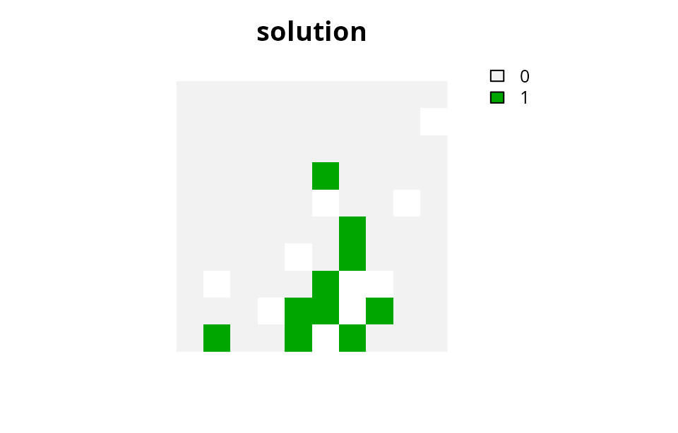
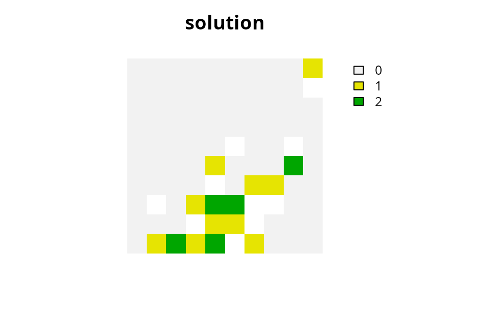
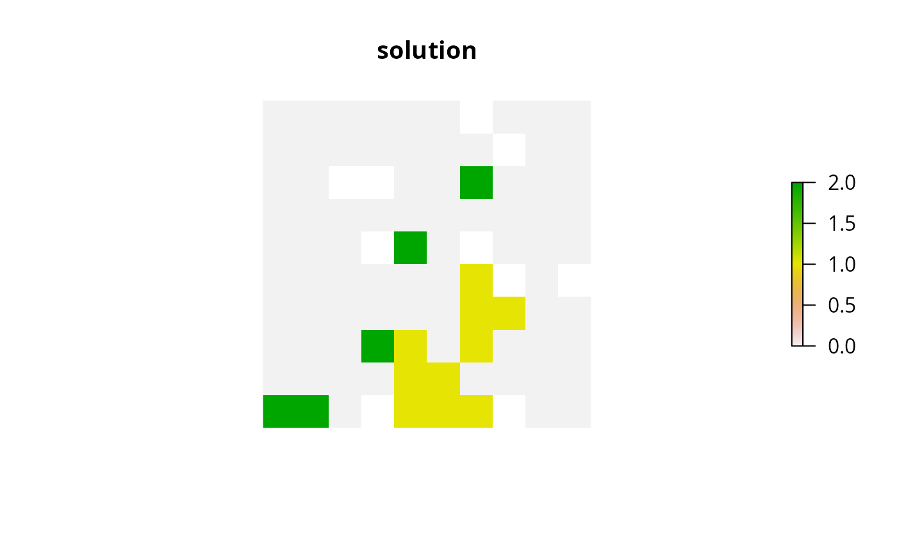
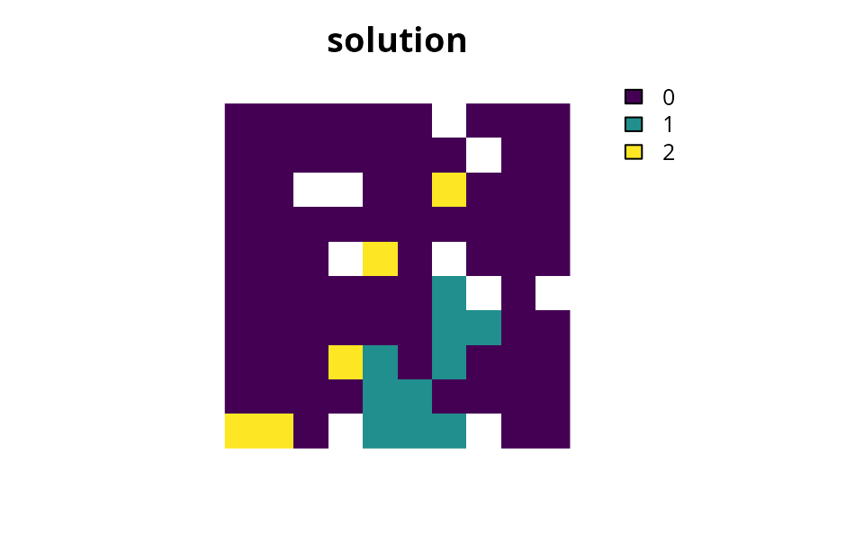
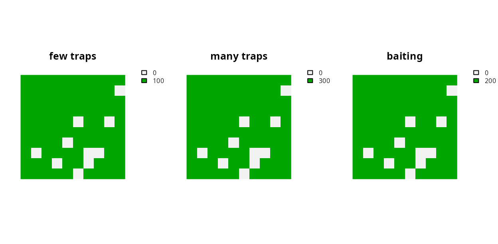
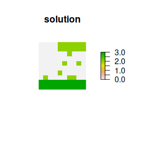
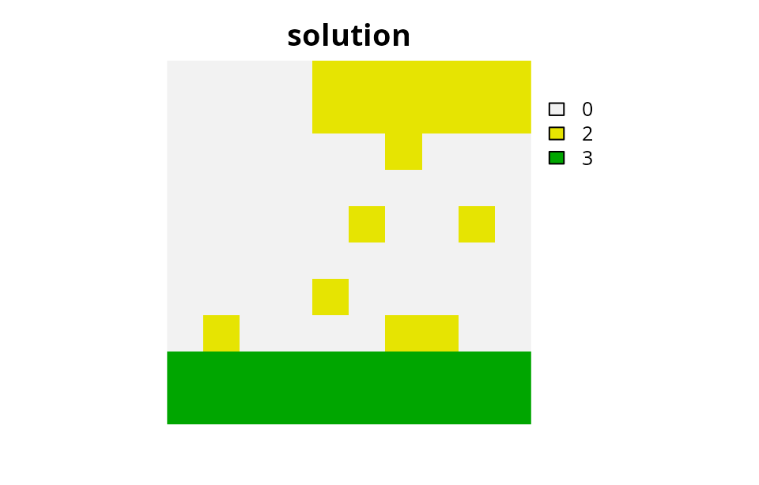
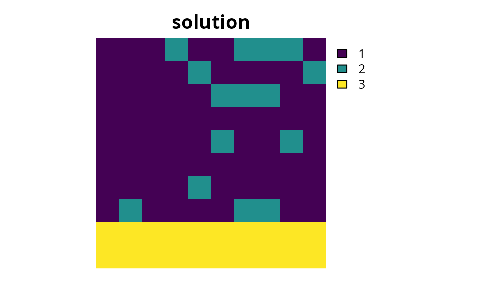

# Management zones tutorial

## Introduction

One of the main aims in conservation planning is to identify the most
cost-effective set of areas to manage biodiversity (Margules & Pressey
2000). To achieve this, prioritizations are generally created to
identify areas for expanding protected area systems. However, many
real-world conservation problems do not simply involve deciding if an
area should be protected or not (e.g., Klein *et al.* 2009; Stigner *et
al.* 2016). Instead, many problems involve a range of different
management categories and the goal is to determine which areas should be
allocated to which management category. For example, a manager might
have a range of different methods (e.g., baiting or trapping at various
intensities) for controlling invasive pests in a set of different areas
(e.g., Cattarino *et al.* 2018). They would need a prioritization that
shows which control methods should be implemented in which areas. In
this particular case, a binary prioritization showing which areas
contain the most biodiversity is simply not helpful. Furthermore, many
real-world problems require decisions that meet multiple, and sometimes
conflicting, objectives from different stakeholders. For example, a
manager might need to implement a set of no-take and partial-take areas
to prevent overfishing, but also ensure that there still remain plenty
of areas for fishing activities (e.g., Wilson *et al.* 2010; Klein *et
al.* 2013). Popularized by the *Marxan with Zones* decision support tool
(Watts *et al.* 2009), this concept has become known as “zones” and is
becoming increasingly important in conservation planning.

The aim of this tutorial is to showcase the zones functionality of the
*prioritizr R* package. It will assume a certain level of familiarity
with conservation planning terminology and the package. If you don’t
have much experience in either of these topics, we recommend first
reading the [*Package
overview*](https://prioritizr.net/articles/package_overview.md)
vignette.

## Usage

### Simple minimum set problem

In the *prioritizr R* package, all conservation planning problems –
including those which contain multiple management zones or actions – are
initialized using the `problem` function. To refresh our memory on how
we can construct problems, let us quickly construct a simple
conservation planning problem. This problem will use the simulated
built-in planning unit and feature data distributed with the package. It
will have a minimum set objective, targets which require that solutions
secure to 10% of the habitat in the study area for each feature, and
binary decision variables indicating that planning units are selected or
not selected for protection.

``` r
# load packages
library(prioritizr)
library(terra)
```

    ## terra 1.9.27

    ## 
    ## Attaching package: 'terra'

    ## The following object is masked from 'package:prioritizr':
    ## 
    ##     rescale

    ## The following objects are masked from 'package:testthat':
    ## 
    ##     compare, describe

``` r
library(tibble)

# set seed for reproducibility
set.seed(500)
```

``` r
# load data
sim_pu_raster <- get_sim_pu_raster()
sim_features <- get_sim_features()

# create targets for each of the five features
t1 <- rep(0.1, 5)

# build single-zone problem
p1 <-
  problem(sim_pu_raster, sim_features) %>%
  add_min_set_objective() %>%
  add_relative_targets(t1) %>%
  add_binary_decisions()

# print problem
print(p1)
```

    ## A conservation problem (<ConservationProblem>)
    ## ├•data
    ## │├•features:    "feature_1", "feature_2", "feature_3", … (5 total)
    ## │└•planning units:
    ## │ ├•data:       <SpatRaster> (90 total)
    ## │ ├•costs:      continuous values (between 190.1328 and 215.8638)
    ## │ ├•extent:     0, 0, 1, 1 (xmin, ymin, xmax, ymax)
    ## │ └•CRS:        WGS 84 / Pseudo-Mercator (projected)
    ## ├•formulation
    ## │├•objective:   minimum set objective
    ## │├•penalties:   none specified
    ## │├•features:
    ## ││├•targets:    relative targets (all equal to 0.1)
    ## ││└•weights:    none specified
    ## │├•constraints: none specified
    ## │└•decisions:   binary decision
    ## └•optimization
    ##  ├•portfolio:   single portfolio
    ##  └•solver:      gurobi solver (`gap` = 0.1, `time_limit` = 2147483647, …)
    ## # ℹ Use `summary(...)` to see further details.

``` r
# solve problem
s1 <- solve(p1)
```

    ## 

    ## ── Optimization ────────────────────────────────────────────────────────────────

    ## Set parameter Username
    ## Set parameter LicenseID to value 2806834
    ## Set parameter TimeLimit to value 2147483647
    ## Set parameter MIPGap to value 0.1
    ## Set parameter Presolve to value 2
    ## Set parameter Threads to value 1
    ## Academic license - for non-commercial use only - expires 2027-04-14
    ## Warning: Gurobi version mismatch between R 13.0.1 and C library 13.0.2
    ## Gurobi Optimizer version 13.0.2 build v13.0.2rc1 (linux64 - "Ubuntu 24.04.2 LTS")
    ## 
    ## CPU model: 11th Gen Intel(R) Core(TM) i7-1185G7 @ 3.00GHz, instruction set [SSE2|AVX|AVX2|AVX512]
    ## Thread count: 4 physical cores, 8 logical processors, using up to 1 threads
    ## 
    ## Non-default parameters:
    ## TimeLimit  2147483647
    ## MIPGap  0.1
    ## Presolve  2
    ## Threads  1
    ## 
    ## Optimize a model with 5 rows, 90 columns and 450 nonzeros (Min)
    ## Model fingerprint: 0x4bb5d283
    ## Model has 90 linear objective coefficients
    ## Variable types: 0 continuous, 90 integer (90 binary)
    ## Coefficient statistics:
    ##   Matrix range     [2e-01, 9e-01]
    ##   Objective range  [2e+02, 2e+02]
    ##   Bounds range     [1e+00, 1e+00]
    ##   RHS range        [3e+00, 8e+00]
    ## 
    ## Found heuristic solution: objective 2337.9617767
    ## Presolve time: 0.00s
    ## Presolved: 5 rows, 90 columns, 450 nonzeros
    ## Variable types: 0 continuous, 90 integer (90 binary)
    ## Root relaxation presolved: 5 rows, 90 columns, 450 nonzeros
    ## 
    ## 
    ## Root relaxation: objective 1.931582e+03, 12 iterations, 0.00 seconds (0.00 work units)
    ## 
    ##     Nodes    |    Current Node    |     Objective Bounds      |     Work
    ##  Expl Unexpl |  Obj  Depth IntInf | Incumbent    BestBd   Gap | It/Node Time
    ## 
    ##      0     0 1931.58191    0    4 2337.96178 1931.58191  17.4%     -    0s
    ## H    0     0                    2207.8530121 1931.58191  12.5%     -    0s
    ## H    0     0                    1987.3985291 1931.58191  2.81%     -    0s
    ## 
    ## Explored 1 nodes (12 simplex iterations) in 0.00 seconds (0.00 work units)
    ## Thread count was 1 (of 8 available processors)
    ## 
    ## Solution count 3: 1987.4 2207.85 2337.96 
    ## 
    ## Optimal solution found (tolerance 1.00e-01)
    ## Best objective 1.987398529053e+03, best bound 1.931581907658e+03, gap 2.8085%

``` r
# calculate feature representation
r1 <- eval_feature_representation_summary(p1, s1)
print(r1)
```

    ## # A tibble: 5 × 5
    ##   summary feature   total_amount absolute_held relative_held
    ##   <chr>   <chr>            <dbl>         <dbl>         <dbl>
    ## 1 overall feature_1         83.3          8.91         0.107
    ## 2 overall feature_2         31.2          3.13         0.100
    ## 3 overall feature_3         72.0          7.34         0.102
    ## 4 overall feature_4         42.7          4.35         0.102
    ## 5 overall feature_5         56.7          6.01         0.106

``` r
# plot solution
plot(
  s1, main = "solution",
  xlim = c(-0.1, 1.1), ylim = c(-0.1, 1.1), axes = FALSE
)
```



### Adding management zones

Now let us imagine that instead of having a single management zone
(e.g., protected area), we have two management zones. Similar to the
example above, we require a solution that secures 10 % of the habitat in
the study area for each feature in the first management zone. But we
also require a solution that secures 5 % of the habitat in the study
area for each feature in the second management zone. Each planning unit
must be allocated to either zone or not selected for management at all.
In this example, each planning unit costs the same when it is allocated
to either of the two zones. We can formulate and solve this problem
using the following code.

``` r
# create a matrix with the targets
# here each column corresponds to a different zone,
# each row corresponds to a different feature, and
# each cell value corresponds to the target
t2 <- matrix(NA, ncol = 2, nrow = 5)
t2[, 1] <- 0.1
t2[, 2] <- 0.05

# print targets
print(t2)
```

    ##      [,1] [,2]
    ## [1,]  0.1 0.05
    ## [2,]  0.1 0.05
    ## [3,]  0.1 0.05
    ## [4,]  0.1 0.05
    ## [5,]  0.1 0.05

``` r
# create a zones object that contains the amount of each feature
# in each planning unit when it is allocated to each zone
# since our zones pertain to the same habitat data, we will
# specify the same habitat data for each zone
z2 <- zones("zone 1" = sim_features, "zone 2" = sim_features)

# print zones
print(z2)
```

    ## A zones object <ZonesSpatRaster/Zones>
    ## • zones:    "zone 1" and "zone 2" (2 total)
    ## • features: "1", "2", "3", "4", and "5" (5 total)

``` r
# create a multi-layer raster with the planning unit data
## since our planning unit costs are the same for each zone,
## we will create a raster with two replicates of the cost data
pu2 <- c(sim_pu_raster, sim_pu_raster)

# print planning units
print(pu2)
```

    ## class       : SpatRaster
    ## size        : 10, 10, 2  (nrow, ncol, nlyr)
    ## resolution  : 0.1, 0.1  (x, y)
    ## extent      : 0, 1, 0, 1  (xmin, xmax, ymin, ymax)
    ## coord. ref. : WGS 84 / Pseudo-Mercator (EPSG:3857)
    ## sources     : sim_pu_raster.tif
    ## names       :      layer,      layer
    ## min values  : 190.132751, 190.132751
    ## max values  : 215.863846, 215.863846

``` r
# build two-zone problem
p2 <-
  problem(pu2, z2) %>%
  add_min_set_objective() %>%
  add_relative_targets(t2) %>%
  add_binary_decisions()

# print problem
print(p2)
```

    ## A conservation problem (<ConservationProblem>)
    ## ├•data
    ## │├•zones:       "zone 1" and "zone 2" (2 total)
    ## │├•features:    "1", "2", "3", "4", and "5" (5 total)
    ## │└•planning units:
    ## │ ├•data:       <SpatRaster> (90 total)
    ## │ ├•costs:      continuous values (between 190.1328 and 215.8638)
    ## │ ├•extent:     0, 0, 1, 1 (xmin, ymin, xmax, ymax)
    ## │ └•CRS:        WGS 84 / Pseudo-Mercator (projected)
    ## ├•formulation
    ## │├•objective:   minimum set objective
    ## │├•penalties:   none specified
    ## │├•features:
    ## ││├•targets:    relative targets (between 0.05 and 0.1)
    ## ││└•weights:    none specified
    ## │├•constraints: none specified
    ## │└•decisions:   binary decision
    ## └•optimization
    ##  ├•portfolio:   single portfolio
    ##  └•solver:      gurobi solver (`gap` = 0.1, `time_limit` = 2147483647, …)
    ## # ℹ Use `summary(...)` to see further details.

``` r
# solve problem
s2 <- solve(p2)
```

    ## 

    ## ── Optimization ────────────────────────────────────────────────────────────────

    ## Set parameter Username
    ## Set parameter LicenseID to value 2806834
    ## Set parameter TimeLimit to value 2147483647
    ## Set parameter MIPGap to value 0.1
    ## Set parameter Presolve to value 2
    ## Set parameter Threads to value 1
    ## Academic license - for non-commercial use only - expires 2027-04-14
    ## Warning: Gurobi version mismatch between R 13.0.1 and C library 13.0.2
    ## Gurobi Optimizer version 13.0.2 build v13.0.2rc1 (linux64 - "Ubuntu 24.04.2 LTS")
    ## 
    ## CPU model: 11th Gen Intel(R) Core(TM) i7-1185G7 @ 3.00GHz, instruction set [SSE2|AVX|AVX2|AVX512]
    ## Thread count: 4 physical cores, 8 logical processors, using up to 1 threads
    ## 
    ## Non-default parameters:
    ## TimeLimit  2147483647
    ## MIPGap  0.1
    ## Presolve  2
    ## Threads  1
    ## 
    ## Optimize a model with 100 rows, 180 columns and 1080 nonzeros (Min)
    ## Model fingerprint: 0x5c140ae3
    ## Model has 180 linear objective coefficients
    ## Variable types: 0 continuous, 180 integer (180 binary)
    ## Coefficient statistics:
    ##   Matrix range     [2e-01, 1e+00]
    ##   Objective range  [2e+02, 2e+02]
    ##   Bounds range     [1e+00, 1e+00]
    ##   RHS range        [1e+00, 8e+00]
    ## 
    ## Found heuristic solution: objective 3568.4931335
    ## Presolve time: 0.00s
    ## Presolved: 100 rows, 180 columns, 1080 nonzeros
    ## Variable types: 0 continuous, 180 integer (180 binary)
    ## Root relaxation presolved: 100 rows, 180 columns, 1080 nonzeros
    ## 
    ## 
    ## Root relaxation: objective 2.911333e+03, 75 iterations, 0.00 seconds (0.00 work units)
    ## 
    ##     Nodes    |    Current Node    |     Objective Bounds      |     Work
    ##  Expl Unexpl |  Obj  Depth IntInf | Incumbent    BestBd   Gap | It/Node Time
    ## 
    ##      0     0 2911.33336    0   10 3568.49313 2911.33336  18.4%     -    0s
    ## H    0     0                    3222.4640198 2911.33336  9.66%     -    0s
    ## 
    ## Explored 1 nodes (79 simplex iterations) in 0.00 seconds (0.00 work units)
    ## Thread count was 1 (of 8 available processors)
    ## 
    ## Solution count 2: 3222.46 3568.49 
    ## 
    ## Optimal solution found (tolerance 1.00e-01)
    ## Best objective 3.222464019775e+03, best bound 2.911333356299e+03, gap 9.6551%

``` r
# calculate feature representation
r2 <- eval_feature_representation_summary(p2, s2)
print(r2)
```

    ## # A tibble: 15 × 5
    ##    summary feature total_amount absolute_held relative_held
    ##    <chr>   <chr>          <dbl>         <dbl>         <dbl>
    ##  1 overall 1              167.          13.9         0.0835
    ##  2 overall 2               62.4          5.31        0.0850
    ##  3 overall 3              144.          11.5         0.0800
    ##  4 overall 4               85.3          7.20        0.0844
    ##  5 overall 5              113.           9.38        0.0827
    ##  6 zone 1  1               83.3          8.68        0.104 
    ##  7 zone 1  2               31.2          3.29        0.105 
    ##  8 zone 1  3               72.0          7.30        0.101 
    ##  9 zone 1  4               42.7          4.47        0.105 
    ## 10 zone 1  5               56.7          5.80        0.102 
    ## 11 zone 2  1               83.3          5.23        0.0628
    ## 12 zone 2  2               31.2          2.02        0.0646
    ## 13 zone 2  3               72.0          4.21        0.0586
    ## 14 zone 2  4               42.7          2.73        0.0640
    ## 15 zone 2  5               56.7          3.58        0.0631

``` r
# plot solution
# here we use the category layer function to generate raster showing the zone
# that each planning unit was allocated. Specifically, pixels with the
# value 1 (green) are allocated to "zone 1" and pixels with the value 2 (yellow)
# are allocated to "zone 2". Units depicted in purple are not allocated
# to any zone.
plot(
  category_layer(s2), main = "solution",
  xlim = c(-0.1, 1.1), ylim = c(-0.1, 1.1), axes = FALSE
)
```



### Multiple zones with varying costs

Real-world problems often have different costs for managing planning
units under different zones. These problems also tend to have different
expected amounts of each feature when planning units are managed
differently. So let us consider a slightly more complex example. Similar
to before we will have two management zones. But this time, the cost of
managing each planning unit is different depending on which management
zone it is assigned to in the solution. Furthermore, when we assign a
planning unit to the second zone, we only expect to end up with half of
the habitat we would get if we managed the unit in the first zone (e.g.,
because the second zone is a partial-take zone and the first zone is a
no-take zone). We will use the same target data as in the previous
example.

``` r
# create new planning unit and cost data
pu3 <- get_sim_zones_pu_raster()[[1:2]]

# plot cost data
plot(
  pu3, main = c("zone 1", "zone 2"),
  xlim = c(-0.1, 1.1), ylim = c(-0.1, 1.1), axes = FALSE
)
```



``` r
# create problem
p3 <-
  problem(pu3, zones(sim_features, sim_features * 0.5)) %>%
  add_min_set_objective() %>%
  add_relative_targets(t2) %>%
  add_binary_decisions()

# print problem
print(p3)
```

    ## A conservation problem (<ConservationProblem>)
    ## ├•data
    ## │├•zones:       "1" and "2" (2 total)
    ## │├•features:    "1", "2", "3", "4", and "5" (5 total)
    ## │└•planning units:
    ## │ ├•data:       <SpatRaster> (90 total)
    ## │ ├•costs:      continuous values (between 182.6017 and 221.363)
    ## │ ├•extent:     0, 0, 1, 1 (xmin, ymin, xmax, ymax)
    ## │ └•CRS:        WGS 84 / Pseudo-Mercator (projected)
    ## ├•formulation
    ## │├•objective:   minimum set objective
    ## │├•penalties:   none specified
    ## │├•features:
    ## ││├•targets:    relative targets (between 0.05 and 0.1)
    ## ││└•weights:    none specified
    ## │├•constraints: none specified
    ## │└•decisions:   binary decision
    ## └•optimization
    ##  ├•portfolio:   single portfolio
    ##  └•solver:      gurobi solver (`gap` = 0.1, `time_limit` = 2147483647, …)
    ## # ℹ Use `summary(...)` to see further details.

``` r
# solve problem
s3 <- solve(p3)
```

    ## 

    ## ── Optimization ────────────────────────────────────────────────────────────────

    ## Set parameter Username
    ## Set parameter LicenseID to value 2806834
    ## Set parameter TimeLimit to value 2147483647
    ## Set parameter MIPGap to value 0.1
    ## Set parameter Presolve to value 2
    ## Set parameter Threads to value 1
    ## Academic license - for non-commercial use only - expires 2027-04-14
    ## Warning: Gurobi version mismatch between R 13.0.1 and C library 13.0.2
    ## Gurobi Optimizer version 13.0.2 build v13.0.2rc1 (linux64 - "Ubuntu 24.04.2 LTS")
    ## 
    ## CPU model: 11th Gen Intel(R) Core(TM) i7-1185G7 @ 3.00GHz, instruction set [SSE2|AVX|AVX2|AVX512]
    ## Thread count: 4 physical cores, 8 logical processors, using up to 1 threads
    ## 
    ## Non-default parameters:
    ## TimeLimit  2147483647
    ## MIPGap  0.1
    ## Presolve  2
    ## Threads  1
    ## 
    ## Optimize a model with 100 rows, 180 columns and 1080 nonzeros (Min)
    ## Model fingerprint: 0xdfa75166
    ## Model has 180 linear objective coefficients
    ## Variable types: 0 continuous, 180 integer (180 binary)
    ## Coefficient statistics:
    ##   Matrix range     [1e-01, 1e+00]
    ##   Objective range  [2e+02, 2e+02]
    ##   Bounds range     [1e+00, 1e+00]
    ##   RHS range        [8e-01, 8e+00]
    ## 
    ## Found heuristic solution: objective 3667.7708740
    ## Presolve time: 0.00s
    ## Presolved: 100 rows, 180 columns, 1080 nonzeros
    ## Variable types: 0 continuous, 180 integer (180 binary)
    ## Root relaxation presolved: 100 rows, 180 columns, 1080 nonzeros
    ## 
    ## 
    ## Root relaxation: objective 2.884872e+03, 38 iterations, 0.00 seconds (0.00 work units)
    ## 
    ##     Nodes    |    Current Node    |     Objective Bounds      |     Work
    ##  Expl Unexpl |  Obj  Depth IntInf | Incumbent    BestBd   Gap | It/Node Time
    ## 
    ##      0     0 2884.87201    0    8 3667.77087 2884.87201  21.3%     -    0s
    ## H    0     0                    3199.6670685 2884.87201  9.84%     -    0s
    ## 
    ## Explored 1 nodes (38 simplex iterations) in 0.00 seconds (0.00 work units)
    ## Thread count was 1 (of 8 available processors)
    ## 
    ## Solution count 2: 3199.67 3667.77 
    ## 
    ## Optimal solution found (tolerance 1.00e-01)
    ## Best objective 3.199667068481e+03, best bound 2.884872007846e+03, gap 9.8384%

``` r
# calculate feature representation
r3 <- eval_feature_representation_summary(p3, s3)
print(r3)
```

    ## # A tibble: 15 × 5
    ##    summary feature total_amount absolute_held relative_held
    ##    <chr>   <chr>          <dbl>         <dbl>         <dbl>
    ##  1 overall 1              125.         11.3          0.0902
    ##  2 overall 2               46.8         4.30         0.0917
    ##  3 overall 3              108.          9.46         0.0877
    ##  4 overall 4               64.0         5.90         0.0922
    ##  5 overall 5               85.1         7.56         0.0889
    ##  6 1       1               83.3         8.69         0.104 
    ##  7 1       2               31.2         3.31         0.106 
    ##  8 1       3               72.0         7.30         0.102 
    ##  9 1       4               42.7         4.53         0.106 
    ## 10 1       5               56.7         5.82         0.103 
    ## 11 2       1               41.6         2.59         0.0621
    ## 12 2       2               15.6         0.990        0.0634
    ## 13 2       3               36.0         2.16         0.0600
    ## 14 2       4               21.3         1.37         0.0642
    ## 15 2       5               28.4         1.74         0.0613

``` r
# plot solution
plot(
  category_layer(s3), main = "solution",
  xlim = c(-0.1, 1.1), ylim = c(-0.1, 1.1), axes = FALSE
)
```



### Multiple zones with complex targets

So far, we have dealt with problems where each feature has a target that
pertains to a single zone. But sometimes we have targets that pertain to
multiple zones. For example, what if we were in charge of managing pest
control in a set of areas and we had three different pest control
methods we could implement in any given planning unit. We could (i) set
up a few traps in a given planning unit and make 10 % of the habitat in
the unit pest-free, (ii) set up a lot of traps and make 50 % of the
habitat in the unit pest-free, or (iii) drop baits over a given planning
unit and make 80 % of the planning unit pest-free. Each of these
different actions has a different cost, with a few low intensity
trapping costing \$100 per planning unit, a high intensity trapping
costing \$300, and baiting costing \$200 (please note these costs aren’t
meant to be realistic). After defining our management actions and costs,
we require a solution that will yield 8 units of pest free habitat per
feature. It’s important to note that unlike the previous examples, here
we don’t have targets for each feature in each zone, but rather our
targets are for each feature and across multiple zones. In other words,
we don’t really care which management actions we implement, we just want
the set of actions that will meet our targets for minimum expenditure.
We can formulate and solve this problem using the following code.

``` r
# create planning unit data with costs
pu4 <- c(
  as.int(!is.na(sim_pu_raster)) * 100,
  as.int(!is.na(sim_pu_raster)) * 300,
  as.int(!is.na(sim_pu_raster)) * 200
)
names(pu4) <- c("few traps", "many traps", "baiting")

# plot planning unit data
plot(
  pu4, nr = 1,
  xlim = c(-0.1, 1.1), ylim = c(-0.1, 1.1), axes = FALSE
)
```



``` r
# create targets
t4 <- tibble(
  feature = names(sim_features),
  zone = list(names(pu4))[rep(1, 5)],
  target = rep(8, 5),
  type = rep("absolute", 5)
)

# print targets
print(t4)
```

    ## # A tibble: 5 × 4
    ##   feature   zone      target type    
    ##   <chr>     <list>     <dbl> <chr>   
    ## 1 feature_1 <chr [3]>      8 absolute
    ## 2 feature_2 <chr [3]>      8 absolute
    ## 3 feature_3 <chr [3]>      8 absolute
    ## 4 feature_4 <chr [3]>      8 absolute
    ## 5 feature_5 <chr [3]>      8 absolute

``` r
# create problem
p4 <-
  problem(
    pu4,
    zones(
      sim_features * 0.1,
      sim_features * 0.5,
      sim_features * 0.8,
      zone_names = names(pu4),
      feature_names = names(sim_features)
    )
  ) %>%
  add_min_set_objective() %>%
  add_manual_targets(t4) %>%
  add_binary_decisions()

# print problem
print(p4)
```

    ## A conservation problem (<ConservationProblem>)
    ## ├•data
    ## │├•zones:       "few traps", "many traps", and "baiting" (3 total)
    ## │├•features:    "feature_1", "feature_2", "feature_3", … (5 total)
    ## │└•planning units:
    ## │ ├•data:       <SpatRaster> (100 total)
    ## │ ├•costs:      continuous values (between 0 and 300)
    ## │ ├•extent:     0, 0, 1, 1 (xmin, ymin, xmax, ymax)
    ## │ └•CRS:        WGS 84 / Pseudo-Mercator (projected)
    ## ├•formulation
    ## │├•objective:   minimum set objective
    ## │├•penalties:   none specified
    ## │├•features:
    ## ││├•targets:    absolute targets (all equal to 8)
    ## ││└•weights:    none specified
    ## │├•constraints: none specified
    ## │└•decisions:   binary decision
    ## └•optimization
    ##  ├•portfolio:   single portfolio
    ##  └•solver:      gurobi solver (`gap` = 0.1, `time_limit` = 2147483647, …)
    ## # ℹ Use `summary(...)` to see further details.

``` r
# solve problem
s4 <- solve(p4)
```

    ## 

    ## ── Optimization ────────────────────────────────────────────────────────────────

    ## Set parameter Username
    ## Set parameter LicenseID to value 2806834
    ## Set parameter TimeLimit to value 2147483647
    ## Set parameter MIPGap to value 0.1
    ## Set parameter Presolve to value 2
    ## Set parameter Threads to value 1
    ## Academic license - for non-commercial use only - expires 2027-04-14
    ## Warning: Gurobi version mismatch between R 13.0.1 and C library 13.0.2
    ## Gurobi Optimizer version 13.0.2 build v13.0.2rc1 (linux64 - "Ubuntu 24.04.2 LTS")
    ## 
    ## CPU model: 11th Gen Intel(R) Core(TM) i7-1185G7 @ 3.00GHz, instruction set [SSE2|AVX|AVX2|AVX512]
    ## Thread count: 4 physical cores, 8 logical processors, using up to 1 threads
    ## 
    ## Non-default parameters:
    ## TimeLimit  2147483647
    ## MIPGap  0.1
    ## Presolve  2
    ## Threads  1
    ## 
    ## Optimize a model with 105 rows, 300 columns and 1800 nonzeros (Min)
    ## Model fingerprint: 0xba527df5
    ## Model has 270 linear objective coefficients
    ## Variable types: 0 continuous, 300 integer (300 binary)
    ## Coefficient statistics:
    ##   Matrix range     [2e-02, 1e+00]
    ##   Objective range  [1e+02, 3e+02]
    ##   Bounds range     [1e+00, 1e+00]
    ##   RHS range        [1e+00, 8e+00]
    ## 
    ## Found heuristic solution: objective 9400.0000000
    ## Presolve removed 14 rows and 120 columns
    ## Presolve time: 0.00s
    ## Presolved: 91 rows, 180 columns, 360 nonzeros
    ## Found heuristic solution: objective 4800.0000000
    ## Variable types: 0 continuous, 180 integer (180 binary)
    ## Found heuristic solution: objective 4700.0000000
    ## Root relaxation presolved: 91 rows, 180 columns, 360 nonzeros
    ## 
    ## 
    ## Root relaxation: objective 3.663237e+03, 1 iterations, 0.00 seconds (0.00 work units)
    ## 
    ##     Nodes    |    Current Node    |     Objective Bounds      |     Work
    ##  Expl Unexpl |  Obj  Depth IntInf | Incumbent    BestBd   Gap | It/Node Time
    ## 
    ##      0     0 3663.23656    0    1 4700.00000 3663.23656  22.1%     -    0s
    ## H    0     0                    3800.0000000 3663.23656  3.60%     -    0s
    ## 
    ## Explored 1 nodes (1 simplex iterations) in 0.00 seconds (0.00 work units)
    ## Thread count was 1 (of 8 available processors)
    ## 
    ## Solution count 4: 3800 4700 4800 9400 
    ## 
    ## Optimal solution found (tolerance 1.00e-01)
    ## Best objective 3.800000000000e+03, best bound 3.700000000000e+03, gap 2.6316%

``` r
# calculate feature representation
r4 <- eval_feature_representation_summary(p4, s4)
print(r4)
```

    ## # A tibble: 20 × 5
    ##    summary    feature   total_amount absolute_held relative_held
    ##    <chr>      <chr>            <dbl>         <dbl>         <dbl>
    ##  1 overall    feature_1       117.           18.3          0.157
    ##  2 overall    feature_2        43.7           8.19         0.187
    ##  3 overall    feature_3       101.           15.2          0.151
    ##  4 overall    feature_4        59.7          11.6          0.194
    ##  5 overall    feature_5        79.4          12.7          0.161
    ##  6 few traps  feature_1         8.33          0            0    
    ##  7 few traps  feature_2         3.12          0            0    
    ##  8 few traps  feature_3         7.20          0            0    
    ##  9 few traps  feature_4         4.27          0            0    
    ## 10 few traps  feature_5         5.67          0            0    
    ## 11 many traps feature_1        41.6           0            0    
    ## 12 many traps feature_2        15.6           0            0    
    ## 13 many traps feature_3        36.0           0            0    
    ## 14 many traps feature_4        21.3           0            0    
    ## 15 many traps feature_5        28.4           0            0    
    ## 16 baiting    feature_1        66.6          18.3          0.275
    ## 17 baiting    feature_2        25.0           8.19         0.328
    ## 18 baiting    feature_3        57.6          15.2          0.264
    ## 19 baiting    feature_4        34.1          11.6          0.340
    ## 20 baiting    feature_5        45.4          12.7          0.281

``` r
# plot solution
plot(category_layer(s4), main = "solution", axes = FALSE)
```



### Multiple zones with extra constraints

So it looks like baiting is the way to go! Except that we might recall
that we can’t use baits in most of the planning units because they
contain native species that are susceptible to baits. So now we need to
specify which of our planning units cannot be assigned to the third zone
(baiting) to obtain a more useful solution.

``` r
# create data.frame to specify that we cannot bait in the first 80 units
l5 <- tibble(pu = seq(1, 80), zone = "baiting", status = 0)

# preview locked data
head(l5)
```

    ## # A tibble: 6 × 3
    ##      pu zone    status
    ##   <int> <chr>    <dbl>
    ## 1     1 baiting      0
    ## 2     2 baiting      0
    ## 3     3 baiting      0
    ## 4     4 baiting      0
    ## 5     5 baiting      0
    ## 6     6 baiting      0

``` r
# create problem
p5 <-
  problem(
    pu4,
    zones(
      sim_features * 0.1,
      sim_features * 0.5,
      sim_features * 0.8,
      zone_names = names(pu4),
      feature_names = names(sim_features)
    )
  ) %>%
  add_min_set_objective() %>%
  add_manual_targets(t4) %>%
  add_manual_locked_constraints(l5) %>%
  add_binary_decisions()

# print problem
print(p5)
```

    ## A conservation problem (<ConservationProblem>)
    ## ├•data
    ## │├•zones:       "few traps", "many traps", and "baiting" (3 total)
    ## │├•features:    "feature_1", "feature_2", "feature_3", … (5 total)
    ## │└•planning units:
    ## │ ├•data:       <SpatRaster> (100 total)
    ## │ ├•costs:      continuous values (between 0 and 300)
    ## │ ├•extent:     0, 0, 1, 1 (xmin, ymin, xmax, ymax)
    ## │ └•CRS:        WGS 84 / Pseudo-Mercator (projected)
    ## ├•formulation
    ## │├•objective:   minimum set objective
    ## │├•penalties:   none specified
    ## │├•features:
    ## ││├•targets:    absolute targets (all equal to 8)
    ## ││└•weights:    none specified
    ## │├•constraints:
    ## ││└•1:          manual locked constraints (80 planning units)
    ## │└•decisions:   binary decision
    ## └•optimization
    ##  ├•portfolio:   single portfolio
    ##  └•solver:      gurobi solver (`gap` = 0.1, `time_limit` = 2147483647, …)
    ## # ℹ Use `summary(...)` to see further details.

``` r
# solve problem
s5 <- solve(p5)
```

    ## 

    ## ── Optimization ────────────────────────────────────────────────────────────────

    ## Set parameter Username
    ## Set parameter LicenseID to value 2806834
    ## Set parameter TimeLimit to value 2147483647
    ## Set parameter MIPGap to value 0.1
    ## Set parameter Presolve to value 2
    ## Set parameter Threads to value 1
    ## Academic license - for non-commercial use only - expires 2027-04-14
    ## Warning: Gurobi version mismatch between R 13.0.1 and C library 13.0.2
    ## Gurobi Optimizer version 13.0.2 build v13.0.2rc1 (linux64 - "Ubuntu 24.04.2 LTS")
    ## 
    ## CPU model: 11th Gen Intel(R) Core(TM) i7-1185G7 @ 3.00GHz, instruction set [SSE2|AVX|AVX2|AVX512]
    ## Thread count: 4 physical cores, 8 logical processors, using up to 1 threads
    ## 
    ## Non-default parameters:
    ## TimeLimit  2147483647
    ## MIPGap  0.1
    ## Presolve  2
    ## Threads  1
    ## 
    ## Optimize a model with 105 rows, 300 columns and 1800 nonzeros (Min)
    ## Model fingerprint: 0x0d87ce25
    ## Model has 270 linear objective coefficients
    ## Variable types: 0 continuous, 300 integer (300 binary)
    ## Coefficient statistics:
    ##   Matrix range     [2e-02, 1e+00]
    ##   Objective range  [1e+02, 3e+02]
    ##   Bounds range     [1e+00, 1e+00]
    ##   RHS range        [1e+00, 8e+00]
    ## 
    ## Found heuristic solution: objective 13600.000000
    ## Presolve removed 14 rows and 120 columns
    ## Presolve time: 0.00s
    ## Presolved: 91 rows, 180 columns, 360 nonzeros
    ## Found heuristic solution: objective 12100.000000
    ## Variable types: 0 continuous, 180 integer (180 binary)
    ## Found heuristic solution: objective 10700.000000
    ## Root relaxation presolved: 91 rows, 180 columns, 360 nonzeros
    ## 
    ## 
    ## Root relaxation: objective 6.938068e+03, 1 iterations, 0.00 seconds (0.00 work units)
    ## 
    ##     Nodes    |    Current Node    |     Objective Bounds      |     Work
    ##  Expl Unexpl |  Obj  Depth IntInf | Incumbent    BestBd   Gap | It/Node Time
    ## 
    ##      0     0 6938.06815    0    1 10700.0000 6938.06815  35.2%     -    0s
    ## H    0     0                    7000.0000000 6938.06815  0.88%     -    0s
    ##      0     0 6938.06815    0    1 7000.00000 6938.06815  0.88%     -    0s
    ## 
    ## Explored 1 nodes (1 simplex iterations) in 0.00 seconds (0.00 work units)
    ## Thread count was 1 (of 8 available processors)
    ## 
    ## Solution count 4: 7000 10700 12100 13600 
    ## 
    ## Optimal solution found (tolerance 1.00e-01)
    ## Best objective 7.000000000000e+03, best bound 7.000000000000e+03, gap 0.0000%

``` r
# calculate feature representation
r5 <- eval_feature_representation_summary(p5, s5)
print(r5)
```

    ## # A tibble: 20 × 5
    ##    summary    feature   total_amount absolute_held relative_held
    ##    <chr>      <chr>            <dbl>         <dbl>         <dbl>
    ##  1 overall    feature_1       117.           21.8          0.187
    ##  2 overall    feature_2        43.7           8.04         0.184
    ##  3 overall    feature_3       101.           17.7          0.176
    ##  4 overall    feature_4        59.7          10.9          0.182
    ##  5 overall    feature_5        79.4          15.2          0.192
    ##  6 few traps  feature_1         8.33          0            0    
    ##  7 few traps  feature_2         3.12          0            0    
    ##  8 few traps  feature_3         7.20          0            0    
    ##  9 few traps  feature_4         4.27          0            0    
    ## 10 few traps  feature_5         5.67          0            0    
    ## 11 many traps feature_1        41.6           7.40         0.178
    ## 12 many traps feature_2        15.6           3.42         0.219
    ## 13 many traps feature_3        36.0           6.00         0.167
    ## 14 many traps feature_4        21.3           4.84         0.227
    ## 15 many traps feature_5        28.4           5.26         0.186
    ## 16 baiting    feature_1        66.6          14.4          0.217
    ## 17 baiting    feature_2        25.0           4.62         0.185
    ## 18 baiting    feature_3        57.6          11.7          0.203
    ## 19 baiting    feature_4        34.1           6.05         0.177
    ## 20 baiting    feature_5        45.4           9.98         0.220

``` r
# plot solution
plot(category_layer(s5), main = "solution", axes = FALSE)
```



### Multiple zones with fragmentation penalties

So now the best strategy seems to be a combination of high intensity
trapping and baiting. But we can also see that this solution is fairly
fragmented, so we can add penalties to cluster managed planning units
together. Here we will add penalties that will cluster the planning
units allocated to the two trapping zones together, and penalties that
will cluster the planning units allocated to the baiting zone together.
We will also set an overall penalty factor to 640 to strongly penalize
fragmented solutions.

``` r
# create matrix that describes boundary penalties between planning units
# allocated to different zones
z6 <- diag(3)
z6[1, 2] <- 1
z6[2, 1] <- 1
colnames(z6) <- c("few traps", "many traps", "baiting")
rownames(z6) <- colnames(z6)

# print matrix
print(z6)
```

    ##            few traps many traps baiting
    ## few traps          1          1       0
    ## many traps         1          1       0
    ## baiting            0          0       1

``` r
# create problem
p6 <-
  problem(
    pu4,
    zones(
      sim_features * 0.1,
      sim_features * 0.5,
      sim_features * 0.8,
      zone_names = names(pu4),
      feature_names = names(sim_features)
    )
  ) %>%
  add_min_set_objective() %>%
  add_manual_targets(t4) %>%
  add_manual_locked_constraints(l5) %>%
  add_boundary_penalties(penalty = 640, zones = z6) %>%
  add_binary_decisions()

# print problem
print(p6)
```

    ## A conservation problem (<ConservationProblem>)
    ## ├•data
    ## │├•zones:       "few traps", "many traps", and "baiting" (3 total)
    ## │├•features:    "feature_1", "feature_2", "feature_3", … (5 total)
    ## │└•planning units:
    ## │ ├•data:       <SpatRaster> (100 total)
    ## │ ├•costs:      continuous values (between 0 and 300)
    ## │ ├•extent:     0, 0, 1, 1 (xmin, ymin, xmax, ymax)
    ## │ └•CRS:        WGS 84 / Pseudo-Mercator (projected)
    ## ├•formulation
    ## │├•objective:   minimum set objective
    ## │├•penalties:
    ## ││└•1:          boundary penalties (`penalty` = 640, …)
    ## │├•features:
    ## ││├•targets:    absolute targets (all equal to 8)
    ## ││└•weights:    none specified
    ## │├•constraints:
    ## ││└•1:          manual locked constraints (80 planning units)
    ## │└•decisions:   binary decision
    ## └•optimization
    ##  ├•portfolio:   single portfolio
    ##  └•solver:      gurobi solver (`gap` = 0.1, `time_limit` = 2147483647, …)
    ## # ℹ Use `summary(...)` to see further details.

``` r
# solve problem
s6 <- solve(p6)
```

    ## 

    ## ── Optimization ────────────────────────────────────────────────────────────────

    ## Set parameter Username
    ## Set parameter LicenseID to value 2806834
    ## Set parameter TimeLimit to value 2147483647
    ## Set parameter MIPGap to value 0.1
    ## Set parameter Presolve to value 2
    ## Set parameter Threads to value 1
    ## Academic license - for non-commercial use only - expires 2027-04-14
    ## Warning: Gurobi version mismatch between R 13.0.1 and C library 13.0.2
    ## Gurobi Optimizer version 13.0.2 build v13.0.2rc1 (linux64 - "Ubuntu 24.04.2 LTS")
    ## 
    ## CPU model: 11th Gen Intel(R) Core(TM) i7-1185G7 @ 3.00GHz, instruction set [SSE2|AVX|AVX2|AVX512]
    ## Thread count: 4 physical cores, 8 logical processors, using up to 1 threads
    ## 
    ## Non-default parameters:
    ## TimeLimit  2147483647
    ## MIPGap  0.1
    ## Presolve  2
    ## Threads  1
    ## 
    ## Optimize a model with 1905 rows, 1200 columns and 5400 nonzeros (Min)
    ## Model fingerprint: 0x4a95c3c3
    ## Model has 1200 linear objective coefficients
    ## Variable types: 900 continuous, 300 integer (300 binary)
    ## Coefficient statistics:
    ##   Matrix range     [2e-02, 1e+00]
    ##   Objective range  [3e+02, 9e+02]
    ##   Bounds range     [1e+00, 1e+00]
    ##   RHS range        [1e+00, 8e+00]
    ## 
    ## Found heuristic solution: objective 29840.000000
    ## Presolve removed 1028 rows and 232 columns
    ## Presolve time: 0.02s
    ## Presolved: 877 rows, 968 columns, 2712 nonzeros
    ## Variable types: 0 continuous, 968 integer (968 binary)
    ## Root relaxation presolved: 877 rows, 968 columns, 2712 nonzeros
    ## 
    ## 
    ## Root relaxation: objective 1.289388e+04, 662 iterations, 0.01 seconds (0.01 work units)
    ## 
    ##     Nodes    |    Current Node    |     Objective Bounds      |     Work
    ##  Expl Unexpl |  Obj  Depth IntInf | Incumbent    BestBd   Gap | It/Node Time
    ## 
    ##      0     0 12893.8842    0  141 29840.0000 12893.8842  56.8%     -    0s
    ## H    0     0                    22960.000000 12893.8842  43.8%     -    0s
    ## H    0     0                    18060.000000 12893.8842  28.6%     -    0s
    ## H    0     0                    17180.000000 12893.8842  24.9%     -    0s
    ## H    0     0                    16880.000000 12893.8842  23.6%     -    0s
    ## H    0     0                    16580.000000 12893.8842  22.2%     -    0s
    ## H    0     0                    16500.000000 12893.8842  21.9%     -    0s
    ## H    0     0                    16400.000000 12893.8842  21.4%     -    0s
    ##      0     0 13004.1024    0  207 16400.0000 13004.1024  20.7%     -    0s
    ##      0     0 13082.4685    0  192 16400.0000 13082.4685  20.2%     -    0s
    ##      0     0 13082.4685    0  192 16400.0000 13082.4685  20.2%     -    0s
    ##      0     0 13082.4685    0  192 16400.0000 13082.4685  20.2%     -    0s
    ## H    0     0                    15520.000000 13082.4685  15.7%     -    0s
    ## H    0     0                    15200.000000 13082.4685  13.9%     -    0s
    ## H    0     0                    15120.000000 13082.4685  13.5%     -    0s
    ## H    0     0                    13780.000000 13082.4685  5.06%     -    0s
    ## 
    ## Cutting planes:
    ##   Gomory: 3
    ## 
    ## Explored 1 nodes (1169 simplex iterations) in 0.13 seconds (0.15 work units)
    ## Thread count was 1 (of 8 available processors)
    ## 
    ## Solution count 10: 13780 15120 15200 ... 18060
    ## 
    ## Optimal solution found (tolerance 1.00e-01)
    ## Best objective 1.378000000000e+04, best bound 1.310000000000e+04, gap 4.9347%

``` r
# calculate feature representation
r6 <- eval_feature_representation_summary(p6, s6)
print(r6)
```

    ## # A tibble: 20 × 5
    ##    summary    feature   total_amount absolute_held relative_held
    ##    <chr>      <chr>            <dbl>         <dbl>         <dbl>
    ##  1 overall    feature_1       117.           22.4          0.192
    ##  2 overall    feature_2        43.7           8.03         0.184
    ##  3 overall    feature_3       101.           17.8          0.176
    ##  4 overall    feature_4        59.7          11.7          0.196
    ##  5 overall    feature_5        79.4          15.7          0.197
    ##  6 few traps  feature_1         8.33          0            0    
    ##  7 few traps  feature_2         3.12          0            0    
    ##  8 few traps  feature_3         7.20          0            0    
    ##  9 few traps  feature_4         4.27          0            0    
    ## 10 few traps  feature_5         5.67          0            0    
    ## 11 many traps feature_1        41.6           7.95         0.191
    ## 12 many traps feature_2        15.6           3.41         0.219
    ## 13 many traps feature_3        36.0           6.06         0.169
    ## 14 many traps feature_4        21.3           5.65         0.265
    ## 15 many traps feature_5        28.4           5.68         0.200
    ## 16 baiting    feature_1        66.6          14.4          0.217
    ## 17 baiting    feature_2        25.0           4.62         0.185
    ## 18 baiting    feature_3        57.6          11.7          0.203
    ## 19 baiting    feature_4        34.1           6.05         0.177
    ## 20 baiting    feature_5        45.4           9.98         0.220

``` r
# plot solution
plot(category_layer(s6), main = "solution", axes = FALSE)
```


Finally, it appears we might have a viable solution for this made-up
conservation problem.

### Multiple zones with fragmentation penalties and mandatory allocations

Finally, we might be interested in conservation planning scenarios where
every single planning unit must be allocated to a management zone. This
is often the case when developing land-use plans where every single
planning unit needs to be allocated to a specific management zone.
Though it makes less sense here, let’s see what happens to the solution
if we needed to do at least one form of control in every single planning
unit.

``` r
# create matrix that describe boundary penalties between planning units
# allocated to different zones
p7 <-
  problem(
    pu4,
    zones(
      sim_features * 0.1,
      sim_features * 0.5,
      sim_features * 0.8,
      zone_names = names(pu4),
      feature_names = names(sim_features)
    )
  ) %>%
  add_min_set_objective() %>%
  add_manual_targets(t4) %>%
  add_mandatory_allocation_constraints() %>%
  add_manual_locked_constraints(l5) %>%
  add_boundary_penalties(penalty = 640, zones = z6) %>%
  add_binary_decisions()

# print problem
print(p7)
```

    ## A conservation problem (<ConservationProblem>)
    ## ├•data
    ## │├•zones:       "few traps", "many traps", and "baiting" (3 total)
    ## │├•features:    "feature_1", "feature_2", "feature_3", … (5 total)
    ## │└•planning units:
    ## │ ├•data:       <SpatRaster> (100 total)
    ## │ ├•costs:      continuous values (between 0 and 300)
    ## │ ├•extent:     0, 0, 1, 1 (xmin, ymin, xmax, ymax)
    ## │ └•CRS:        WGS 84 / Pseudo-Mercator (projected)
    ## ├•formulation
    ## │├•objective:   minimum set objective
    ## │├•penalties:
    ## ││└•1:          boundary penalties (`penalty` = 640, …)
    ## │├•features:
    ## ││├•targets:    absolute targets (all equal to 8)
    ## ││└•weights:    none specified
    ## │├•constraints:
    ## ││├•1:          mandatory allocation constraints
    ## ││└•2:          manual locked constraints (80 planning units)
    ## │└•decisions:   binary decision
    ## └•optimization
    ##  ├•portfolio:   single portfolio
    ##  └•solver:      gurobi solver (`gap` = 0.1, `time_limit` = 2147483647, …)
    ## # ℹ Use `summary(...)` to see further details.

``` r
# solve problem
s7 <- solve(p7)
```

    ## 

    ## ── Optimization ────────────────────────────────────────────────────────────────

    ## Set parameter Username
    ## Set parameter LicenseID to value 2806834
    ## Set parameter TimeLimit to value 2147483647
    ## Set parameter MIPGap to value 0.1
    ## Set parameter Presolve to value 2
    ## Set parameter Threads to value 1
    ## Academic license - for non-commercial use only - expires 2027-04-14
    ## Warning: Gurobi version mismatch between R 13.0.1 and C library 13.0.2
    ## Gurobi Optimizer version 13.0.2 build v13.0.2rc1 (linux64 - "Ubuntu 24.04.2 LTS")
    ## 
    ## CPU model: 11th Gen Intel(R) Core(TM) i7-1185G7 @ 3.00GHz, instruction set [SSE2|AVX|AVX2|AVX512]
    ## Thread count: 4 physical cores, 8 logical processors, using up to 1 threads
    ## 
    ## Non-default parameters:
    ## TimeLimit  2147483647
    ## MIPGap  0.1
    ## Presolve  2
    ## Threads  1
    ## 
    ## Optimize a model with 1905 rows, 1200 columns and 5400 nonzeros (Min)
    ## Model fingerprint: 0x5ecdaddd
    ## Model has 1200 linear objective coefficients
    ## Variable types: 900 continuous, 300 integer (300 binary)
    ## Coefficient statistics:
    ##   Matrix range     [2e-02, 1e+00]
    ##   Objective range  [3e+02, 9e+02]
    ##   Bounds range     [1e+00, 1e+00]
    ##   RHS range        [1e+00, 8e+00]
    ## 
    ## Found heuristic solution: objective 24400.000000
    ## Presolve removed 1120 rows and 324 columns
    ## Presolve time: 0.02s
    ## Presolved: 785 rows, 876 columns, 2448 nonzeros
    ## Variable types: 0 continuous, 876 integer (876 binary)
    ## Root relaxation presolved: 785 rows, 876 columns, 2448 nonzeros
    ## 
    ## 
    ## Root relaxation: objective 1.695102e+04, 309 iterations, 0.00 seconds (0.00 work units)
    ## 
    ##     Nodes    |    Current Node    |     Objective Bounds      |     Work
    ##  Expl Unexpl |  Obj  Depth IntInf | Incumbent    BestBd   Gap | It/Node Time
    ## 
    ##      0     0 16951.0158    0   95 24400.0000 16951.0158  30.5%     -    0s
    ## H    0     0                    19100.000000 16951.0158  11.3%     -    0s
    ## H    0     0                    19020.000000 16951.0158  10.9%     -    0s
    ##      0     0 17029.0334    0  102 19020.0000 17029.0334  10.5%     -    0s
    ## H    0     0                    18700.000000 17029.0334  8.94%     -    0s
    ## 
    ## Cutting planes:
    ##   Gomory: 1
    ## 
    ## Explored 1 nodes (447 simplex iterations) in 0.03 seconds (0.04 work units)
    ## Thread count was 1 (of 8 available processors)
    ## 
    ## Solution count 4: 18700 19020 19100 24400 
    ## 
    ## Optimal solution found (tolerance 1.00e-01)
    ## Best objective 1.870000000000e+04, best bound 1.704000000000e+04, gap 8.8770%

``` r
# calculate feature representation
r7 <- eval_feature_representation_summary(p7, s7)
print(r7)
```

    ## # A tibble: 20 × 5
    ##    summary    feature   total_amount absolute_held relative_held
    ##    <chr>      <chr>            <dbl>         <dbl>         <dbl>
    ##  1 overall    feature_1       117.           25.7          0.221
    ##  2 overall    feature_2        43.7           9.25         0.212
    ##  3 overall    feature_3       101.           21.4          0.212
    ##  4 overall    feature_4        59.7          12.5          0.210
    ##  5 overall    feature_5        79.4          17.7          0.223
    ##  6 few traps  feature_1         8.33          5.33         0.640
    ##  7 few traps  feature_2         3.12          2.02         0.648
    ##  8 few traps  feature_3         7.20          4.74         0.659
    ##  9 few traps  feature_4         4.27          2.76         0.647
    ## 10 few traps  feature_5         5.67          3.59         0.633
    ## 11 many traps feature_1        41.6           5.95         0.143
    ## 12 many traps feature_2        15.6           2.61         0.167
    ## 13 many traps feature_3        36.0           4.94         0.137
    ## 14 many traps feature_4        21.3           3.74         0.175
    ## 15 many traps feature_5        28.4           4.16         0.147
    ## 16 baiting    feature_1        66.6          14.4          0.217
    ## 17 baiting    feature_2        25.0           4.62         0.185
    ## 18 baiting    feature_3        57.6          11.7          0.203
    ## 19 baiting    feature_4        34.1           6.05         0.177
    ## 20 baiting    feature_5        45.4           9.98         0.220

``` r
# plot solution
plot(category_layer(s7), main = "solution", axes = FALSE)
```



## Conclusion

Hopefully, this vignette has provided an informative introduction to
building and solving problems with multiple zones. Although we have
examined only a few different functions here, almost every single
function for modifying conservation planning problems is compatible with
problems that contain zones. It’s worth noting that working with
multiple zones is a lot trickier than working with a single zone, so we
would recommend playing around with the code in the *Examples* sections
of the package documentation to help understand how functions work when
applied to multiple zones.

## References

Cattarino, L., Hermoso, V., Carwardine, J., Adams, V.M., Kennard, M.J. &
Linke, S. (2018). Information uncertainty influences conservation
outcomes when prioritizing multi-action management efforts. *Journal of
Applied Ecology*, Available at: https://doi.org/10.1111/1365–2664.13147.

Klein, C.J., Tulloch, V.J., Halpern, B.S., Selkoe, K.A., Watts, M.E.,
Steinback, C., Scholz, A. & Possingham, H.P. (2013). Tradeoffs in marine
reserve design: Habitat condition, representation, and socioeconomic
costs. *Conservation Letters*, *6*, 324–332.

Klein, C., Wilson, K., Watts, M., Stein, J., Berry, S., Carwardine, J.,
Smith, M.S., Mackey, B. & Possingham, H. (2009). Incorporating
ecological and evolutionary processes into continental-scale
conservation planning. *Ecological Applications*, *19*, 206–217.

Margules, C.R. & Pressey, R.L. (2000). Systematic conservation planning.
*Nature*, *405*, 243–253.

Stigner, M.G., Beyer, H.L., Klein, C.J. & Fuller, R.A. (2016).
Reconciling recreational use and conservation values in a coastal
protected area. *Journal of Applied Ecology*, *53*, 1206–1214.

Watts, M.E., Ball, I.R., Stewart, R.S., Klein, C.J., Wilson, K.,
Steinback, C., Lourival, R., Kircher, L. & Possingham, H.P. (2009).
Marxan with Zones: Software for optimal conservation based land- and
sea-use zoning. *Environmental Modelling & Software*, *24*, 1513–1521.

Wilson, K.A., Meijaard, E., Drummond, S., Grantham, H.S., Boitani, L.,
Catullo, G., Christie, L., Dennis, R., Dutton, I., Falcucci, A. &
others. (2010). Conserving biodiversity in production landscapes.
*Ecological Applications*, *20*, 1721–1732.
