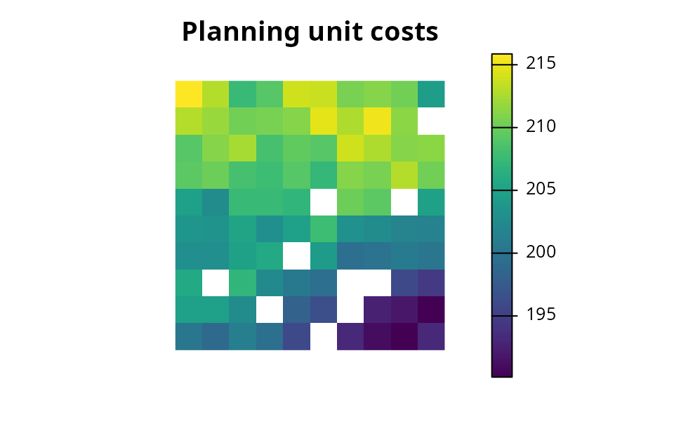
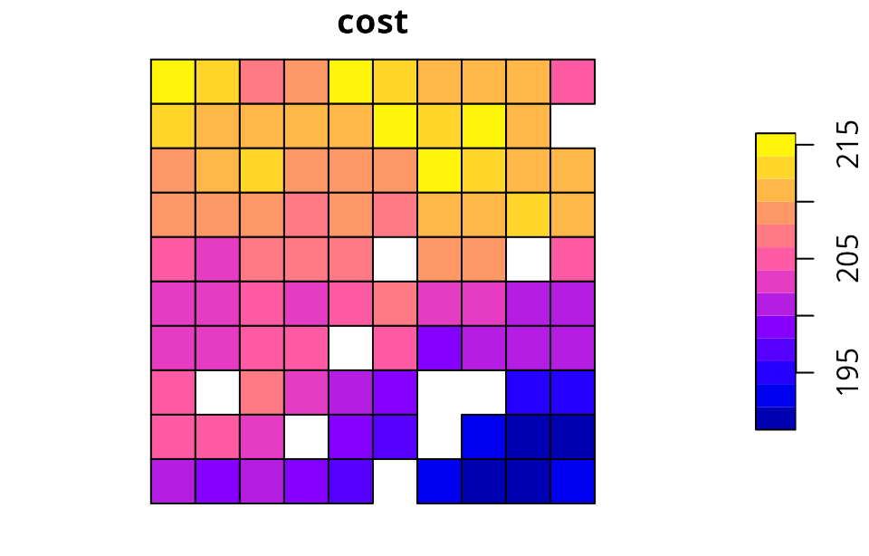
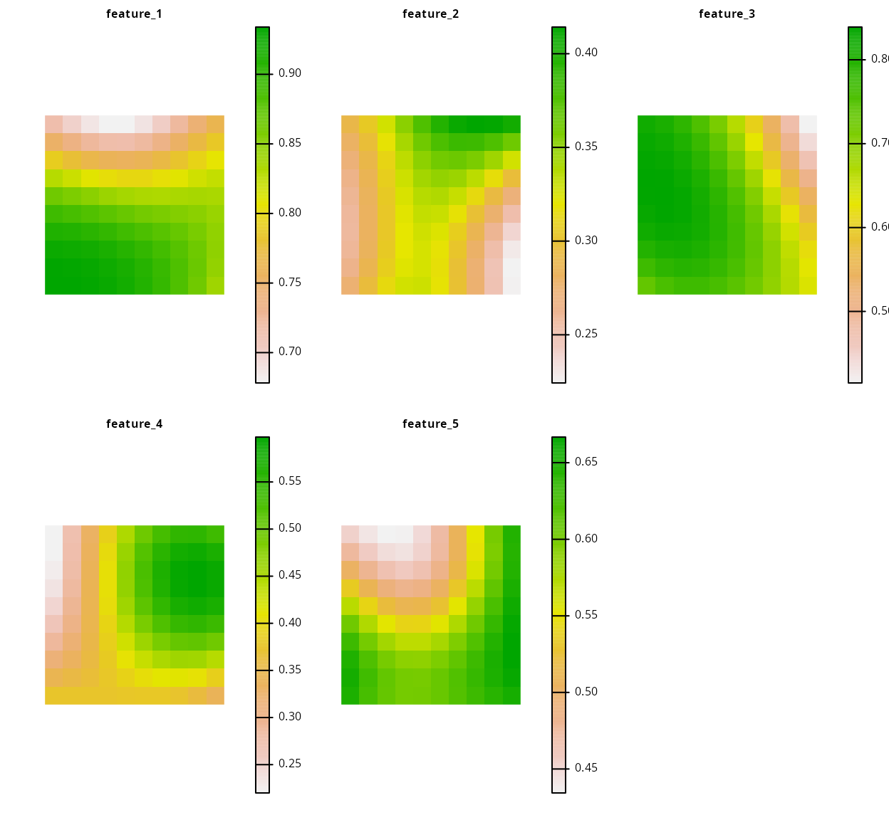
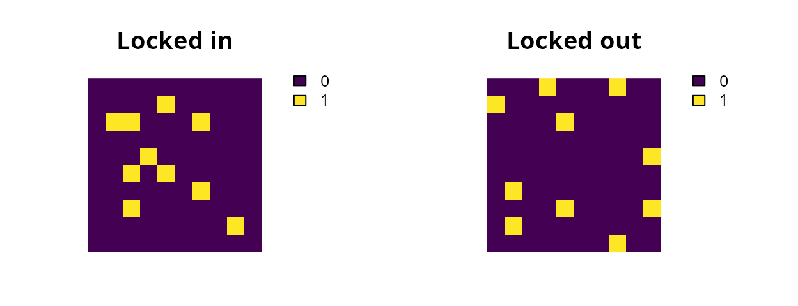
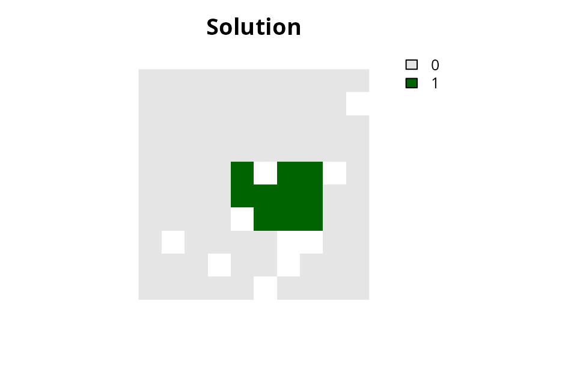
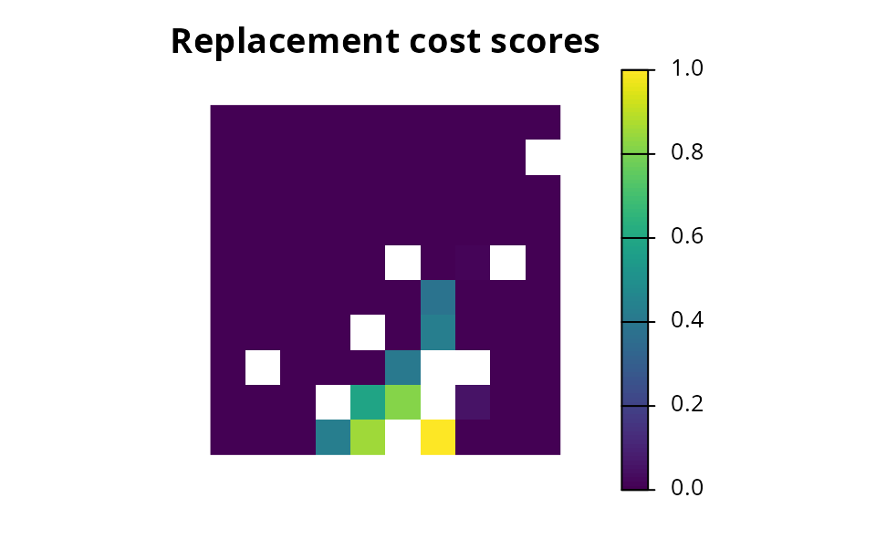
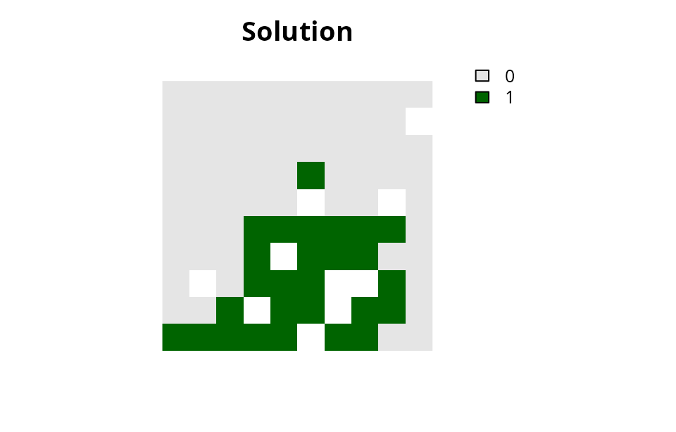
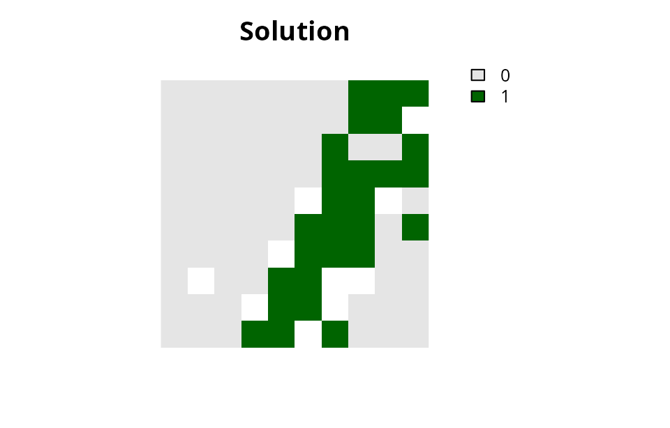
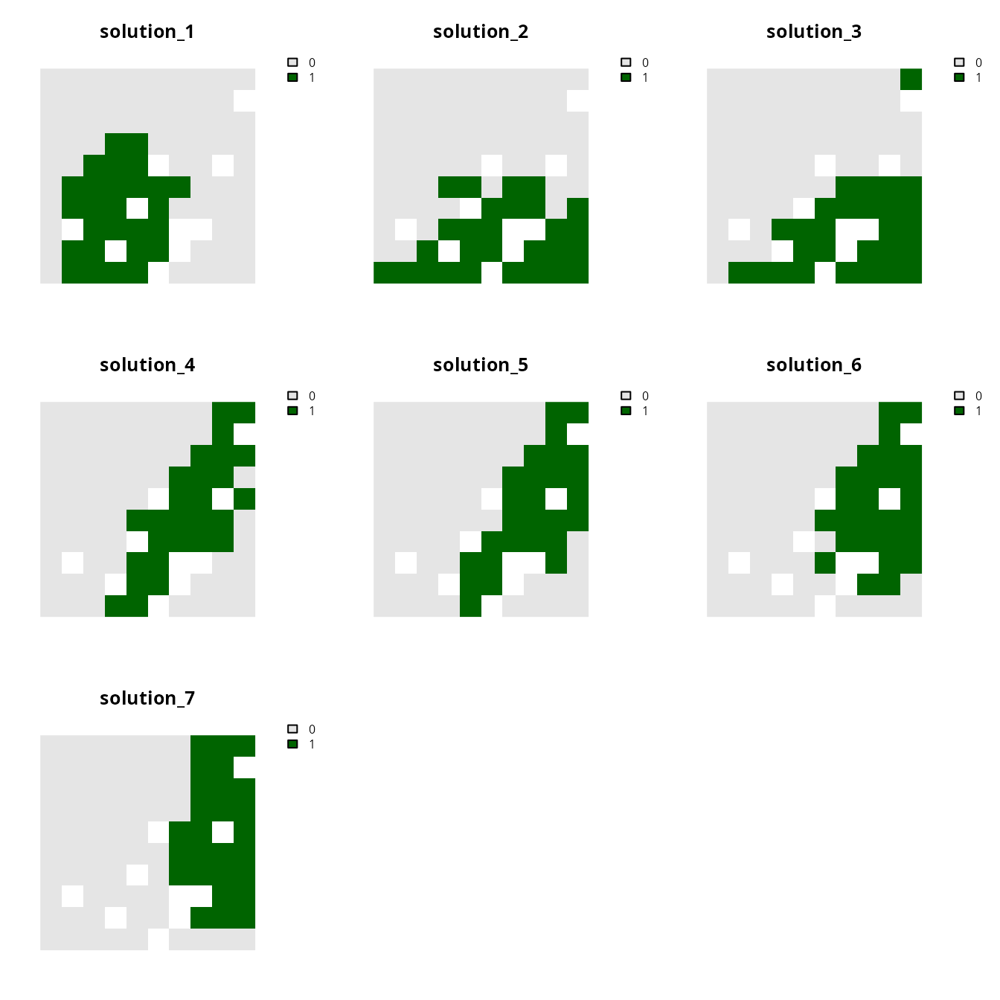

# Package overview

## Summary

The *prioritizr R* package uses mixed integer linear programming (MILP)
techniques to provide a flexible interface for building and solving
conservation planning problems (Rodrigues *et al.* 2000; Billionnet
2013). It supports a broad range of objectives, constraints, and
penalties that can be used to custom-tailor conservation planning
problems to the specific needs of a conservation planning exercise. Once
built, conservation planning problems can be solved using a variety of
commercial and open-source exact algorithm solvers. In contrast to the
algorithms conventionally used to solve conservation problems, such as
heuristics or simulated annealing (Ball *et al.* 2009), the exact
algorithms used here are guaranteed to find optimal solutions.
Furthermore, conservation problems can be constructed to optimize the
spatial allocation of different management zones (or actions), meaning
that conservation practitioners can identify solutions that benefit
multiple stakeholders. Finally, this package has the functionality to
read input data formatted for the *Marxan* conservation planning program
(Ball *et al.* 2009), and find much cheaper solutions in a much shorter
period of time than *Marxan* (Beyer *et al.* 2016).

## Introduction

Systematic conservation planning is a rigorous, repeatable, and
structured approach to designing new protected areas that efficiently
meet conservation objectives (Margules & Pressey 2000). Historically,
conservation decision-making has often evaluated parcels
opportunistically as they became available for purchase, donation, or
under threat. Although purchasing such areas may improve the *status
quo*, such decisions may not substantially enhance the long-term
persistence of target species or communities. Faced with this
realization, conservation planners began using decision support tools to
help simulate alternative reserve designs over a range of different
biodiversity and management goals and, ultimately, guide protected area
acquisitions and management actions. Due to the systematic,
evidence-based nature of these tools, conservation prioritization can
help contribute to a transparent, inclusive, and more defensible
decision making process.

A conservation planning exercise typically starts by defining a study
area. This study area should encompass all the areas relevant to the
decision maker or the hypothesis being tested. The extent of a study
area could encompass a few important localities (e.g., Stigner *et al.*
2016), a single state (e.g., Kirkpatrick 1983), an entire country
(Fuller *et al.* 2010), or the entire planet (Butchart *et al.* 2015).
Next, the study area is divided into a set of discrete areas termed
*planning units*. Each planning unit represents a discrete locality in
the study area that can be managed independently of other areas. The
general idea is that some combination of the planning units can be
selected for conservation actions (e.g., protected area establishment,
habitat restoration). Planning units are often created as square or
hexagon cells that are sized according to the scale of the conservation
actions, and the resolution of the data that underpin the planning
exercise (but see Klein *et al.* 2009).

Cost data (or a surrogate thereof) are needed to inform the
prioritization process. Specifically, these cost data describe the
relative expenditure associated with managing each planning unit for
conservation. For example, if the goal of the conservation planning
exercise is to identify priority areas for expanding a local protected
area system, then the cost data could represent the physical cost of
purchasing the land. Alternatively, if such data are not available, then
surrogate data are often used instead (e.g., human population density,
opportunity cost of foregone commercial activities, or planning unit
size).

Conservation planning exercises also require data on the biodiversity
elements that are of conservation interest (termed *conservation
features*). These features could be species (e.g., *Neofelis nebulosa*,
the Clouded Leopard), populations, or habitats (e.g., mangroves or cloud
forest). After identifying the set of relevant conservation features for
a conservation planning exercise, spatially explicit data need to be
obtained for each and every feature to describe their spatial
distribution (e.g., habitat suitability data, probability of occurrence
data, presence/absence data). This is important to ensure that
conservation features are adequately covered (represented) by
prioritizations. After assembling all the data, the next step is to
define the conservation planning problem.

The *prioritizr R* package is designed to help you build and solve
conservation planning problems. Specifically, prioritizations are
generated by formulating a mathematical optimization problem and then
solving it to generate a solution. These mathematical optimization
problems are formulated using the planning unit data, cost data, and
feature data, and with information related to the overarching aim of the
prioritization process. In general, the goal of an optimization problem
is to minimize (or maximize) an *objective function* that is calculated
using a set of *decision variables*, subject to a series of constraints
to ensure that solution exhibits specific properties. The objective
function describes the quantity which we are trying to minimize (e.g.,
cost of the solution) or maximize (e.g., number of features conserved).
The decision variables describe the entities that we can control, and
indicate which planning units are selected for conservation management
and which are not. The constraints can be thought of as rules that the
decision variables need to follow. For example, a commonly used
constraint is specifying that the solution must not exceed a certain
budget.

A wide variety of approaches have been developed for solving
optimization problems. Reserve design problems are frequently solved
using simulated annealing (Kirkpatrick *et al.* 1983) or heuristics
(Nicholls & Margules 1993; Moilanen 2007). These methods are
conceptually simple and can be applied to a wide variety of optimization
problems. However, they do not scale well for large or complex problems
(Beyer *et al.* 2016). Additionally, these methods cannot tell you how
close any given solution is to the optimal solution. The *prioritizr*
package uses exact algorithms to efficiently solve conservation planning
problems to within a pre-specified optimality gap. In other words, you
can specify that you need the optimal solution (i.e., a gap of 0%) and
the algorithms will, given enough time, find a solution that meets this
criteria. In the past, exact algorithms have been too slow for
conservation planning exercises (Pressey *et al.* 1996). However,
improvements over the last decade mean that they are now much faster
(Achterberg & Wunderling 2013; Beyer *et al.* 2016).

In this package, optimization problems are expressed using *integer
linear programming* (ILP) so that they can be solved using (linear)
exact algorithm solvers. The general form of an integer programming
problem can be expressed in matrix notation using the following
equation.

\text{Minimize} \space \boldsymbol{c}^\text{T} \boldsymbol{x} \space
\space \text{subject to} \space A\boldsymbol{x} \space \Box \space
\boldsymbol{b}

Where x is a vector of decision variables, c and b are vectors of known
coefficients, and A is the constraint matrix. The final term specifies a
series of structural constants and the \Box symbol is used to indicate
that the relational operators for the constraints can be either \geq, =,
or \leq. In the context of a conservation planning problem, c could be
used to represent the planning unit costs, A could be used to store the
data showing the presence / absence (or amount) of each feature in each
planning unit, b could be used to represent minimum amount of habitat
required for each species in the solution, the \Box could be set to \geq
symbols to indicate that the total amount of each feature in the
solution must exceed the quantities in b. But there are many other ways
of formulating the reserve selection problem (Rodrigues *et al.* 2000).

## A grammar for conservation planning

The *prioritizr R* package uses a grammar to describe elements of
conservation planning. This means that functions are organized into
verbs that relate to specific concepts. For example, all of the
functions used to specify the primary objective for optimization end
with the `_objective` suffix (e.g.,
[`add_min_set_objective()`](https://prioritizr.net/reference/add_min_set_objective.md)
and
[`add_min_shortfall_objective()`](https://prioritizr.net/reference/add_min_shortfall_objective.md)).
By combining multiple functions together, they can be used to formulate
a complete conservation planning problem. Specifically, the verbs for
formulating problems are described below.

- Create a new conservation planning
  [problem](https://prioritizr.net/reference/problem.html) by specifying
  the planning units, features, and management zones of conservation
  interest.
- Add a primary
  [objective](https://prioritizr.net/reference/objectives.html) to a
  conservation planning problem (e.g., minimize overall cost).
- Add [penalties](https://prioritizr.net/reference/penalties.html) to a
  conservation planning problem to penalize solutions according to
  specific metric (e.g., connectivity).
- Add [targets](https://prioritizr.net/reference/targets.html) to a
  conservation planning problem to specify how much of each feature
  should ideally be represented by solutions.
- Add [constraints](https://prioritizr.net/reference/constraints.html)
  to a conservation planning problem to ensure that solutions exhibit
  specific properties (e.g., select specific planning units for
  protection).
- Add [decisions](https://prioritizr.net/reference/decisions.html) to a
  conservation planning problem to specify the nature of the decisions
  in the problem (e.g., binary decisions indicate the planning units
  should be selected or not selected for management).
- Add a [portfolio](https://prioritizr.net/reference/portfolios.html) to
  a conservation planning problem to specify a methodological approach
  for generating multiple solutions (e.g., generate multiple solutions
  by finding 100 solutions within 10% of optimality).
- Add a [solver](https://prioritizr.net/reference/solvers.html) to a
  conservation problem to specify the optimization software (e.g.,
  Gurobi) for generating solutions and customize the optimization
  settings (e.g., generate an optimal solution).

After building a conservation planning problem, it can be solved to
generate a prioritization (using the
[`solve()`](https://prioritizr.net/reference/solve.md) function). There
are also verbs available to help evaluate and interpret solutions. These
verbs are described below.

- Evaluate performance by computing [summary
  statistics](https://prioritizr.net/reference/summaries.html) (e.g.,
  overall cost, feature representation, or total boundary length).
- Evaluate the relative
  [importance](https://prioritizr.net/reference/importance.html) of
  planning units selected by a solution (e.g., based on
  irreplaceability).

## Workflow

The general workflow when using the *prioritizr R* package starts with
creating a new conservation planning
[`problem()`](https://prioritizr.net/reference/problem.md) object using
data. Specifically, the
[`problem()`](https://prioritizr.net/reference/problem.md) object should
be constructed using data that specify the planning units, biodiversity
features, management zones (if applicable), and costs. After creating a
new [`problem()`](https://prioritizr.net/reference/problem.md) object,
it can be customized—by adding objectives, penalties, constraints, and
other information—to build a precise representation of the conservation
planning problem required, and then solved to obtain a solution.

All conservation planning problems require an objective. An objective
specifies the property which is used to compare different feasible
solutions. Simply put, the objective is the property of the solution
which should be maximized or minimized during the optimization process.
For instance, with the minimum set objective (specified using
[`add_min_set_objective()`](https://prioritizr.net/reference/add_min_set_objective.md)),
we are seeking to minimize the cost of the solution (similar to
*Marxan*). On the other hand, with the minimum shortfall objective
(specified using
[`add_min_shortfall_objective()`](https://prioritizr.net/reference/add_min_shortfall_objective.md)),
we are seeking to minimize the average target shortfall for all features
represented in the solution, subject to a budget.

Many objectives require representation targets (e.g., the minimum set
objective). These targets are a specialized set of constraints that
relate to the total quantity of each feature secured in the solution
(e.g., amount of suitable habitat or number of individuals). In the case
of the minimum set objective
([`add_min_set_objective()`](https://prioritizr.net/reference/add_min_set_objective.md)),
targets are used to ensure that solutions must secure a sufficient
quantity of each and every feature. In budget-limited objectives (e.g.,
the minimum shortfall objective;
[`add_min_shortfall_objective()`](https://prioritizr.net/reference/add_min_shortfall_objective.md)),
candidate solutions do not have to all meet targets and targets are
instead used to specify trade-offs for representing different features.
Targets can be expressed numerically as the total amount required for a
given feature (using
[`add_absolute_targets()`](https://prioritizr.net/reference/add_absolute_targets.md)),
or as a proportion of the total amount found in the planning units
(using
[`add_relative_targets()`](https://prioritizr.net/reference/add_relative_targets.md)).
Note that not all objectives require targets, and a warning will be
thrown if an attempt is made to add targets to a problem with an
objective that does not use them.

Constraints and penalties can be added to a conservation planning
problem to ensure that solutions exhibit a specific property or penalize
solutions which don’t exhibit a specific property (respectively). The
difference between constraints and penalties, strictly speaking, is
constraints are used to rule out potential solutions that don’t exhibit
a specific property. For instance, constraints can be used to ensure
that specific planning units are selected in the solution for
prioritization (using
[`add_locked_in_constraints()`](https://prioritizr.net/reference/add_locked_in_constraints.md))
or not selected in the solution for prioritization (using
[`add_locked_out_constraints()`](https://prioritizr.net/reference/add_locked_out_constraints.md)).
On the other hand, penalties are combined with the objective of a
problem, with a penalty factor, and the overall objective of the problem
then becomes to minimize (or maximize) the primary objective function
and the penalty function. For example, penalties can be added to a
problem to penalize solutions that are excessively fragmented (using
[`add_boundary_penalties()`](https://prioritizr.net/reference/add_boundary_penalties.md)).
These penalties have a `penalty` argument that specifies the relative
importance of having spatially clustered solutions. When the argument to
`penalty` is high, then solutions which are less fragmented are valued
more highly – even if they cost more – and when the argument to
`penalty` is low, then the solutions which are more fragmented are
valued less highly.

After building a conservation problem, it can then be solved to obtain a
solution (or portfolio of solutions if desired). The solution is
returned in the same format as the planning unit data used to construct
the problem. For instance, this means that if raster data was used to
initialize the problem, then the solution will also be output in raster
format. This can be very helpful when it comes to interpreting and
visualizing solutions because it means that the solution data does not
first have to be merged with spatial data before they can be plotted on
a map.

## Usage

Here we will provide an introduction to using the *prioritizr R* package
to build and solve a conservation planning problem. Please note that we
will not discuss conservation planning with multiple zones in this
vignette, for more information on working with multiple management zones
please see the [*Management zones
tutorial*](https://prioritizr.net/articles/management_zones_tutorial.md).

First, we will load the *prioritizr* package.

``` r
# load package
library(prioritizr)
```

### Data

Now we will load some built-in data sets that are distributed with the
*prioritizr R* package. This package contains several different planning
unit data sets. To provide a comprehensive overview of the different
ways that we can initialize a conservation planning problem, we will
load each of them.

First, we will load the raster planning unit data (`sim_pu_raster`).
Here, the planning units are represented as a single-layer raster object
(i.e., a
[`terra::rast()`](https://rspatial.github.io/terra/reference/rast.html)
object) and each pixel corresponds to the spatial extent of each panning
unit. The pixel values correspond to the acquisition costs of each
planning unit.

``` r
# load raster planning unit data
sim_pu_raster <- get_sim_pu_raster()

# print data
print(sim_pu_raster)
```

    ## class       : SpatRaster
    ## size        : 10, 10, 1  (nrow, ncol, nlyr)
    ## resolution  : 0.1, 0.1  (x, y)
    ## extent      : 0, 1, 0, 1  (xmin, xmax, ymin, ymax)
    ## coord. ref. : WGS 84 / Pseudo-Mercator (EPSG:3857)
    ## source      : sim_pu_raster.tif
    ## name        :      layer
    ## min value   : 190.132751
    ## max value   : 215.863846

``` r
# plot data
plot(
  sim_pu_raster, main = "Planning unit costs",
  xlim = c(-0.1, 1.1), ylim = c(-0.1, 1.1), axes = FALSE
)
```



Secondly, we will load one of the spatial vector planning unit data sets
(`sim_pu_polygons`). Here, each polygon (i.e., feature using ArcGIS
terminology) corresponds to a different planning unit. This data set has
an attribute table that contains additional information about each
polygon. Namely, the `cost` field (column) in the attribute table
contains the acquisition cost for each planning unit.

``` r
# load polygon planning unit data
sim_pu_polygons <- get_sim_pu_polygons()

# print data
print(sim_pu_polygons)
```

    ## Simple feature collection with 90 features and 3 fields
    ## Geometry type: POLYGON
    ## Dimension:     XY
    ## Bounding box:  xmin: 0 ymin: 0 xmax: 1 ymax: 1
    ## Projected CRS: WGS 84 / Pseudo-Mercator
    ## # A tibble: 90 × 4
    ##     cost locked_in locked_out                                      geom
    ##  * <dbl> <lgl>     <lgl>                                  <POLYGON [m]>
    ##  1  216. FALSE     FALSE            ((0 1, 0.1 1, 0.1 0.9, 0 0.9, 0 1))
    ##  2  213. FALSE     FALSE      ((0.1 1, 0.2 1, 0.2 0.9, 0.1 0.9, 0.1 1))
    ##  3  207. FALSE     FALSE      ((0.2 1, 0.3 1, 0.3 0.9, 0.2 0.9, 0.2 1))
    ##  4  209. FALSE     TRUE       ((0.3 1, 0.4 1, 0.4 0.9, 0.3 0.9, 0.3 1))
    ##  5  214. FALSE     FALSE      ((0.4 1, 0.5 1, 0.5 0.9, 0.4 0.9, 0.4 1))
    ##  6  214. FALSE     FALSE      ((0.5 1, 0.6 1, 0.6 0.9, 0.5 0.9, 0.5 1))
    ##  7  210. FALSE     FALSE      ((0.6 1, 0.7 1, 0.7 0.9, 0.6 0.9, 0.6 1))
    ##  8  211. FALSE     TRUE       ((0.7 1, 0.8 1, 0.8 0.9, 0.7 0.9, 0.7 1))
    ##  9  210. FALSE     FALSE      ((0.8 1, 0.9 1, 0.9 0.9, 0.8 0.9, 0.8 1))
    ## 10  204. FALSE     FALSE          ((0.9 1, 1 1, 1 0.9, 0.9 0.9, 0.9 1))
    ## # ℹ 80 more rows

``` r
# plot the planning units, and color them according to cost values
plot(sim_pu_polygons[, "cost"])
```



Thirdly, we will load some planning unit data stored in tabular format
(i.e., `data.frame` format). For those familiar with *Marxan* or dealing
with very large conservation planning problems (\> 10 million planning
units), it may be useful to work with data in this format because it
does not contain any spatial information which will reduce computational
burden. When using tabular data to initialize conservation planning
problems, the data must follow the conventions used by *Marxan*.
Specifically, each row in the planning unit table must correspond to a
different planning unit. The table must also have an “id” column to
provide a unique integer identifier for each planning unit, and it must
also have a column that indicates the cost of each planning unit. For
more information, please see the [official *Marxan*
documentation](https://marxansolutions.org/).

``` r
# specify file path for planning unit data
pu_path <- system.file("extdata/marxan/input/pu.dat", package = "prioritizr")

# load in the tabular planning unit data
pu_dat <- vroom::vroom(pu_path)
```

    ## Rows: 1751 Columns: 5
    ## ── Column specification ────────────────────────────────────────────────────────
    ## Delimiter: ","
    ## dbl (5): id, cost, status, xloc, yloc
    ## 
    ## ℹ Use `spec()` to retrieve the full column specification for this data.
    ## ℹ Specify the column types or set `show_col_types = FALSE` to quiet this message.

``` r
# preview first six rows of the tabular planning unit data
# note that it has some extra columns other than id and cost as per the
# Marxan format
head(pu_dat)
```

    ## # A tibble: 6 × 5
    ##      id    cost status     xloc      yloc
    ##   <dbl>   <dbl>  <dbl>    <dbl>     <dbl>
    ## 1     3      0       0 1116623. -4493479.
    ## 2    30   7527.      3 1110623. -4496943.
    ## 3    56  37349.      0 1092623. -4500408.
    ## 4    58  16959.      0 1116623. -4500408.
    ## 5    84  34220.      0 1098623. -4503872.
    ## 6    85 178908.      0 1110623. -4503872.

Finally, we will load data showing the spatial distribution of the
conservation features. Our conservation features (`sim_features`) are
represented as a multi-layer raster object (i.e., a
[`terra::rast()`](https://rspatial.github.io/terra/reference/rast.html)
object), where each layer corresponds to a different feature. The pixel
values in each layer correspond to the amount of suitable habitat
available in a given planning unit. Note that our planning unit and our
feature data have exactly the same spatial properties (i.e., resolution,
extent, coordinate reference system) so their pixels line up perfectly.

``` r
# load feature data
sim_features <- get_sim_features()

# plot the distribution of suitable habitat for each feature
plot(
  sim_features, nr = 2,
  axes = FALSE, xlim = c(-0.1, 1.1), ylim = c(-0.1, 1.1)
)
```



### Initialize a problem

After having loaded our planning unit and feature data, we will now try
initializing some conservation planning problems. There are a lot of
different ways to initialize a conservation planning problem, so here we
will just showcase a few of the more commonly used methods. For an
exhaustive description of all the ways you can initialize a conservation
problem, see the help file for the
[`problem()`](https://prioritizr.net/reference/problem.md) function.
First off, we will initialize a conservation planning problem using the
raster data.

``` r
# create problem
p1 <- problem(sim_pu_raster, sim_features)

# print problem
print(p1)
```

    ## A conservation problem (<ConservationProblem>)
    ## ├•data
    ## │├•features:    "feature_1", "feature_2", "feature_3", … (5 total)
    ## │└•planning units:
    ## │ ├•data:       <SpatRaster> (90 total)
    ## │ ├•costs:      continuous values (between 190.1328 and 215.8638)
    ## │ ├•extent:     0, 0, 1, 1 (xmin, ymin, xmax, ymax)
    ## │ └•CRS:        WGS 84 / Pseudo-Mercator (projected)
    ## ├•formulation
    ## │├•objective:   none specified
    ## │├•penalties:   none specified
    ## │├•features:
    ## ││├•targets:    none specified
    ## ││└•weights:    none specified
    ## │├•constraints: none specified
    ## │└•decisions:   binary decision
    ## └•optimization
    ##  ├•portfolio:   single portfolio
    ##  └•solver:      gurobi solver (`gap` = 0.1, `time_limit` = 2147483647, …)
    ## # ℹ Use `summary(...)` to see further details.

``` r
# print number of planning units
number_of_planning_units(p1)
```

    ## [1] 90

``` r
# print number of features
number_of_features(p1)
```

    ## [1] 5

Generally, we recommend initializing problems using raster data where
possible. This is because the
[`problem()`](https://prioritizr.net/reference/problem.md) function
needs to calculate the amount of each feature in each planning unit, and
by providing both the planning unit and feature data in raster format
with the same spatial resolution, extents, and coordinate systems, this
means that the
[`problem()`](https://prioritizr.net/reference/problem.md) function does
not need to do any geoprocessing behind the scenes. But sometimes we
can’t use raster planning unit data, because our planning units aren’t
equal-sized grid cells. So, below is an example showing how we can
initialize a conservation planning problem using planning units that are
formatted as spatial vector data. Note that we could reduce run-time by
pre-computing the amount of each feature in each planning unit and
storing the data in the attribute table (e.g., by performing zonal
statistics with *R* or *ESRI ArcGIS*), and then passing in the names of
the columns as an argument to the
[`problem()`](https://prioritizr.net/reference/problem.md) function (see
Examples section for
[`problem()`](https://prioritizr.net/reference/problem.md) for details).

``` r
# create problem with spatial vector data
# note that we have to specify which column in the attribute table contains
# the cost data
p2 <- problem(sim_pu_polygons, sim_features, cost_column = "cost")

# print problem
print(p2)
```

    ## A conservation problem (<ConservationProblem>)
    ## ├•data
    ## │├•features:    "feature_1", "feature_2", "feature_3", … (5 total)
    ## │└•planning units:
    ## │ ├•data:       <sf> (90 total)
    ## │ ├•costs:      continuous values (between 190.1328 and 215.8638)
    ## │ ├•extent:     0, 0, 1, 1 (xmin, ymin, xmax, ymax)
    ## │ └•CRS:        WGS 84 / Pseudo-Mercator (projected)
    ## ├•formulation
    ## │├•objective:   none specified
    ## │├•penalties:   none specified
    ## │├•features:
    ## ││├•targets:    none specified
    ## ││└•weights:    none specified
    ## │├•constraints: none specified
    ## │└•decisions:   binary decision
    ## └•optimization
    ##  ├•portfolio:   single portfolio
    ##  └•solver:      gurobi solver (`gap` = 0.1, `time_limit` = 2147483647, …)
    ## # ℹ Use `summary(...)` to see further details.

We can also initialize a conservation planning problem using tabular
planning unit data (i.e., `data.frame` format). Since the tabular
planning unit data does not contain any spatial information, we also
have to provide the feature data in tabular format (i.e., `data.frame`
format) and data showing the amount of each feature in each planning
unit in tabular format (i.e., `data.frame` format). The feature data
must have an “id” column containing a unique integer identifier for each
feature, and the planning unit by feature data must contain the
following three columns: `pu` corresponding to the planning unit
identifiers, `species` corresponding to the feature identifiers, and
`amount` showing the amount of a given feature in a given planning unit.

``` r
# set file path for feature data
spec_path <- system.file(
  "extdata/marxan/input/spec.dat", package = "prioritizr"
)

# load in feature data
spec_dat <- vroom::vroom(spec_path)
```

    ## Rows: 17 Columns: 4
    ## ── Column specification ────────────────────────────────────────────────────────
    ## Delimiter: ","
    ## chr (1): name
    ## dbl (3): id, prop, spf
    ## 
    ## ℹ Use `spec()` to retrieve the full column specification for this data.
    ## ℹ Specify the column types or set `show_col_types = FALSE` to quiet this message.

``` r
# print first six rows of the data
# note that it contains extra columns
head(spec_dat)
```

    ## # A tibble: 6 × 4
    ##      id  prop   spf name  
    ##   <dbl> <dbl> <dbl> <chr> 
    ## 1    10   0.3     1 bird1 
    ## 2    11   0.3     1 nvis2 
    ## 3    12   0.3     1 nvis8 
    ## 4    13   0.3     1 nvis9 
    ## 5    14   0.3     1 nvis14
    ## 6    15   0.3     1 nvis20

``` r
# set file path for planning unit vs. feature data
puvspr_path <- system.file(
  "extdata/marxan/input/puvspr.dat", package = "prioritizr"
)

# load in planning unit vs feature data
puvspr_dat <- vroom::vroom(puvspr_path)
```

    ## Rows: 4662 Columns: 3
    ## ── Column specification ────────────────────────────────────────────────────────
    ## Delimiter: ","
    ## dbl (3): species, pu, amount
    ## 
    ## ℹ Use `spec()` to retrieve the full column specification for this data.
    ## ℹ Specify the column types or set `show_col_types = FALSE` to quiet this message.

``` r
# print first six rows of the data
head(puvspr_dat)
```

    ## # A tibble: 6 × 3
    ##   species    pu amount
    ##     <dbl> <dbl>  <dbl>
    ## 1      26    56 120.  
    ## 2      26    58  45.2 
    ## 3      26    84  68.0 
    ## 4      26    85   9.74
    ## 5      26    86   7.80
    ## 6      26   111 478.

``` r
# create problem
p3 <- problem(pu_dat, spec_dat, cost_column = "cost", rij = puvspr_dat)

# print problem
print(p3)
```

    ## A conservation problem (<ConservationProblem>)
    ## ├•data
    ## │├•features:    "bird1", "nvis2", "nvis8", "nvis9", … (17 total)
    ## │└•planning units:
    ## │ ├•data:       <spec_tbl_df> (1751 total)
    ## │ ├•costs:      continuous values (between 0 and 415692.2)
    ## │ ├•extent:     NA
    ## │ └•CRS:        NA
    ## ├•formulation
    ## │├•objective:   none specified
    ## │├•penalties:   none specified
    ## │├•features:
    ## ││├•targets:    none specified
    ## ││└•weights:    none specified
    ## │├•constraints: none specified
    ## │└•decisions:   binary decision
    ## └•optimization
    ##  ├•portfolio:   single portfolio
    ##  └•solver:      gurobi solver (`gap` = 0.1, `time_limit` = 2147483647, …)
    ## # ℹ Use `summary(...)` to see further details.

For more information on initializing problems, please see the help page
for the [`problem()`](https://prioritizr.net/reference/problem.md)
function (which you can open by entering the code:
[`?problem`](https://prioritizr.net/reference/problem.md)). Now that we
have initialized a conservation planning problem, we will show you how
you can customize it to suit the exact needs of your conservation
planning scenario. Although we initialized the conservation planning
problems using several different methods, moving forward, we will only
use raster-based planning unit data to keep things simple.

### Add an objective

The next step is to add a primary objective to the problem. A problem
objective is used to specify the primary goal of the problem (i.e., the
quantity that is to be maximized or minimized). All conservation
planning problems involve minimizing or maximizing some kind of
objective. For instance, we might require a solution that conserves
enough habitat for each species while minimizing the overall cost of the
reserve network. Alternatively, we might require a solution that
maximizes the number of conserved species while ensuring that the cost
of the reserve network does not exceed the budget. Please note that
objectives are added in the same way regardless of the type of data used
to initialize the problem. The following objectives are available.

- **Minimum set objective**: Minimize the cost of the solution whilst
  ensuring that all targets are met (Rodrigues *et al.* 2000). This
  objective is similar to that used in *Marxan* (Ball *et al.* 2009).
  For example, we can add a minimum set objective to a problem using the
  following code.

``` r
# create a new problem that has the minimum set objective
p3 <-
  problem(sim_pu_raster, sim_features) %>%
  add_min_set_objective()

# print problem
print(p3)
```

    ## A conservation problem (<ConservationProblem>)
    ## ├•data
    ## │├•features:    "feature_1", "feature_2", "feature_3", … (5 total)
    ## │└•planning units:
    ## │ ├•data:       <SpatRaster> (90 total)
    ## │ ├•costs:      continuous values (between 190.1328 and 215.8638)
    ## │ ├•extent:     0, 0, 1, 1 (xmin, ymin, xmax, ymax)
    ## │ └•CRS:        WGS 84 / Pseudo-Mercator (projected)
    ## ├•formulation
    ## │├•objective:   minimum set objective
    ## │├•penalties:   none specified
    ## │├•features:
    ## ││├•targets:    none specified
    ## ││└•weights:    none specified
    ## │├•constraints: none specified
    ## │└•decisions:   binary decision
    ## └•optimization
    ##  ├•portfolio:   single portfolio
    ##  └•solver:      gurobi solver (`gap` = 0.1, `time_limit` = 2147483647, …)
    ## # ℹ Use `summary(...)` to see further details.

- **Maximum cover objective**: Represent at least one instance of as
  many features as possible within a given budget (Church *et al.*
  1996).

``` r
# create a new problem that has the maximum coverage objective and a budget
# of 5000
p4 <-
  problem(sim_pu_raster, sim_features) %>%
  add_max_cover_objective(5000)

# print problem
print(p4)
```

    ## A conservation problem (<ConservationProblem>)
    ## ├•data
    ## │├•features:    "feature_1", "feature_2", "feature_3", … (5 total)
    ## │└•planning units:
    ## │ ├•data:       <SpatRaster> (90 total)
    ## │ ├•costs:      continuous values (between 190.1328 and 215.8638)
    ## │ ├•extent:     0, 0, 1, 1 (xmin, ymin, xmax, ymax)
    ## │ └•CRS:        WGS 84 / Pseudo-Mercator (projected)
    ## ├•formulation
    ## │├•objective:   maximum coverage objective (`budget` = 5000)
    ## │├•penalties:   none specified
    ## │├•features:
    ## ││├•targets:    none specified
    ## ││└•weights:    none specified
    ## │├•constraints: none specified
    ## │└•decisions:   binary decision
    ## └•optimization
    ##  ├•portfolio:   single portfolio
    ##  └•solver:      gurobi solver (`gap` = 0.1, `time_limit` = 2147483647, …)
    ## # ℹ Use `summary(...)` to see further details.

- **Maximum number of targets met objective**: Fulfill as many targets
  as possible while ensuring that the cost of the solution does not
  exceed a budget (inspired by Cabeza & Moilanen 2001). Note that this
  objective does not value the partial fulfillment of targets. This
  objective is similar to the maximum cover objective except that we
  have the option of later specifying targets for each feature. In
  practice, this objective is more useful than the maximum cover
  objective because features often require a certain amount of area for
  them to persist and simply capturing a single instance of habitat for
  each feature is generally unlikely to enhance their long-term
  persistence.

``` r
# create a new problem that has the maximum number of targets met objective and
# a budget of 5000
p5 <-
  problem(sim_pu_raster, sim_features) %>%
  add_max_n_targets_met_objective(budget = 5000)

# print problem
print(p5)
```

    ## A conservation problem (<ConservationProblem>)
    ## ├•data
    ## │├•features:    "feature_1", "feature_2", "feature_3", … (5 total)
    ## │└•planning units:
    ## │ ├•data:       <SpatRaster> (90 total)
    ## │ ├•costs:      continuous values (between 190.1328 and 215.8638)
    ## │ ├•extent:     0, 0, 1, 1 (xmin, ymin, xmax, ymax)
    ## │ └•CRS:        WGS 84 / Pseudo-Mercator (projected)
    ## ├•formulation
    ## │├•objective:   maximum number targets met objective (`budget` = 5000)
    ## │├•penalties:   none specified
    ## │├•features:
    ## ││├•targets:    none specified
    ## ││└•weights:    none specified
    ## │├•constraints: none specified
    ## │└•decisions:   binary decision
    ## └•optimization
    ##  ├•portfolio:   single portfolio
    ##  └•solver:      gurobi solver (`gap` = 0.1, `time_limit` = 2147483647, …)
    ## # ℹ Use `summary(...)` to see further details.

- **Minimum shortfall objective**: Minimize the overall (weighted sum)
  shortfall for as many targets as possible while ensuring that the cost
  of the solution does not exceed a budget. In general, we recommend
  using this objective for budget-limited planning exercises. Although
  the maximum number of targets met objective
  ([`add_max_n_targets_met_objective()`](https://prioritizr.net/reference/add_max_n_targets_met_objective.md))
  will often produce solutions that have unspent (or left-over) funding,
  this objective does not have this limitation because it values the
  partial fulfillment of targets.

``` r
# create a new problem that has the minimum shortfall objective and a budget
# of 5000
p6 <-
  problem(sim_pu_raster, sim_features) %>%
  add_min_shortfall_objective(budget = 5000)

# print problem
print(p6)
```

    ## A conservation problem (<ConservationProblem>)
    ## ├•data
    ## │├•features:    "feature_1", "feature_2", "feature_3", … (5 total)
    ## │└•planning units:
    ## │ ├•data:       <SpatRaster> (90 total)
    ## │ ├•costs:      continuous values (between 190.1328 and 215.8638)
    ## │ ├•extent:     0, 0, 1, 1 (xmin, ymin, xmax, ymax)
    ## │ └•CRS:        WGS 84 / Pseudo-Mercator (projected)
    ## ├•formulation
    ## │├•objective:   minimum shortfall objective (`budget` = 5000)
    ## │├•penalties:   none specified
    ## │├•features:
    ## ││├•targets:    none specified
    ## ││└•weights:    none specified
    ## │├•constraints: none specified
    ## │└•decisions:   binary decision
    ## └•optimization
    ##  ├•portfolio:   single portfolio
    ##  └•solver:      gurobi solver (`gap` = 0.1, `time_limit` = 2147483647, …)
    ## # ℹ Use `summary(...)` to see further details.

- **Minimum largest shortfall objective**: Minimize the largest
  (maximum) shortfall while ensuring that the cost of the solution does
  not exceed a budget. In practice, this objective useful when the
  minimum shortfall objective returns solutions that focus too much on
  representing a small number of features (e.g., because they occur in
  much cheaper planning units), and solutions are needed to spread
  conservation effort out more evenly among all features—even if it
  means that all features will have (relatively) poor representation.

``` r
# create a new problem that has the minimum largest shortfall objective and a
# budget of 5000
p7 <-
  problem(sim_pu_raster, sim_features) %>%
  add_min_largest_shortfall_objective(budget = 5000)

# print problem
print(p7)
```

    ## A conservation problem (<ConservationProblem>)
    ## ├•data
    ## │├•features:    "feature_1", "feature_2", "feature_3", … (5 total)
    ## │└•planning units:
    ## │ ├•data:       <SpatRaster> (90 total)
    ## │ ├•costs:      continuous values (between 190.1328 and 215.8638)
    ## │ ├•extent:     0, 0, 1, 1 (xmin, ymin, xmax, ymax)
    ## │ └•CRS:        WGS 84 / Pseudo-Mercator (projected)
    ## ├•formulation
    ## │├•objective:   minimum largest shortfall objective (`budget` = 5000)
    ## │├•penalties:   none specified
    ## │├•features:
    ## ││├•targets:    none specified
    ## ││└•weights:    none specified
    ## │├•constraints: none specified
    ## │└•decisions:   binary decision
    ## └•optimization
    ##  ├•portfolio:   single portfolio
    ##  └•solver:      gurobi solver (`gap` = 0.1, `time_limit` = 2147483647, …)
    ## # ℹ Use `summary(...)` to see further details.

- **Maximum phylogenetic diversity objective**: Maximize the
  phylogenetic diversity of the features represented in the solution
  subject to a budget (inspired by Faith 1992; Rodrigues & Gaston 2002).
  This objective is similar to the maximum number of targets met
  objective (`add_max_n_targets_met()`) except that emphasis is placed
  on protecting features which are associated with a diverse range of
  evolutionary histories. The package contains a simulated phylogeny
  that can be used with the simulated feature data (`sim_phylogny`).

``` r
# load simulated phylogeny data
sim_phylogeny <- get_sim_phylogeny()

# create a new problem that has the maximum phylogenetic diversity
# objective and a budget of 5000
p8 <-
  problem(sim_pu_raster, sim_features) %>%
  add_max_phylo_div_objective(budget = 5000, tree = sim_phylogeny)

# print problem
print(p8)
```

    ## A conservation problem (<ConservationProblem>)
    ## ├•data
    ## │├•features:    "feature_1", "feature_2", "feature_3", … (5 total)
    ## │└•planning units:
    ## │ ├•data:       <SpatRaster> (90 total)
    ## │ ├•costs:      continuous values (between 190.1328 and 215.8638)
    ## │ ├•extent:     0, 0, 1, 1 (xmin, ymin, xmax, ymax)
    ## │ └•CRS:        WGS 84 / Pseudo-Mercator (projected)
    ## ├•formulation
    ## │├•objective:   phylogenetic diversity objective (`budget` = 5000, …)
    ## │├•penalties:   none specified
    ## │├•features:
    ## ││├•targets:    none specified
    ## ││└•weights:    none specified
    ## │├•constraints: none specified
    ## │└•decisions:   binary decision
    ## └•optimization
    ##  ├•portfolio:   single portfolio
    ##  └•solver:      gurobi solver (`gap` = 0.1, `time_limit` = 2147483647, …)
    ## # ℹ Use `summary(...)` to see further details.

- **Maximum phylogenetic endemism objective**: Maximize the phylogenetic
  endemism of the features represented in the solution subject to a
  budget (inspired by Faith 1992; Rodrigues & Gaston 2002; Rosauer *et
  al.* 2009). This objective is similar to the maximum phylogenetic
  diversity except that emphasis is placed on conserving features that
  are associated with geographically restricted periods of evolutionary
  history rather than a diverse range of evolutionary histories.

``` r
# load simulated phylogeny data
sim_phylogeny <- get_sim_phylogeny()

# create a new problem that has the maximum phylogenetic diversity
# objective and a budget of 5000
p9 <-
  problem(sim_pu_raster, sim_features) %>%
  add_max_phylo_end_objective(budget = 5000, tree = sim_phylogeny)

# print problem
print(p9)
```

    ## A conservation problem (<ConservationProblem>)
    ## ├•data
    ## │├•features:    "feature_1", "feature_2", "feature_3", … (5 total)
    ## │└•planning units:
    ## │ ├•data:       <SpatRaster> (90 total)
    ## │ ├•costs:      continuous values (between 190.1328 and 215.8638)
    ## │ ├•extent:     0, 0, 1, 1 (xmin, ymin, xmax, ymax)
    ## │ └•CRS:        WGS 84 / Pseudo-Mercator (projected)
    ## ├•formulation
    ## │├•objective:   phylogenetic endemism objective (`budget` = 5000, …)
    ## │├•penalties:   none specified
    ## │├•features:
    ## ││├•targets:    none specified
    ## ││└•weights:    none specified
    ## │├•constraints: none specified
    ## │└•decisions:   binary decision
    ## └•optimization
    ##  ├•portfolio:   single portfolio
    ##  └•solver:      gurobi solver (`gap` = 0.1, `time_limit` = 2147483647, …)
    ## # ℹ Use `summary(...)` to see further details.

- **Maximum weighted sum objective**: Maximize the weighted sum of the
  features represented by the solution as much as possible without
  exceeding a budget. This objective is functionally equivalent to
  selecting the planning units with the greatest amounts of each feature
  (e.g., weighted species richness). Generally, we don’t encourage the
  use of this objective because it will only rarely identify
  complementary solutions – solutions which adequately conserve a range
  of different features – except perhaps to explore trade-offs or
  provide a baseline solution with which to compare other solutions.

``` r
# create a new problem that has the maximum weighted sum objective and a budget
# of 5000
p10 <-
  problem(sim_pu_raster, sim_features) %>%
  add_max_wtd_sum_objective(budget = 5000)
```

    ## ℹ `add_max_wtd_sum_objective()` has severe limitations - use
    ## with caution.

``` r
# print problem
print(p10)
```

    ## A conservation problem (<ConservationProblem>)
    ## ├•data
    ## │├•features:    "feature_1", "feature_2", "feature_3", … (5 total)
    ## │└•planning units:
    ## │ ├•data:       <SpatRaster> (90 total)
    ## │ ├•costs:      continuous values (between 190.1328 and 215.8638)
    ## │ ├•extent:     0, 0, 1, 1 (xmin, ymin, xmax, ymax)
    ## │ └•CRS:        WGS 84 / Pseudo-Mercator (projected)
    ## ├•formulation
    ## │├•objective:   maximum weighted sum objective (`budget` = 5000)
    ## │├•penalties:   none specified
    ## │├•features:
    ## ││├•targets:    none specified
    ## ││└•weights:    none specified
    ## │├•constraints: none specified
    ## │└•decisions:   binary decision
    ## └•optimization
    ##  ├•portfolio:   single portfolio
    ##  └•solver:      gurobi solver (`gap` = 0.1, `time_limit` = 2147483647, …)
    ## # ℹ Use `summary(...)` to see further details.

- **Minimum penalties objective**: Minimize only the penalties added to
  the problem, whilst ensuring that al targets are met and the cost of
  the solution does not exceed a budget. This objective is useful when
  using a hierarchical approach for multi-objective optimization.

``` r
# create a new problem that has the minimum penalties objective and a budget
# of 5000
p11 <-
  problem(sim_pu_raster, sim_features) %>%
  add_min_penalties_objective(budget = 5000)

# print problem
print(p11)
```

    ## A conservation problem (<ConservationProblem>)
    ## ├•data
    ## │├•features:    "feature_1", "feature_2", "feature_3", … (5 total)
    ## │└•planning units:
    ## │ ├•data:       <SpatRaster> (90 total)
    ## │ ├•costs:      continuous values (between 190.1328 and 215.8638)
    ## │ ├•extent:     0, 0, 1, 1 (xmin, ymin, xmax, ymax)
    ## │ └•CRS:        WGS 84 / Pseudo-Mercator (projected)
    ## ├•formulation
    ## │├•objective:   minimum penalties objective (`budget` = 5000)
    ## │├•penalties:   none specified
    ## │├•features:
    ## ││├•targets:    none specified
    ## ││└•weights:    none specified
    ## │├•constraints: none specified
    ## │└•decisions:   binary decision
    ## └•optimization
    ##  ├•portfolio:   single portfolio
    ##  └•solver:      gurobi solver (`gap` = 0.1, `time_limit` = 2147483647, …)
    ## # ℹ Use `summary(...)` to see further details.

### Add targets

Most conservation planning problems require targets. Targets are used to
specify the minimum amount or proportion of a feature’s distribution
that needs to be represented (in other words, covered) by the solution.
For example, we may want to develop a reserve network that will secure
20% of the distribution for each feature for minimal cost. As with the
functions for specifying the objective of a problem, if we try adding
multiple targets to a problem, only the most recently added set of
targets are used. The following methods are available for specifying
targets.

- **Absolute targets**: Targets are expressed as the total amount of
  each feature in the study area that need to be secured. For example,
  if we had binary feature data that showed the absence or presence of
  suitable habitat across the study area, we could set an absolute
  target of 5 to mean that we require 5 planning units with suitable
  habitat in the solution.

``` r
# create a problem with targets which specify that the solution must conserve
# a sum total of 3 units of suitable habitat for each feature
p12 <-
  problem(sim_pu_raster, sim_features) %>%
  add_min_set_objective() %>%
  add_absolute_targets(3)

# print problem
print(p12)
```

    ## A conservation problem (<ConservationProblem>)
    ## ├•data
    ## │├•features:    "feature_1", "feature_2", "feature_3", … (5 total)
    ## │└•planning units:
    ## │ ├•data:       <SpatRaster> (90 total)
    ## │ ├•costs:      continuous values (between 190.1328 and 215.8638)
    ## │ ├•extent:     0, 0, 1, 1 (xmin, ymin, xmax, ymax)
    ## │ └•CRS:        WGS 84 / Pseudo-Mercator (projected)
    ## ├•formulation
    ## │├•objective:   minimum set objective
    ## │├•penalties:   none specified
    ## │├•features:
    ## ││├•targets:    absolute targets (all equal to 3)
    ## ││└•weights:    none specified
    ## │├•constraints: none specified
    ## │└•decisions:   binary decision
    ## └•optimization
    ##  ├•portfolio:   single portfolio
    ##  └•solver:      gurobi solver (`gap` = 0.1, `time_limit` = 2147483647, …)
    ## # ℹ Use `summary(...)` to see further details.

- **Relative targets**: Targets are set as a proportion (between 0
  and 1) of the total amount of each feature in the study area. For
  example, if we had binary feature data and the feature occupied a
  total of 20 planning units in the study area, we could set a relative
  target of 0.5 (i.e., 50%) to specify that the solution must secure 10
  planning units for the feature. We could alternatively specify an
  absolute target of 10 to achieve the same result, but sometimes
  proportions are easier to work with.

``` r
# create a problem with the minimum set objective and relative targets of 10%
# for each feature
p13 <-
  problem(sim_pu_raster, sim_features) %>%
  add_min_set_objective() %>%
  add_relative_targets(0.1)

# print problem
print(p13)
```

    ## A conservation problem (<ConservationProblem>)
    ## ├•data
    ## │├•features:    "feature_1", "feature_2", "feature_3", … (5 total)
    ## │└•planning units:
    ## │ ├•data:       <SpatRaster> (90 total)
    ## │ ├•costs:      continuous values (between 190.1328 and 215.8638)
    ## │ ├•extent:     0, 0, 1, 1 (xmin, ymin, xmax, ymax)
    ## │ └•CRS:        WGS 84 / Pseudo-Mercator (projected)
    ## ├•formulation
    ## │├•objective:   minimum set objective
    ## │├•penalties:   none specified
    ## │├•features:
    ## ││├•targets:    relative targets (all equal to 0.1)
    ## ││└•weights:    none specified
    ## │├•constraints: none specified
    ## │└•decisions:   binary decision
    ## └•optimization
    ##  ├•portfolio:   single portfolio
    ##  └•solver:      gurobi solver (`gap` = 0.1, `time_limit` = 2147483647, …)
    ## # ℹ Use `summary(...)` to see further details.

``` r
# create a problem with targets which specify that we need 10% of the habitat
# for the first feature, 15 % for the second feature, 20 % for the third feature
# 25 % for the fourth feature and 30 % of the habitat for the fifth feature
targets <- c(0.1, 0.15, 0.2, 0.25, 0.3)
p14 <-
  problem(sim_pu_raster, sim_features) %>%
  add_min_set_objective() %>%
  add_relative_targets(targets)

# print problem
print(p14)
```

    ## A conservation problem (<ConservationProblem>)
    ## ├•data
    ## │├•features:    "feature_1", "feature_2", "feature_3", … (5 total)
    ## │└•planning units:
    ## │ ├•data:       <SpatRaster> (90 total)
    ## │ ├•costs:      continuous values (between 190.1328 and 215.8638)
    ## │ ├•extent:     0, 0, 1, 1 (xmin, ymin, xmax, ymax)
    ## │ └•CRS:        WGS 84 / Pseudo-Mercator (projected)
    ## ├•formulation
    ## │├•objective:   minimum set objective
    ## │├•penalties:   none specified
    ## │├•features:
    ## ││├•targets:    relative targets (between 0.1 and 0.3)
    ## ││└•weights:    none specified
    ## │├•constraints: none specified
    ## │└•decisions:   binary decision
    ## └•optimization
    ##  ├•portfolio:   single portfolio
    ##  └•solver:      gurobi solver (`gap` = 0.1, `time_limit` = 2147483647, …)
    ## # ℹ Use `summary(...)` to see further details.

- **Automatic targets**: Targets are set following a particular target
  setting method. This is provided as a convenient interface for setting
  targets based on published methodologies. Target setting methods can
  be specified using the following functions:
  [`spec_absolute_targets()`](https://prioritizr.net/reference/spec_absolute_targets.md),
  [`spec_area_targets()`](https://prioritizr.net/reference/spec_area_targets.md),
  [`spec_relative_targets()`](https://prioritizr.net/reference/spec_relative_targets.md),
  [`spec_interp_absolute_targets()`](https://prioritizr.net/reference/spec_interp_absolute_targets.md),
  [`spec_interp_area_targets()`](https://prioritizr.net/reference/spec_interp_area_targets.md),
  [`spec_duran_targets()`](https://prioritizr.net/reference/spec_duran_targets.md),
  [`spec_jung_targets()`](https://prioritizr.net/reference/spec_jung_targets.md),
  [`spec_polak_targets()`](https://prioritizr.net/reference/spec_polak_targets.md),
  [`spec_pop_size_targets()`](https://prioritizr.net/reference/spec_pop_size_targets.md),
  [`spec_rl_ecosystem_targets()`](https://prioritizr.net/reference/spec_rl_ecosystem_targets.md),
  [`spec_rl_species_targets()`](https://prioritizr.net/reference/spec_rl_species_targets.md),
  [`spec_rodrigues_targets()`](https://prioritizr.net/reference/spec_rodrigues_targets.md),
  [`spec_rule_targets()`](https://prioritizr.net/reference/spec_rule_targets.md),
  [`spec_ward_targets()`](https://prioritizr.net/reference/spec_ward_targets.md),
  [`spec_watson_targets()`](https://prioritizr.net/reference/spec_watson_targets.md),
  and
  [`spec_wilson_targets()`](https://prioritizr.net/reference/spec_wilson_targets.md).
  Additionally, if a targets should be calculated based on the maximum
  or minimum thresholds obtained from multiple target setting methods,
  then the
  [`spec_max_targets()`](https://prioritizr.net/reference/spec_max_targets.md)
  and
  [`spec_min_targets()`](https://prioritizr.net/reference/spec_min_targets.md)
  functions can be used. Note that this is designed for problems that
  pertain to a single management zone.

``` r
# create a problem with the minimum set objective and relative targets of 10%
# for each feature
p15 <-
  problem(sim_pu_raster, sim_features) %>%
  add_min_set_objective() %>%
  add_auto_targets(method = spec_relative_targets(0.1))

# print problem
print(p15)
```

    ## A conservation problem (<ConservationProblem>)
    ## ├•data
    ## │├•features:    "feature_1", "feature_2", "feature_3", … (5 total)
    ## │└•planning units:
    ## │ ├•data:       <SpatRaster> (90 total)
    ## │ ├•costs:      continuous values (between 190.1328 and 215.8638)
    ## │ ├•extent:     0, 0, 1, 1 (xmin, ymin, xmax, ymax)
    ## │ └•CRS:        WGS 84 / Pseudo-Mercator (projected)
    ## ├•formulation
    ## │├•objective:   minimum set objective
    ## │├•penalties:   none specified
    ## │├•features:
    ## ││├•targets:    Relative targets (relative values all equal to 0.1)
    ## ││└•weights:    none specified
    ## │├•constraints: none specified
    ## │└•decisions:   binary decision
    ## └•optimization
    ##  ├•portfolio:   single portfolio
    ##  └•solver:      gurobi solver (`gap` = 0.1, `time_limit` = 2147483647, …)
    ## # ℹ Use `summary(...)` to see further details.

- **Group targets**: Targets are set for groups of features following a
  user-specified target setting method. This is provided as a convenient
  alternative for
  [`add_auto_targets()`](https://prioritizr.net/reference/add_auto_targets.md)
  when different target setting methods should be used for different
  features (e.g., when using different methods for features that
  correspond to species and habitat types). Similar to
  [`add_auto_targets()`](https://prioritizr.net/reference/add_auto_targets.md),
  Target setting methods can be specified using the following functions:
  [`spec_absolute_targets()`](https://prioritizr.net/reference/spec_absolute_targets.md),
  [`spec_area_targets()`](https://prioritizr.net/reference/spec_area_targets.md),
  [`spec_relative_targets()`](https://prioritizr.net/reference/spec_relative_targets.md),
  [`spec_interp_absolute_targets()`](https://prioritizr.net/reference/spec_interp_absolute_targets.md),
  [`spec_interp_area_targets()`](https://prioritizr.net/reference/spec_interp_area_targets.md),
  [`spec_duran_targets()`](https://prioritizr.net/reference/spec_duran_targets.md),
  [`spec_jung_targets()`](https://prioritizr.net/reference/spec_jung_targets.md),
  [`spec_polak_targets()`](https://prioritizr.net/reference/spec_polak_targets.md),
  [`spec_pop_size_targets()`](https://prioritizr.net/reference/spec_pop_size_targets.md),
  [`spec_rl_ecosystem_targets()`](https://prioritizr.net/reference/spec_rl_ecosystem_targets.md),
  [`spec_rl_species_targets()`](https://prioritizr.net/reference/spec_rl_species_targets.md),
  [`spec_rodrigues_targets()`](https://prioritizr.net/reference/spec_rodrigues_targets.md),
  [`spec_rule_targets()`](https://prioritizr.net/reference/spec_rule_targets.md),
  [`spec_ward_targets()`](https://prioritizr.net/reference/spec_ward_targets.md),
  [`spec_watson_targets()`](https://prioritizr.net/reference/spec_watson_targets.md),
  and
  [`spec_wilson_targets()`](https://prioritizr.net/reference/spec_wilson_targets.md).
  Additionally, if a targets should be calculated based on the maximum
  or minimum thresholds obtained from multiple target setting methods,
  then the
  [`spec_max_targets()`](https://prioritizr.net/reference/spec_max_targets.md)
  and
  [`spec_min_targets()`](https://prioritizr.net/reference/spec_min_targets.md)
  functions can be used. Note that this is designed for problems that
  pertain to a single management zone.

``` r
# create a problem with the minimum set objective and relative targets of 10%
# for the first three features (assigned to the group a) and 20% targets
# for the last two features (assigned to the group b)
p16 <-
  problem(sim_pu_raster, sim_features) %>%
  add_min_set_objective() %>%
  add_group_targets(
    groups = c("a", "a", "a", "b", "b"),
    method = list(
      "a" = spec_relative_targets(0.1),
      "b" = spec_relative_targets(0.2)
    )
  )

# print problem
print(p16)
```

    ## A conservation problem (<ConservationProblem>)
    ## ├•data
    ## │├•features:    "feature_1", "feature_2", "feature_3", … (5 total)
    ## │└•planning units:
    ## │ ├•data:       <SpatRaster> (90 total)
    ## │ ├•costs:      continuous values (between 190.1328 and 215.8638)
    ## │ ├•extent:     0, 0, 1, 1 (xmin, ymin, xmax, ymax)
    ## │ └•CRS:        WGS 84 / Pseudo-Mercator (projected)
    ## ├•formulation
    ## │├•objective:   minimum set objective
    ## │├•penalties:   none specified
    ## │├•features:
    ## ││├•targets:    Relative targets (relative values between 0.1 and 0.2)
    ## ││└•weights:    none specified
    ## │├•constraints: none specified
    ## │└•decisions:   binary decision
    ## └•optimization
    ##  ├•portfolio:   single portfolio
    ##  └•solver:      gurobi solver (`gap` = 0.1, `time_limit` = 2147483647, …)
    ## # ℹ Use `summary(...)` to see further details.

- **Manual targets**: Targets are set by manually specifying all the
  required information for each target. This is only really recommended
  for advanced users or problems that involve multiple management zones.
  See [*Management zones
  tutorial*](https://prioritizr.net/articles/management_zones_tutorial.md)
  for more information on these targets.

``` r
# create a data frame with the following targets:
# a relative target of 10% for the second feature,
# an absolute target of 5 for the third feature,
# and an absolute target of 100 for the fifth feature that specifies the
# maximum level of representation (i.e., not the minimum level, unlike all
# targets discussed previously)
man_targets <- data.frame(
  feature = c("feature_2", "feature_3", "feature_5"),
  type = c("relative", "absolute", "absolute"),
  sense = c(">=", ">=", "<="),
  target = c(0.1, 5, 100)
)
print(man_targets)
```

    ##     feature     type sense target
    ## 1 feature_2 relative    >=    0.1
    ## 2 feature_3 absolute    >=    5.0
    ## 3 feature_5 absolute    <=  100.0

``` r
# create a problem with the minimum set objective and a manual targets
p17 <-
  problem(sim_pu_raster, sim_features) %>%
  add_min_set_objective() %>%
  add_manual_targets(man_targets)

# print problem
print(p17)
```

    ## A conservation problem (<ConservationProblem>)
    ## ├•data
    ## │├•features:    "feature_1", "feature_2", "feature_3", … (5 total)
    ## │└•planning units:
    ## │ ├•data:       <SpatRaster> (90 total)
    ## │ ├•costs:      continuous values (between 190.1328 and 215.8638)
    ## │ ├•extent:     0, 0, 1, 1 (xmin, ymin, xmax, ymax)
    ## │ └•CRS:        WGS 84 / Pseudo-Mercator (projected)
    ## ├•formulation
    ## │├•objective:   minimum set objective
    ## │├•penalties:   none specified
    ## │├•features:
    ## ││├•targets:    mixed targets (between 0.1 and 100)
    ## ││└•weights:    none specified
    ## │├•constraints: none specified
    ## │└•decisions:   binary decision
    ## └•optimization
    ##  ├•portfolio:   single portfolio
    ##  └•solver:      gurobi solver (`gap` = 0.1, `time_limit` = 2147483647, …)
    ## # ℹ Use `summary(...)` to see further details.

### Add constraints

A constraint can be added to a conservation planning problem to ensure
that all solutions exhibit a specific property. For example, they can be
used to make sure that all solutions select a specific planning unit or
that all selected planning units in the solution follow a certain
configuration. The following constraints are available.

- **Locked in constraints**: Add constraints to ensure that certain
  planning units are prioritized in the solution. For example, it may be
  desirable to lock in planning units that are inside existing protected
  areas so that the solution fills in the gaps in the existing reserve
  network.

``` r
# create problem with constraints which specify that the first planning unit
# must be selected in the solution
p18 <-
  problem(sim_pu_raster, sim_features) %>%
  add_min_set_objective() %>%
  add_relative_targets(0.1) %>%
  add_locked_in_constraints(1)

# print problem
print(p18)
```

    ## A conservation problem (<ConservationProblem>)
    ## ├•data
    ## │├•features:    "feature_1", "feature_2", "feature_3", … (5 total)
    ## │└•planning units:
    ## │ ├•data:       <SpatRaster> (90 total)
    ## │ ├•costs:      continuous values (between 190.1328 and 215.8638)
    ## │ ├•extent:     0, 0, 1, 1 (xmin, ymin, xmax, ymax)
    ## │ └•CRS:        WGS 84 / Pseudo-Mercator (projected)
    ## ├•formulation
    ## │├•objective:   minimum set objective
    ## │├•penalties:   none specified
    ## │├•features:
    ## ││├•targets:    relative targets (all equal to 0.1)
    ## ││└•weights:    none specified
    ## │├•constraints:
    ## ││└•1:          locked in constraints (1 planning units)
    ## │└•decisions:   binary decision
    ## └•optimization
    ##  ├•portfolio:   single portfolio
    ##  └•solver:      gurobi solver (`gap` = 0.1, `time_limit` = 2147483647, …)
    ## # ℹ Use `summary(...)` to see further details.

- **Locked out constraints**: Add constraints to ensure that certain
  planning units are not prioritized in the solution. For example, it
  may be useful to lock out planning units that have been degraded and
  are not suitable for conserving species.

``` r
# create problem with constraints which specify that the second planning unit
# must not be selected in the solution
p19 <-
  problem(sim_pu_raster, sim_features) %>%
  add_min_set_objective() %>%
  add_relative_targets(0.1) %>%
  add_locked_out_constraints(2)

# print problem
print(p19)
```

    ## A conservation problem (<ConservationProblem>)
    ## ├•data
    ## │├•features:    "feature_1", "feature_2", "feature_3", … (5 total)
    ## │└•planning units:
    ## │ ├•data:       <SpatRaster> (90 total)
    ## │ ├•costs:      continuous values (between 190.1328 and 215.8638)
    ## │ ├•extent:     0, 0, 1, 1 (xmin, ymin, xmax, ymax)
    ## │ └•CRS:        WGS 84 / Pseudo-Mercator (projected)
    ## ├•formulation
    ## │├•objective:   minimum set objective
    ## │├•penalties:   none specified
    ## │├•features:
    ## ││├•targets:    relative targets (all equal to 0.1)
    ## ││└•weights:    none specified
    ## │├•constraints:
    ## ││└•1:          locked out constraints (1 planning units)
    ## │└•decisions:   binary decision
    ## └•optimization
    ##  ├•portfolio:   single portfolio
    ##  └•solver:      gurobi solver (`gap` = 0.1, `time_limit` = 2147483647, …)
    ## # ℹ Use `summary(...)` to see further details.

- **Neighbor constraints**: Add constraints to a conservation problem to
  ensure that all selected planning units have at least a certain number
  of neighbors.

``` r
# create problem with constraints which specify that all selected planning units
# in the solution must have at least 1 neighbor
p20 <-
  problem(sim_pu_raster, sim_features) %>%
  add_min_set_objective() %>%
  add_relative_targets(0.1) %>%
  add_neighbor_constraints(1)

# print problem
print(p20)
```

    ## A conservation problem (<ConservationProblem>)
    ## ├•data
    ## │├•features:    "feature_1", "feature_2", "feature_3", … (5 total)
    ## │└•planning units:
    ## │ ├•data:       <SpatRaster> (90 total)
    ## │ ├•costs:      continuous values (between 190.1328 and 215.8638)
    ## │ ├•extent:     0, 0, 1, 1 (xmin, ymin, xmax, ymax)
    ## │ └•CRS:        WGS 84 / Pseudo-Mercator (projected)
    ## ├•formulation
    ## │├•objective:   minimum set objective
    ## │├•penalties:   none specified
    ## │├•features:
    ## ││├•targets:    relative targets (all equal to 0.1)
    ## ││└•weights:    none specified
    ## │├•constraints:
    ## ││└•1:          neighbor constraints (`k` = 1, `clamp` = TRUE, …)
    ## │└•decisions:   binary decision
    ## └•optimization
    ##  ├•portfolio:   single portfolio
    ##  └•solver:      gurobi solver (`gap` = 0.1, `time_limit` = 2147483647, …)
    ## # ℹ Use `summary(...)` to see further details.

- **Contiguity constraints**: Add constraints to a conservation problem
  to ensure that all selected planning units are spatially connected to
  each other and form spatially contiguous unit.

``` r
# create problem with constraints which specify that all selected planning units
# in the solution must form a single contiguous unit
p21 <-
  problem(sim_pu_raster, sim_features) %>%
  add_min_set_objective() %>%
  add_relative_targets(0.1) %>%
  add_contiguity_constraints()

# print problem
print(p21)
```

    ## A conservation problem (<ConservationProblem>)
    ## ├•data
    ## │├•features:    "feature_1", "feature_2", "feature_3", … (5 total)
    ## │└•planning units:
    ## │ ├•data:       <SpatRaster> (90 total)
    ## │ ├•costs:      continuous values (between 190.1328 and 215.8638)
    ## │ ├•extent:     0, 0, 1, 1 (xmin, ymin, xmax, ymax)
    ## │ └•CRS:        WGS 84 / Pseudo-Mercator (projected)
    ## ├•formulation
    ## │├•objective:   minimum set objective
    ## │├•penalties:   none specified
    ## │├•features:
    ## ││├•targets:    relative targets (all equal to 0.1)
    ## ││└•weights:    none specified
    ## │├•constraints:
    ## ││└•1:          contiguity constraints (`data` = NULL, …)
    ## │└•decisions:   binary decision
    ## └•optimization
    ##  ├•portfolio:   single portfolio
    ##  └•solver:      gurobi solver (`gap` = 0.1, `time_limit` = 2147483647, …)
    ## # ℹ Use `summary(...)` to see further details.

- **Feature contiguity constraints**: Add constraints to ensure that
  each feature is represented in a contiguous unit of dispersible
  habitat. These constraints are a more advanced version of those
  implemented in the `add_contiguity_constraints` function, because they
  ensure that each feature is represented in a contiguous unit and not
  that the entire solution should form a contiguous unit.

``` r
# create problem with constraints which specify that the planning units used
# to conserve each feature must form a contiguous unit
p22 <-
  problem(sim_pu_raster, sim_features) %>%
  add_min_set_objective() %>%
  add_relative_targets(0.1) %>%
  add_feature_contiguity_constraints()

# print problem
print(p22)
```

    ## A conservation problem (<ConservationProblem>)
    ## ├•data
    ## │├•features:    "feature_1", "feature_2", "feature_3", … (5 total)
    ## │└•planning units:
    ## │ ├•data:       <SpatRaster> (90 total)
    ## │ ├•costs:      continuous values (between 190.1328 and 215.8638)
    ## │ ├•extent:     0, 0, 1, 1 (xmin, ymin, xmax, ymax)
    ## │ └•CRS:        WGS 84 / Pseudo-Mercator (projected)
    ## ├•formulation
    ## │├•objective:   minimum set objective
    ## │├•penalties:   none specified
    ## │├•features:
    ## ││├•targets:    relative targets (all equal to 0.1)
    ## ││└•weights:    none specified
    ## │├•constraints:
    ## ││└•1:          feature contiguity constraints (`data` = NULL, …)
    ## │└•decisions:   binary decision
    ## └•optimization
    ##  ├•portfolio:   single portfolio
    ##  └•solver:      gurobi solver (`gap` = 0.1, `time_limit` = 2147483647, …)
    ## # ℹ Use `summary(...)` to see further details.

- **Linear constraints**: Add constraints to ensure that all selected
  planning units meet certain criteria. For example, they can be used to
  add multiple budgets, or limit the number of planning units selected
  in different administrative areas within a study region (e.g.,
  different countries).

``` r
# create problem with constraints which specify that the sum of
# values in sim_features[[1]] among selected planning units must not exceed a
# threshold value of 190.
p23 <-
  problem(sim_pu_raster, sim_features) %>%
  add_min_shortfall_objective(budget = 1800) %>%
  add_relative_targets(0.1) %>%
  add_linear_constraints(190, "<=", sim_features[[1]])

# print problem
print(p23)
```

    ## A conservation problem (<ConservationProblem>)
    ## ├•data
    ## │├•features:    "feature_1", "feature_2", "feature_3", … (5 total)
    ## │└•planning units:
    ## │ ├•data:       <SpatRaster> (90 total)
    ## │ ├•costs:      continuous values (between 190.1328 and 215.8638)
    ## │ ├•extent:     0, 0, 1, 1 (xmin, ymin, xmax, ymax)
    ## │ └•CRS:        WGS 84 / Pseudo-Mercator (projected)
    ## ├•formulation
    ## │├•objective:   minimum shortfall objective (`budget` = 1800)
    ## │├•penalties:   none specified
    ## │├•features:
    ## ││├•targets:    relative targets (all equal to 0.1)
    ## ││└•weights:    none specified
    ## │├•constraints:
    ## ││└•1:          linear constraints (`threshold` = 190, `sense` = "<=", …)
    ## │└•decisions:   binary decision
    ## └•optimization
    ##  ├•portfolio:   single portfolio
    ##  └•solver:      gurobi solver (`gap` = 0.1, `time_limit` = 2147483647, …)
    ## # ℹ Use `summary(...)` to see further details.

- **Cost constraints**: Add constraints to ensure that the cost of
  selected planning units meet certain criteria. These constraints are a
  specialized version of linear constraints (per
  [`add_linear_constraints()`](https://prioritizr.net/reference/add_linear_constraints.md))
  designed to work with the specified cost data. For example, they can
  be used to specify both lower and upper budgets to ensure that the
  total cost is within a predefined range of values (e.g., 25% and 30%
  of total costs).

``` r
# create problem with constraints which specify that the total
# cost of the solution must be greater than or equal to 1600
p24 <-
  problem(sim_pu_raster, sim_features) %>%
  add_min_shortfall_objective(budget = 1800) %>%
  add_relative_targets(0.1) %>%
  add_cost_constraints(1600, ">=")

# print problem
print(p24)
```

    ## A conservation problem (<ConservationProblem>)
    ## ├•data
    ## │├•features:    "feature_1", "feature_2", "feature_3", … (5 total)
    ## │└•planning units:
    ## │ ├•data:       <SpatRaster> (90 total)
    ## │ ├•costs:      continuous values (between 190.1328 and 215.8638)
    ## │ ├•extent:     0, 0, 1, 1 (xmin, ymin, xmax, ymax)
    ## │ └•CRS:        WGS 84 / Pseudo-Mercator (projected)
    ## ├•formulation
    ## │├•objective:   minimum shortfall objective (`budget` = 1800)
    ## │├•penalties:   none specified
    ## │├•features:
    ## ││├•targets:    relative targets (all equal to 0.1)
    ## ││└•weights:    none specified
    ## │├•constraints:
    ## ││└•1:          cost constraints (`budget` = 1600, `sense` = ">=")
    ## │└•decisions:   binary decision
    ## └•optimization
    ##  ├•portfolio:   single portfolio
    ##  └•solver:      gurobi solver (`gap` = 0.1, `time_limit` = 2147483647, …)
    ## # ℹ Use `summary(...)` to see further details.

- **Mandatory allocation constraints**: Add constraints to ensure that
  every planning unit is allocated to a management zone in the solution.
  Please note that this function can only be used with problems that
  contain multiple zones. For more information on problems with multiple
  zones and an example using this function, see the [*Management zones
  tutorial*](https://prioritizr.net/articles/management_zones_tutorial.md).

In particular, The `add_locked_in_constraints` and
`add_locked_out_constraints` functions are incredibly useful for
real-world conservation planning exercises, so it’s worth pointing out
that there are several ways we can specify which planning units should
be locked in or out of the solutions. If we use raster planning unit
data, we can also use raster data to specify which planning units should
be locked in or locked out.

``` r
# load data to lock in or lock out planning units
sim_locked_in_raster <- get_sim_locked_in_raster()
sim_locked_out_raster <- get_sim_locked_out_raster()

# plot the locked data
plot(
  c(sim_locked_in_raster, sim_locked_out_raster),
  xlim = c(-0.1, 1.1), ylim = c(-0.1, 1.1),
  axes = FALSE, main = c("Locked in", "Locked out")
)
```



``` r
# create a problem using raster planning unit data and use the locked raster
# data to lock in some planning units and lock out some other planning units
p25 <-
  problem(sim_pu_raster, sim_features) %>%
  add_min_set_objective() %>%
  add_relative_targets(0.1) %>%
  add_locked_in_constraints(sim_locked_in_raster) %>%
  add_locked_out_constraints(sim_locked_out_raster)

# print problem
print(p25)
```

    ## A conservation problem (<ConservationProblem>)
    ## ├•data
    ## │├•features:    "feature_1", "feature_2", "feature_3", … (5 total)
    ## │└•planning units:
    ## │ ├•data:       <SpatRaster> (90 total)
    ## │ ├•costs:      continuous values (between 190.1328 and 215.8638)
    ## │ ├•extent:     0, 0, 1, 1 (xmin, ymin, xmax, ymax)
    ## │ └•CRS:        WGS 84 / Pseudo-Mercator (projected)
    ## ├•formulation
    ## │├•objective:   minimum set objective
    ## │├•penalties:   none specified
    ## │├•features:
    ## ││├•targets:    relative targets (all equal to 0.1)
    ## ││└•weights:    none specified
    ## │├•constraints:
    ## ││├•1:          locked in constraints (10 planning units)
    ## ││└•2:          locked out constraints (10 planning units)
    ## │└•decisions:   binary decision
    ## └•optimization
    ##  ├•portfolio:   single portfolio
    ##  └•solver:      gurobi solver (`gap` = 0.1, `time_limit` = 2147483647, …)
    ## # ℹ Use `summary(...)` to see further details.

If our planning unit data are in a spatial vector format (similar to the
`sim_pu_polygons` data) or a tabular format (similar to `pu_dat`), we
can use the field names in the data to refer to which planning units
should be locked in and / or out. For example, the `sim_pu_polygons`
object has `TRUE` / `FALSE` values in the “locked_in” field which
indicate which planning units should be selected in the solution. We
could use the data in this field to specify that those planning units
with `TRUE` values should be locked in using the following methods.

``` r
# preview sim_pu_polygons object
print(sim_pu_polygons)
```

    ## Simple feature collection with 90 features and 3 fields
    ## Geometry type: POLYGON
    ## Dimension:     XY
    ## Bounding box:  xmin: 0 ymin: 0 xmax: 1 ymax: 1
    ## Projected CRS: WGS 84 / Pseudo-Mercator
    ## # A tibble: 90 × 4
    ##     cost locked_in locked_out                                      geom
    ##  * <dbl> <lgl>     <lgl>                                  <POLYGON [m]>
    ##  1  216. FALSE     FALSE            ((0 1, 0.1 1, 0.1 0.9, 0 0.9, 0 1))
    ##  2  213. FALSE     FALSE      ((0.1 1, 0.2 1, 0.2 0.9, 0.1 0.9, 0.1 1))
    ##  3  207. FALSE     FALSE      ((0.2 1, 0.3 1, 0.3 0.9, 0.2 0.9, 0.2 1))
    ##  4  209. FALSE     TRUE       ((0.3 1, 0.4 1, 0.4 0.9, 0.3 0.9, 0.3 1))
    ##  5  214. FALSE     FALSE      ((0.4 1, 0.5 1, 0.5 0.9, 0.4 0.9, 0.4 1))
    ##  6  214. FALSE     FALSE      ((0.5 1, 0.6 1, 0.6 0.9, 0.5 0.9, 0.5 1))
    ##  7  210. FALSE     FALSE      ((0.6 1, 0.7 1, 0.7 0.9, 0.6 0.9, 0.6 1))
    ##  8  211. FALSE     TRUE       ((0.7 1, 0.8 1, 0.8 0.9, 0.7 0.9, 0.7 1))
    ##  9  210. FALSE     FALSE      ((0.8 1, 0.9 1, 0.9 0.9, 0.8 0.9, 0.8 1))
    ## 10  204. FALSE     FALSE          ((0.9 1, 1 1, 1 0.9, 0.9 0.9, 0.9 1))
    ## # ℹ 80 more rows

``` r
# specify locked in data using the field name
p26 <-
  problem(sim_pu_polygons, sim_features, cost_column = "cost") %>%
  add_min_set_objective() %>%
  add_relative_targets(0.1) %>%
  add_locked_in_constraints("locked_in")

# print problem
print(p26)
```

    ## A conservation problem (<ConservationProblem>)
    ## ├•data
    ## │├•features:    "feature_1", "feature_2", "feature_3", … (5 total)
    ## │└•planning units:
    ## │ ├•data:       <sf> (90 total)
    ## │ ├•costs:      continuous values (between 190.1328 and 215.8638)
    ## │ ├•extent:     0, 0, 1, 1 (xmin, ymin, xmax, ymax)
    ## │ └•CRS:        WGS 84 / Pseudo-Mercator (projected)
    ## ├•formulation
    ## │├•objective:   minimum set objective
    ## │├•penalties:   none specified
    ## │├•features:
    ## ││├•targets:    relative targets (all equal to 0.1)
    ## ││└•weights:    none specified
    ## │├•constraints:
    ## ││└•1:          locked in constraints (10 planning units)
    ## │└•decisions:   binary decision
    ## └•optimization
    ##  ├•portfolio:   single portfolio
    ##  └•solver:      gurobi solver (`gap` = 0.1, `time_limit` = 2147483647, …)
    ## # ℹ Use `summary(...)` to see further details.

``` r
# specify locked in data using the values in the field
p27 <-
  problem(sim_pu_polygons, sim_features, cost_column = "cost") %>%
  add_min_set_objective() %>%
  add_relative_targets(0.1) %>%
  add_locked_in_constraints(which(sim_pu_polygons$locked_in))

# print problem
print(p27)
```

    ## A conservation problem (<ConservationProblem>)
    ## ├•data
    ## │├•features:    "feature_1", "feature_2", "feature_3", … (5 total)
    ## │└•planning units:
    ## │ ├•data:       <sf> (90 total)
    ## │ ├•costs:      continuous values (between 190.1328 and 215.8638)
    ## │ ├•extent:     0, 0, 1, 1 (xmin, ymin, xmax, ymax)
    ## │ └•CRS:        WGS 84 / Pseudo-Mercator (projected)
    ## ├•formulation
    ## │├•objective:   minimum set objective
    ## │├•penalties:   none specified
    ## │├•features:
    ## ││├•targets:    relative targets (all equal to 0.1)
    ## ││└•weights:    none specified
    ## │├•constraints:
    ## ││└•1:          locked in constraints (10 planning units)
    ## │└•decisions:   binary decision
    ## └•optimization
    ##  ├•portfolio:   single portfolio
    ##  └•solver:      gurobi solver (`gap` = 0.1, `time_limit` = 2147483647, …)
    ## # ℹ Use `summary(...)` to see further details.

### Add penalties

We can also add penalties to a problem to favor or penalize solutions
according to a secondary objective. Unlike the constraint functions,
these functions will add extra information to the objective function of
the optimization function to penalize solutions that do not exhibit
specific characteristics. For example, penalties can be added to a
problem to avoid highly fragmented solutions at the expense of accepting
slightly more expensive solutions. All penalty functions have a
`penalty` argument that controls the relative importance of the
secondary penalty function compared to the primary objective function.
It is worth noting that incredibly low or incredibly high `penalty`
values – relative to the main objective function – can cause problems to
take a very long time to solve, so when trying out a range of different
penalty values it can be helpful to limit the solver to run for a set
period of time. The following penalties are available.

- **Boundary penalties**: Add penalties to penalize solutions that are
  excessively fragmented. These penalties are similar to those used in
  *Marxan* (Ball *et al.* 2009; Beyer *et al.* 2016).

``` r
# create problem with penalties that penalize fragmented solutions with a
# penalty factor of 0.01
p28 <-
  problem(sim_pu_raster, sim_features) %>%
  add_min_set_objective() %>%
  add_relative_targets(0.1) %>%
  add_boundary_penalties(penalty = 0.01)

# print problem
print(p28)
```

    ## A conservation problem (<ConservationProblem>)
    ## ├•data
    ## │├•features:    "feature_1", "feature_2", "feature_3", … (5 total)
    ## │└•planning units:
    ## │ ├•data:       <SpatRaster> (90 total)
    ## │ ├•costs:      continuous values (between 190.1328 and 215.8638)
    ## │ ├•extent:     0, 0, 1, 1 (xmin, ymin, xmax, ymax)
    ## │ └•CRS:        WGS 84 / Pseudo-Mercator (projected)
    ## ├•formulation
    ## │├•objective:   minimum set objective
    ## │├•penalties:
    ## ││└•1:          boundary penalties (`penalty` = 0.01, `edge_factor` = 0.5, …)
    ## │├•features:
    ## ││├•targets:    relative targets (all equal to 0.1)
    ## ││└•weights:    none specified
    ## │├•constraints: none specified
    ## │└•decisions:   binary decision
    ## └•optimization
    ##  ├•portfolio:   single portfolio
    ##  └•solver:      gurobi solver (`gap` = 0.1, `time_limit` = 2147483647, …)
    ## # ℹ Use `summary(...)` to see further details.

- **Neighbor penalties**: Add penalties to favor solutions that contain
  a high number of neighboring planning units (based on Williams *et
  al.* 2005). This function is a simpler version of the boundary
  penalties that may solve faster for large-scale problems.

``` r
# create problem with neighbor penalties
p29 <-
  problem(sim_pu_raster, sim_features[[1:4]]) %>%
  add_min_set_objective() %>%
  add_relative_targets(0.1) %>%
  add_neighbor_penalties(penalty = 5)

# print problem
print(p29)
```

    ## A conservation problem (<ConservationProblem>)
    ## ├•data
    ## │├•features:    "feature_1", "feature_2", "feature_3", … (4 total)
    ## │└•planning units:
    ## │ ├•data:       <SpatRaster> (90 total)
    ## │ ├•costs:      continuous values (between 190.1328 and 215.8638)
    ## │ ├•extent:     0, 0, 1, 1 (xmin, ymin, xmax, ymax)
    ## │ └•CRS:        WGS 84 / Pseudo-Mercator (projected)
    ## ├•formulation
    ## │├•objective:   minimum set objective
    ## │├•penalties:
    ## ││└•1:          neighbor penalties (`penalty` = 5, …)
    ## │├•features:
    ## ││├•targets:    relative targets (all equal to 0.1)
    ## ││└•weights:    none specified
    ## │├•constraints: none specified
    ## │└•decisions:   binary decision
    ## └•optimization
    ##  ├•portfolio:   single portfolio
    ##  └•solver:      gurobi solver (`gap` = 0.1, `time_limit` = 2147483647, …)
    ## # ℹ Use `summary(...)` to see further details.

- **Connectivity penalties**: Add penalties to favor solutions that
  select combinations of planning units with high connectivity between
  them. This function is used for symmetric connectivities among
  planning units (based on Önal & Briers 2002).

``` r
# create problem with penalties for symmetric connectivity,
# here we will use only the first four layers in
# sim_features for the features and we will use the fifth layer in sim_features
# to represent the connectivity data, where the connectivity_matrix function
# will create a matrix showing the average strength of connectivity between
# adjacent planning units using the data in the fifth layer of sim_features
p30 <-
  problem(sim_pu_raster, sim_features[[1:4]]) %>%
  add_min_set_objective() %>%
  add_relative_targets(0.1) %>%
  add_connectivity_penalties(
    penalty = 5,
    data = connectivity_matrix(sim_pu_raster, sim_features[[5]])
  )

# print problem
print(p30)
```

    ## A conservation problem (<ConservationProblem>)
    ## ├•data
    ## │├•features:    "feature_1", "feature_2", "feature_3", … (4 total)
    ## │└•planning units:
    ## │ ├•data:       <SpatRaster> (90 total)
    ## │ ├•costs:      continuous values (between 190.1328 and 215.8638)
    ## │ ├•extent:     0, 0, 1, 1 (xmin, ymin, xmax, ymax)
    ## │ └•CRS:        WGS 84 / Pseudo-Mercator (projected)
    ## ├•formulation
    ## │├•objective:   minimum set objective
    ## │├•penalties:
    ## ││└•1:          connectivity penalties (`penalty` = 5, …)
    ## │├•features:
    ## ││├•targets:    relative targets (all equal to 0.1)
    ## ││└•weights:    none specified
    ## │├•constraints: none specified
    ## │└•decisions:   binary decision
    ## └•optimization
    ##  ├•portfolio:   single portfolio
    ##  └•solver:      gurobi solver (`gap` = 0.1, `time_limit` = 2147483647, …)
    ## # ℹ Use `summary(...)` to see further details.

- **Asymmetric connectivity penalties**: Add penalties to penalize
  solutions that select planning units that share high connectivity
  values with other planning units that are not selected by the
  solution. This function is used for asymmetric connectivities among
  planning units (based on Beger *et al.* 2010).

``` r
# create a matrix containing asymmetric connectivity data,
asym_con_matrix <- matrix(
  runif(ncell(sim_pu_raster)^2),
  nrow = ncell(sim_pu_raster),
  ncol = ncell(sim_pu_raster)
)

# create problem with penalties for asymmetric connectivity
p31 <-
  problem(sim_pu_raster, sim_features[[1:4]]) %>%
  add_min_set_objective() %>%
  add_relative_targets(0.1) %>%
  add_asym_connectivity_penalties(penalty = 5, data = asym_con_matrix)

# print problem
print(p31)
```

    ## A conservation problem (<ConservationProblem>)
    ## ├•data
    ## │├•features:    "feature_1", "feature_2", "feature_3", … (4 total)
    ## │└•planning units:
    ## │ ├•data:       <SpatRaster> (90 total)
    ## │ ├•costs:      continuous values (between 190.1328 and 215.8638)
    ## │ ├•extent:     0, 0, 1, 1 (xmin, ymin, xmax, ymax)
    ## │ └•CRS:        WGS 84 / Pseudo-Mercator (projected)
    ## ├•formulation
    ## │├•objective:   minimum set objective
    ## │├•penalties:
    ## ││└•1:          asymmetric connectivity penalties (`penalty` = 5, …)
    ## │├•features:
    ## ││├•targets:    relative targets (all equal to 0.1)
    ## ││└•weights:    none specified
    ## │├•constraints: none specified
    ## │└•decisions:   binary decision
    ## └•optimization
    ##  ├•portfolio:   single portfolio
    ##  └•solver:      gurobi solver (`gap` = 0.1, `time_limit` = 2147483647, …)
    ## # ℹ Use `summary(...)` to see further details.

- **Linear penalties**: Add penalties to penalize solutions that select
  planning units according to a certain criteria (e.g., anthropogenic
  pressure).

``` r
# create data for penalizing planning units
pen_raster <- simulate_cost(sim_pu_raster)

# create problem with penalties that penalize solutions that select
# planning units with high values in the pen_raster object,
# here we will use a penalty value of 5 to indicate the trade-off (scaling)
# between the penalty values (in the sim_pu_raster) and the main objective
# (i.e., the cost of the solution)
p32 <-
  problem(sim_pu_raster, sim_features) %>%
  add_min_set_objective() %>%
  add_relative_targets(0.1) %>%
  add_linear_penalties(penalty = 5, data = pen_raster)

# print problem
print(p32)
```

    ## A conservation problem (<ConservationProblem>)
    ## ├•data
    ## │├•features:    "feature_1", "feature_2", "feature_3", … (5 total)
    ## │└•planning units:
    ## │ ├•data:       <SpatRaster> (90 total)
    ## │ ├•costs:      continuous values (between 190.1328 and 215.8638)
    ## │ ├•extent:     0, 0, 1, 1 (xmin, ymin, xmax, ymax)
    ## │ └•CRS:        WGS 84 / Pseudo-Mercator (projected)
    ## ├•formulation
    ## │├•objective:   minimum set objective
    ## │├•penalties:
    ## ││└•1:          linear penalties (`penalty` = 5, …)
    ## │├•features:
    ## ││├•targets:    relative targets (all equal to 0.1)
    ## ││└•weights:    none specified
    ## │├•constraints: none specified
    ## │└•decisions:   binary decision
    ## └•optimization
    ##  ├•portfolio:   single portfolio
    ##  └•solver:      gurobi solver (`gap` = 0.1, `time_limit` = 2147483647, …)
    ## # ℹ Use `summary(...)` to see further details.

- **Cost penalties**: Add penalties to penalize solutions that select
  planning units with high cost values. These penalties are a
  specialized version of linear constraints (per
  [`add_linear_penalties()`](https://prioritizr.net/reference/add_linear_penalties.md))
  designed to work with the specified cost data.

``` r
# create problem with cost penalties, and here we will use a penalty value
# of 0.01 to indicate the trade-off (scaling)
# between the cost values (in the sim_pu_raster) and the main objective
# (i.e., sum of feature shortfall values)
p33 <-
  problem(sim_pu_raster, sim_features) %>%
  add_min_shortfall_objective(budget = 1800) %>%
  add_cost_penalties(0.01) %>%
  add_relative_targets(0.1)

# print problem
print(p33)
```

    ## A conservation problem (<ConservationProblem>)
    ## ├•data
    ## │├•features:    "feature_1", "feature_2", "feature_3", … (5 total)
    ## │└•planning units:
    ## │ ├•data:       <SpatRaster> (90 total)
    ## │ ├•costs:      continuous values (between 190.1328 and 215.8638)
    ## │ ├•extent:     0, 0, 1, 1 (xmin, ymin, xmax, ymax)
    ## │ └•CRS:        WGS 84 / Pseudo-Mercator (projected)
    ## ├•formulation
    ## │├•objective:   minimum shortfall objective (`budget` = 1800)
    ## │├•penalties:
    ## ││└•1:          cost penalties (`penalty` = 0.01)
    ## │├•features:
    ## ││├•targets:    relative targets (all equal to 0.1)
    ## ││└•weights:    none specified
    ## │├•constraints: none specified
    ## │└•decisions:   binary decision
    ## └•optimization
    ##  ├•portfolio:   single portfolio
    ##  └•solver:      gurobi solver (`gap` = 0.1, `time_limit` = 2147483647, …)
    ## # ℹ Use `summary(...)` to see further details.

### Add the decision types

Conservation planning problems involve making decisions on how planning
units will be managed. These decisions are then associated with
management actions (e.g., turning a planning unit into a protected
area). The type of decision describes how the action is applied to
planning units. For instance, the default decision-type is a binary
decision type, meaning that we are either selecting or not selecting
planning units for management. The following decision types are
available.

- **Binary decisions**: Add a binary decision to a conservation planning
  problem. This is the classic decision of either prioritizing or not
  prioritizing a planning unit. Typically, this decision has the assumed
  action of buying the planning unit to include in a protected area
  network. If no decision is added to a problem object, then this
  decision class will be used by default.

``` r
# add binary decisions to a problem
p34 <-
  problem(sim_pu_raster, sim_features) %>%
  add_min_set_objective() %>%
  add_relative_targets(0.1) %>%
  add_binary_decisions()

# print problem
print(p34)
```

    ## A conservation problem (<ConservationProblem>)
    ## ├•data
    ## │├•features:    "feature_1", "feature_2", "feature_3", … (5 total)
    ## │└•planning units:
    ## │ ├•data:       <SpatRaster> (90 total)
    ## │ ├•costs:      continuous values (between 190.1328 and 215.8638)
    ## │ ├•extent:     0, 0, 1, 1 (xmin, ymin, xmax, ymax)
    ## │ └•CRS:        WGS 84 / Pseudo-Mercator (projected)
    ## ├•formulation
    ## │├•objective:   minimum set objective
    ## │├•penalties:   none specified
    ## │├•features:
    ## ││├•targets:    relative targets (all equal to 0.1)
    ## ││└•weights:    none specified
    ## │├•constraints: none specified
    ## │└•decisions:   binary decision
    ## └•optimization
    ##  ├•portfolio:   single portfolio
    ##  └•solver:      gurobi solver (`gap` = 0.1, `time_limit` = 2147483647, …)
    ## # ℹ Use `summary(...)` to see further details.

- **Proportion decisions**: Add a proportion decision to a problem. This
  is a relaxed decision where a part of a planning unit can be
  prioritized, as opposed to the default of the entire planning unit.
  Typically, this decision has the assumed action of buying a fraction
  of a planning unit to include in a protected area network. Generally,
  problems can be solved much faster with proportion-type decisions than
  binary-type decisions, so they can be very useful when commercial
  solvers are not available.

``` r
# add proportion decisions to a problem
p35 <-
  problem(sim_pu_raster, sim_features) %>%
  add_min_set_objective() %>%
  add_relative_targets(0.1) %>%
  add_proportion_decisions()

# print problem
print(p35)
```

    ## A conservation problem (<ConservationProblem>)
    ## ├•data
    ## │├•features:    "feature_1", "feature_2", "feature_3", … (5 total)
    ## │└•planning units:
    ## │ ├•data:       <SpatRaster> (90 total)
    ## │ ├•costs:      continuous values (between 190.1328 and 215.8638)
    ## │ ├•extent:     0, 0, 1, 1 (xmin, ymin, xmax, ymax)
    ## │ └•CRS:        WGS 84 / Pseudo-Mercator (projected)
    ## ├•formulation
    ## │├•objective:   minimum set objective
    ## │├•penalties:   none specified
    ## │├•features:
    ## ││├•targets:    relative targets (all equal to 0.1)
    ## ││└•weights:    none specified
    ## │├•constraints: none specified
    ## │└•decisions:   proportion decision
    ## └•optimization
    ##  ├•portfolio:   single portfolio
    ##  └•solver:      gurobi solver (`gap` = 0.1, `time_limit` = 2147483647, …)
    ## # ℹ Use `summary(...)` to see further details.

- **Semi-continuous decisions**: Add a semi-continuous decision to a
  problem. This decision is similar to proportion decisions except that
  it has an upper bound parameter. By default, the decision can range
  from prioritizing none (0%) to all (100%) of a planning unit. However,
  a upper bound can be specified to ensure that at most only a fraction
  (e.g., 80%) of a planning unit can be purchased. This type of decision
  may be useful when it is not practical to conserve the entire area
  indicated by a planning unit.

``` r
# add semi-continuous decisions to a problem, where we can only manage at most
# 50 % of the area encompassed by a planning unit
p36 <-
  problem(sim_pu_raster, sim_features) %>%
  add_min_set_objective() %>%
  add_relative_targets(0.1) %>%
  add_semicontinuous_decisions(0.5)

# print problem
print(p36)
```

    ## A conservation problem (<ConservationProblem>)
    ## ├•data
    ## │├•features:    "feature_1", "feature_2", "feature_3", … (5 total)
    ## │└•planning units:
    ## │ ├•data:       <SpatRaster> (90 total)
    ## │ ├•costs:      continuous values (between 190.1328 and 215.8638)
    ## │ ├•extent:     0, 0, 1, 1 (xmin, ymin, xmax, ymax)
    ## │ └•CRS:        WGS 84 / Pseudo-Mercator (projected)
    ## ├•formulation
    ## │├•objective:   minimum set objective
    ## │├•penalties:   none specified
    ## │├•features:
    ## ││├•targets:    relative targets (all equal to 0.1)
    ## ││└•weights:    none specified
    ## │├•constraints: none specified
    ## │└•decisions:   semicontinuous decision (`upper_limit` = 0.5)
    ## └•optimization
    ##  ├•portfolio:   single portfolio
    ##  └•solver:      gurobi solver (`gap` = 0.1, `time_limit` = 2147483647, …)
    ## # ℹ Use `summary(...)` to see further details.

### Add a solver

Next, after specifying the mathematical formulation that underpins your
conservation planning problem, you can specify how the problem should be
solved. If you do not specify this information, the *prioritizr R*
package will automatically use the best solver currently installed on
your system with some reasonable defaults. **We strongly recommend
installing the [Gurobi software suite and the *gurobi* *R*
package](https://www.gurobi.com/) to solve problems, and for more
information on this topic please refer to the [Gurobi Installation
Guide](https://prioritizr.net/articles/gurobi_installation_guide.md)**.
The following solvers are available.

- ***Gurobi* solver**: [*Gurobi*](https://www.gurobi.com/) is a state of
  the art commercial optimization software. It is by far the fastest of
  the solvers that can be used to solve conservation problems. However,
  it is not freely available. That said, special licenses are available
  to academics at no cost.

``` r
# create a problem and specify that Gurobi should be used to solve the problem
# and specify an optimality gap of zero to obtain the optimal solution
p37 <-
  problem(sim_pu_raster, sim_features) %>%
  add_min_set_objective() %>%
  add_relative_targets(0.1) %>%
  add_binary_decisions() %>%
  add_gurobi_solver(gap = 0)

# print problem
print(p37)
```

    ## A conservation problem (<ConservationProblem>)
    ## ├•data
    ## │├•features:    "feature_1", "feature_2", "feature_3", … (5 total)
    ## │└•planning units:
    ## │ ├•data:       <SpatRaster> (90 total)
    ## │ ├•costs:      continuous values (between 190.1328 and 215.8638)
    ## │ ├•extent:     0, 0, 1, 1 (xmin, ymin, xmax, ymax)
    ## │ └•CRS:        WGS 84 / Pseudo-Mercator (projected)
    ## ├•formulation
    ## │├•objective:   minimum set objective
    ## │├•penalties:   none specified
    ## │├•features:
    ## ││├•targets:    relative targets (all equal to 0.1)
    ## ││└•weights:    none specified
    ## │├•constraints: none specified
    ## │└•decisions:   binary decision
    ## └•optimization
    ##  ├•portfolio:   single portfolio
    ##  └•solver:      gurobi solver (`gap` = 0, `time_limit` = 2147483647, …)
    ## # ℹ Use `summary(...)` to see further details.

- ***IBM CPLEX* solver**: [*IBM
  CPLEX*](https://www.ibm.com/products/ilog-cplex-optimization-studio/cplex-optimizer)
  is a commercial optimization software. It is faster than the open
  source solvers available for generating prioritizations (see below),
  however, it is not freely available. Similar to the *Gurobi* software,
  special licenses are available to academics at no cost.

``` r
# create a problem and specify that IBM CPLEX should be used to solve the
# problem and specify an optimality gap of zero to obtain the optimal solution
p38 <-
  problem(sim_pu_raster, sim_features) %>%
  add_min_set_objective() %>%
  add_relative_targets(0.1) %>%
  add_binary_decisions() %>%
  add_cplex_solver(gap = 0)

# print problem
print(p38)
```

    ## A conservation problem (<ConservationProblem>)
    ## ├•data
    ## │├•features:    "feature_1", "feature_2", "feature_3", … (5 total)
    ## │└•planning units:
    ## │ ├•data:       <SpatRaster> (90 total)
    ## │ ├•costs:      continuous values (between 190.1328 and 215.8638)
    ## │ ├•extent:     0, 0, 1, 1 (xmin, ymin, xmax, ymax)
    ## │ └•CRS:        WGS 84 / Pseudo-Mercator (projected)
    ## ├•formulation
    ## │├•objective:   minimum set objective
    ## │├•penalties:   none specified
    ## │├•features:
    ## ││├•targets:    relative targets (all equal to 0.1)
    ## ││└•weights:    none specified
    ## │├•constraints: none specified
    ## │└•decisions:   binary decision
    ## └•optimization
    ##  ├•portfolio:   single portfolio
    ##  └•solver:      cplex solver (`gap` = 0, `time_limit` = 2147483647, …)
    ## # ℹ Use `summary(...)` to see further details.

- ***CBC* solver**: [*CBC*](https://github.com/coin-or/Cbc) is an
  open-source mixed integer programming solver that is part of the
  Computational Infrastructure for Operations Research (COIN-OR)
  project. This solver seems to have much better performance than the
  other open-source solvers (i.e.,
  [`add_rsymphony_solver()`](https://prioritizr.net/reference/add_rsymphony_solver.md),
  [`add_lpsymphony_solver()`](https://prioritizr.net/reference/add_lsymphony_solver.md))
  (see the [*Solver benchmarks
  vignette*](https://prioritizr.net/articles/solver_benchmarks.md) for
  details). As such, it is strongly recommended to use this solver if
  the *Gurobi* and *IBM CPLEX* solvers are not available. This solver
  requires the *rcbc R* package, which is currently only available on
  [GitHub](https://github.com/dirkschumacher/rcbc).

``` r
# create a problem and specify that CBC should be used to solve the
# problem and specify an optimality gap of zero to obtain the optimal solution
p39 <-
  problem(sim_pu_raster, sim_features) %>%
  add_min_set_objective() %>%
  add_relative_targets(0.1) %>%
  add_binary_decisions() %>%
  add_cbc_solver(gap = 0)

# print problem
print(p39)
```

    ## A conservation problem (<ConservationProblem>)
    ## ├•data
    ## │├•features:    "feature_1", "feature_2", "feature_3", … (5 total)
    ## │└•planning units:
    ## │ ├•data:       <SpatRaster> (90 total)
    ## │ ├•costs:      continuous values (between 190.1328 and 215.8638)
    ## │ ├•extent:     0, 0, 1, 1 (xmin, ymin, xmax, ymax)
    ## │ └•CRS:        WGS 84 / Pseudo-Mercator (projected)
    ## ├•formulation
    ## │├•objective:   minimum set objective
    ## │├•penalties:   none specified
    ## │├•features:
    ## ││├•targets:    relative targets (all equal to 0.1)
    ## ││└•weights:    none specified
    ## │├•constraints: none specified
    ## │└•decisions:   binary decision
    ## └•optimization
    ##  ├•portfolio:   single portfolio
    ##  └•solver:      cbc solver (`gap` = 0, `time_limit` = 2147483647, …)
    ## # ℹ Use `summary(...)` to see further details.

- ***HiGHS* solver**: [*HiGHS*](https://highs.dev/) is an open source
  optimization software. Although this solver can have comparable
  performance to the *CBC* solver (i.e.,
  [`add_cbc_solver()`](https://prioritizr.net/reference/add_cbc_solver.md))
  for particular problems and is generally faster than the *SYMPHONY*
  based solvers (i.e.,
  [`add_rsymphony_solver()`](https://prioritizr.net/reference/add_rsymphony_solver.md),
  [`add_lpsymphony_solver()`](https://prioritizr.net/reference/add_lsymphony_solver.md)),
  it can sometimes take much longer than the *CBC* solver for particular
  problems. This solver is recommended if the
  [`add_gurobi_solver()`](https://prioritizr.net/reference/add_gurobi_solver.md),
  [`add_cplex_solver()`](https://prioritizr.net/reference/add_cplex_solver.md),
  [`add_cbc_solver()`](https://prioritizr.net/reference/add_cbc_solver.md)
  cannot be used.

``` r
# create a problem and specify that HiGHS should be used to solve the
# problem and specify an optimality gap of zero to obtain the optimal solution
p40 <-
  problem(sim_pu_raster, sim_features) %>%
  add_min_set_objective() %>%
  add_relative_targets(0.1) %>%
  add_binary_decisions() %>%
  add_highs_solver(gap = 0)

# print problem
print(p40)
```

    ## A conservation problem (<ConservationProblem>)
    ## ├•data
    ## │├•features:    "feature_1", "feature_2", "feature_3", … (5 total)
    ## │└•planning units:
    ## │ ├•data:       <SpatRaster> (90 total)
    ## │ ├•costs:      continuous values (between 190.1328 and 215.8638)
    ## │ ├•extent:     0, 0, 1, 1 (xmin, ymin, xmax, ymax)
    ## │ └•CRS:        WGS 84 / Pseudo-Mercator (projected)
    ## ├•formulation
    ## │├•objective:   minimum set objective
    ## │├•penalties:   none specified
    ## │├•features:
    ## ││├•targets:    relative targets (all equal to 0.1)
    ## ││└•weights:    none specified
    ## │├•constraints: none specified
    ## │└•decisions:   binary decision
    ## └•optimization
    ##  ├•portfolio:   single portfolio
    ##  └•solver:      highs solver (`gap` = 0, `time_limit` = 2147483647, …)
    ## # ℹ Use `summary(...)` to see further details.

- ***lpsymphony* solver**:
  [*SYMPHONY*](https://github.com/coin-or/SYMPHONY) is an open-source
  integer programming solver that is also part of the COIN-OR project.
  This solver uses the *lpsymphony R* package (available on
  [Bioconductor](https://bioconductor.org/packages/release/bioc/html/lpsymphony.html))
  to interface with the *SYMPHONY* software.

``` r
# create a problem and specify that lpsymphony should be used to solve the
# problem and specify an optimality gap of zero to obtain the optimal solution
p41 <-
  problem(sim_pu_raster, sim_features) %>%
  add_min_set_objective() %>%
  add_relative_targets(0.1) %>%
  add_binary_decisions() %>%
  add_lpsymphony_solver(gap = 0)

# print problem
print(p41)
```

    ## A conservation problem (<ConservationProblem>)
    ## ├•data
    ## │├•features:    "feature_1", "feature_2", "feature_3", … (5 total)
    ## │└•planning units:
    ## │ ├•data:       <SpatRaster> (90 total)
    ## │ ├•costs:      continuous values (between 190.1328 and 215.8638)
    ## │ ├•extent:     0, 0, 1, 1 (xmin, ymin, xmax, ymax)
    ## │ └•CRS:        WGS 84 / Pseudo-Mercator (projected)
    ## ├•formulation
    ## │├•objective:   minimum set objective
    ## │├•penalties:   none specified
    ## │├•features:
    ## ││├•targets:    relative targets (all equal to 0.1)
    ## ││└•weights:    none specified
    ## │├•constraints: none specified
    ## │└•decisions:   binary decision
    ## └•optimization
    ##  ├•portfolio:   single portfolio
    ##  └•solver:      lpsymphony (`gap` = 0, `time_limit` = 2147483647, …)
    ## # ℹ Use `summary(...)` to see further details.

- ***Rsymphony* solver**: This solver provides a different interface to
  the [*SYMPHONY*](https://github.com/coin-or/SYMPHONY) software. It
  uses the *Rsymphony R* package which is available on The Comprehensive
  R Archive Network (CRAN). This solver is generally slower than the
  other solvers, because it cannot use parallel processing.

``` r
# create a problem and specify that Rsymphony should be used to solve the
# problem and specify an optimality gap of zero to obtain the optimal solution
p42 <-
  problem(sim_pu_raster, sim_features) %>%
  add_min_set_objective() %>%
  add_relative_targets(0.1) %>%
  add_binary_decisions() %>%
  add_rsymphony_solver(gap = 0)

# print problem
print(p42)
```

    ## A conservation problem (<ConservationProblem>)
    ## ├•data
    ## │├•features:    "feature_1", "feature_2", "feature_3", … (5 total)
    ## │└•planning units:
    ## │ ├•data:       <SpatRaster> (90 total)
    ## │ ├•costs:      continuous values (between 190.1328 and 215.8638)
    ## │ ├•extent:     0, 0, 1, 1 (xmin, ymin, xmax, ymax)
    ## │ └•CRS:        WGS 84 / Pseudo-Mercator (projected)
    ## ├•formulation
    ## │├•objective:   minimum set objective
    ## │├•penalties:   none specified
    ## │├•features:
    ## ││├•targets:    relative targets (all equal to 0.1)
    ## ││└•weights:    none specified
    ## │├•constraints: none specified
    ## │└•decisions:   binary decision
    ## └•optimization
    ##  ├•portfolio:   single portfolio
    ##  └•solver:      rsymphony solver (`gap` = 0, `time_limit` = 2147483647, …)
    ## # ℹ Use `summary(...)` to see further details.

### Add a portfolio

Many conservation planning exercises require a portfolio of solutions.
For example, real-world exercises can involve presenting decision makers
with a range of near-optimal decisions. Additionally, the number of
times that different planning units are selected in different solutions
can provide insight into their relative importance. The following
portfolio methods are available.

- **Gap portfolio**: Generate a portfolio of solutions by finding a
  certain number of solutions that are all within a pre-specified
  optimality gap. This method is especially useful for generating
  multiple solutions that can used be to calculate selection frequencies
  (similar to *Marxan*). Note that this method requires that the
  *Gurobi* optimization software is used to generate solutions.

``` r
# create a problem and specify that a portfolio should be created by
# finding five solutions within 10% of optimality
p43 <-
  problem(sim_pu_raster, sim_features) %>%
  add_min_set_objective() %>%
  add_relative_targets(0.1) %>%
  add_binary_decisions() %>%
  add_gap_portfolio(number_solutions = 5, pool_gap = 0.2)

# print problem
print(p43)
```

    ## A conservation problem (<ConservationProblem>)
    ## ├•data
    ## │├•features:    "feature_1", "feature_2", "feature_3", … (5 total)
    ## │└•planning units:
    ## │ ├•data:       <SpatRaster> (90 total)
    ## │ ├•costs:      continuous values (between 190.1328 and 215.8638)
    ## │ ├•extent:     0, 0, 1, 1 (xmin, ymin, xmax, ymax)
    ## │ └•CRS:        WGS 84 / Pseudo-Mercator (projected)
    ## ├•formulation
    ## │├•objective:   minimum set objective
    ## │├•penalties:   none specified
    ## │├•features:
    ## ││├•targets:    relative targets (all equal to 0.1)
    ## ││└•weights:    none specified
    ## │├•constraints: none specified
    ## │└•decisions:   binary decision
    ## └•optimization
    ##  ├•portfolio:   gap portfolio (`number_solutions` = 5, `pool_gap` = 0.2)
    ##  └•solver:      gurobi solver (`gap` = 0.1, `time_limit` = 2147483647, …)
    ## # ℹ Use `summary(...)` to see further details.

- **Top portfolio**: Generate a portfolio of solutions by finding a
  pre-specified number of solutions that are closest to optimality (i.e
  the top solutions). Note that this method requires that the *Gurobi*
  optimization software is used to generate solutions.

``` r
# create a problem and specify that a portfolio should be created using
# the top five solutions
p44 <-
  problem(sim_pu_raster, sim_features) %>%
  add_min_set_objective() %>%
  add_relative_targets(0.1) %>%
  add_binary_decisions() %>%
  add_top_portfolio(number_solutions = 5)

# print problem
print(p44)
```

    ## A conservation problem (<ConservationProblem>)
    ## ├•data
    ## │├•features:    "feature_1", "feature_2", "feature_3", … (5 total)
    ## │└•planning units:
    ## │ ├•data:       <SpatRaster> (90 total)
    ## │ ├•costs:      continuous values (between 190.1328 and 215.8638)
    ## │ ├•extent:     0, 0, 1, 1 (xmin, ymin, xmax, ymax)
    ## │ └•CRS:        WGS 84 / Pseudo-Mercator (projected)
    ## ├•formulation
    ## │├•objective:   minimum set objective
    ## │├•penalties:   none specified
    ## │├•features:
    ## ││├•targets:    relative targets (all equal to 0.1)
    ## ││└•weights:    none specified
    ## │├•constraints: none specified
    ## │└•decisions:   binary decision
    ## └•optimization
    ##  ├•portfolio:   top portfolio (`number_solutions` = 5)
    ##  └•solver:      gurobi solver (`gap` = 0.1, `time_limit` = 2147483647, …)
    ## # ℹ Use `summary(...)` to see further details.

- **Extra portfolio**: Generate a portfolio of solutions by storing
  feasible solutions found during the optimization process. Note that
  this method requires that the *Gurobi* optimization software is used
  to generate solutions.

``` r
# create a problem and specify that a portfolio should be created using
# extra solutions found while solving the problem
p45 <-
  problem(sim_pu_raster, sim_features) %>%
  add_min_set_objective() %>%
  add_relative_targets(0.1) %>%
  add_binary_decisions() %>%
  add_extra_portfolio()

# print problem
print(p45)
```

    ## A conservation problem (<ConservationProblem>)
    ## ├•data
    ## │├•features:    "feature_1", "feature_2", "feature_3", … (5 total)
    ## │└•planning units:
    ## │ ├•data:       <SpatRaster> (90 total)
    ## │ ├•costs:      continuous values (between 190.1328 and 215.8638)
    ## │ ├•extent:     0, 0, 1, 1 (xmin, ymin, xmax, ymax)
    ## │ └•CRS:        WGS 84 / Pseudo-Mercator (projected)
    ## ├•formulation
    ## │├•objective:   minimum set objective
    ## │├•penalties:   none specified
    ## │├•features:
    ## ││├•targets:    relative targets (all equal to 0.1)
    ## ││└•weights:    none specified
    ## │├•constraints: none specified
    ## │└•decisions:   binary decision
    ## └•optimization
    ##  ├•portfolio:   extra portfolio
    ##  └•solver:      gurobi solver (`gap` = 0.1, `time_limit` = 2147483647, …)
    ## # ℹ Use `summary(...)` to see further details.

- **Cuts portfolio**: Generate a portfolio of distinct solutions within
  a pre-specified optimality gap. This method is only recommended if the
  *Gurobi* optimization solver is not available.

``` r
# create a problem and specify that a portfolio containing 10 solutions
# should be created using using Bender's cuts
p46 <-
  problem(sim_pu_raster, sim_features) %>%
  add_min_set_objective() %>%
  add_relative_targets(0.1) %>%
  add_binary_decisions() %>%
  add_cuts_portfolio(number_solutions = 10)

# print problem
print(p46)
```

    ## A conservation problem (<ConservationProblem>)
    ## ├•data
    ## │├•features:    "feature_1", "feature_2", "feature_3", … (5 total)
    ## │└•planning units:
    ## │ ├•data:       <SpatRaster> (90 total)
    ## │ ├•costs:      continuous values (between 190.1328 and 215.8638)
    ## │ ├•extent:     0, 0, 1, 1 (xmin, ymin, xmax, ymax)
    ## │ └•CRS:        WGS 84 / Pseudo-Mercator (projected)
    ## ├•formulation
    ## │├•objective:   minimum set objective
    ## │├•penalties:   none specified
    ## │├•features:
    ## ││├•targets:    relative targets (all equal to 0.1)
    ## ││└•weights:    none specified
    ## │├•constraints: none specified
    ## │└•decisions:   binary decision
    ## └•optimization
    ##  ├•portfolio:   cuts portfolio (`number_solutions` = 10, `verbose` = TRUE)
    ##  └•solver:      gurobi solver (`gap` = 0.1, `time_limit` = 2147483647, …)
    ## # ℹ Use `summary(...)` to see further details.

- **Shuffle portfolio**: Generate a portfolio of solutions by randomly
  reordering the data prior to attempting to solve the problem. If the
  *Gurobi* optimization solver is not available, this method is the
  fastest method for generating a set number of solutions within a
  specified distance from optimality.

``` r
# create a problem and specify a portfolio should be created that contains
# 10 solutions and that any duplicate solutions should not be removed
p47 <-
  problem(sim_pu_raster, sim_features) %>%
  add_min_set_objective() %>%
  add_relative_targets(0.1) %>%
  add_binary_decisions() %>%
  add_shuffle_portfolio(number_solutions = 10)

# print problem
print(p47)
```

    ## A conservation problem (<ConservationProblem>)
    ## ├•data
    ## │├•features:    "feature_1", "feature_2", "feature_3", … (5 total)
    ## │└•planning units:
    ## │ ├•data:       <SpatRaster> (90 total)
    ## │ ├•costs:      continuous values (between 190.1328 and 215.8638)
    ## │ ├•extent:     0, 0, 1, 1 (xmin, ymin, xmax, ymax)
    ## │ └•CRS:        WGS 84 / Pseudo-Mercator (projected)
    ## ├•formulation
    ## │├•objective:   minimum set objective
    ## │├•penalties:   none specified
    ## │├•features:
    ## ││├•targets:    relative targets (all equal to 0.1)
    ## ││└•weights:    none specified
    ## │├•constraints: none specified
    ## │└•decisions:   binary decision
    ## └•optimization
    ##  ├•portfolio:   shuffle portfolio (`number_solutions` = 10, `threads` = 1, …)
    ##  └•solver:      gurobi solver (`gap` = 0.1, `time_limit` = 2147483647, …)
    ## # ℹ Use `summary(...)` to see further details.

### Solve the problem

After formulating our conservation planning problem and specifying how
the problem should be solved, we can use the
[`solve()`](https://prioritizr.net/reference/solve.md) function to
obtain a solution. Note that the solver will typically print out some
information describing the size of the problem and report its progress
when searching for a suitable solution.

``` r
# formulate the problem
p48 <-
  problem(sim_pu_raster, sim_features) %>%
  add_min_set_objective() %>%
  add_relative_targets(0.1) %>%
  add_boundary_penalties(penalty = 500, edge_factor = 0.5) %>%
  add_binary_decisions()

# print problem
print(p48)
```

    ## A conservation problem (<ConservationProblem>)
    ## ├•data
    ## │├•features:    "feature_1", "feature_2", "feature_3", … (5 total)
    ## │└•planning units:
    ## │ ├•data:       <SpatRaster> (90 total)
    ## │ ├•costs:      continuous values (between 190.1328 and 215.8638)
    ## │ ├•extent:     0, 0, 1, 1 (xmin, ymin, xmax, ymax)
    ## │ └•CRS:        WGS 84 / Pseudo-Mercator (projected)
    ## ├•formulation
    ## │├•objective:   minimum set objective
    ## │├•penalties:
    ## ││└•1:          boundary penalties (`penalty` = 500, `edge_factor` = 0.5, …)
    ## │├•features:
    ## ││├•targets:    relative targets (all equal to 0.1)
    ## ││└•weights:    none specified
    ## │├•constraints: none specified
    ## │└•decisions:   binary decision
    ## └•optimization
    ##  ├•portfolio:   single portfolio
    ##  └•solver:      gurobi solver (`gap` = 0.1, `time_limit` = 2147483647, …)
    ## # ℹ Use `summary(...)` to see further details.

``` r
# solve the problem (using the default solver)
s48 <- solve(p48)
```

    ## 

    ## ── Optimization ────────────────────────────────────────────────────────────────

    ## Set parameter Username
    ## Set parameter LicenseID to value 2806834
    ## Set parameter TimeLimit to value 2147483647
    ## Set parameter MIPGap to value 0.1
    ## Set parameter Presolve to value 2
    ## Set parameter Threads to value 1
    ## Academic license - for non-commercial use only - expires 2027-04-14
    ## Gurobi Optimizer version 13.0.1 build v13.0.1rc0 (linux64 - "Ubuntu 24.04.2 LTS")
    ## 
    ## CPU model: 11th Gen Intel(R) Core(TM) i7-1185G7 @ 3.00GHz, instruction set [SSE2|AVX|AVX2|AVX512]
    ## Thread count: 4 physical cores, 8 logical processors, using up to 1 threads
    ## 
    ## Non-default parameters:
    ## TimeLimit  2147483647
    ## MIPGap  0.1
    ## Presolve  2
    ## Threads  1
    ## 
    ## Optimize a model with 293 rows, 234 columns and 1026 nonzeros (Min)
    ## Model fingerprint: 0xc085d862
    ## Model has 234 linear objective coefficients
    ## Variable types: 144 continuous, 90 integer (90 binary)
    ## Coefficient statistics:
    ##   Matrix range     [2e-01, 1e+00]
    ##   Objective range  [2e+02, 7e+02]
    ##   Bounds range     [1e+00, 1e+00]
    ##   RHS range        [3e+00, 8e+00]
    ## 
    ## Found heuristic solution: objective 22987.197006
    ## Found heuristic solution: objective 4212.9617767
    ## Presolve time: 0.00s
    ## Presolved: 293 rows, 234 columns, 1026 nonzeros
    ## Variable types: 0 continuous, 234 integer (234 binary)
    ## Root relaxation presolved: 293 rows, 234 columns, 1026 nonzeros
    ## 
    ## 
    ## Root relaxation: objective 2.572718e+03, 199 iterations, 0.00 seconds (0.00 work units)
    ## 
    ##     Nodes    |    Current Node    |     Objective Bounds      |     Work
    ##  Expl Unexpl |  Obj  Depth IntInf | Incumbent    BestBd   Gap | It/Node Time
    ## 
    ##      0     0 2572.71784    0  234 4212.96178 2572.71784  38.9%     -    0s
    ##      0     0 2744.14775    0  196 4212.96178 2744.14775  34.9%     -    0s
    ## H    0     0                    3957.3427429 2744.14775  30.7%     -    0s
    ## H    0     0                    3894.2509155 2744.14775  29.5%     -    0s
    ##      0     0 2849.78696    0  180 3894.25092 2849.78696  26.8%     -    0s
    ##      0     0 2861.03787    0  185 3894.25092 2861.03787  26.5%     -    0s
    ##      0     0 2861.03787    0  185 3894.25092 2861.03787  26.5%     -    0s
    ##      0     2 2861.21354    0  185 3894.25092 2861.21354  26.5%     -    0s
    ## H   54    50                    3724.7123718 2881.34727  22.6%   9.0    0s
    ## H   54    28                    3659.3806915 2881.34727  21.3%   9.0    0s
    ## H  113    49                    3606.4540253 2957.34630  18.0%  14.2    0s
    ## H  293    87                    3548.2596588 3171.74017  10.6%  15.2    0s
    ## 
    ## Cutting planes:
    ##   Gomory: 3
    ## 
    ## Explored 304 nodes (5020 simplex iterations) in 0.18 seconds (0.24 work units)
    ## Thread count was 1 (of 8 available processors)
    ## 
    ## Solution count 8: 3548.26 3606.45 3659.38 ... 22987.2
    ## 
    ## Optimal solution found (tolerance 1.00e-01)
    ## Best objective 3.548259658813e+03, best bound 3.193596607494e+03, gap 9.9954%

``` r
# plot solution
plot(
  s48, col = c("grey90", "darkgreen"), main = "Solution",
  xlim = c(-0.1, 1.1), ylim = c(-0.1, 1.1), axes = FALSE
)
```



We can plot this solution because the planning unit input data are
spatially referenced in a raster format. The output format will always
match the planning unit data used to initialize the problem. For
example, the solution to a problem with planning units in a spatial
vector (shapefile) format would also be in a spatial vector format.
Similarly, if the planning units were in a tabular format (i.e.,
`data.frame`), the solution would also be returned in a tabular format.

We can also extract attributes from the solution that describe the
quality of the solution and the optimization process.

``` r
# extract the objective value for solution
# (numerical value that is being minimized or maximized during optimization)
print(attr(s48, "objective"))
```

    ## solution_1 
    ##    3548.26

``` r
# extract time spent solving solution
print(attr(s48, "runtime"))
```

    ## solution_1 
    ##       0.18

``` r
# extract state message from the solver that describes why this specific
# solution was returned
print(attr(s48, "status"))
```

    ## solution_1 
    ##  "OPTIMAL"

``` r
# extract the objective bound
# (best estimate of lower or upper limit for optimal objective value)
print(attr(s48, "objbound"))
```

    ## solution_1 
    ## 0.09995409

## Evaluate the solution

Conservation planning involves making trade-offs between different
criteria (e.g., overall cost, feature representation, connectivity).
After obtaining a solution to a conservation planning problem, it is
important to evaluate it to help understand the trade-offs made by the
prioritization. This is also useful to compare different solutions with
each other.

### Evaluating performance

Summary statistics can be computed to evaluate the overall performance
of a solution based on certain criteria. The following summaries can be
computed.

The following functions are available to summarize a solution:

- **Number summary**: Calculate the number of planning units selected by
  a solution.

``` r
# calculate statistic
eval_n_summary(p48, s48)
```

    ## # A tibble: 1 × 2
    ##   summary     n
    ##   <chr>   <dbl>
    ## 1 overall    10

- **Cost summary**: Calculate the total cost of a solution.

``` r
# calculate statistic
eval_cost_summary(p48, s48)
```

    ## # A tibble: 1 × 2
    ##   summary  cost
    ##   <chr>   <dbl>
    ## 1 overall 2048.

- **Feature representation summary**: Calculate how well features are
  represented by a solution. This function can be used for any type of
  problem.

``` r
# calculate statistics
eval_feature_representation_summary(p48, s48)
```

    ## # A tibble: 5 × 5
    ##   summary feature   total_amount absolute_held relative_held
    ##   <chr>   <chr>            <dbl>         <dbl>         <dbl>
    ## 1 overall feature_1         83.3          8.57         0.103
    ## 2 overall feature_2         31.2          3.18         0.102
    ## 3 overall feature_3         72.0          7.28         0.101
    ## 4 overall feature_4         42.7          5.01         0.118
    ## 5 overall feature_5         56.7          5.71         0.101

- **Target coverage summary**: Calculate how well representation targets
  are met by a solution. This function can only be used with problems
  contain targets.

``` r
# calculate statistics
eval_target_coverage_summary(p48, s48)
```

    ## # A tibble: 5 × 10
    ##   feature   met   total_amount absolute_target absolute_held absolute_shortfall
    ##   <chr>     <lgl>        <dbl>           <dbl>         <dbl>              <dbl>
    ## 1 feature_1 TRUE          83.3            8.33          8.57                  0
    ## 2 feature_2 TRUE          31.2            3.12          3.18                  0
    ## 3 feature_3 TRUE          72.0            7.20          7.28                  0
    ## 4 feature_4 TRUE          42.7            4.27          5.01                  0
    ## 5 feature_5 TRUE          56.7            5.67          5.71                  0
    ## # ℹ 4 more variables: relative_target <dbl>, relative_held <dbl>,
    ## #   relative_shortfall <dbl>, relative_met <dbl>

- **Boundary summary**: Calculate the total exposed boundary length
  (perimeter) associated with a solution.

``` r
# calculate statistic
eval_boundary_summary(p48, s48)
```

    ## # A tibble: 1 × 2
    ##   summary boundary
    ##   <chr>      <dbl>
    ## 1 overall        3

- **Connectivity summary**: Calculate the connectivity of a solution
  using symmetric connectivity data.

``` r
# create symmetric connectivity data
# here we parametrize connectivity based on which planning units are
# adjacent to each other
cm <- adjacency_matrix(sim_pu_raster)

# calculate statistic
eval_connectivity_summary(p48, s48, data = cm)
```

    ## # A tibble: 1 × 2
    ##   summary connectivity
    ##   <chr>          <dbl>
    ## 1 overall           24

- **Asymmetric connectivity summary**: Calculate the connectivity of a
  solution using asymmetric connectivity data.

``` r
# create asymmetric connectivity data
# here we parametrize connectivity by randomly simulating values
acm <- matrix(runif(ncell(sim_pu_raster) ^ 2), ncol = ncell(sim_pu_raster))

# calculate statistic
eval_asym_connectivity_summary(p48, s48, data = acm)
```

    ## # A tibble: 1 × 2
    ##   summary asym_connectivity
    ##   <chr>               <dbl>
    ## 1 overall              50.1

### Evaluating importance

Conservation plans can take a long time to implement. Since funding
availability and habitat quality can decline over time, it is critical
that the most important places in a prioritization are scheduled for
management as early as possible. For instance, some planning units in a
solution might contain many rare species which do not occur in any other
planning units. Alternatively, some planning units might offer an
especially high return on investment that reduces costs considerably. As
a consequence, conservation planners often need information on which
planning units selected in a prioritization are most important to the
overall success of the prioritization. To achieve this, conservation
planners can use importance scores for each planning unit selected by a
solution.

Let’s generate a prioritization so that can compare the different
importance methods.

``` r
# formulate the problem
p49 <-
  problem(sim_pu_raster, sim_features) %>%
  add_min_set_objective() %>%
  add_relative_targets(0.1) %>%
  add_binary_decisions()

# solve the problem
s49 <- solve(p49)

# plot solution
plot(
  s49, col = c("grey90", "darkgreen"), main = "Solution",
  xlim = c(-0.1, 1.1), ylim = c(-0.1, 1.1), axes = FALSE
)
```


The following methods are available for computing importance scores.

- **Replacement cost**: Evaluate importance using the replacement cost
  method (Cabeza & Moilanen 2006). This method quantifies the importance
  of a given planning unit as the decrease in the performance of the
  solution (based on the objective function) if the planning unit cannot
  be acquired (e.g., in terms of the additional costs required to meet
  feature targets). The advantages of this method are that it (i)
  accounts for the costs of the planning units, (ii) can be applied to
  multiple management zones, (iii) can be applied to any objective
  function, and (iv) can identify truly irreplaceable planning units
  (denoted with infinite values). However, the key disadvantage of this
  method, is that can take an infeasible amount of time to complete for
  large and complex problems.

``` r
# calculate replacement cost scores and make the solver quiet
rc49 <-
  p49 %>%
  add_default_solver(gap = 0, verbose = FALSE) %>%
  eval_replacement_importance(s49)

# plot replacement cost scores
plot(
  rc49, main = "Replacement cost scores",
  xlim = c(-0.1, 1.1), ylim = c(-0.1, 1.1), axes = FALSE
)
```

 \*
**Incremental ranks**: Evaluate importance scores by calculating ranks
via an incremental optimization process (Jung *et al.* 2021). Briefly,
this approach involves generating incremental prioritizations with
increasing budgets, wherein planning units selected in a previous
increment are locked in to the following solution. Additionally, locked
out constraints are used to ensure that only planning units selected in
the original solution are available for selection. The advantages of
this approach are that it can (i) be computed relatively quickly for
relatively large problems, (ii) account for the cost of different
planning units, (iii) account for multiple management zones, and (iv)
apply to solutions generated using any objective function.

``` r
# calculate rank scores and make the solver quiet
rs49 <-
  p49 %>%
  add_default_solver(gap = 0, verbose = FALSE) %>%
  eval_rank_importance(s49, n = 10)

# plot replacement cost scores
plot(
  rs49, main = "Rank scores",
  xlim = c(-0.1, 1.1), ylim = c(-0.1, 1.1), axes = FALSE
)
```

 \*
**Ferrier method**: Evaluate importance by computing irreplaceability
scores following Ferrier *et al.* (2000). The advantages of this method
are that it (i) can be computed relatively quickly for moderate
problems, and (ii) calculates a score for each feature within each
planning unit to provide insight into why certain planning units are
more important than others. The disadvantage with this method is that it
can only be applied to conservation problems that use targets and have a
single zone (i.e., similar to *Marxan*-type problems).

``` r
# calculate Ferrier scores and extract total score
fs49 <- eval_ferrier_importance(p49, s49)[["total"]]

# plot Ferrier scores
plot(
  fs49, main = "Ferrier scores",
  xlim = c(-0.1, 1.1), ylim = c(-0.1, 1.1), axes = FALSE
)
```

 \*
**Rarity weighted richness**: Evaluate importance by computing rarity
weighted richness scores (Williams *et al.* 1996). The only advantage
with this method is that it can be computed very quickly for very large
problems. The key disadvantage with this approach is that it merely
describes the spatial patterns of biodiversity, and does not consider
any of the goals that underpin conservation planning exercise. For
instance, it does not account for planning costs, management zones,
objective functions, or feature representation targets.

``` r
# calculate rarity weighted richness scores
rwr49 <- eval_rare_richness_importance(p49, s49)

# plot rarity weighted richness scores
plot(
  rwr49, main = "Rarity weighted richness scores",
  xlim = c(-0.1, 1.1), ylim = c(-0.1, 1.1), axes = FALSE
)
```


In general, we recommend using replacement cost scores for small and
moderate sized problems (e.g., less than 30,000 planning units) when it
is feasible to do so. It can take a very long time to compute
replacement cost scores, and so it is simply not feasible to compute
these scores for particularly large problems. For moderate and large
sized problems (e.g., more than 30,000 planning units), we recommend
using the Ferrier method. This is because it explicitly accounts for
representation targets, unlike the rarity weighted richness scores. We
almost never recommend using the rarity weighted richness scores. This
is because they do not consider criteria needed to inform conservation
decision making (Brown *et al.* 2015).

## Multi-objective optimization

Multi-objective optimization provides a framework to examine trade-offs
and identify solutions that represent a desirable compromise among
multiple objectives (López Jaimes *et al.* 2011; Neubert *et al.* 2025).
To apply multi-objective optimization, users should first identify the
underlying motivations and preferences (hereafter, fundamental
objectives) that underpin the planning process and trade-offs they wish
to examine (e.g., connectivity, representation of different types of
features, competing human uses). For each fundamental objective, users
should then formulate a separate conservation planning problem using the
[`problem()`](https://prioritizr.net/reference/problem.md) function.
These [`problem()`](https://prioritizr.net/reference/problem.md) objects
are then combined into a multi-objective problem with the
[`multi_problem()`](https://prioritizr.net/reference/multi_problem.md)
function. Next, the
[`multi_problem()`](https://prioritizr.net/reference/multi_problem.md)
object is customized by adding (i) an approach to specify a mathematical
technique for optimizing multiple objectives, and (ii) a solver to
specify settings for the optimization software. After completing these
steps, the [`solve()`](https://prioritizr.net/reference/solve.md)
function is used to generate solutions that aim to achieve multiple
objectives.

When building a
[`multi_problem()`](https://prioritizr.net/reference/multi_problem.md)
object, it is important to ensure that each
[`problem()`](https://prioritizr.net/reference/problem.md) object has
comparable planning units, decision types, and zones. For example, if
using
[`terra::rast()`](https://rspatial.github.io/terra/reference/rast.html)
planning units, then each
[`problem()`](https://prioritizr.net/reference/problem.md) object should
have planning units that have the same resolution, dimensionality
(number of rows and columns), and coordinate reference system. Although
the planning units in different
[`problem()`](https://prioritizr.net/reference/problem.md) objects can
have different values (e.g., one
[`problem()`](https://prioritizr.net/reference/problem.md) may have
costs based on human pressure and another
[`problem()`](https://prioritizr.net/reference/problem.md) may have
costs based on spatial area), they must have missing (`NA`) values in
the same cells (or rows if planning units are
[`sf::st_sf()`](https://r-spatial.github.io/sf/reference/sf.html)
objects). If you try building a
[`multi_problem()`](https://prioritizr.net/reference/multi_problem.md)
object based on
[`problem()`](https://prioritizr.net/reference/problem.md) objects that
not have comparable planning units, decision types, and zones, then it
will throw an error. Note that each
[`problem()`](https://prioritizr.net/reference/problem.md) object can
have different planning unit costs, features, constraints, objectives,
and penalties.

Let’s generate a multi-objective conservation problem so that we can
compare different approaches. In this example, we have two fundamental
objectives: representing keystone species and representing iconic
species. Although we ideally want to achieve adequate representation of
all species (in other words, meet the representation targets for all
species), the total budget available for purchasing planning units is
too low to achieve this. As such, we need to generate solutions that
weigh these two competing objectives.

``` r
# import data
cost_data <- get_sim_pu_raster()
keystone_spp_data <- get_sim_features()[[1:3]]
iconic_spp_data <- get_sim_features()[[4:5]]

# define a total budget (30% of total cost)
budget <- 0.3 * terra::global(cost_data, "sum", na.rm = TRUE)[[1]]

# create problem for keystone fundamental objective
keystone_problem <-
  problem(cost_data, keystone_spp_data) %>%
  add_min_shortfall_objective(budget) %>%
  add_relative_targets(0.4) %>%
  add_binary_decisions()

# print keystone problem
print(keystone_problem)
```

    ## A conservation problem (<ConservationProblem>)
    ## ├•data
    ## │├•features:    "feature_1", "feature_2", and "feature_3" (3 total)
    ## │└•planning units:
    ## │ ├•data:       <SpatRaster> (90 total)
    ## │ ├•costs:      continuous values (between 190.1328 and 215.8638)
    ## │ ├•extent:     0, 0, 1, 1 (xmin, ymin, xmax, ymax)
    ## │ └•CRS:        WGS 84 / Pseudo-Mercator (projected)
    ## ├•formulation
    ## │├•objective:   minimum shortfall objective (`budget` = 5546.159)
    ## │├•penalties:   none specified
    ## │├•features:
    ## ││├•targets:    relative targets (all equal to 0.4)
    ## ││└•weights:    none specified
    ## │├•constraints: none specified
    ## │└•decisions:   binary decision
    ## └•optimization
    ##  ├•portfolio:   single portfolio
    ##  └•solver:      gurobi solver (`gap` = 0.1, `time_limit` = 2147483647, …)
    ## # ℹ Use `summary(...)` to see further details.

``` r
# create problem for iconic fundamental objective
iconic_problem <-
  problem(cost_data, iconic_spp_data) %>%
  add_min_shortfall_objective(budget) %>%
  add_relative_targets(0.5) %>%
  add_binary_decisions()

# print iconic problem
print(iconic_problem)
```

    ## A conservation problem (<ConservationProblem>)
    ## ├•data
    ## │├•features:    "feature_4" and "feature_5" (2 total)
    ## │└•planning units:
    ## │ ├•data:       <SpatRaster> (90 total)
    ## │ ├•costs:      continuous values (between 190.1328 and 215.8638)
    ## │ ├•extent:     0, 0, 1, 1 (xmin, ymin, xmax, ymax)
    ## │ └•CRS:        WGS 84 / Pseudo-Mercator (projected)
    ## ├•formulation
    ## │├•objective:   minimum shortfall objective (`budget` = 5546.159)
    ## │├•penalties:   none specified
    ## │├•features:
    ## ││├•targets:    relative targets (all equal to 0.5)
    ## ││└•weights:    none specified
    ## │├•constraints: none specified
    ## │└•decisions:   binary decision
    ## └•optimization
    ##  ├•portfolio:   single portfolio
    ##  └•solver:      gurobi solver (`gap` = 0.1, `time_limit` = 2147483647, …)
    ## # ℹ Use `summary(...)` to see further details.

``` r
# create multi-objective problem
mop <- multi_problem(keystone = keystone_problem, iconic = iconic_problem)

# display multi-objective problem
print(mop)
```

    ## A multi-objective conservation problem (<MultiConservationProblem>)
    ## ├•data
    ## │└•planning units:
    ## │ ├•data:       <SpatRaster> (90 total)
    ## │ ├•extent:     0, 0, 1, 1 (xmin, ymin, xmax, ymax)
    ## │ └•CRS:        WGS 84 / Pseudo-Mercator (projected)
    ## ├•formulation
    ## │├•name:        keystone
    ## ││├•objective:  minimum shortfall objective (`budget` = 5546.159)
    ## ││├•penalties:
    ## │││└•1:         none specified
    ## ││└•features:   "feature_1", "feature_2", and "feature_3" (3 total)
    ## ││ ├•targets:   relative targets (all equal to 0.4)
    ## ││ └•weights:   none specified
    ## │├•name:        iconic
    ## ││├•objective:  minimum shortfall objective (`budget` = 5546.159)
    ## ││├•penalties:
    ## │││└•1:         none specified
    ## ││└•features:   "feature_4" and "feature_5" (2 total)
    ## ││ ├•targets:   relative targets (all equal to 0.5)
    ## ││ └•weights:   none specified
    ## │├•constraints: none specified
    ## │└•decisions:   binary decision
    ## └•optimization
    ##  ├•approach:    none specified
    ##  └•solver:      gurobi solver (`gap` = 0.1, `time_limit` = 2147483647, …)
    ## # ℹ Use `summary(...)` to see further details.

- **Weighted sum**: This approach linearly combines multiple objectives
  using weight (`weights`) parameters. In particular, objectives with
  greater weights are intended to exert greater influence on the
  optimization process (López Jaimes *et al.* 2011). Although this
  approach is conceptually simple and widely used, it is sensitive to
  differences in scale between objectives (Das & Dennis 1997). Thus the
  degree of influence that a given objective has on the optimization
  process may not actually reflect its assigned weight. For example, an
  objective with a relatively high weight (e.g., 0.99) may have a much
  smaller influence than an objective with a relatively low weight
  (e.g., 0.01) if the range of values for the first objective are much
  smaller than the second objective (e.g., if the objective values for
  the first objective range between 0 and 1, and the second objective
  range between 0 and 1000). Due to this limitation, substantial
  calibration is often required to identify weights that accurately
  reflect stakeholder preferences and motivations. As such, we generally
  recommend alternative approaches when possible.

``` r
# build multi-objective problem with weighted sum approach and
# specify equal weights for each objective
mop1 <-
  mop %>%
  add_wtd_sum_approach(weights = c(1, 1))

# solve the problem
mos1 <- solve(mop1)

# plot solution
plot(
  mos1, col = c("grey90", "darkgreen"), main = "Solution",
  xlim = c(-0.1, 1.1), ylim = c(-0.1, 1.1), axes = FALSE
)
```

 \*
**Reference point**: This approaches involves combining the objectives
together using (i) reference point (`ref_points`) parameters that
specify aspirational levels of achievement for each objective and (ii)
weight (`weight`) parameters that specify the relative importance of
each objective (Wierzbicki 1980). It also considers the best (`best`)
and worst (`worst`) possible objective values for each objective to
ensure that differences in scale among objective do not bias the
optimization process. To help make this approach accessible, the best
and worst objective values are calculated automatically and the
reference point values are set based on the best objective values (note,
if required, these values can be manually specified). Since setting
equal weights for each objective ensures that a solution has (as much as
possible) an equal compromise in how close it is to achieving the
reference point for each objective, setting weight parameters for this
approach is a much more intuitive process than for the weighted sum
approach (Deléglise *et al.* 2024). As such, this approach is especially
well-suited for applied contexts that seek to identify solutions that
meet multiple stakeholder preferences and motivations (Dujardin & Chadès
2018).

``` r
# build multi-objective problem with reference point approach and
# specify equal weights for each objective
mop2 <-
  mop %>%
  add_ref_point_approach(weights = c(1, 1))

# solve the problem
mos2 <- solve(mop2)

# plot solution
plot(
  mos2, col = c("grey90", "darkgreen"), main = "Solution",
  xlim = c(-0.1, 1.1), ylim = c(-0.1, 1.1), axes = FALSE
)
```

 \*
**Hierarchical**: This approach involves solving an optimization problem
for each objective in a hierarchical (lexicographic) manner. In
particular, it solves optimization problems based on an order of
priority, wherein those associated with a higher priority are solved
before those with a lower priority (López Jaimes *et al.* 2011). By
default, the order of priority is based on the order of problems in the
[`multi_problem()`](https://prioritizr.net/reference/multi_problem.md)
object. To express trade-offs, this approach uses relative tolerance
(`rel_tol`) parameters that allow the optimization process to degrade
previously optimized objectives so that solutions can achieve better
performance when optimizing subsequent (lower priority) objectives. This
approach is especially well-suited for characterizing the full range of
trade-offs between different objectives (in other words, generating a
Pareto frontier).

``` r
# build multi-objective problem with hierarchical approach and
# specify that the keystone objective should be optimized first
# and performance of the keystone objective can be reduced by 10%
# when subsequently optimizing the iconic objective
mop3 <-
  mop %>%
  add_hier_approach(rel_tol = 0.1)

# solve the problem
mos3 <- solve(mop3)

# plot solution
plot(
  mos3, col = c("grey90", "darkgreen"), main = "Solution",
  xlim = c(-0.1, 1.1), ylim = c(-0.1, 1.1), axes = FALSE
)
```


The multi-objective optimization approaches can be used to generate
multiple solutions. Although portfolio functions can also be used to
generate multiple solutions, they are different from the approach
functions. This is because the approach functions are designed to
generate solutions that have different levels of performance
(trade-offs) in achieving different objectives, whereas the portfolio
functions are designed to generate solutions that have the
(approximately) same performance with different spatial configurations.
To help explore trade-offs with the approach functions, the
[`approach_rel_tol_matrix()`](https://prioritizr.net/reference/approach_rel_tol_matrix.md)
and
[`approach_weights_matrix()`](https://prioritizr.net/reference/approach_weights_matrix.md)
functions can be used to generate multiple sets of values for the
`rel_tol` and `weights` parameters of approach functions. For example,
here we will use the hierarchical approach and the
[`approach_rel_tol_matrix()`](https://prioritizr.net/reference/approach_rel_tol_matrix.md)
function to generate multiple solutions and explore trade-offs between
representing keystone and iconic species.

``` r
# define a matrix of relative tolerance values between 0 and 1
rel_tol_matrix <-
  approach_rel_tol_matrix(n_problems = 2, n_values = 20, max = 1)

# print matrix
print(rel_tol_matrix)
```

    ##             [,1]
    ##  [1,] 0.00000000
    ##  [2,] 0.05263158
    ##  [3,] 0.10526316
    ##  [4,] 0.15789474
    ##  [5,] 0.21052632
    ##  [6,] 0.26315789
    ##  [7,] 0.31578947
    ##  [8,] 0.36842105
    ##  [9,] 0.42105263
    ## [10,] 0.47368421
    ## [11,] 0.52631579
    ## [12,] 0.57894737
    ## [13,] 0.63157895
    ## [14,] 0.68421053
    ## [15,] 0.73684211
    ## [16,] 0.78947368
    ## [17,] 0.84210526
    ## [18,] 0.89473684
    ## [19,] 0.94736842
    ## [20,] 1.00000000

``` r
# build multi-objective problem with hierarchical approach and specify
# gap of 1% to better characterize trade-offs
mop4 <-
  mop %>%
  add_hier_approach(rel_tol = rel_tol_matrix) %>%
  add_default_solver(gap = 0.01)

# generate multiple solutions and remove any duplicates
mos4 <- solve(mop4, remove_duplicates = TRUE)
```

``` r
# plot solutions
plot(
  terra::rast(mos4), col = c("grey90", "darkgreen"),
  xlim = c(-0.1, 1.1), ylim = c(-0.1, 1.1), axes = FALSE
)
```



``` r
# extract objective values for the solutions
obj_matrix <- attributes(mos4)$objective

# print the objective values
print(obj_matrix)
```

    ##             keystone    iconic
    ## solution_1 0.8570267 0.9560810
    ## solution_2 0.9021151 0.8479742
    ## solution_3 0.9472400 0.8136019
    ## solution_4 0.9923467 0.7883789
    ## solution_5 1.0374533 0.7660535
    ## solution_6 1.0825600 0.7496580
    ## solution_7 1.1276667 0.7451962

``` r
# plot the objectives values to visualize trade-offs
# (note that smaller values are better because these objectives seek to
# minimize representation shortfalls)
plot(
  obj_matrix,
  main = "Trade-offs between objectives",
  xlab = "Keystone objective (shortfall)",
  ylab = "Iconic objective (shortfall)",
  asp = 1
)
```


## *Marxan* problems

Although we encourage users to build and tailor conservation planning
problems to suit their own needs, sometimes it just simply easier to use
something you’re already familiar with. The
[`marxan_problem()`](https://prioritizr.net/reference/marxan_problem.md)
function is provided as a convenient wrapper for building and solving
*Marxan*-style conservation problems. If users already have their
conservation planning data formatted for use with *Marxan*, this
function can also read *Marxan* data files and solve the *Marxan*-style
problems using exact algorithm solvers. **Please note that problems
built using the
[`marxan_problem()`](https://prioritizr.net/reference/marxan_problem.md)
function are still solved the same way as a problem initialized using
the [`problem()`](https://prioritizr.net/reference/problem.md) function,
and therefore still require the installation of one of the solver
packages.**

Here is a short example showing how the
[`marxan_problem()`](https://prioritizr.net/reference/marxan_problem.md)
function can be used to read *Marxan* input files and the `solve`
function can be used to solve the problem.

``` r
# set file path for Marxan input file
minput <- system.file("extdata/marxan/input.dat", package = "prioritizr")

# read Marxan input file
mp <- marxan_problem(minput)

# print problem
print(mp)
```

    ## A conservation problem (<ConservationProblem>)
    ## ├•data
    ## │├•features:    "bird1", "nvis2", "nvis8", "nvis9", … (17 total)
    ## │└•planning units:
    ## │ ├•data:       <spec_tbl_df> (1751 total)
    ## │ ├•costs:      continuous values (between 0 and 415692.2)
    ## │ ├•extent:     NA
    ## │ └•CRS:        NA
    ## ├•formulation
    ## │├•objective:   minimum set objective
    ## │├•penalties:
    ## ││└•1:          boundary penalties (`penalty` = 1, `edge_factor` = 1, …)
    ## │├•features:
    ## ││├•targets:    relative targets (all equal to 0.3)
    ## ││└•weights:    none specified
    ## │├•constraints:
    ## ││├•1:          locked in constraints (317 planning units)
    ## ││└•2:          locked out constraints (1 planning units)
    ## │└•decisions:   binary decision
    ## └•optimization
    ##  ├•portfolio:   single portfolio
    ##  └•solver:      gurobi solver (`gap` = 0.1, `time_limit` = 2147483647, …)
    ## # ℹ Use `summary(...)` to see further details.

``` r
# solve the problem
ms <- solve(mp)
```

``` r
# since the Marxan data was in a tabular format, the solution is also returned
# in a tabular format, so we will print the first six rows of the table
# containing the solution
head(ms)
```

    ## # A tibble: 6 × 8
    ##      id    cost status     xloc      yloc locked_in locked_out solution_1
    ##   <dbl>   <dbl>  <dbl>    <dbl>     <dbl> <lgl>     <lgl>           <dbl>
    ## 1     3      0       0 1116623. -4493479. FALSE     FALSE               0
    ## 2    30   7527.      3 1110623. -4496943. FALSE     TRUE                0
    ## 3    56  37349.      0 1092623. -4500408. FALSE     FALSE               0
    ## 4    58  16959.      0 1116623. -4500408. FALSE     FALSE               0
    ## 5    84  34220.      0 1098623. -4503872. FALSE     FALSE               0
    ## 6    85 178908.      0 1110623. -4503872. FALSE     FALSE               0

Alternatively, rather then using a *Marxan* input file to construct the
problem, we can manually read in the *Marxan* data files and input these
to the
[`marxan_problem()`](https://prioritizr.net/reference/marxan_problem.md)
function.

``` r
# load data
pu <-
  system.file("extdata/marxan/input/pu.dat", package = "prioritizr") %>%
  read.table(sep = ",", header = TRUE)
features <-
  system.file("extdata/marxan/input/spec.dat", package = "prioritizr") %>%
  read.table(sep = ",", header = TRUE)
bound <-
  system.file("extdata/marxan/input/bound.dat", package = "prioritizr") %>%
  read.table(sep = "\t", header = TRUE)
rij <-
  system.file("extdata/marxan/input/puvspr.dat", package = "prioritizr") %>%
  read.table(sep = ",", header = TRUE)

# build Marxan problem using data.frame objects
mp2 <- marxan_problem(
  x = pu, spec = features, puvspr = rij, bound = bound, blm = 0
)

# print problem
print(mp2)
```

    ## A conservation problem (<ConservationProblem>)
    ## ├•data
    ## │├•features:    "bird1", "nvis2", "nvis8", "nvis9", … (17 total)
    ## │└•planning units:
    ## │ ├•data:       <data.frame> (1751 total)
    ## │ ├•costs:      continuous values (between 0 and 415692.2)
    ## │ ├•extent:     NA
    ## │ └•CRS:        NA
    ## ├•formulation
    ## │├•objective:   minimum set objective
    ## │├•penalties:
    ## ││└•1:          boundary penalties (`penalty` = 0, `edge_factor` = 1, …)
    ## │├•features:
    ## ││├•targets:    relative targets (all equal to 0.3)
    ## ││└•weights:    none specified
    ## │├•constraints:
    ## ││├•1:          locked in constraints (317 planning units)
    ## ││└•2:          locked out constraints (1 planning units)
    ## │└•decisions:   binary decision
    ## └•optimization
    ##  ├•portfolio:   single portfolio
    ##  └•solver:      gurobi solver (`gap` = 0.1, `time_limit` = 2147483647, …)
    ## # ℹ Use `summary(...)` to see further details.

Conservation planning problems that are built using the
[`marxan_problem()`](https://prioritizr.net/reference/marxan_problem.md)
function can also be customized. For example, we could change the
decision type for `mp2` to involve selecting a proportion of each
planing unit (using the
[`add_proportion_decisions()`](https://prioritizr.net/reference/add_proportion_decisions.md)
function).

## Conclusion

Hopefully, this vignette has provided an informative overview of the
*prioritizr R* package. For more examples using the package, please see
the other vignettes. Perhaps, one of the best ways to learn a new piece
of software is to just try it out. Test it, try breaking it, make
mistakes, and learn from them. We would recommend trying to build
conservation planning problems that resemble those you face in your own
work—but using the built-in example data sets. This way you can quickly
verify that the problems you build actually mean what you think they
mean. For instance, you can try playing around with the targets and see
what effect they have on the solutions, or try playing around with
penalties and see what effect they have on the solutions. Finally, if
you have any questions about using the package or suggestions for it,
please [post an issue on the package’s online coding
repository](https://github.com/prioritizr/prioritizr/issues).

## References

Achterberg, T. & Wunderling, R. (2013). Mixed Integer Programming:
Analyzing 12 Years of Progress. *Facets of Combinatorial Optimization:
Festschrift for Martin Grötschel* (eds M. Jünger & G. Reinelt), pp.
449–481. Springer, Berlin, Heidelberg.

Ball, I.R., Possingham, H. & Watts, M.E. (2009). Marxan and relatives:
Software for spatial conservation prioritisation. *Spatial Conservation
Prioritisation: Quantitative Methods & Computational Tools* (eds A.
Moilanen, K.A. Wilson & H. Possingham), pp. 185–189. Oxford University
Press, Oxford, UK.

Beger, M., Linke, S., Watts, M., Game, E., Treml, E., Ball, I. &
Possingham, H.P. (2010). Incorporating asymmetric connectivity into
spatial decision making for conservation. *Conservation Letters*, *3*,
359–368.

Beyer, H.L., Dujardin, Y., Watts, M.E. & Possingham, H.P. (2016).
Solving conservation planning problems with integer linear programming.
*Ecological Modelling*, *328*, 14–22.

Billionnet, A. (2013). Mathematical optimization ideas for biodiversity
conservation. *European Journal of Operational Research*, *231*,
514–534.

Brown, C.J., Bode, M., Venter, O., Barnes, M.D., McGowan, J., Runge,
C.A., Watson, J.E.M. & Possingham, H.P. (2015). Effective conservation
requires clear objectives and prioritizing actions, not places or
species. *Proceedings of the National Academy of Sciences*, *112*,
E4342.

Butchart, S.H., Clarke, M., Smith, R.J., Sykes, R.E., Scharlemann, J.P.,
Harfoot, M., Buchanan, G.M., Angulo, A., Balmford, A., Bertzky, B. &
others. (2015). Shortfalls and solutions for meeting national and global
conservation area targets. *Conservation Letters*, *8*, 329–337.

Cabeza, M. & Moilanen, A. (2001). Design of reserve networks and the
persistence of biodiversity. *Trends in Ecology & Evolution*, *16*,
242–248.

Cabeza, M. & Moilanen, A. (2006). Replacement cost: A practical measure
of site value for cost-effective reserve planning. *Biological
Conservation*, *132*, 336–342.

Church, R.L., Stoms, D.M. & Davis, F.W. (1996). Reserve selection as a
maximal covering location problem. *Biological conservation*, *76*,
105–112.

Das, I. & Dennis, J.E. (1997). A closer look at drawbacks of minimizing
weighted sums of objectives for Pareto set generation in multicriteria
optimization problems. *Structural Optimization*, *14*, 63–69.

Deléglise, H., Justeau-Allaire, D., Mulligan, M., Espinoza, J.-C.,
Isasi-Catalá, E., Alvarez, C., Condom, T. & Palomo, I. (2024).
Integrating multi-objective optimization and ecological connectivity to
strengthen Peru’s protected area system towards the 30\*2030 target.
*Biological Conservation*, *299*, 110799.

Dujardin, Y. & Chadès, I. (2018). Solving multi-objective optimization
problems in conservation with the reference point method. *PLOS ONE*,
*13*, e0190748.

Faith, D.P. (1992). Conservation evaluation and phylogenetic diversity.
*Biological Conservation*, *61*, 1–10.

Ferrier, S., Pressey, R.L. & Barrett, T.W. (2000). A new predictor of
the irreplaceability of areas for achieving a conservation goal, its
application to real-world planning, and a research agenda for further
refinement. *Biological Conservation*, *93*, 303–325.

Fuller, R.A., McDonald-Madden, E., Wilson, K.A., Carwardine, J.,
Grantham, H.S., Watson, J.E., Klein, C.J., Green, D.C. & Possingham,
H.P. (2010). Replacing underperforming protected areas achieves better
conservation outcomes. *Nature*, *466*, 365.

Jung, M., Arnell, A., Lamo, X. de, García-Rangel, S., Lewis, M., Mark,
J., Merow, C., Miles, L., Ondo, I., Pironon, S., Ravilious, C., Rivers,
M., Schepaschenko, D., Tallowin, O., Soesbergen, A. van, Govaerts, R.,
Boyle, B.L., Enquist, B.J., Feng, X., Gallagher, R., Maitner, B., Meiri,
S., Mulligan, M., Ofer, G., Roll, U., Hanson, J.O., Jetz, W., Di Marco,
M., McGowan, J., Rinnan, D.S., Sachs, J.D., Lesiv, M., Adams, V.M.,
Andrew, S.C., Burger, J.R., Hannah, L., Marquet, P.A., McCarthy, J.K.,
Morueta-Holme, N., Newman, E.A., Park, D.S., Roehrdanz, P.R., Svenning,
J.-C., Violle, C., Wieringa, J.J., Wynne, G., Fritz, S., Strassburg,
B.B.N., Obersteiner, M., Kapos, V., Burgess, N., Schmidt-Traub, G. &
Visconti, P. (2021). Areas of global importance for conserving
terrestrial biodiversity, carbon and water. *Nature Ecology &amp;
Evolution*, *5*, 1499–1509.

Kirkpatrick, J.B. (1983). An iterative method for establishing
priorities for the selection of nature reserves: An example from
Tasmania. *Biological Conservation*, *25*, 127–134.

Kirkpatrick, S., Gelatt, C.D. & Vecchi, M.P. (1983). Optimization by
simulated annealing. *Science*, *220*, 671–680.

Klein, C., Wilson, K., Watts, M., Stein, J., Berry, S., Carwardine, J.,
Smith, M.S., Mackey, B. & Possingham, H. (2009). Incorporating
ecological and evolutionary processes into continental-scale
conservation planning. *Ecological Applications*, *19*, 206–217.

López Jaimes, A., Zapotecas Martínez, S. & Coello Coello, C.A. (2011).
An introduction to multiobjective optimization techniques. *Optimization
in Polymer Processing*, pp. 29–57. Nova Science Publishers Inc, New
York, United States.

Margules, C.R. & Pressey, R.L. (2000). Systematic conservation planning.
*Nature*, *405*, 243–253.

Moilanen, A. (2007). Landscape Zonation, benefit functions and
target-based planning: Unifying reserve selection strategies.
*Biological Conservation*, *134*, 571–579.

Neubert, S., McGowan, J., Metcalfe, K., Hanson, J.O., Buenafe, K.C.V.,
Dabalà, A., Dunn, D.C., Everett, J.D., Possingham, H.P., Stelzenmüller,
V., Estep, A., Ervin, J. & Richardson, A.J. (2025). Multiple-use spatial
planning for sustainable development and conservation. *Trends in
Ecology and Evolution*, *40*, 1126–1142.

Nicholls, A.O. & Margules, C.R. (1993). An upgraded reserve selection
algorithm. *Biological Conservation*, *64*, 165–169.

Önal, H. & Briers, R.A. (2002). Incorporating spatial criteria in
optimum reserve network selection. *Proceedings of the Royal Society of
London. Series B: Biological Sciences*, *269*, 2437–2441.

Pressey, R.L., Possingham, H.P. & Margules, C.R. (1996). Optimality in
reserve selection algorithms: When does it matter and how much?
*Biological Conservation*, *76*, 259–267.

Rodrigues, A.S. & Gaston, K.J. (2002). Maximising phylogenetic diversity
in the selection of networks of conservation areas. *Biological
Conservation*, *105*, 103–111.

Rodrigues, A.S., Orestes Cerdeira, J. & Gaston, K.J. (2000).
Flexibility, efficiency, and accountability: Adapting reserve selection
algorithms to more complex conservation problems. *Ecography*, *23*,
565–574.

Rosauer, D., Laffan, S.W., Crisp, M.D., Donnellan, S.C. & Cook, L.G.
(2009). Phylogenetic endemism: A new approach for identifying
geographical concentrations of evolutionary history. *Molecular
Ecology*, *18*, 4061–4072.

Stigner, M.G., Beyer, H.L., Klein, C.J. & Fuller, R.A. (2016).
Reconciling recreational use and conservation values in a coastal
protected area. *Journal of Applied Ecology*, *53*, 1206–1214.

Wierzbicki, A.P. (1980). The use of reference objectives in
multiobjective optimization. *Multiple Criteria Decision Making Theory
and Application. Lecture Notes in Economics and Mathematical Systems*
(eds G. Fandel & T. Gal), pp. 468–486. Springer Berlin Heidelberg,
Berlin, Heidelberg.

Williams, P., Gibbons, D., Margules, C., Rebelo, A., Humphries, C. &
Pressey, R. (1996). A comparison of richness hotspots, rarity hotspots,
and complementary areas for conserving diversity of British birds.
*Conservation Biology*, *10*, 155–174.

Williams, J.C., ReVelle, C.S. & Levin, S.A. (2005). Spatial attributes
and reserve design models: A review. *Environmental Modeling &amp;
Assessment*, *10*, 163–181.
