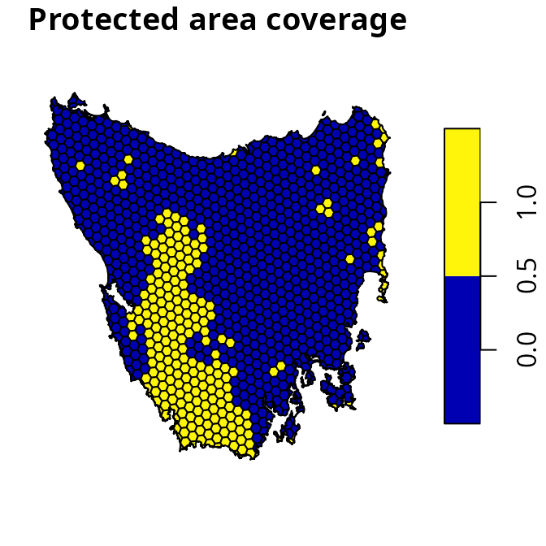
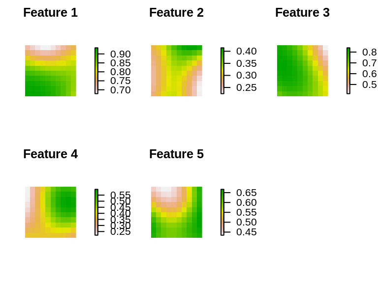
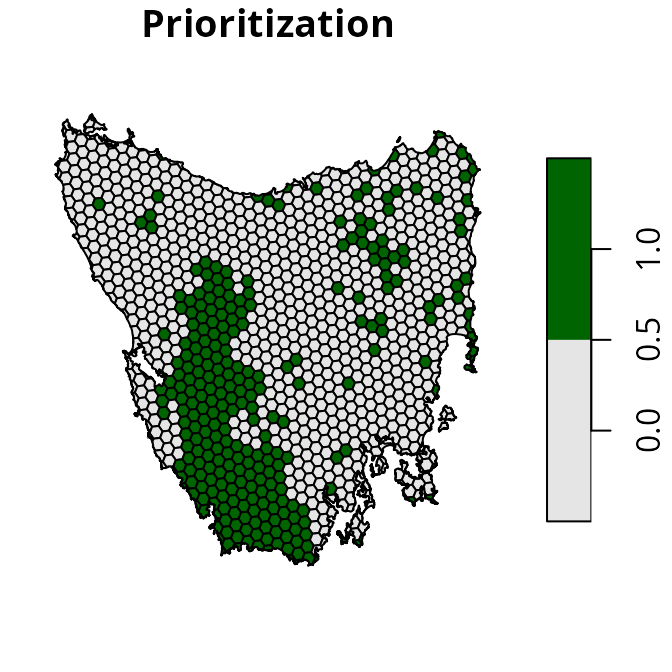
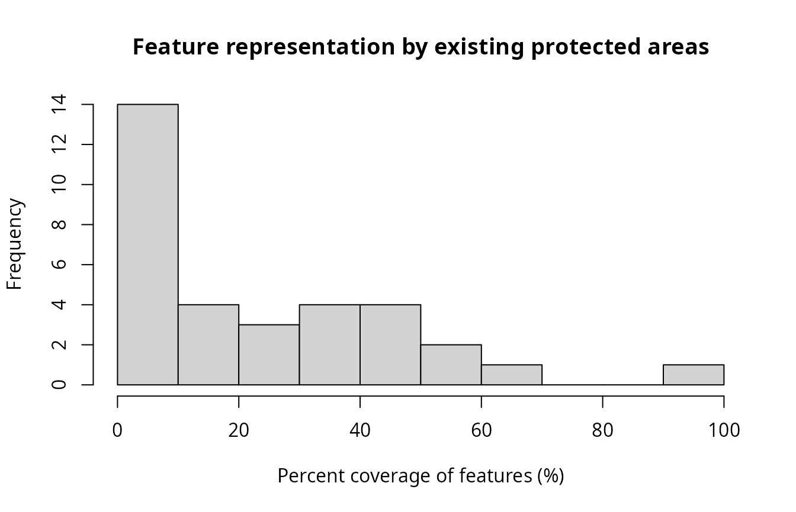
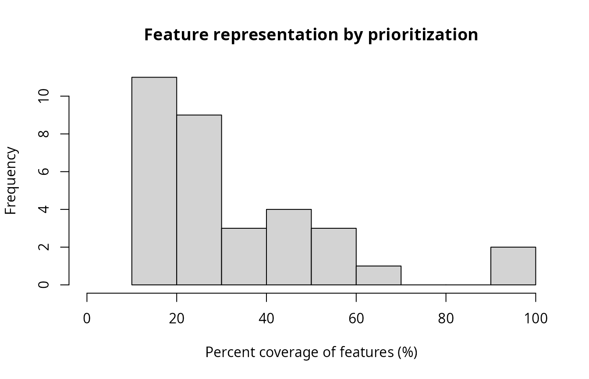
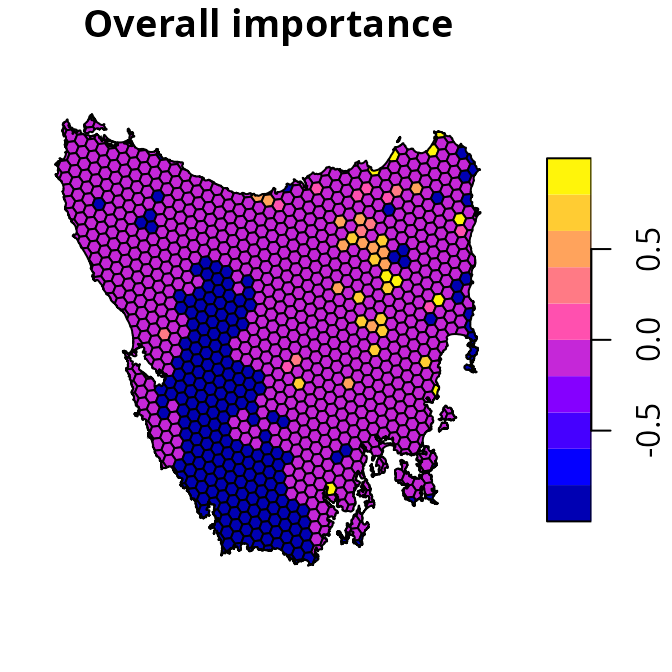
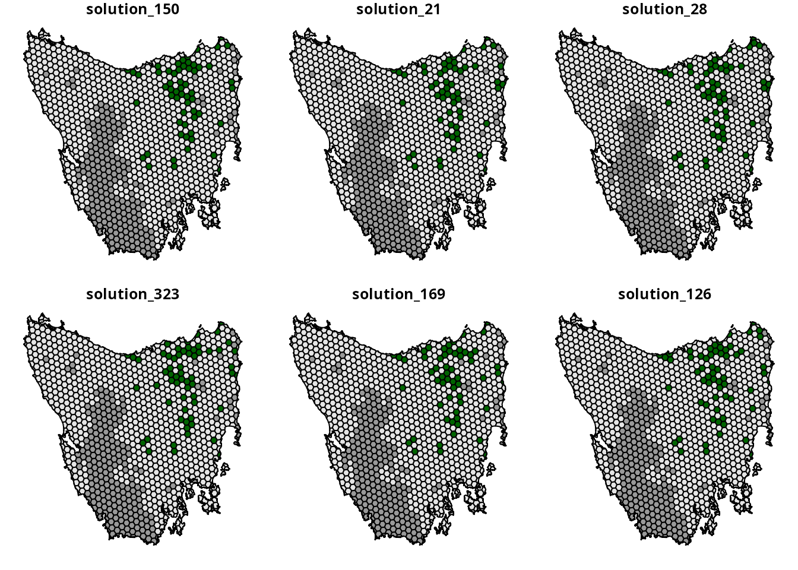

# Getting started

## Introduction

The aim of this tutorial is to provide a short introduction to the
*prioritizr R* package. It is also intended to help conservation
planners familiar the *Marxan* decision support tool (Ball *et al.*
2009) start using the package for their work.

## Data

Let’s load the packages and data used in this tutorial. Since this
tutorial uses data from the *prioritizrdata R* package, please ensure
that it is installed. The data used in this tutorial were obtained from
the *Introduction to Marxan* course and the Australian Government’s
National Vegetation Information System.

``` r
# load packages
library(prioritizrdata)
library(prioritizr)
library(sf)
library(terra)
library(vegan)
library(cluster)

# set seed for reproducibility
set.seed(500)

# load planning unit data
tas_pu <- get_tas_pu()

# load feature data
tas_features <- get_tas_features()
```

Let’s have a look at the planning unit data. The `tas_pu` object
contains planning units represented as spatial polygons (i.e., a
[`sf::st_sf()`](https://r-spatial.github.io/sf/reference/sf.html)
object). This object has three columns that denote the following
information for each planning unit: a unique identifier (`id`),
unimproved land value (`cost`), and current conservation status
(`locked_in`). Planning units that have at least half of their area
overlapping with existing protected areas are denoted with a locked in
`TRUE` value, otherwise they are denoted with a value of `FALSE`. We
will also set the costs for existing protected areas to zero, so that
existing protected areas aren’t included in the the cost of the
prioritization.

``` r
# print planning unit data
print(tas_pu)
```

    ## Simple feature collection with 1130 features and 4 fields
    ## Geometry type: MULTIPOLYGON
    ## Dimension:     XY
    ## Bounding box:  xmin: 298809.6 ymin: 5167775 xmax: 613818.8 ymax: 5502544
    ## Projected CRS: WGS 84 / UTM zone 55S
    ## # A tibble: 1,130 × 5
    ##       id  cost locked_in locked_out                                         geom
    ##    <int> <dbl> <lgl>     <lgl>                                <MULTIPOLYGON [m]>
    ##  1     1 60.2  FALSE     TRUE       (((328497 5497704, 326783.8 5500050, 326775…
    ##  2     2 19.9  FALSE     FALSE      (((307121.6 5490487, 305344.4 5492917, 3053…
    ##  3     3 59.7  FALSE     TRUE       (((321726.1 5492382, 320111 5494593, 320127…
    ##  4     4 32.4  FALSE     FALSE      (((304314.5 5494324, 304342.2 5494287, 3043…
    ##  5     5 26.2  FALSE     FALSE      (((314958.5 5487057, 312336 5490646, 312339…
    ##  6     6 51.3  FALSE     FALSE      (((327904.3 5491218, 326594.6 5493012, 3284…
    ##  7     7 32.3  FALSE     FALSE      (((308194.1 5481729, 306601.2 5483908, 3066…
    ##  8     8 38.4  FALSE     FALSE      (((322792.7 5483624, 319965.3 5487497, 3199…
    ##  9     9  3.55 FALSE     FALSE      (((334896.6 5490731, 335610.4 5492490, 3357…
    ## 10    10  1.83 FALSE     FALSE      (((356377.1 5487952, 353903.1 5487635, 3538…
    ## # ℹ 1,120 more rows

``` r
# set costs for existing protected areas to zero
tas_pu$cost <- tas_pu$cost * !tas_pu$locked_in

# plot map of planning unit costs
plot(st_as_sf(tas_pu[, "cost"]), main = "Planning unit costs")
```


``` r
# plot map of planning unit coverage by protected areas
plot(st_as_sf(tas_pu[, "locked_in"]), main = "Protected area coverage")
```



Now, let’s look at the conservation feature data. The `tas_features`
object describes the spatial distribution of the features. Specifically,
the feature data are a multi-layer raster (i.e., a
[`terra::rast()`](https://rspatial.github.io/terra/reference/rast.html)
object). Each layer corresponds to a different vegetation community.
Within each layer, cells values denote the presence (using value of 1)
or absence (using value of 0) of the vegetation community across the
study area.

``` r
# print planning unit data
print(tas_features)
```

    ## class       : SpatRaster 
    ## size        : 398, 359, 33  (nrow, ncol, nlyr)
    ## resolution  : 1000, 1000  (x, y)
    ## extent      : 288801.7, 647801.7, 5142976, 5540976  (xmin, xmax, ymin, ymax)
    ## coord. ref. : WGS 84 / UTM zone 55S (EPSG:32755) 
    ## source      : tas_features.tif 
    ## names       : Banks~lands, Bould~marks, Calli~lands, Cool ~orest, Eucal~hyll), Eucal~torey, ... 
    ## min values  :           0,           0,           0,           0,           0,           0, ... 
    ## max values  :           1,           1,           1,           1,           1,           1, ...

``` r
# plot map of the first four vegetation classes
plot(tas_features[[1:4]])
```



## Problem formulation

Now we will formulate a conservation planing problem. To achieve this,
we first specify which objects contain the planning unit and feature
data (using the
[`problem()`](https://prioritizr.net/reference/problem.md) function).
Next, we specify that we want to use the minimum set objective function
(using the
[`add_min_set_objective()`](https://prioritizr.net/reference/add_min_set_objective.md)
function). This objective function indicates that we wish to minimize
the total cost of planning units selected by the prioritization. We then
specify boundary penalties to reduce spatial fragmentation in the
resulting prioritization (using the
[`add_boundary_penalties()`](https://prioritizr.net/reference/add_boundary_penalties.md)
function; see the [*Calibrating trade-offs*
vignette](https://prioritizr.net/articles/calibrating_trade-offs_tutorial.md)
for details on calibrating the penalty value). We also specify
representation targets to ensure the resulting prioritization provides
adequate coverage of each vegetation community (using the
[`add_relative_targets()`](https://prioritizr.net/reference/add_relative_targets.md)
function). Specifically, we specify targets to ensure at least 17% of
the spatial extent of each vegetation community (based on the [Aichi
Target 11](https://www.cbd.int/sp/targets/)). Additionally, we set
constraints to ensure that planning units predominately covered by
existing protected areas are selected by the prioritization (using the
[`add_locked_in_constraints()`](https://prioritizr.net/reference/add_locked_in_constraints.md)
function). Finally, we specify that the prioritization should either
select – or not select – planning units for prioritization (using the
[`add_binary_decisions()`](https://prioritizr.net/reference/add_binary_decisions.md)
function).

``` r
# build problem
p1 <-
  problem(tas_pu, tas_features, cost_column = "cost") %>%
  add_min_set_objective() %>%
  add_boundary_penalties(penalty = 0.005) %>%
  add_relative_targets(0.17) %>%
  add_locked_in_constraints("locked_in") %>%
  add_binary_decisions()

# print problem
print(p1)
```

    ## A conservation problem (<ConservationProblem>)
    ## ├•data
    ## │├•features:    "Banksia woodlands", … (33 total)
    ## │└•planning units:
    ## │ ├•data:       <sf> (1130 total)
    ## │ ├•costs:      continuous values (between 0 and 61.92727)
    ## │ ├•extent:     298809.6, 5167775, 613818.8, 5502544 (xmin, ymin, xmax, ymax)
    ## │ └•CRS:        WGS 84 / UTM zone 55S (projected)
    ## ├•formulation
    ## │├•objective:   minimum set objective
    ## │├•penalties:
    ## ││└•1:          boundary penalties (`penalty` = 0.005, `edge_factor` = 0.5, `formulation` = "simple", …)
    ## │├•features:
    ## ││├•targets:    relative targets (all equal to 0.17)
    ## ││└•weights:    none specified
    ## │├•constraints:
    ## ││└•1:          locked in constraints (257 planning units)
    ## │└•decisions:   binary decision
    ## └•optimization
    ##  ├•portfolio:   default portfolio
    ##  └•solver:      gurobi solver (`gap` = 0.1, `time_limit` = 2147483647, `first_feasible` = FALSE, …)
    ## # ℹ Use `summary(...)` to see complete formulation.

## Prioritization

We can now solve the problem formulation (`p1`) to generate a
prioritization (using the
[`solve()`](https://prioritizr.net/reference/solve.md) function). The
*prioritizr* R package supports a range of different exact algorithm
solvers, including *Gurobi*, *IBM CPLEX*, *CBC*, *HiGHS*, *Rsymphony*,
and *lpsymphony*. Although there are benefits and limitations associated
with each of these different solvers, they should return similar
results. Note that you will need at least one solver installed on your
system to generate prioritizations. Since we did not specify a solver
when building the problem, the *prioritizr R* package will automatically
select the best available solver installed. We recommend using the
*Gurobi* solver if possible, and have used it for this tutorial (see the
*Gurobi Installation Guide* vignette for installation instructions).
After solving the problem, the prioritization will be stored in the
`solution_1` column of the `s1` object.

``` r
# solve problem
s1 <- solve(p1)
```

    ## Set parameter Username
    ## Set parameter LicenseID to value 2599748
    ## Set parameter TimeLimit to value 2147483647
    ## Set parameter MIPGap to value 0.1
    ## Set parameter Presolve to value 2
    ## Set parameter Threads to value 1
    ## Academic license - for non-commercial use only - expires 2025-12-16
    ## Gurobi Optimizer version 12.0.2 build v12.0.2rc0 (linux64 - "Ubuntu 24.04.2 LTS")
    ## 
    ## CPU model: 11th Gen Intel(R) Core(TM) i7-1185G7 @ 3.00GHz, instruction set [SSE2|AVX|AVX2|AVX512]
    ## Thread count: 4 physical cores, 8 logical processors, using up to 1 threads
    ## 
    ## Non-default parameters:
    ## TimeLimit  2147483647
    ## MIPGap  0.1
    ## LogToConsole  0
    ## Presolve  2
    ## Threads  1
    ## 
    ## Optimize a model with 6329 rows, 4278 columns and 20749 nonzeros
    ## Model fingerprint: 0xdea3ac39
    ## Variable types: 3148 continuous, 1130 integer (1130 binary)
    ## Coefficient statistics:
    ##   Matrix range     [2e-06, 6e+01]
    ##   Objective range  [5e-01, 2e+02]
    ##   Bounds range     [1e+00, 1e+00]
    ##   RHS range        [2e-01, 2e+03]
    ## Found heuristic solution: objective 28313.965155
    ## Found heuristic solution: objective 18343.093396
    ## Presolve removed 1909 rows and 1249 columns
    ## Presolve time: 0.04s
    ## Presolved: 4420 rows, 3029 columns, 11081 nonzeros
    ## Found heuristic solution: objective 17785.511418
    ## Variable types: 0 continuous, 3029 integer (3029 binary)
    ## Found heuristic solution: objective 17508.673350
    ## Root relaxation presolve removed 8 rows and 6 columns
    ## Root relaxation presolved: 4412 rows, 3023 columns, 11060 nonzeros
    ## 
    ## 
    ## Root relaxation: objective 9.520699e+03, 1230 iterations, 0.04 seconds (0.08 work units)
    ## 
    ##     Nodes    |    Current Node    |     Objective Bounds      |     Work
    ##  Expl Unexpl |  Obj  Depth IntInf | Incumbent    BestBd   Gap | It/Node Time
    ## 
    ##      0     0 9520.69856    0 1115 17508.6734 9520.69856  45.6%     -    0s
    ## H    0     0                    13545.245401 9520.69856  29.7%     -    0s
    ## H    0     0                    12933.143362 9520.69856  26.4%     -    0s
    ## H    0     0                    12898.492261 9520.69856  26.2%     -    0s
    ## H    0     0                    11650.114891 9520.69856  18.3%     -    0s
    ## H    0     0                    11590.840386 9520.69856  17.9%     -    0s
    ## H    0     0                    11556.820277 9520.69856  17.6%     -    0s
    ## H    0     0                    11104.484526 9520.69856  14.3%     -    0s
    ## H    0     0                    11096.985518 9520.69856  14.2%     -    0s
    ## H    0     0                    11095.828253 9520.69856  14.2%     -    0s
    ## H    0     0                    10922.063522 9520.69856  12.8%     -    0s
    ## H    0     0                    10866.263713 9520.69856  12.4%     -    0s
    ##      0     0 9615.33215    0 1144 10866.2637 9615.33215  11.5%     -    0s
    ## H    0     0                    10820.247151 9615.33215  11.1%     -    0s
    ## H    0     0                    10732.637110 9615.33215  10.4%     -    0s
    ## H    0     0                    10693.101120 9615.33215  10.1%     -    0s
    ## H    0     0                    10592.436809 9615.33215  9.22%     -    0s
    ## 
    ## Cutting planes:
    ##   Cover: 1
    ##   MIR: 2
    ##   RLT: 1
    ## 
    ## Explored 1 nodes (1410 simplex iterations) in 0.51 seconds (0.90 work units)
    ## Thread count was 1 (of 8 available processors)
    ## 
    ## Solution count 10: 10592.4 10693.1 10732.6 ... 11556.8
    ## 
    ## Optimal solution found (tolerance 1.00e-01)
    ## Best objective 1.059243680880e+04, best bound 9.615332148707e+03, gap 9.2246%

``` r
# plot map of prioritization
plot(
  st_as_sf(s1[, "solution_1"]), main = "Prioritization",
  pal = c("grey90", "darkgreen")
)
```



## Feature representation

Let’s examine how well the vegetation communities are represented by
existing protected areas and the prioritization.

``` r
# create column with existing protected areas
tas_pu$pa <- round(tas_pu$locked_in)

# calculate feature representation statistics based on existing protected areas
tc_pa <- eval_target_coverage_summary(p1, tas_pu[, "pa"])
print(tc_pa)
```

    ## # A tibble: 33 × 9
    ##    feature   met   total_amount absolute_target absolute_held absolute_shortfall
    ##    <chr>     <lgl>        <dbl>           <dbl>         <dbl>              <dbl>
    ##  1 Banksia … TRUE          2.00           0.340         0.367              0    
    ##  2 Boulders… TRUE        140.            23.9          65.5                0    
    ##  3 Callitri… FALSE         6.00           1.02          0.487              0.533
    ##  4 Cool tem… TRUE       7257.          1234.         2992.                 0    
    ##  5 Eucalypt… TRUE       5699.           969.         1398.                 0    
    ##  6 Eucalypt… FALSE      9180.          1561.         1030.               531.   
    ##  7 Eucalypt… TRUE         38.0            6.46         15.1                0    
    ##  8 Eucalypt… FALSE      1908.           324.          189.               135.   
    ##  9 Eucalypt… FALSE       388.            65.9          27.4               38.6  
    ## 10 Eucalypt… TRUE       6145.          1045.         1449.                 0    
    ## # ℹ 23 more rows
    ## # ℹ 3 more variables: relative_target <dbl>, relative_held <dbl>,
    ## #   relative_shortfall <dbl>

``` r
# calculate  feature representation statistics based on the prioritization
tc_s1 <- eval_target_coverage_summary(p1, s1[, "solution_1"])
print(tc_s1)
```

    ## # A tibble: 33 × 9
    ##    feature   met   total_amount absolute_target absolute_held absolute_shortfall
    ##    <chr>     <lgl>        <dbl>           <dbl>         <dbl>              <dbl>
    ##  1 Banksia … TRUE          2.00           0.340         0.367                  0
    ##  2 Boulders… TRUE        140.            23.9          77.7                    0
    ##  3 Callitri… TRUE          6.00           1.02          1.49                   0
    ##  4 Cool tem… TRUE       7257.          1234.         3319.                     0
    ##  5 Eucalypt… TRUE       5699.           969.         1745.                     0
    ##  6 Eucalypt… TRUE       9180.          1561.         1820.                     0
    ##  7 Eucalypt… TRUE         38.0            6.46         16.1                    0
    ##  8 Eucalypt… TRUE       1908.           324.          326.                     0
    ##  9 Eucalypt… TRUE        388.            65.9          77.3                    0
    ## 10 Eucalypt… TRUE       6145.          1045.         2101.                     0
    ## # ℹ 23 more rows
    ## # ℹ 3 more variables: relative_target <dbl>, relative_held <dbl>,
    ## #   relative_shortfall <dbl>

``` r
# explore representation by existing protected areas
## calculate number of features adequately represented by existing protected
## areas
sum(tc_pa$met)
```

    ## [1] 18

``` r
## summarize representation (values show percent coverage)
summary(tc_pa$relative_held * 100)
```

    ##    Min. 1st Qu.  Median    Mean 3rd Qu.    Max. 
    ##   0.000   3.163  18.363  23.827  39.649  93.002

``` r
## visualize representation  (values show percent coverage)
hist(tc_pa$relative_held * 100,
     main = "Feature representation by existing protected areas",
     xlim = c(0, 100),
     xlab = "Percent coverage of features (%)")
```



``` r
# explore representation by prioritization
## summarize representation (values show percent coverage)
summary(tc_s1$relative_held * 100)
```

    ##    Min. 1st Qu.  Median    Mean 3rd Qu.    Max. 
    ##   17.09   18.99   30.43   37.25   49.40  100.00

``` r
## calculate number of features adequately represented by the prioritization
sum(tc_s1$met)
```

    ## [1] 33

``` r
## visualize representation  (values show percent coverage)
hist(
  tc_s1$relative_held * 100,
  main = "Feature representation by prioritization",
  xlim = c(0, 100),
  xlab = "Percent coverage of features (%)"
)
```



We can see that representation of the vegetation communities by existing
protected areas is remarkably poor. For example, many of the vegetation
communities have nearly zero coverage by existing protected areas. In
other words, are almost entirely absent from existing protected areas.
We can also see that all vegetation communities have at least 17%
coverage by the prioritization – meaning that it meets the
representation targets for all of the features.

## Evaluating importance

After generating the prioritization, we can examine the relative
importance of planning units selected by the prioritization. This can be
useful to identify critically important planning units for conservation
– in other words, places that contain biodiversity features which cannot
be represented anywhere else – and schedule implementation of the
prioritization. To achieve this, we will use an incremental rank
approach (Jung *et al.* 2021). Briefly, this approach involves
generating incremental prioritizations with increasing budgets, wherein
planning units selected in a previous increment are locked in to the
following solution. Additionally, locked out constraints are used to
ensure that only planning units selected in the original solution are
available for selection. If you’re interested, other approaches for
examining importance are also available (see
[`?importance`](https://prioritizr.net/reference/importance.html)).

``` r
# calculate relative importance
imp_s1 <- eval_rank_importance(p1, s1["solution_1"], n = 10)
print(imp_s1)

# manually set locked in planning units to -1 to help with visualization,
# this way we can easily see the importance scores for the priority areas
imp_s1$rs[tas_pu$locked_in] <- -1
```

``` r
# plot map of importance scores
plot(st_as_sf(imp_s1[, "rs"]), main = "Overall importance")
```



## Portfolios

Conservation planning exercises often involve generating multiple
different prioritizations. This can help decision makers consider
different options, and provide starting points for building consensus
among stakeholders. To generate a range of different prioritizations
given the same problem formulation, we can use portfolio functions. Here
we will use the gap portfolio to generate 1000 solutions that are within
20% of optimality. Please note that you will need to have the *Gurobi*
solver installed to use this specific portfolio. If you don’t have
access to *Gurobi*, you could try using the shuffle portfolio instead
(using the
[`add_shuffle_portfolio()`](https://prioritizr.net/reference/add_shuffle_portfolio.md)
function).

``` r
# create new problem with a portfolio added to it
p2 <-
  p1 %>%
  add_gap_portfolio(number_solutions = 1000, pool_gap = 0.2)

# print problem
print(p2)
```

    ## A conservation problem (<ConservationProblem>)
    ## ├•data
    ## │├•features:    "Banksia woodlands", … (33 total)
    ## │└•planning units:
    ## │ ├•data:       <sf> (1130 total)
    ## │ ├•costs:      continuous values (between 0 and 61.92727)
    ## │ ├•extent:     298809.6, 5167775, 613818.8, 5502544 (xmin, ymin, xmax, ymax)
    ## │ └•CRS:        WGS 84 / UTM zone 55S (projected)
    ## ├•formulation
    ## │├•objective:   minimum set objective
    ## │├•penalties:
    ## ││└•1:          boundary penalties (`penalty` = 0.005, `edge_factor` = 0.5, `formulation` = "simple", …)
    ## │├•features:
    ## ││├•targets:    relative targets (all equal to 0.17)
    ## ││└•weights:    none specified
    ## │├•constraints:
    ## ││└•1:          locked in constraints (257 planning units)
    ## │└•decisions:   binary decision
    ## └•optimization
    ##  ├•portfolio:   gap portfolio (`number_solutions` = 1000, `pool_gap` = 0.2)
    ##  └•solver:      gurobi solver (`gap` = 0.1, `time_limit` = 2147483647, `first_feasible` = FALSE, …)
    ## # ℹ Use `summary(...)` to see complete formulation.

``` r
# generate prioritizations
prt <- solve(p2)
```

    ## Set parameter Username
    ## Set parameter LicenseID to value 2599748
    ## Set parameter TimeLimit to value 2147483647
    ## Set parameter MIPGap to value 0.1
    ## Set parameter Presolve to value 2
    ## Set parameter Threads to value 1
    ## Set parameter PoolSolutions to value 1000
    ## Set parameter PoolSearchMode to value 2
    ## Set parameter PoolGap to value 0.2
    ## Academic license - for non-commercial use only - expires 2025-12-16
    ## Gurobi Optimizer version 12.0.2 build v12.0.2rc0 (linux64 - "Ubuntu 24.04.2 LTS")
    ## 
    ## CPU model: 11th Gen Intel(R) Core(TM) i7-1185G7 @ 3.00GHz, instruction set [SSE2|AVX|AVX2|AVX512]
    ## Thread count: 4 physical cores, 8 logical processors, using up to 1 threads
    ## 
    ## Non-default parameters:
    ## TimeLimit  2147483647
    ## MIPGap  0.1
    ## LogToConsole  0
    ## Presolve  2
    ## Threads  1
    ## PoolSolutions  1000
    ## PoolSearchMode  2
    ## PoolGap  0.2
    ## 
    ## Optimize a model with 6329 rows, 4278 columns and 20749 nonzeros
    ## Model fingerprint: 0xdea3ac39
    ## Variable types: 3148 continuous, 1130 integer (1130 binary)
    ## Coefficient statistics:
    ##   Matrix range     [2e-06, 6e+01]
    ##   Objective range  [5e-01, 2e+02]
    ##   Bounds range     [1e+00, 1e+00]
    ##   RHS range        [2e-01, 2e+03]
    ## Found heuristic solution: objective 28313.965155
    ## Found heuristic solution: objective 18343.093396
    ## Presolve removed 1434 rows and 258 columns
    ## Presolve time: 0.01s
    ## Presolved: 4895 rows, 4020 columns, 12058 nonzeros
    ## Variable types: 3148 continuous, 872 integer (872 binary)
    ## Root relaxation presolved: 4895 rows, 4020 columns, 12058 nonzeros
    ## 
    ## 
    ## Root relaxation: objective 9.516231e+03, 1297 iterations, 0.05 seconds (0.10 work units)
    ## 
    ##     Nodes    |    Current Node    |     Objective Bounds      |     Work
    ##  Expl Unexpl |  Obj  Depth IntInf | Incumbent    BestBd   Gap | It/Node Time
    ## 
    ##      0     0 9516.23114    0  311 18343.0934 9516.23114  48.1%     -    0s
    ## H    0     0                    13639.424721 9516.23114  30.2%     -    0s
    ## H    0     0                    12501.341845 9516.23114  23.9%     -    0s
    ## H    0     0                    12233.515013 9516.23114  22.2%     -    0s
    ##      0     0 9564.51582    0  330 12233.5150 9564.51582  21.8%     -    0s
    ## H    0     0                    11843.700741 9564.85620  19.2%     -    0s
    ## H    0     0                    11798.635920 9564.85620  18.9%     -    0s
    ##      0     0 9616.33444    0  323 11798.6359 9616.33444  18.5%     -    0s
    ##      0     0 9624.88617    0  289 11798.6359 9624.88617  18.4%     -    0s
    ##      0     0 9627.57060    0  314 11798.6359 9627.57060  18.4%     -    0s
    ##      0     0 9630.97840    0  289 11798.6359 9630.97840  18.4%     -    0s
    ##      0     0 9633.36306    0  287 11798.6359 9633.36306  18.4%     -    0s
    ##      0     0 9634.35497    0  287 11798.6359 9634.35497  18.3%     -    0s
    ## H    0     0                    11699.466283 9634.35497  17.7%     -    0s
    ## H    0     0                    11387.774340 9634.35497  15.4%     -    0s
    ## H    0     0                    11268.949558 9634.35497  14.5%     -    0s
    ## H    0     0                    11234.661427 9634.35497  14.2%     -    0s
    ## H    0     0                    11194.982696 9634.35497  13.9%     -    0s
    ## H    0     0                    11172.169609 9634.35497  13.8%     -    0s
    ## H    0     0                    11165.030893 9634.35497  13.7%     -    0s
    ##      0     2 9634.35497    0  287 11165.0309 9634.35497  13.7%     -    0s
    ## H   18    18                    11149.468300 9682.80304  13.2%   136    0s
    ## H   18    18                    11134.219959 9682.80304  13.0%   136    0s
    ## H   18    18                    10851.832531 9682.80304  10.8%   136    0s
    ## H   18    18                    10708.613855 9682.80304  9.58%   136    0s
    ## H  130   130                    10674.943182 9682.80304  9.29%   114    1s
    ## H  239   239                    10578.521820 9682.80304  8.47%  76.3    1s
    ## H  239   239                    10508.435291 9682.80304  7.86%  76.3    1s
    ## H  239   239                    10497.969765 9682.80304  7.76%  76.3    1s
    ## H  239   239                    10496.476241 9682.80304  7.75%  76.3    1s
    ## H  239   239                    10485.373665 9682.80304  7.65%  76.3    1s
    ## H  512   510                    10471.621505 9682.81219  7.53%  48.0    2s
    ## H  519     4                    10417.846434 9682.81219  7.06%  47.3    3s
    ##    571    53 10300.2736   38  147 10417.8464 9728.49230  6.62%  58.6    5s
    ## H  650   130                    10401.982397 9728.49230  6.47%  55.2    5s
    ## H  650   130                    10375.652090 9728.49230  6.24%  55.2    5s
    ## H  650   130                    10374.487430 9728.49230  6.23%  55.2    5s
    ## H  891   371                    10369.036126 9728.49230  6.18%  41.3    5s
    ## H  917   397                    10363.328948 9728.49230  6.13%  40.4    5s
    ## H  943   423                    10359.364988 9728.49230  6.09%  39.4    5s
    ## H 1572  1039                    10265.819905 9735.74190  5.16%  31.3    7s
    ## H 1572   928                    10074.309694 9735.74190  3.36%  31.3    7s
    ## H 1576   930                    10001.434711 9735.74190  2.66%  31.4    7s
    ## H 1627   977                    9998.5862207 9735.74190  2.63%  32.3    7s
    ## H 1627   966                    9983.5761260 9735.74190  2.48%  32.3    7s
    ## H 1950  1261                    9948.6785488 9737.24570  2.13%  32.0    8s
    ##   2330  1641 10613.7197   53  341 9948.67855 9761.95086  1.88%  31.1   10s
    ##   4349  2734 10780.4960  148  103 9948.67855 9849.42265  1.00%  28.3   15s
    ## 
    ## Cutting planes:
    ##   Cover: 1
    ##   MIR: 4
    ##   RLT: 8
    ## 
    ## Explored 5272 nodes (141503 simplex iterations) in 16.36 seconds (27.24 work units)
    ## Thread count was 1 (of 8 available processors)
    ## 
    ## Solution count 1000: 9948.68 9983.58 9998.59 ... 10947.2
    ## No other solutions better than 10947.2
    ## 
    ## Optimal solution found (tolerance 1.00e-01)
    ## Best objective 9.948678548832e+03, best bound 9.852864286347e+03, gap 0.9631%

``` r
print(prt)
```

    ## Simple feature collection with 1130 features and 1004 fields
    ## Geometry type: MULTIPOLYGON
    ## Dimension:     XY
    ## Bounding box:  xmin: 298809.6 ymin: 5167775 xmax: 613818.8 ymax: 5502544
    ## Projected CRS: WGS 84 / UTM zone 55S
    ## # A tibble: 1,130 × 1,005
    ##       id  cost locked_in locked_out solution_1 solution_2 solution_3 solution_4
    ##  * <int> <dbl> <lgl>     <lgl>           <dbl>      <dbl>      <dbl>      <dbl>
    ##  1     1 60.2  FALSE     TRUE                0          0          0          0
    ##  2     2 19.9  FALSE     FALSE               0          0          0          0
    ##  3     3 59.7  FALSE     TRUE                0          0          0          0
    ##  4     4 32.4  FALSE     FALSE               0          0          0          0
    ##  5     5 26.2  FALSE     FALSE               0          0          0          0
    ##  6     6 51.3  FALSE     FALSE               0          0          0          0
    ##  7     7 32.3  FALSE     FALSE               0          0          0          0
    ##  8     8 38.4  FALSE     FALSE               0          0          0          0
    ##  9     9  3.55 FALSE     FALSE               0          0          0          0
    ## 10    10  1.83 FALSE     FALSE               0          0          0          0
    ## # ℹ 1,120 more rows
    ## # ℹ 997 more variables: solution_5 <dbl>, solution_6 <dbl>, solution_7 <dbl>,
    ## #   solution_8 <dbl>, solution_9 <dbl>, solution_10 <dbl>, solution_11 <dbl>,
    ## #   solution_12 <dbl>, solution_13 <dbl>, solution_14 <dbl>, solution_15 <dbl>,
    ## #   solution_16 <dbl>, solution_17 <dbl>, solution_18 <dbl>, solution_19 <dbl>,
    ## #   solution_20 <dbl>, solution_21 <dbl>, solution_22 <dbl>, solution_23 <dbl>,
    ## #   solution_24 <dbl>, solution_25 <dbl>, solution_26 <dbl>, …

After generating all these prioritizations, we now want some way to
visualize them. Because it would be onerous to look at each and every
prioritization individually, we will use statistical analyses to help
us. We can visualize the differences between these different
prioritizations – based on which planning units they selected – using a
hierarchical cluster analysis (Harris *et al.* 2014).

``` r
# extract solutions
prt_results <- sf::st_drop_geometry(prt)
prt_results <- prt_results[, startsWith(names(prt_results), "solution_")]

# calculate pair-wise distances between different prioritizations for analysis
prt_dists <- vegan::vegdist(t(prt_results), method = "jaccard", binary = TRUE)

# run cluster analysis
prt_clust <- hclust(as.dist(prt_dists), method = "average")

# visualize clusters
opar <- par()
par(oma = c(0, 0, 0, 0), mar= c(0, 4.1, 1.5, 2.1))
plot(
  prt_clust, labels = FALSE, sub = NA, xlab = "",
  main = "Different prioritizations in portfolio"
)
suppressWarnings(par(opar))
```


We can see that there are approximately six main groups of
prioritizations in the portfolio. To explore these different groups,
let’s conduct another cluster analysis (i.e., a *k*-medoids analysis) to
extract the most representative prioritization from each of these
groups. In other words, we will run another statistical analysis to find
the most central prioritization within each group.

``` r
# run k-medoids analysis
prt_med <- pam(prt_dists, k = 6)

# extract names of prioritizations that are most central for each group.
prt_med_names <- prt_med$medoids
print(prt_med_names)
```

    ## [1] "solution_2"   "solution_122" "solution_170" "solution_393" "solution_732"
    ## [6] "solution_663"

``` r
# create a copy of prt and set values for locked in planning units to -1
# so we can easily visualize differences between prioritizations
prt2 <- prt[, prt_med_names]
prt2[which(tas_pu$locked_in > 0.5), prt_med_names] <- -1

# plot a map showing main different prioritizations
# dark grey: locked in planning units
# grey: planning units not selected
# green: selected planning units
plot(st_as_sf(prt2), pal = c("grey60", "grey90", "darkgreen"))
```



## *Marxan* compatibility

The *prioritizr R* package provides functionality to help *Marxan* users
generate prioritizations. Specifically, it can import conservation
planning data prepared for *Marxan*, and can generate prioritizations
using a similar problem formulation as *Marxan* (based on Beyer *et al.*
2016). Indeed, the problem formulation presented earlier in this
vignette is very similar to that used by *Marxan*. The key difference is
that the problem formulation we specified earlier uses “hard
constraints” for feature representation, and *Marxan* uses “soft
constraints” for feature representation. This means that prioritization
we generated earlier was mathematically guaranteed to reach the targets
for all features. However, if we used *Marxan* to generate the
prioritization, then we could have produced a prioritization that would
fail to reach targets (depending the *Species Penalty Factors* used to
generate the prioritization). In addition to these differences in terms
problem formulation, the *prioritizr R* package uses exact algorithms –
instead of the simulated annealing algorithm – which ensures that we
obtain prioritizations that are near optimal.

Here we will show the *prioritizr R* package can import *Marxan* data
and generate a prioritization. To begin with, let’s import a
conservation planning data prepared for *Marxan*.

``` r
# import data
## planning unit data
pu_path <- system.file("extdata/marxan/input/pu.dat", package = "prioritizr")
pu_data <- read.csv(pu_path, header = TRUE, stringsAsFactors = FALSE)
print(head(pu_data))
```

    ##   id       cost status    xloc     yloc
    ## 1  3      0.000      0 1116623 -4493479
    ## 2 30   7527.275      3 1110623 -4496943
    ## 3 56  37349.075      0 1092623 -4500408
    ## 4 58  16959.021      0 1116623 -4500408
    ## 5 84  34220.256      0 1098623 -4503872
    ## 6 85 178907.584      0 1110623 -4503872

``` r
## feature data
spec_path <- system.file(
  "extdata/marxan/input/spec.dat", package = "prioritizr"
)
spec_data <- read.csv(spec_path, header = TRUE, stringsAsFactors = FALSE)
print(head(spec_data))
```

    ##   id prop spf   name
    ## 1 10  0.3   1  bird1
    ## 2 11  0.3   1  nvis2
    ## 3 12  0.3   1  nvis8
    ## 4 13  0.3   1  nvis9
    ## 5 14  0.3   1 nvis14
    ## 6 15  0.3   1 nvis20

``` r
## amount of each feature within each planning unit data
puvspr_path <- system.file(
  "extdata/marxan/input/puvspr.dat", package = "prioritizr"
)
puvspr_data <- read.csv(puvspr_path, header = TRUE, stringsAsFactors = FALSE)
print(head(puvspr_data))
```

    ##   species  pu     amount
    ## 1      26  56 120.344884
    ## 2      26  58  45.167010
    ## 3      26  84  68.047375
    ## 4      26  85   9.735624
    ## 5      26  86   7.803476
    ## 6      26 111 478.327417

``` r
## boundary data
bound_path <- system.file(
  "extdata/marxan/input/bound.dat", package = "prioritizr"
)
bound_data <- read.table(bound_path, header = TRUE, stringsAsFactors = FALSE)
print(head(bound_data))
```

    ##   id1 id2 boundary
    ## 1   3   3    16000
    ## 2   3  30     4000
    ## 3   3  58     4000
    ## 4  30  30    12000
    ## 5  30  58     4000
    ## 6  30  85     4000

After importing the data, we can now generate a prioritization based on
the *Marxan* problem formulation (using the
[`marxan_problem()`](https://prioritizr.net/reference/marxan_problem.md)
function). **Please note that this function does not generate
prioritizations using *Marxan*.** Instead, it uses the data to create an
optimization problem formulation similar to *Marxan* – using hard
constraints instead of soft constraints – and uses an exact algorithm
solver to generate a prioritization.

``` r
# create problem
p3 <- marxan_problem(
  pu_data, spec_data, puvspr_data, bound_data, blm = 0.0005
)

# print problem
print(p3)
```

    ## A conservation problem (<ConservationProblem>)
    ## ├•data
    ## │├•features:    "bird1", "nvis2", "nvis8", "nvis9", "nvis14", "nvis20", … (17 total)
    ## │└•planning units:
    ## │ ├•data:       <data.frame> (1751 total)
    ## │ ├•costs:      continuous values (between 0 and 415692.2)
    ## │ ├•extent:     NA
    ## │ └•CRS:        NA
    ## ├•formulation
    ## │├•objective:   minimum set objective
    ## │├•penalties:
    ## ││└•1:          boundary penalties (`penalty` = 0.0005, `edge_factor` = 1, `formulation` = "simple", …)
    ## │├•features:
    ## ││├•targets:    relative targets (all equal to 0.3)
    ## ││└•weights:    none specified
    ## │├•constraints:
    ## ││├•1:          locked in constraints (317 planning units)
    ## ││└•2:          locked out constraints (1 planning units)
    ## │└•decisions:   binary decision
    ## └•optimization
    ##  ├•portfolio:   default portfolio
    ##  └•solver:      gurobi solver (`gap` = 0.1, `time_limit` = 2147483647, `first_feasible` = FALSE, …)
    ## # ℹ Use `summary(...)` to see complete formulation.

``` r
# solve problem
s3 <- solve(p3)
```

    ## Set parameter Username
    ## Set parameter LicenseID to value 2599748
    ## Set parameter TimeLimit to value 2147483647
    ## Set parameter MIPGap to value 0.1
    ## Set parameter Presolve to value 2
    ## Set parameter Threads to value 1
    ## Academic license - for non-commercial use only - expires 2025-12-16
    ## Gurobi Optimizer version 12.0.2 build v12.0.2rc0 (linux64 - "Ubuntu 24.04.2 LTS")
    ## 
    ## CPU model: 11th Gen Intel(R) Core(TM) i7-1185G7 @ 3.00GHz, instruction set [SSE2|AVX|AVX2|AVX512]
    ## Thread count: 4 physical cores, 8 logical processors, using up to 1 threads
    ## 
    ## Non-default parameters:
    ## TimeLimit  2147483647
    ## MIPGap  0.1
    ## LogToConsole  0
    ## Presolve  2
    ## Threads  1
    ## 
    ## Optimize a model with 10075 rows, 6780 columns and 24778 nonzeros
    ## Model fingerprint: 0xe84a83d7
    ## Variable types: 5029 continuous, 1751 integer (1751 binary)
    ## Coefficient statistics:
    ##   Matrix range     [5e-05, 4e+03]
    ##   Objective range  [4e+00, 4e+05]
    ##   Bounds range     [1e+00, 1e+00]
    ##   RHS range        [5e+03, 3e+05]
    ## Found heuristic solution: objective 1.221202e+08
    ## Presolve removed 4707 rows and 3103 columns
    ## Presolve time: 0.05s
    ## Presolved: 5368 rows, 3677 columns, 12704 nonzeros
    ## Variable types: 0 continuous, 3677 integer (3677 binary)
    ## Root relaxation presolved: 5368 rows, 3677 columns, 12704 nonzeros
    ## 
    ## 
    ## Root relaxation: objective 9.564790e+07, 521 iterations, 0.01 seconds (0.01 work units)
    ## 
    ##     Nodes    |    Current Node    |     Objective Bounds      |     Work
    ##  Expl Unexpl |  Obj  Depth IntInf | Incumbent    BestBd   Gap | It/Node Time
    ## 
    ##      0     0 9.5648e+07    0   20 1.2212e+08 9.5648e+07  21.7%     -    0s
    ## H    0     0                    9.660231e+07 9.5648e+07  0.99%     -    0s
    ## 
    ## Explored 1 nodes (521 simplex iterations) in 0.06 seconds (0.11 work units)
    ## Thread count was 1 (of 8 available processors)
    ## 
    ## Solution count 3: 9.66023e+07 9.66023e+07 1.2212e+08 
    ## 
    ## Optimal solution found (tolerance 1.00e-01)
    ## Best objective 9.660230173667e+07, best bound 9.564790440581e+07, gap 0.9880%

``` r
# print first six rows of solution object
print(head(s3))
```

    ## # A tibble: 6 × 8
    ##      id    cost status     xloc      yloc locked_in locked_out solution_1
    ##   <int>   <dbl>  <int>    <dbl>     <dbl> <lgl>     <lgl>           <dbl>
    ## 1     3      0       0 1116623. -4493479. FALSE     FALSE               0
    ## 2    30   7527.      3 1110623. -4496943. FALSE     TRUE                0
    ## 3    56  37349.      0 1092623. -4500408. FALSE     FALSE               1
    ## 4    58  16959.      0 1116623. -4500408. FALSE     FALSE               0
    ## 5    84  34220.      0 1098623. -4503872. FALSE     FALSE               0
    ## 6    85 178908.      0 1110623. -4503872. FALSE     FALSE               0

## Conclusion

This tutorial shows how the *prioritizr R* package can be used to build
a conservation problem, generate a prioritization, and evaluate it.
Although we explored just a few functions, the package provides many
different functions so that you can build and custom-tailor conservation
planning problems to suit your needs. To learn more about the package,
please see the package vignettes for [an overview of the
package](https://prioritizr.net/articles/package_overview.md),
[instructions for installing the *Gurobi* optimization
suite](https://prioritizr.net/articles/gurobi_installation_guide.md),
[benchmarks comparing the performance of different
solvers](https://prioritizr.net/articles/solver_benchmarks.md), and [a
record of publications that have cited the
package](https://prioritizr.net/articles/publication_record.md). In
addition to this tutorial, the package also provides tutorials on
[incorporating connectivity into
prioritizations](https://prioritizr.net/articles/connectivity_tutorial.md),
[calibrating trade-offs between different
criteria](https://prioritizr.net/articles/calibrating_trade-offs_tutorial.md)
(e.g., total cost and spatial fragmentation), and [creating
prioritizations that have multiple management zones or management
actions](https://prioritizr.net/articles/management_zones_tutorial.md).

## References

Ball, I.R., Possingham, H. & Watts, M.E. (2009). Marxan and relatives:
Software for spatial conservation prioritisation. *Spatial Conservation
Prioritisation: Quantitative Methods & Computational Tools* (eds A.
Moilanen, K.A. Wilson & H. Possingham), pp. 185–189. Oxford University
Press, Oxford, UK.

Beyer, H.L., Dujardin, Y., Watts, M.E. & Possingham, H.P. (2016).
Solving conservation planning problems with integer linear programming.
*Ecological Modelling*, *328*, 14–22.

Harris, L.R., Watts, M.E., Nel, R., Schoeman, D.S. & Possingham, H.P.
(2014). Using multivariate statistics to explore trade-offs among
spatial planning scenarios (P. Armsworth, Ed.). *Journal of Applied
Ecology*, *51*, 1504–1514.

Jung, M., Arnell, A., Lamo, X. de, García-Rangel, S., Lewis, M., Mark,
J., Merow, C., Miles, L., Ondo, I., Pironon, S., Ravilious, C., Rivers,
M., Schepaschenko, D., Tallowin, O., Soesbergen, A. van, Govaerts, R.,
Boyle, B.L., Enquist, B.J., Feng, X., Gallagher, R., Maitner, B., Meiri,
S., Mulligan, M., Ofer, G., Roll, U., Hanson, J.O., Jetz, W., Di Marco,
M., McGowan, J., Rinnan, D.S., Sachs, J.D., Lesiv, M., Adams, V.M.,
Andrew, S.C., Burger, J.R., Hannah, L., Marquet, P.A., McCarthy, J.K.,
Morueta-Holme, N., Newman, E.A., Park, D.S., Roehrdanz, P.R., Svenning,
J.-C., Violle, C., Wieringa, J.J., Wynne, G., Fritz, S., Strassburg,
B.B.N., Obersteiner, M., Kapos, V., Burgess, N., Schmidt-Traub, G. &
Visconti, P. (2021). Areas of global importance for conserving
terrestrial biodiversity, carbon and water. *Nature Ecology &amp;
Evolution*, *5*, 1499–1509.
