# Solver benchmarks

## Introduction

The *prioritizr R* package supports a variety of optimization solvers
for generating prioritizations. Specifically, the following functions
can be used:
[`add_gurobi_solver()`](https://prioritizr.net/reference/add_gurobi_solver.md)
(interfaces with the [*Gurobi* software](https://www.gurobi.com/)),
[`add_cplex_solver()`](https://prioritizr.net/reference/add_cplex_solver.md)
(interfaces with the [*IBM CPLEX*
software](https://www.ibm.com/products/ilog-cplex-optimization-studio/cplex-optimizer)),
[`add_cbc_solver()`](https://prioritizr.net/reference/add_cbc_solver.md)
(interfaces with the [*CBC* software](https://github.com/coin-or/Cbc)
using the [*rcbc R* package](https://dirkschumacher.github.io/rcbc/)),
[`add_rsymphony_solver()`](https://prioritizr.net/reference/add_rsymphony_solver.md)
(interfaces with the [*SYMPHONY*
software](https://github.com/coin-or/SYMPHONY) using the [*Rsymphony R*
package](https://CRAN.R-project.org/package=Rsymphony)),
[`add_lpsymphony_solver()`](https://prioritizr.net/reference/add_lsymphony_solver.md)
function (interfaces with the [*SYMPHONY*
software](https://github.com/coin-or/SYMPHONY) using the [*lpsymphony R*
package](https://www.bioconductor.org/packages/release/bioc/html/lpsymphony.html)),
and the
[`add_highs_solver()`](https://prioritizr.net/reference/add_highs_solver.md)
function (interfaces with the [*HiGHS* software](https://highs.dev/))
using the [*highs* package](https://cran.r-project.org/package=highs).
Broadly speaking, *IBM CPLEX* and *Gurobi* tend to be the fastest among
the supported solvers. Although they are both commercial software,
special academic licenses are available at no cost.

In this vignette, we will explore the performance of different solvers.
Using a benchmark analysis, we will see how well they can tackle
problems of varying size (e.g., number of planning units) and complexity
(e.g., adding boundary length penalties to reduce spatial
fragmentation). Since users working in governmental and non-governmental
organizations may need to purchase licenses for *IBM CPLEX* or *Gurobi*
to use them, this vignette also aims to provide insight into whether the
potential benefits of purchasing such licenses is worthwhile. Indeed –
depending on the size and complexity of a given conservation planning
problem – solvers based on open source software may only take slightly
longer than commercial solvers.

## Methods

This vignette will report the results of a benchmark analysis. To reduce
computational burden, we previously completed the benchmark analysis and
[uploaded the results to an online
repository](https://github.com/prioritizr/benchmark/releases) ([code
available online](https://github.com/prioritizr/benchmark)). This
analysis involved generating prioritizations using different solvers and
recording how long it took for the solvers to finish. To help understand
the factors that influence how long it takes for solvers to generate a
prioritization, we examined a suite of conservation planning problems
with varying size (i.e., number of planning units), complexity (i.e.,
varying penalties to reduce spatial fragmentation), and with different
objective functions (i.e., [metric used to evaluate competing
solutions](https://prioritizr.net/reference/objectives.html)). In this
section, we will download the results for the previously completed
benchmark analysis and examine the parameters used to conduct it.

### Set up

To start off, we will the load packages used in this vignette.

``` r
# load packages
library(prioritizr)
library(piggyback)
library(ggplot2)
library(units)
library(dplyr)
library(scales)
```

### Download benchmark results

Let’s download the results of the benchmark analysis. This code will
save the results to a temporary folder on your computer. Please note
that downloading the results might take several minutes to complete
depending on your internet connection. If you are unable to download the
results onto your computer, you can view the graphs shown in this
vignette. You only need to run the code in this vignette if you wish to
explore certain aspects of the results yourself.

``` r
# download data to temporary folder
pb_download(
  file = c("solutions.zip", "results.rda"),
  repo = "prioritizr/benchmark", dest = tempdir(), tag = "latest",
  show_progress = FALSE
)

# load benchmark results
load(file.path(tempdir(), "results.rda"))
```

### Benchmark parameters

After downloading the benchmark results, let’s have a look at the
parameters that were used to conduct it. Note that all benchmark
scenarios have 72 features.

``` r
# numbers of planning units examined the benchmark analysis
n_planning_units <- sort(unique(benchmark_results$number_of_planning_units))
print(n_planning_units)
```

    ## [1]   1478  12902 102242 606180

``` r
# number of features (e.g., number of different species examined)
sort(unique(benchmark_results$number_features))
```

    ## [1] 72

``` r
# representation targets,
# units are proportion of the total amount of each feature (e.g., 0.1 = 10%)
sort(unique(benchmark_results$relative_target))
```

    ## [1] 0.10 0.15 0.20 0.30

``` r
# number of planning units
sort(unique(benchmark_results$number_of_planning_units))
```

    ## [1]   1478  12902 102242 606180

``` r
# objective functions
sort(unique(benchmark_results$objective))
```

    ## [1] "add_min_set_objective"       "add_min_shortfall_objective"

``` r
# extract boundary penalty values,
# note that different values were examined for different objective functions
boundary_penalty_values <-
  benchmark_results %>%
  split(.$objective) %>%
  lapply(function(x) unique(x$boundary_penalty))

## boundary penalty values for min set objective function
sort(boundary_penalty_values$add_min_set_objective)
```

    ## [1] 0e+00 1e-05 1e-03

``` r
## boundary penalty values for min shortfall objective function
sort(boundary_penalty_values$add_min_shortfall_objective)
```

    ## [1] 0e+00 1e-14 1e-13

``` r
# budgets examined for budget-limited objectives (e.g., 0.1 = 10% of total cost)
## note that the min set objective function does not use a budget,
## and thus it has a NA value
tibble(
  objective = unique(benchmark_results$objective),
  budget = unique(benchmark_results$budget)
)
```

    ## # A tibble: 2 × 2
    ##   objective                   budget
    ##   <chr>                        <dbl>
    ## 1 add_min_set_objective         NA  
    ## 2 add_min_shortfall_objective    0.1

### Helper function

Now we will define a helper function to quickly plot the results from
the benchmark analysis. This will be helpful for interpreting the
results of the benchmark analysis in the following section.

``` r
# define helper function to create plots
plot_benchmark <- function(
  objective, n_pu, boundary_penalty, solver = NULL){
  # assert arguments are valid
  ## verify parameters with no default arguments
  assertthat::assert_that(
    assertthat::is.count(n_pu), assertthat::noNA(n_pu),
    n_pu %in% unique(benchmark_results$number_of_planning_units),
    assertthat::is.number(boundary_penalty), assertthat::noNA(boundary_penalty),
    assertthat::is.string(objective), assertthat::noNA(objective),
    objective %in% unique(benchmark_results$objective)
  )
  ## set default argument for solver if needed
  if (is.null(solver)) {
    solver <- unique(benchmark_results$solver)
  }
  ## verify solver argument
  assertthat::assert_that(
    is.character(solver), all(solver %in% benchmark_results$solver)
  )
  ## verify that only a single set of features was used
  assertthat::assert_that(
    dplyr::n_distinct(benchmark_results$number_features) == 1
  )

  # prepare data for plotting
  ## rename variables to avoid scoping issues
  sol <- solver
  obj <- objective
  bp <- boundary_penalty
  ## subset data relevant for plotting
  plot_data <-
    benchmark_results %>%
    filter(.$objective == obj, .$solver %in% sol,
           .$number_of_planning_units == n_pu,
           .$boundary_penalty == bp
    )
  ## scale run time to helpful units for plotting
  plot_units <-
    dplyr::case_when(
      # show hours if max(run_time) > 3 h
      max(plot_data$run_time, na.rm = TRUE) > 60 * 60 * 3 ~ "hours",
      # show minutes if max(run_time) > 3 M
      max(plot_data$run_time, na.rm = TRUE) > 60 * 3 ~ "minutes",
      # else show seconds
      TRUE ~ "seconds"
    )
   plot_data$min_set_scaled <-
    plot_data$run_time %>%
    units::set_units(s) %>%
    units::set_units(plot_units, mode = "standard") %>%
    as.numeric()
  ## plot labels
  n_f <- unique(benchmark_results$number_features)[1]
  plot_title =
    paste0(
      dplyr::case_when(
        objective == "add_min_set_objective" ~ "Min. set",
        objective == "add_min_shortfall_objective" ~ "Min. shortfall",
        TRUE ~ objective),
      ": ",
      formatC(
        n_f, big.mark = ",", digits = 2, format = "f",
        drop0trailing = TRUE),
      " features, ",
      formatC(
        n_pu, big.mark = ",", digits = 2, format = "f",
        drop0trailing = TRUE),
      " planning units"
  )
  if (bp > 1e-15) {
    plot_title <- paste0(plot_title, ", ", bp, " boundary penalty")
  }
  ## determine colors for solvers (so that solvers always have same color
  solver_names <- unique(benchmark_results$solver)
  solver_colors <- scales::hue_pal()(length(solver_names))
  names(solver_colors) <- solver_names

  # return plot for selected benchmark runs
  # (suppress warnings when a solver doesn't have results)
  suppressWarnings(
    print(
      ggplot(
        data = plot_data,
        mapping = aes(
          x = relative_target, y = min_set_scaled, color = solver
        )
      ) +
      scale_y_continuous(limits = c(0, NA_real_)) +
      geom_line() +
      geom_point() +
      scale_x_continuous(labels = function(x) x * 100) +
      scale_color_manual(values = solver_colors) +
      labs(
        title = plot_title,
        x = "Representation targets (%)",
        y = paste0("Run time (", plot_units, ")"))
    )
  )
}
```

## Results

We will now inspect the results of the benchmark analysis. The
`benchmark_results` object is a table (i.e.,
[`tibble()`](https://tibble.tidyverse.org/reference/tibble.html))
containing information for each benchmark run (e.g., run time), and the
`solution_raster_data` object (i.e., `RasterStack`) contains the
prioritizations generated for each benchmark run. Note that the
benchmarks were run using a time limit (i.e., 6 hours), meaning that
some solvers were not able to generate a prioritization in certain runs
(indicated by the `exceeded_run_time` column).

``` r
# extract columns from table with relevant data
benchmark_results <-
  benchmark_results %>%
  dplyr::select(
    id, number_of_planning_units, number_features,
    objective, budget, relative_target, boundary_penalty,
    solver, status, total_time, run_time, exceeded_run_time
  )

# preview results
print(benchmark_results)
```

    ## # A tibble: 576 × 12
    ##    id    number_of_planning_u…¹ number_features objective budget relative_target
    ##    <chr>                  <int>           <int> <chr>      <dbl>           <dbl>
    ##  1 0095…                  12902              72 add_min_…   NA              0.3 
    ##  2 00da…                 606180              72 add_min_…    0.1            0.1 
    ##  3 00e9…                 606180              72 add_min_…   NA              0.2 
    ##  4 0115…                   1478              72 add_min_…    0.1            0.3 
    ##  5 0125…                   1478              72 add_min_…   NA              0.15
    ##  6 012c…                   1478              72 add_min_…   NA              0.3 
    ##  7 0184…                 606180              72 add_min_…   NA              0.2 
    ##  8 02ae…                 606180              72 add_min_…    0.1            0.2 
    ##  9 03fd…                 102242              72 add_min_…   NA              0.3 
    ## 10 0408…                  12902              72 add_min_…    0.1            0.15
    ## # ℹ 566 more rows
    ## # ℹ abbreviated name: ¹​number_of_planning_units
    ## # ℹ 6 more variables: boundary_penalty <dbl>, solver <chr>, status <chr>,
    ## #   total_time <dbl>, run_time <dbl>, exceeded_run_time <lgl>

Specifically, the `benchmark_results` object has the following columns:

- `id`: Unique identifier for run.
- `number_of_planning_units`: Number of planning units in run.
- `number_features`: Number of features in run.
- `objective`: Objective function for problem in run.
- `budget`: Budget used in run (missing \[`NA`\] values denote
  objectives that do not use budgets).
- `relative_target`: Targets used in run (expressed as a proportion).
- `boundary_penalty`: Boundary penalty value used in run (zeros indicate
  no penalties).
- `solver`: Solver used in run to generate prioritization.
- `status`: Status from solver after generating prioritization.
- `total_time`: Overall time (seconds) elapsed for generating
  prioritization in the run.
- `run_time`: Time (seconds) elapsed for the solver to generate
  prioritization in the run.
- `exceeded_run_time`: Did the run time exceed the maximum time limit?

After importing the data, let’s examine the run times for each solver
across all benchmark runs. To achieve this, we will create a box plot.
Since we prefer solvers that generate prioritizations in a short period
of time, solvers that have shorter (lower) run times are considered
better. When looking at this box plot, we can see that average run times
for the *IBM CPLEX* and *Gurobi* solvers are consistently low and don’t
differ much from each other. Additionally, the run times for the open
source *CBC* solver are generally low too. However, there are some cases
where the run times for the *CBC* solver are much higher than those for
the *IBM CPLEX* and *Gurobi* solvers. We can also see that the
*lpsymphony* and *Rsymphony* solvers – which both use the open source
*SYMPHONY* software – can take much longer to generate prioritizations
than the other solvers.

``` r
# plot overall summary of solver performance
ggplot(
  data =
    benchmark_results %>%
    mutate(
      min_set_scaled = as.numeric(
        set_units(set_units(run_time, "seconds"), "hours")
      )
    ),
  aes(x = solver, y = min_set_scaled)
) +
geom_boxplot() +
theme(axis.text.x = element_text(size = 7)) +
labs(x = "Solver", y = "Run time (hours)")
```

    ## Warning: Removed 33 rows containing non-finite outside the scale range
    ## (`stat_boxplot()`).

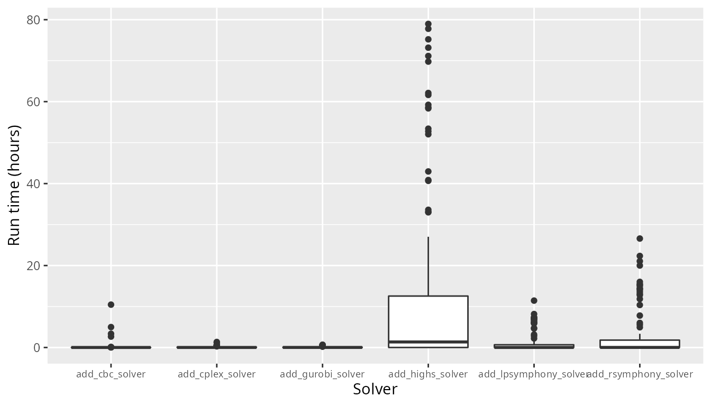

### Minimum set results (no boundary penalty)

Now, let’s investigate the solver behavior in more detail. Specifically,
we will examine the benchmark results generated for the minimum set
objective function. This is because the minimum set objective function
is the most commonly used objective function in systematic conservation,
due to the fact that it is used by the [*Marxan* decision support
software](https://marxansolutions.org/). To begin with, let’s examine
the results for the smallest and simplest conservation planning problems
examined in the benchmark analysis. Here, all prioritizations were
generated using problems that involved 1,478 planning units and did not
contain any boundary length penalties. Since all benchmark scenarios
have 72 features – as mentioned earlier – all of these prioritizations
were generated with 72 features. When looking at the results, we can see
that all solvers solve the problem in a comparable amount of time across
all targets investigated.

``` r
plot_benchmark(
  objective = "add_min_set_objective",
  n_pu = n_planning_units[1],
  boundary_penalty = 0
)
```

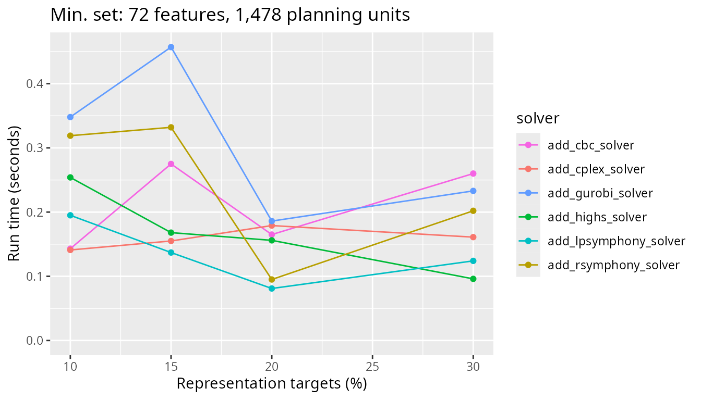

Next, let’s look at the results for a more realistic problem involving
12,902 planning units and see how the timing of the different solvers
used compares. Note that all other factors (e.g., absence of boundary
length penalties) are the same as for the previous graph.

``` r
plot_benchmark(
  objective = "add_min_set_objective",
  n_pu = n_planning_units[2],
  boundary_penalty = 0
)
```

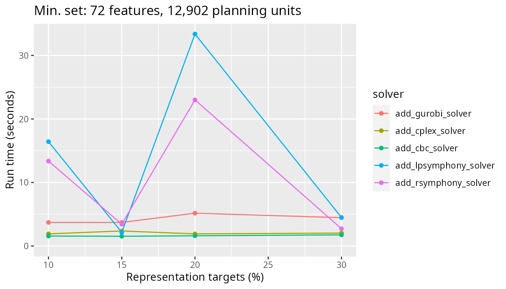

Next, we will look at a medium sized problem with 102,242 planning
units. Now we really start to see the difference between the *Rsymphony*
and *lpsymphony* solvers – which use the *SYMPHONY* software – and the
other solvers.

``` r
plot_benchmark(
  objective = "add_min_set_objective",
  n_pu = n_planning_units[3],
  boundary_penalty = 0
)
```

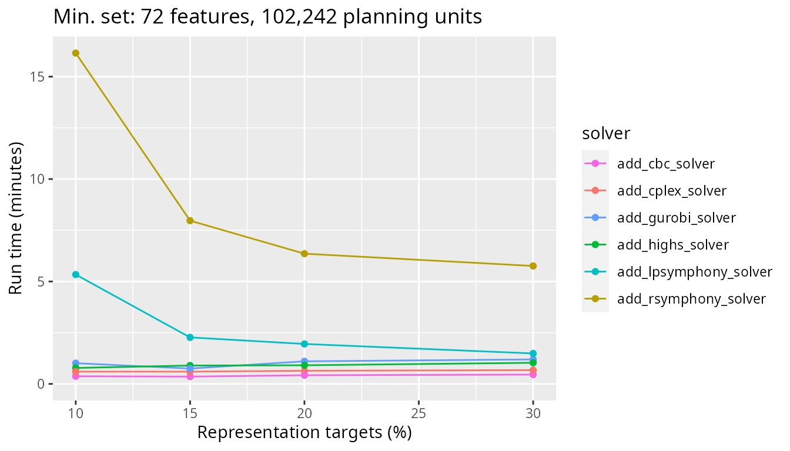

Finally, let’s look at timing comparisons for a large problem with
606,180 planning units. We can see that both the *Rsymphony* and
*lpsymphony* solvers are really taking a much longer time to generate
prioritizations now.

``` r
plot_benchmark(
  objective = "add_min_set_objective",
  n_pu = n_planning_units[4],
  boundary_penalty = 0
)
```

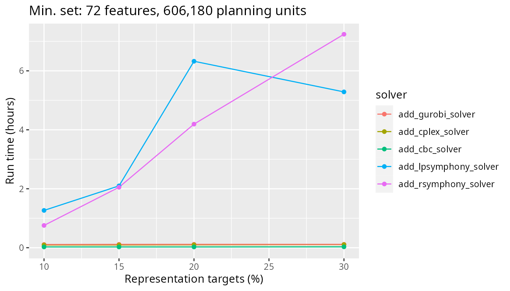

To get a better sense of how the faster solvers (i.e., based on *CBC*,
*IBM CPLEX*, *Gurobi*) compare for such a large problem, let’s take a
closer look at these three solvers. Interestingly, we can see that the
solver based on the open source *CBC* software is slightly faster – by a
few minutes – than the other solvers.

``` r
plot_benchmark(
  objective = "add_min_set_objective",
  n_pu = n_planning_units[4],
  boundary_penalty = 0,
  solver = c("add_cbc_solver", "add_cplex_solver", "add_gurobi_solver")
)
```

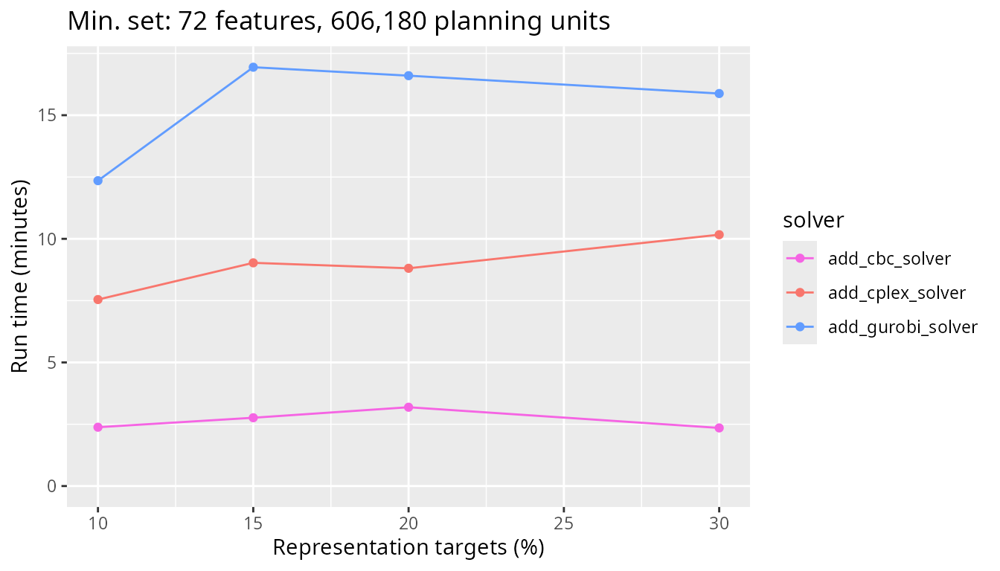

### Minimum set results with low boundary penalty

Now let’s look at the same problem types, but this time with a low
boundary length penalty value added to the problem formulation. To start
with, we will look at scenarios with a low `boundary_penalty` value
(i.e., 10^{-5}). Let’s start again with the smallest problem size we’ve
benchmarked. This problem has only 1,478 planning units.

``` r
plot_benchmark(
  objective = "add_min_set_objective",
  n_pu = n_planning_units[1],
  boundary_penalty = boundary_penalty_values$add_min_set_objective[2]
)
```

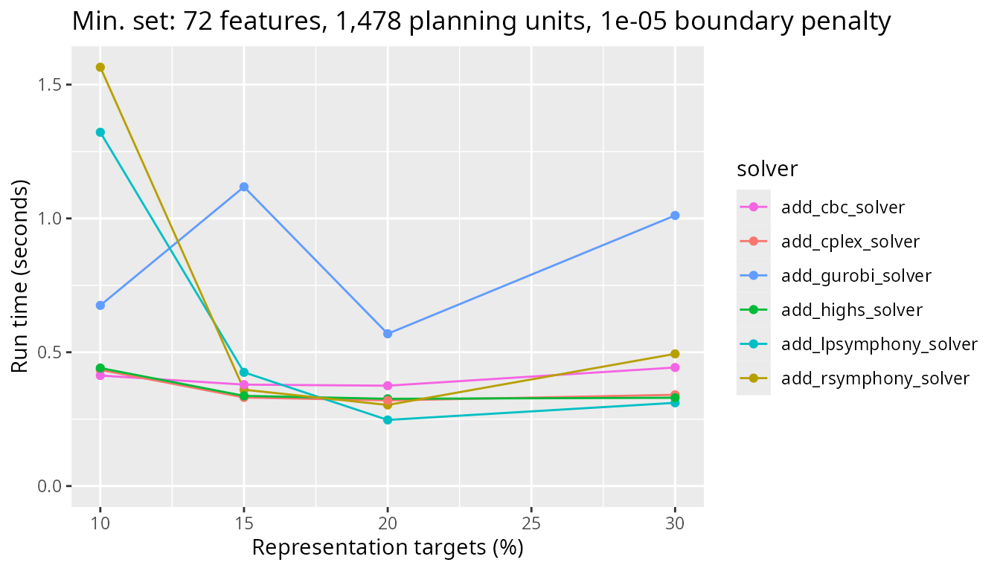

Next, let’s look at the results for a more realistic problem with 12,902
planning units and see how the timing of the different solvers used
compares.

``` r
plot_benchmark(
  objective = "add_min_set_objective",
  n_pu = n_planning_units[2],
  boundary_penalty = boundary_penalty_values$add_min_set_objective[2]
)
```

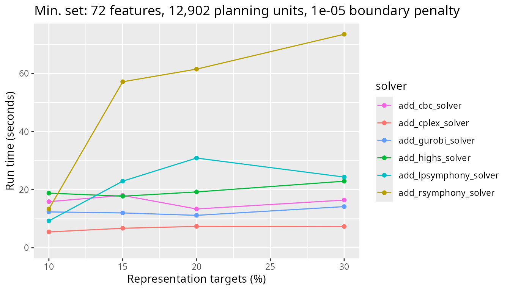

Next, we will look at a medium sized problem with 102,242 planning
units. Now we really start to see the difference between *lpsymphony*
and *Rsymphony* solvers and the other solvers.

``` r
plot_benchmark(
  objective = "add_min_set_objective",
  n_pu = n_planning_units[3],
  boundary_penalty = boundary_penalty_values$add_min_set_objective[3]
)
```


Finally, let’s look at timing comparisons for a large problem with
606,180 planning units. As with the scenario without boundary penalties,
*lpsymphony* and *Rsymphony* solvers take a lot longer to generate
prioritizations than the other three solvers.

``` r
plot_benchmark(
  objective = "add_min_set_objective",
  n_pu = n_planning_units[4],
  boundary_penalty = boundary_penalty_values$add_min_set_objective[2]
)
```

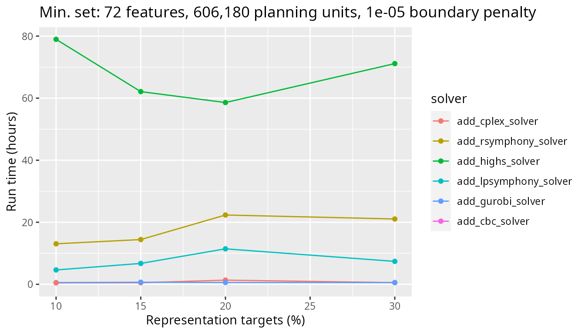

Similar to earlier, let’s take a look at just the *CBC*, *IBM CPLEX*,
and *Gurobi* solvers. We can see that the *Gurobi* solver has the best
performance, generating prioritizations in under half an hour in all
cases. This result shows that the commercial solvers can massively
outperform the open source solvers for large-scale problems with
boundary length penalties.

``` r
plot_benchmark(
  objective = "add_min_set_objective",
  n_pu = n_planning_units[4],
  boundary_penalty = boundary_penalty_values$add_min_set_objective[2],
  solver = c("add_cbc_solver", "add_cplex_solver", "add_gurobi_solver")
)
```

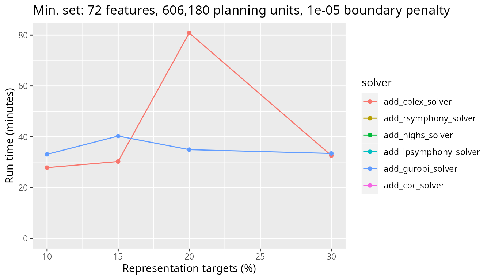

### Minimum set results with high boundary penalty

Now let’s look at the same problem types, but this time with a high
boundary length penalty parameter added to the problem formulation
(i.e., 0.001). Let’s start again with the smallest problem size we’ve
benchmarked. This problem has only 1,478 planning units. Although there
are some differences between the solvers, they all have very similar run
times (i.e., all less than one second).

``` r
plot_benchmark(
  objective = "add_min_set_objective",
  n_pu = n_planning_units[1],
  boundary_penalty = boundary_penalty_values$add_min_set_objective[3]
)
```

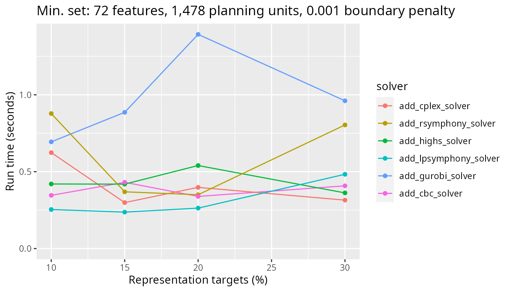

Next, let’s look at the results for a more realistic problem with 12,902
planning units and see how the timing of the different solvers used
compares.

``` r
plot_benchmark(
  objective = "add_min_set_objective",
  n_pu = n_planning_units[2],
  boundary_penalty = boundary_penalty_values$add_min_set_objective[3]
)
```

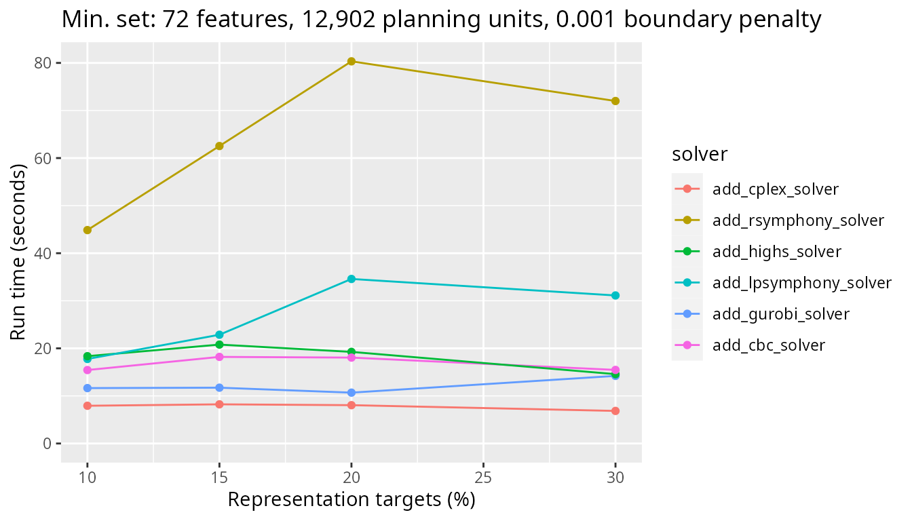

Next, we will look at a medium sized problem with 102,242 planning
units. We again see the difference between *Rsymphony* and *lpsymphony*
solvers and the other solvers.

``` r
plot_benchmark(
  objective = "add_min_set_objective",
  n_pu = n_planning_units[3],
  boundary_penalty = boundary_penalty_values$add_min_set_objective[3]
)
```

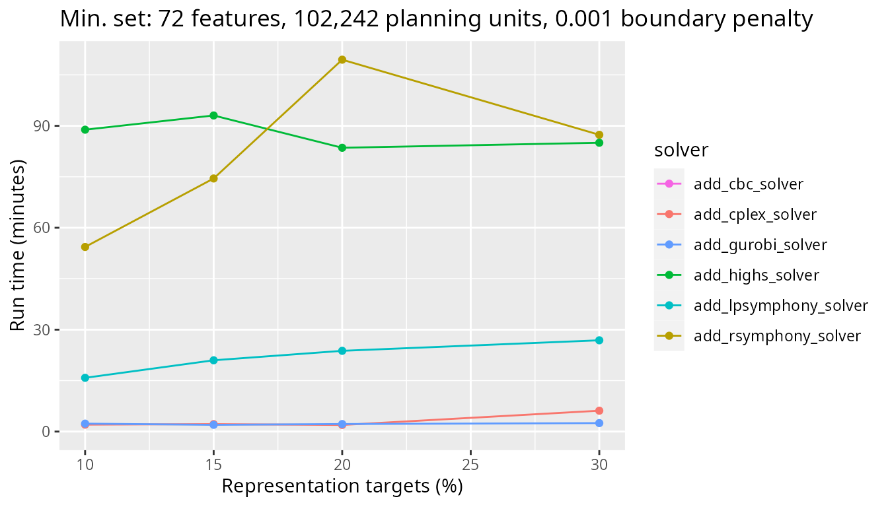

Finally, let’s look at timing comparisons for a large problem with
606,180 planning units. As with the previous scenarios, *Rsymphony* and
*lpsymphony* solvers take a lot longer to generate prioritizations than
the other solvers.

``` r
plot_benchmark(
  objective = "add_min_set_objective",
  n_pu = n_planning_units[4],
  boundary_penalty = boundary_penalty_values$add_min_set_objective[3]
)
```

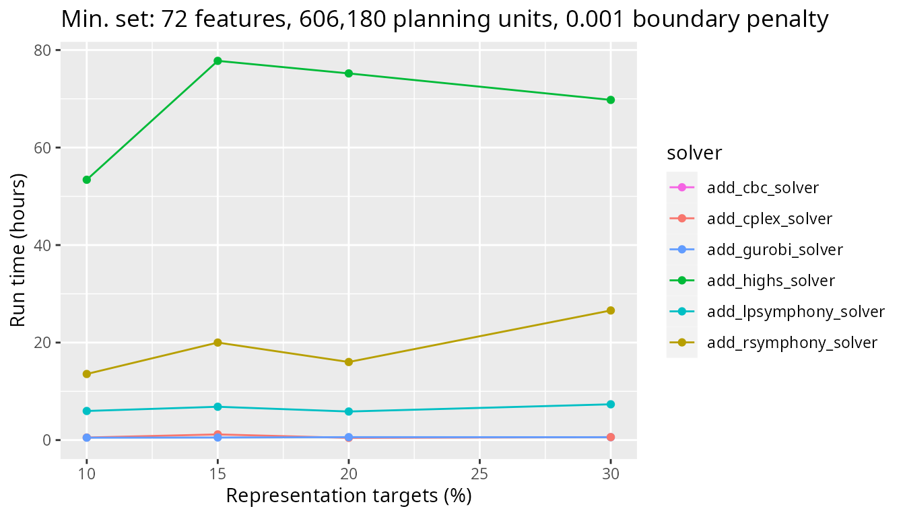

Similar to before, let’s take a look at just the *CBC*, *IBM CPLEX*, and
*Gurobi* solvers. We can see that *Gurobi* has the best performance.
This result further emphasizes the potential speed gains of commercial
solvers for large-scale conservation planning problems with boundary
penalties.

``` r
plot_benchmark(
  objective = "add_min_set_objective",
  n_pu = n_planning_units[4],
  boundary_penalty = boundary_penalty_values$add_min_set_objective[3],
  solver = c("add_cbc_solver", "add_cplex_solver", "add_gurobi_solver")
)
```

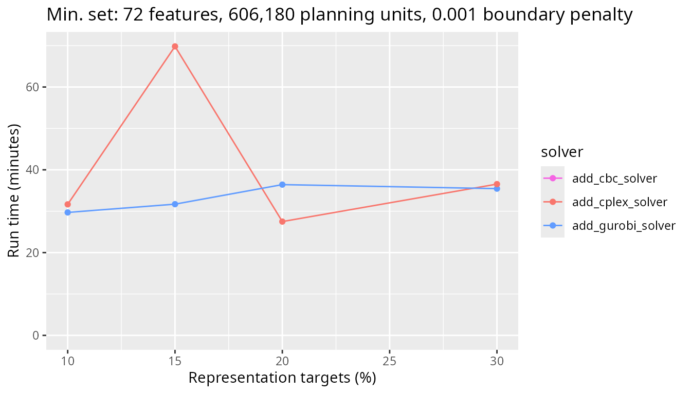

### Minimize shortfall results (no boundary penalty)

Now, let’s investigate the solver behavior for the minimum shortfall
objective function. Let’s start with the smallest problem size examined.
All benchmark scenarios have 72 features. This problem has only 1,478
planning units. We can see that all solvers solve the problem in a
comparable amount of time across all targets investigated.

``` r
plot_benchmark(
  objective = "add_min_shortfall_objective",
  n_pu = n_planning_units[1],
  boundary_penalty = 0
)
```

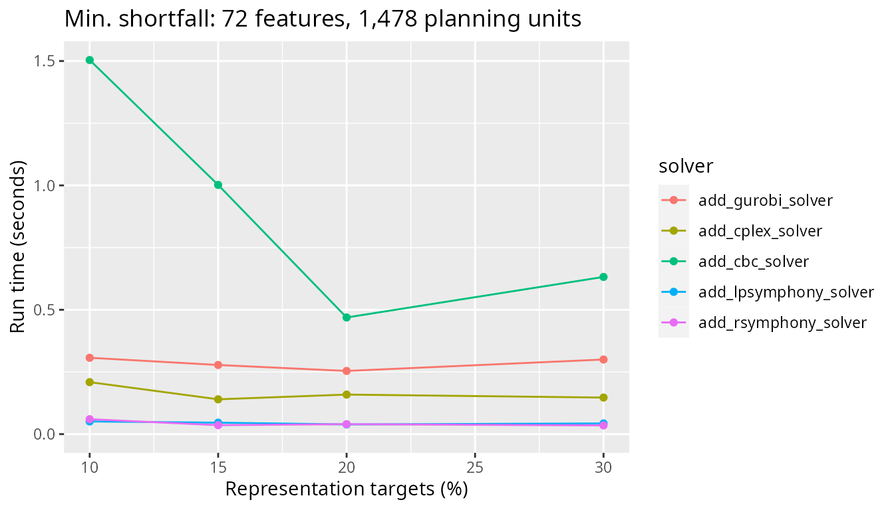

Next, let’s look at the results for a more realistic problem with 12,902
planning units and see how the timing of the different solvers used
compares. Here, the *CBC* solver takes slightly longer than the other
solvers.

``` r
plot_benchmark(
  objective = "add_min_shortfall_objective",
  n_pu = n_planning_units[2],
  boundary_penalty = 0
)
```


Next, we will look at a medium sized problem with 102,242 planning
units. Now we see a larger difference between the *CBC* solver and the
other solvers, with the *CBC* solver taking several minutes longer to
complete.

``` r
plot_benchmark(
  objective = "add_min_shortfall_objective",
  n_pu = n_planning_units[3],
  boundary_penalty = 0
)
```


Finally, let’s look at timing comparisons for a large problem with
606,180 planning units. We can see that all the open source solvers
(i.e., *CBC*, *Rsymphony* and *lpsymphony*) take a lot longer than the
commercial solvers (i.e., *IBM CPLEX* and *Guorbi*).

``` r
plot_benchmark(
  objective = "add_min_shortfall_objective",
  n_pu = n_planning_units[4],
  boundary_penalty = 0
)
```


### Minimize shortfall results with low boundary penalty

Now let’s look at the same problem type, but this time with a low
`boundary_penalty` parameter added to the problem formulation (i.e., 0).
Let’s start again with the smallest problem size examined. This problem
has only 1,478 planning units.

``` r
plot_benchmark(
  objective = "add_min_shortfall_objective",
  n_pu = n_planning_units[1],
  boundary_penalty = boundary_penalty_values$add_min_shortfall_objective[2]
)
```

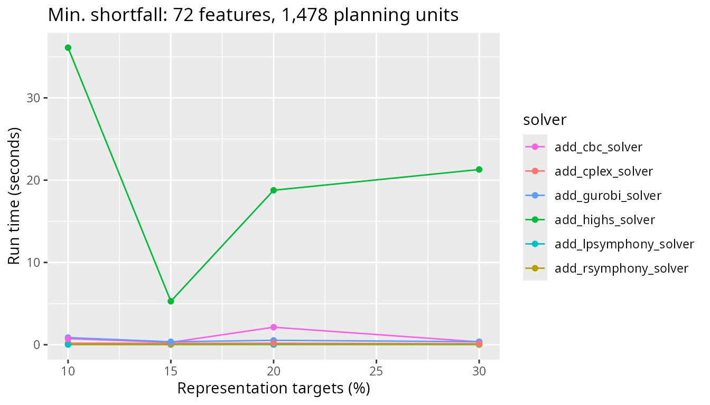

Next, let’s look at the results for a more realistic problem with 12,902
planning units and see how the timing of the different solvers compare.
Similar to before, we can see the *CBC* solver takes slightly longer
than the other solvers.

``` r
plot_benchmark(
  objective = "add_min_shortfall_objective",
  n_pu = n_planning_units[2],
  boundary_penalty = boundary_penalty_values$add_min_shortfall_objective[2]
)
```

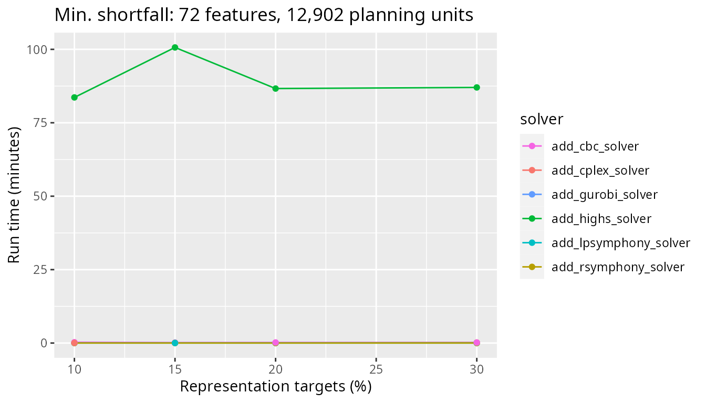

Next, we will look at a medium sized problem with 102,242 planning
units. Now we really start to see the difference between the *CBC*
solver and the other solvers. Additionally, the *Rsymphony* and
*lpsymphony* solvers also take considerably longer than the commercial
solvers too.

``` r
plot_benchmark(
  objective = "add_min_shortfall_objective",
  n_pu = n_planning_units[3],
  boundary_penalty = boundary_penalty_values$add_min_shortfall_objective[2]
)
```

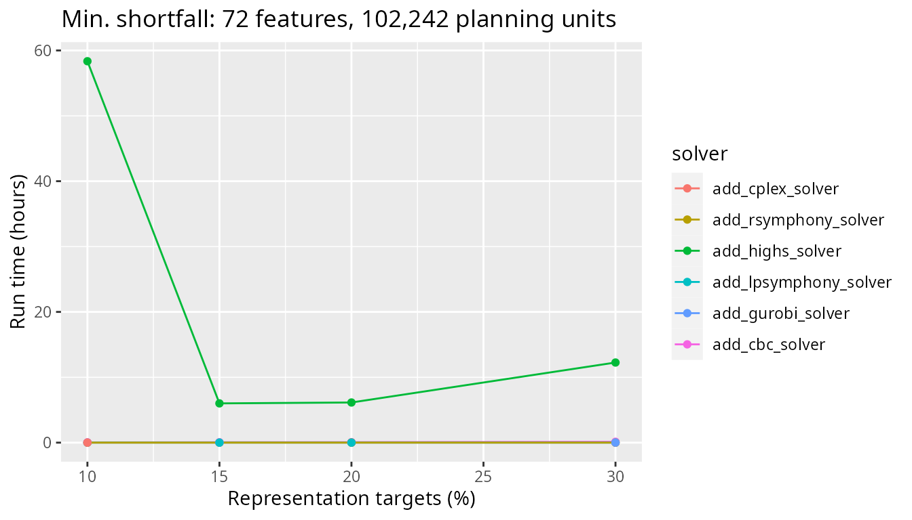

Finally, let’s look at timing comparisons for a large problem with
606,180 planning units. The *CBC* solver now performs better than the
*Rsymphony* and *lpsymphony* solvers, which can take over a whole day to
complete.

``` r
plot_benchmark(
  objective = "add_min_shortfall_objective",
  n_pu = n_planning_units[4],
  boundary_penalty = boundary_penalty_values$add_min_shortfall_objective[2]
)
```

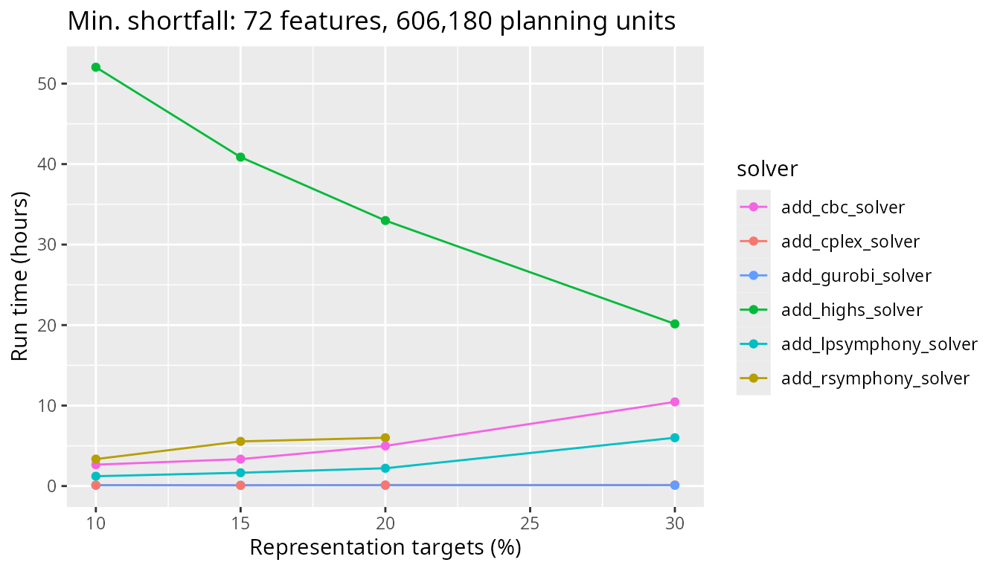

To get a better sense of how the faster solvers compare (i.e., *CBC*,
*IBM CPLEX*, and *Gurobi*), let’s take a closer look at these three
solvers. We can see that the *CBC* solver takes a lot longer to generate
prioritizations than the *IBM CPLEX* and *Gurobi* solvers. This result
suggests that *IBM CPLEX* and *Gurobi* could be really beneficial for
large-scale conservation planning problems with boundary length
penalties and the minimum shortfall objective function.

``` r
plot_benchmark(
  objective = "add_min_shortfall_objective",
  n_pu = n_planning_units[4],
  boundary_penalty = boundary_penalty_values$add_min_shortfall_objective[2],
  solver = c("add_cbc_solver", "add_cplex_solver", "add_gurobi_solver")
)
```

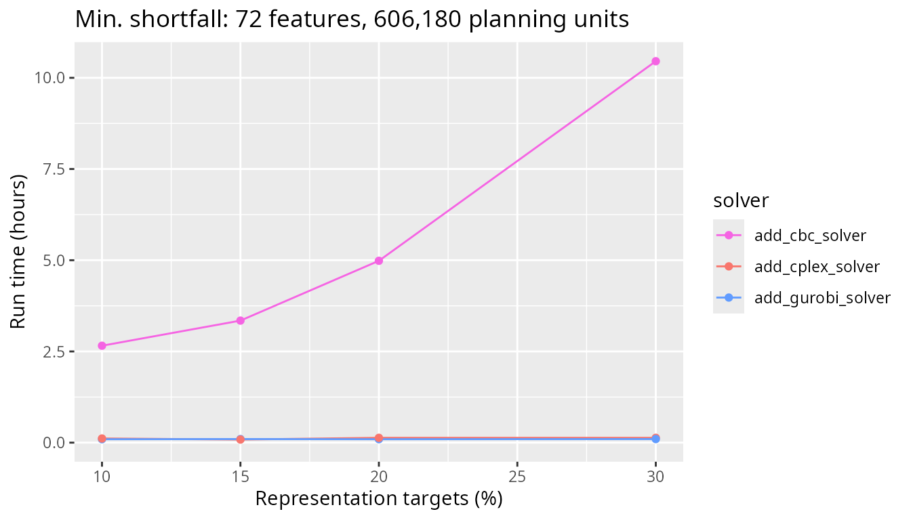

### Minimize shortfall results with high boundary penalty

Now let’s look at the same problem types, but this time with a higher
`boundary_penalty` parameter added to the problem formulation
(10^{-14}). Let’s start again with the smallest problem size examined.
This problem has only 1,478 planning units.

``` r
plot_benchmark(
  objective = "add_min_shortfall_objective",
  n_pu = n_planning_units[1],
  boundary_penalty = boundary_penalty_values$add_min_shortfall_objective[3]
)
```

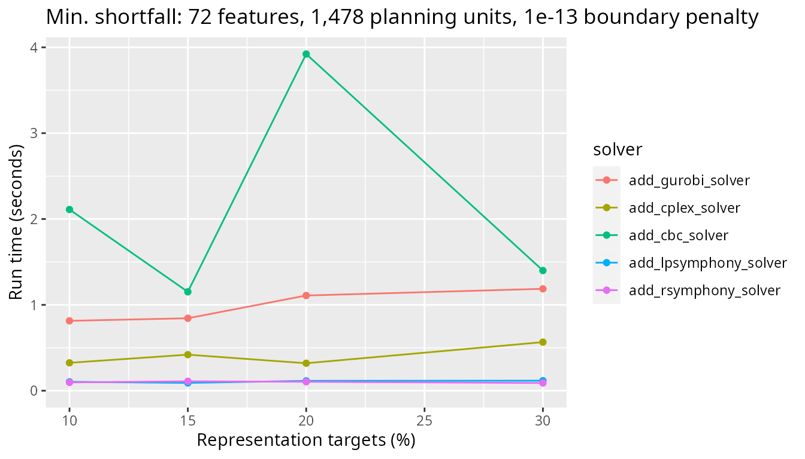

Next, let’s look at the results for a greater number of planning units
(i.e., 12,902 planning units) and see how the timings compare. All the
solvers have a similar run time now. Interestingly, the *Gurobi* solver
is the slowest – but only by a couple of minutes – for these benchmark
parameters.

``` r
plot_benchmark(
  objective = "add_min_shortfall_objective",
  n_pu = n_planning_units[2],
  boundary_penalty = boundary_penalty_values$add_min_shortfall_objective[3]
)
```


Next, we will look at a medium sized problem with 102,242 planning
units. Similar to some of the previous results for the minimum shortfall
objective, the *CBC* solver is the slowest and the *IBM CPLEX* and
*Gurobi* commercial solvers are fastest.

``` r
plot_benchmark(
  objective = "add_min_shortfall_objective",
  n_pu = n_planning_units[3],
  boundary_penalty = boundary_penalty_values$add_min_shortfall_objective[3]
)
```

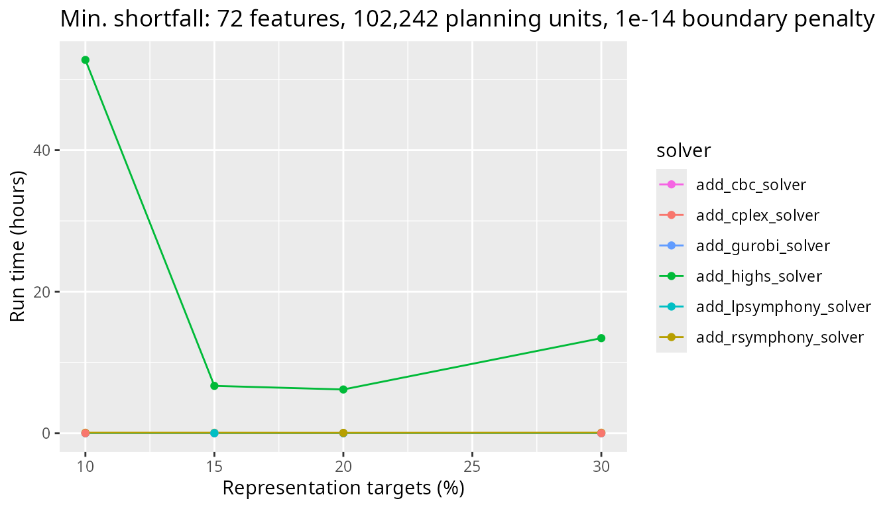

Finally, let’s look at timing comparisons for a large problem with
606,180 planning units. We can see that the benchmark times vary greatly
for the *Rsymphony* and *lpsymphony* solvers, with run times ranging
from one to two whole days. Additionally, although the *CBC* solver can
still require several hours to generate a prioritization, it now
outperforms the *Rsymphony* and *lpsymphony* solvers. Finally, the *IBM
CPLEX* and *Gurobi* solvers perform much, much better than all the other
solvers.

``` r
plot_benchmark(
  objective = "add_min_shortfall_objective",
  n_pu = n_planning_units[4],
  boundary_penalty = boundary_penalty_values$add_min_shortfall_objective[3]
)
```

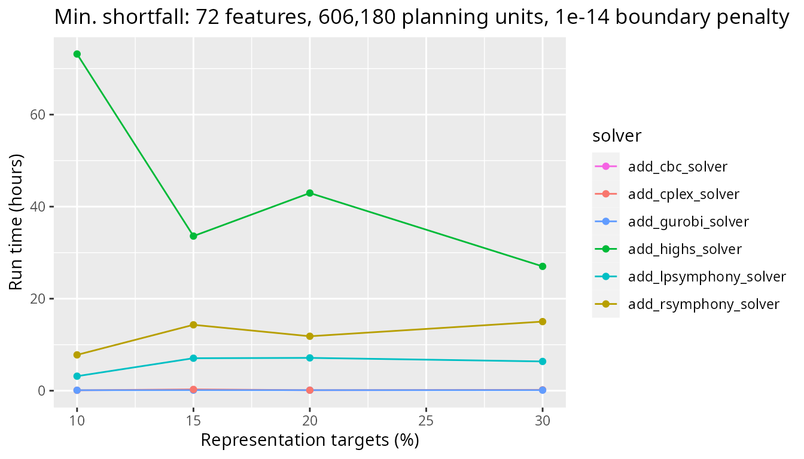

## Conclusion

The benchmark results demonstrate that the time required to solve a
conservation planning problem can vary considerably depending on the
size and complexity of the problem, and also the solver used to generate
the prioritization. Indeed, some solvers (e.g., *Rsymphony* solver) may
require many hours to solve a problem that other solvers (e.g., *CBC* or
*Gurobi* solvers) can solve within minutes. Broadly speaking, we
recommend using the *Gurobi* and *IBM CPLEX* solvers where possible.
This is because they often have the best performance. Although academics
can obtain a special license to use these solvers at no cost,
conservation planners working in governmental or non-governmental
organizations may not have access to these solvers. In such cases, we
recommend using the *CBC* solver because it generally has better
performance than the other open source solvers (i.e., the *Rsymphony*
and *lpsymphony* solvers). Since the *CBC* solver did not always have
better performance than the other open source solvers, we recommend
trying the *lpsymphony* solver if the *CBC* solver is taking a long time
to solve a particular problem.
