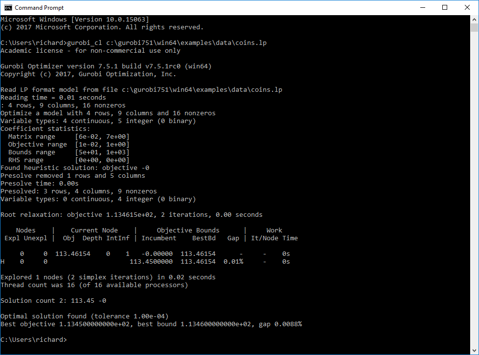

```{r, include = FALSE}
h = 3.5
w = 3.5
is_check <- ("CheckExEnv" %in% search()) || any(c("_R_CHECK_TIMINGS_",
             "_R_CHECK_LICENSE_") %in% names(Sys.getenv()))
knitr::opts_chunk$set(fig.align = "center", eval = !is_check)
```

```{r, include = FALSE}
devtools::load_all()
```

# Introduction


This vignette is part of the _prioritizr_ _R_ package for solving systematic conservation prioritization problems using integer linear programming (ILP) techniques. The package offers a flexible interface for creating conservation problems using a range of different objectives and constraints that can be tailored to the specific needs of the conservation planner. Conservation problems can be solved using a variety of commercial and open-source exact algorithm solvers. In contrast to the algorithms conventionally used to solve conservation problems, such as greedy heuristics or simulated annealing, the ILP algorithms used by _prioritizr_ are guaranteed to find optimal solutions. This package also has the functionality to read [Marxan](http://marxan.net/) input data and find much cheaper solutions in a much shorter period of time than Marxan ([Beyer _et al. 2016_](http://marxan.net/downloads/papers/beyer_etal_2015.pdf)).


For a walk-through of the functions available in the prioritizr package and their usage with a simulated dataset, refer to the [Quickstart Guide](quick_start.html).  

Please refer to the [Prioritizr Basics](prioritizr_basics.html) vignette for more on the concepts behind the _prioritizr_ package.


# The Gurobi solver

The currently supported solvers are listed below. Each must be installed separately from this package. The details of the solvers are intentionally abstracted away so that minimal knowledge is required to use a given solver. However, one of the following R packages must be installed before a conservation problem can be solved.

* [Gurobi:](http://gurobi.com) Install the [_gurobi_ _R_ package](http://www.gurobi.com/products/modeling-languages/r) to use this solver.
* [SYMPHONY:](https://projects.coin-or.org/SYMPHONY) Install either the [_Rsymphony_](https://CRAN.R-project.org/package=Rsymphony) or [_lpsymphony_](https://bioconductor.riken.jp/packages/3.3/bioc/html/lpsymphony.html) _R_ packages to use this solver.

Gurobi is the most powerful and fastest solver _prioritizr_ supports at this point, which is why we are providing the Gurobi Optimizer installation intstructions here. A great place to start in terms of software and package installation is the Gurobi [documentation](http://www.gurobi.com/documentation/)

## Gurobi requires a license to work

One of the potential caveats of using Gurobi is that you will need to aquire a license in order to use the Gurobi software. If you are an academic user at a degree-granting institution you can take advantage of Gurobi's [Free Academic License](https://user.gurobi.com/download/licenses/free-academic). Once you have signed up for a free account you can request a free academic licence.


  
  
Once you accept the terms of service you can generate a license such as this one:

 

## Gurobi optimizer software installation

The Gurobi softwre installation itself is plattform specific. You can download the version that works for your operating system [here](http://www.gurobi.com/downloads/gurobi-optimizer). The documentation [page](http://www.gurobi.com/documentation/) and platform specific Quick Start Guides should help you with the installation. Installing the software is fairly straight forward on Windows and Linux.  

  
Once the installation is finished you will need to activate the Gurobi software using the licence you downloaded earlier. The Licence detail website already shows you the command you need to execute to do so, which you can do via a command/terminal Prompt. This screenshot shows the prompt output on a Windows machine:  


  
Once the licence key has been successfully installed you can test if the installation worked, but running an example model included in the Gurobi installation. If we assume you installed _Gurobi version 7.5.1_ in the standard location on your (Windows) system we can enter the following command in the prompt to test if the solver is working:  
  
`gurobi_cl c:\gurobi751\win64\examples\data\coins.lp`  

  
You should see output like this, if everything worked:  
  
  


## Gurobi R package installation on Windows


The R package file can be found in the <installdir>/R directory of your Gurobi installation. For a default installation of Gurobi 7.5.1, the command would be:

`install.packages('c:/gurobi751/win64/R/gurobi_7.5-1.zip', repos=NULL)`

Next you will need to install the `slam` package for gurobi to work:

`install.packages('slam','https://cloud.r-project.org')`

The next thing to try is if the R package works. To do so you can follow the [example](http://www.gurobi.com/documentation/7.5/quickstart_windows/r_example.html) from the Gurobi website, which is:

```{r}
library('gurobi')

model <- list()

model$A          <- matrix(c(1,2,3,1,1,0), nrow=2, ncol=3, byrow=T)
model$obj        <- c(1,1,2)
model$modelsense <- "max"
model$rhs        <- c(4,1)
model$sense      <- c('<', '>')
model$vtype      <- 'B'

params <- list(OutputFlag=0)

result <- gurobi(model, params)

print('Solution:')
print(result$objval)
print(result$x)
```

If R doesn't give you any error message you have successfully installed the Gurobi solver and can now use it with _prioritizr_. 

## Gurobi R package installation on Linux

Before talking about the R package installation it's important to bring up some points about the gurobi software installation on Linux, that could cause some issues for users.

Once you have downloaded the Gurobi optimizer from [here](http://www.gurobi.com/downloads/gurobi-optimizer) and decided to extract Gurobi in the standard /opt directory you will have Gurobi installed here:

_/opt/gurobi751_  

We now have to now make the Gurobi solver dicoverable. If you are isung the bash shell, add the following  _~/.bashrc_
  
``` {r, eval = FALSE}
  export GUROBI_HOME="/opt/gurobi650/linux64"  
  export PATH="${PATH}:${GUROBI_HOME}/bin"  
  export LD_LIBRARY_PATH="${GUROBI_HOME}/lib"  
```  

Once that is done you need to logout and login again. When you have logged into your Linux system again, open a terminal and add your Gurobi license from above: 
  
`grbgetkey 2b695a2e-aac7-11e7-be25-0a4522cc772c`
  
Now you are ready to install the Gurobi _R_ package.  
In an R session run the folowing code:  

``` {r, eval = FALSE}
install.packages(c('slam'), repos='https://cran.rstudio.com/')
install.packages('/opt/gurobi650/linux64/R/gurobi_6.5-0_R_x86_64-unknown-linux-gnu.tar.gz', repos=NULL)
```

Just as on a Windows system you can try out if Gurobi is working from R with the following code:  

```{r}
library('gurobi')

model <- list()

model$A          <- matrix(c(1,2,3,1,1,0), nrow=2, ncol=3, byrow=T)
model$obj        <- c(1,1,2)
model$modelsense <- "max"
model$rhs        <- c(4,1)
model$sense      <- c('<', '>')
model$vtype      <- 'B'

params <- list(OutputFlag=0)

result <- gurobi(model, params)

print('Solution:')
print(result$objval)
print(result$x)
```


In case you are using [RStudio](https://www.rstudio.com/products/rstudio/) on Linux, you might need to add the following line to _/etc/rstudio/rserver.conf_


`rsession-ld-library-path=/opt/gurobi650/linux64/lib`

If everything works, you are good to go to test prioritzr with the Gurobi solver with the example below.


## Gurobi installation on Mac OS X

TO DO

## Solving a prioritzr problem with Gurobi

If the Gurobi software and _R_ package installation on your system was successful you can test if the gurobi solver is working with the following addition to a _prioritzr_ problem forumlation:

[add_gurobi_solver()](https://prioritizr.github.io/prioritizr/reference/add_gurobi_solver.html)

Below is an exmple you can use to test if everything is working with both _prioritzr_ and the _gurobi_ package.

```{r, message = FALSE, results = "hide", fig.height = h, fig.width = w}
library(prioritizr)

# formulate the problem
p <- problem(sim_pu_raster, sim_features) %>%
      add_min_set_objective() %>%
      add_relative_targets(0.1) %>%
      add_gurobi_solver()

# solve the problem
s <- solve(p)

plot(s, col = c("grey90", "darkgreen"), main = "Solution",
     xlim = c(-0.1, 1.1), ylim = c(-0.1, 1.1))
```