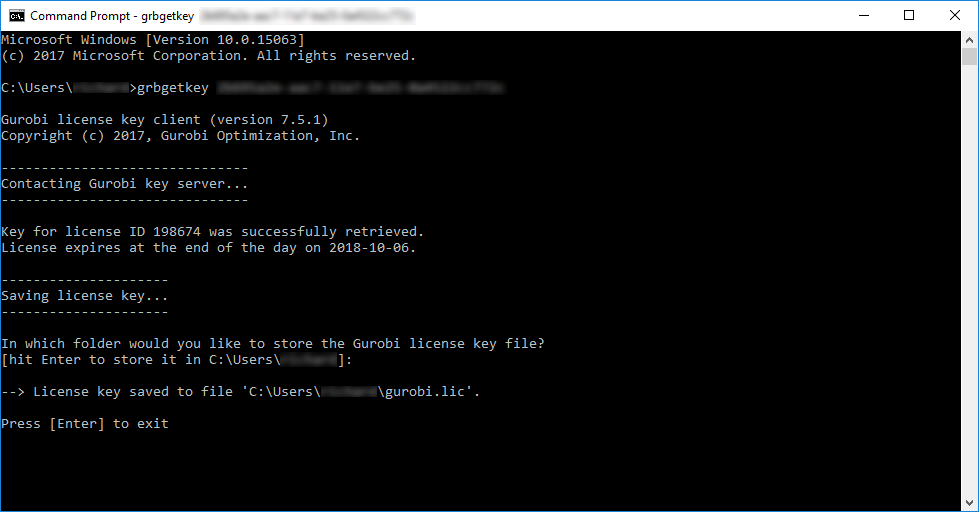

```{r, include = FALSE}
h = 3.5
w = 3.5
is_check <-
  ("CheckExEnv" %in% search()) ||
  any(c("_R_CHECK_TIMINGS_", "_R_CHECK_LICENSE_") %in% names(Sys.getenv())) ||
  !identical(Sys.getenv("MY_UNIVERSE"), "")
knitr::opts_chunk$set(
  fig.align = "center",
  eval = !is_check, purl = !is_check
)
```

```{r, include = FALSE}
# set up print method
print <- function(x, ...) {
  if (inherits(x, "ConservationProblem")) {
    prioritizr::knit_print.ConservationProblem(x)
  } else if (inherits(x, "OptimizationProblem")) {
    prioritizr::knit_print.OptimizationProblem(x)
  } else {
    base::print(x)
  }
}
```

## Introduction

_Gurobi_ is the most powerful and fastest solver that the _prioritizr R_ package can use to solve conservation planning problems (see the [_Solver benchmarks_](solver_benchmarks.html) vignette for further details). This guide will walk you through the process of setting up _Gurobi_ on your computer so that it can be used to solve conservation planning problems. If you encounter any problems while following the instructions below, please refer to the [official _Gurobi_ documentation](https://www.gurobi.com/documentation/).

## Obtaining a license

_Gurobi_ is a commercial computer program. [This means that users will need to obtain a license for _Gurobi_ before they can use it](https://www.gurobi.com/downloads/). Although academics can obtain a special license at no cost, individuals that are not affiliated with a recognized educational institution may need to purchase a license. If you are an academic that is affiliated with a recognized educational institution, you can take advantage of the [special academic license](https://www.gurobi.com/features/academic-named-user-license/) to use _Gurobi_ for no cost. Once you have signed up for a free account you can request a [free academic license](https://www.gurobi.com/features/academic-named-user-license/).

<br><center>{ width=75% }</center><br>

Once you accept the Terms Of Service you can generate a license.

<br><center>{ width=75% }</center><br>

Now, copy and save the `grbgetkey XXXXXXXX-XXXX-XXXX-XXXX-XXXXXXXXXXXX` command for later use.

## Downloading the software

After obtaining a license, you will need to download the _Gurobi_ installer to your computer. To achieve this, visit the [_Gurobi_ downloads web page](https://www.gurobi.com/products/gurobi-optimizer/) and download the correct version of the installer for your operating system.

## Software installation

The process for installing the _Gurobi_ software depends on the operating system on your computer. Fortunately, _Gurobi_ provides detailed [platform-specific instructions](https://support.gurobi.com/hc/en-us/articles/4534161999889) for Windows, MacOS, and Linux systems that should help with this. Briefly, on Windows systems, you just need to double-click on the _Gurobi_ installer, follow the prompts, and the installer will automatically handle everything for you. On Linux and MacOS systems, you will need to manually extract the downloaded file's contents to a folder, move the extracted contents to a suitable location (typically _/opt/gurobi_), and update your system's variables so that it knows where to find _Gurobi_ (i.e., the `PATH` variable).

Additionally, if you are using [_RStudio_](https://posit.co/products/open-source/rstudio/) on a Linux system, you might need to add the following text to a Rstudio configuration file (located at `/etc/rstudio/rserver.conf`).

```
rsession-ld-library-path=/opt/gurobi650/linux64/lib
```

After installing the _Gurobi_ software suite on your computer, you will need to activate your license.

## License activation

Now we will activate the _Gurobi_ software using the license you obtained earlier. Please note that the correct set of instructions depends on your system and license. To activate the license, simply copy and paste the `grbgetkey` command into your computer's command prompt or terminal (note that Windows users can open the command prompt by typing `cmd` in the search box and pressing the `enter` key). After running the `grbgetkey` command with the correct license code, you should see output that resembles the following screen shot.

<br><center>{ width=75% }</center><br>

Next, we will now check that the license has been successfully activated. To achieve this, we will try running _Gurobi_ directly from the command line. Note that the following commands assume you are using version 8.0.0 of _Gurobi_, and so you will need to modify the command if you are using a more recent version (e.g., if using version 9.1.2, then use `gurobi912` instead of `gurobi800` below).

On Windows systems, users can type in the following system command to check their license activation.

```{bash, eval = FALSE}
gurobi_cl c:\gurobi800\win64\examples\data\coins.lp
```

On Linux and MacOS systems, users can type in the following system command.

```{bash, eval = FALSE}
gurobi_cl /opt/gurobi800/linux64/examples/data/coins.lp
```

If the license was successfully activated, you should see output that resembles the screen shot below.

<br><center>{ width=75% }</center><br>

After activating the license, you now need to install the _gurobi R_ package. This is so that you can access the _Gurobi_ software from within the R statistical computing environment, and enable the _prioritizr_ package to interface with the _Gurobi_ software.

## _R_ package installation

Now we will install the _gurobi R_ package. This package is not available on the Comprehensive R Archive Network and is instead distributed with the _Gurobi_ software suite. Specifically, the _gurobi_ _R_ package should be located within the folder where you installed the _Gurobi_ software suite. We will install the _gurobi_ _R_ package by running the following _R_ code within your _R_ session. Note that the following code assumes that you are using version 8.0.0 of _Gurobi_, and so you will need to modify the code if you are using a more recent version (e.g., if using version 9.1.2, then use `gurobi912` instead of `gurobi800` below).

Assuming you installed _Gurobi_ in the default location, Windows users can install _gurobi_ _R_ package using the following code.

```{r, eval = FALSE}
install.packages("c:/gurobi800/win64/R/gurobi_8.0-0.zip", repos = NULL)
```

Similarly, Linux and MacOS users can install the _gurobi_ _R_ package using the following code.

```{r, eval = FALSE}
install.packages(
  file.path(
    Sys.getenv("GUROBI_HOME"),
    "R/gurobi_8.0-0_R_x86_64-pc-linux-gnu.tar.gz"
  ),
  repos = NULL
)
```

Next, you will need to install the _slam R_ package because the _gurobi_ _R_ package needs this package to work. Users of all platforms (i.e., Windows, Linux, and MacOS) can install the package using the following _R_ code.

```{r, eval  = FALSE}
install.packages("slam", repos = "https://cloud.r-project.org")
```

Let's check that the _gurobi_ _R_ package has been successfully installed. To do this, we can try using the _gurobi R_ package to solve an optimization problem. Copy and paste the _R_ code below into _R_.

```{r}
# load gurobi package
library(gurobi)

# create optimization problem
model <- list()
model$obj        <- c(1, 1, 2)
model$modelsense <- "max"
model$rhs        <- c(4, 1)
model$sense      <- c("<", ">")
model$vtype      <- "B"
model$A          <- matrix(c(1, 2, 3, 1, 1, 0), nrow = 2, ncol = 3,
                           byrow = TRUE)

# solve the optimization problem using Gurobi
result <- gurobi(model, list())

# print the solution
print(result$objval) # objective
print(result$x)      # decision variables
```

If you see the outputs for `result$objval` and `result$x` and you don't see any error messages, then you have (1) successfully installed the _Gurobi_ software suite, (2) activated a valid license, and (3) successfully installed the _gurobi R_ package. If do see an error message, then you might have missed a  previous step or something might have gone wrong while installing _Gurobi_ or activating the license. In such cases, try going back through this vignette and repeating the previous steps to see if that fixes the issue.

## Solving a _prioritzr_ problem with _Gurobi_

If you successfully installed the _Gurobi_ software suite and the _gurobi_ _R_ package, you can now try solving conservation planning problems using the _prioritzr_ _R_ package. Although the _prioritizr_ _R_ package should automatically detect that _Gurobi_ has been installed, you can use the function `add_gurobi_solver()` to manually specify that _Gurobi_ should be used to solve problems. This function is also useful because you can use it to customize the optimization process (e.g., specify the desired optimality gap or set a limit on how much time should be spent searching for a solution).

Finally, to check that everything has been installed correctly, we will use the _Gurobi_ software suite to solve a reserve selection problem created using the _prioritzr_ _R_ package.

```{r, fig.height = h, fig.width = w}
# load package
library(prioritizr)

# load data
sim_pu_raster <- get_sim_pu_raster()
sim_features <- get_sim_features()

# formulate the problem
p <-
  problem(sim_pu_raster, sim_features) %>%
  add_min_set_objective() %>%
  add_relative_targets(0.1) %>%
  add_binary_decisions() %>%
  add_gurobi_solver()

# solve the problem
s <- solve(p)

# plot solution
plot(
  s, col = c("grey90", "darkgreen"), main = "Solution",
  xlim = c(-0.1, 1.1), ylim = c(-0.1, 1.1)
)
```

After running this code, hopefully, you should some information printed on-screen about the optimization process and _R_ should produce a map displaying a solution. If this code does not produce any errors, then you have successfully installed everything and can begin using _Gurobi_ and the _prioritizr R_ package to solve your very own conservation planning problems.
